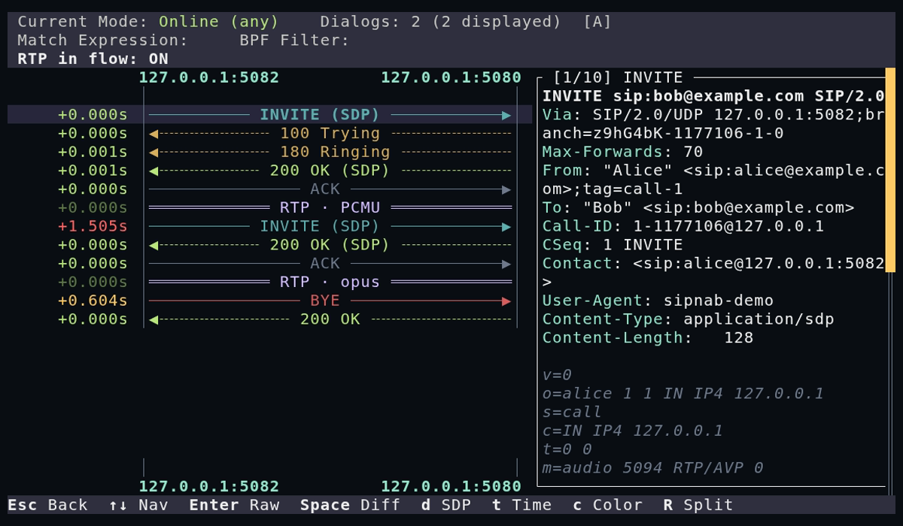

# sipnab

[](https://github.com/NormB/sipnab/actions/workflows/ci.yml)
[](https://www.bestpractices.dev/projects/13931)
[](https://codecov.io/gh/NormB/sipnab)

**Read a SIP call and see why it failed.** One static binary — live traffic, a
pcap, or the HEP feed from every proxy in your estate — showing the call flow,
the RTP quality underneath it, and the security signals around it.



Documentation and a browser-based analyzer that needs no install:
**[sipnab.com](https://sipnab.com)**

## Install

```bash
curl -fsSL https://sipnab.com/install.sh | sh
```

macOS: `brew install NormB/tap/sipnab`. Packages, checksums and the
capabilities needed for live capture are in
[Installation](docs/install.md). Building from source is
[below](#build).

## First run

Start with a capture file — no root, no interface, and the fastest way to see
whether sipnab tells you something you did not already know:

```bash
sipnab -I capture.pcap
```

Just the calls sipnab considers problematic, as JSON, which is the shape most
people want first:

```bash
sipnab -N --json -I capture.pcap --problems
```

One call, explained:

```bash
sipnab -N -I capture.pcap --call-report <call-id> --no-cli-print
```

Live capture needs privileges on the interface. This is the TUI, which puts
the terminal in raw mode — anything pasted after it arrives as keystrokes
rather than as a second command (`i` clears non-matching dialogs, `q` quits):

```bash
sudo sipnab -d eth0
```

More recipes below, and a full set in [Examples](docs/examples.md).

## One listener for a whole estate

Kamailio, OpenSIPS and Asterisk already speak HEP, so they mirror their
signaling to a single sipnab listener and that one process answers for every
node — nothing goes on the production hosts, and there is no collector, no
database and no web UI to operate.

On one box it still does what you expect. sipnab honors every
[sngrep](https://github.com/irontec/sngrep) keybinding and accepts the
[sipgrep](https://github.com/sipcapture/sipgrep) flags, in one Rust binary that
adds first-class RTP quality monitoring, VoIP diagnostic aliases, security
analysis, and an MCP server an AI agent can drive.

## What it does


- **Four output modes** -- interactive TUI, non-interactive CLI, JSON, MCP server (drive sipnab from an AI agent)
- **SIP header matching** -- From, To, Contact, User-Agent, filter DSL
- **RTP quality monitoring** -- jitter, loss, MOS scoring, one-way audio detection
- **Per-call asymmetry signals** -- codec, ptime, payload-type, duration, late-media
- **Diagnostic aliases** -- `--problems`, `--slow-setup`, `--short-calls`, `--one-way`, `--nat-issues` as flags; `codec-asym`, `ptime-asym`, `payload-asym`, `duration-asym`, `late-media` via `--filter` (e.g. `sipnab -N -I capture.pcap --filter codec-asym`)
- **Security analysis** -- scanner detection, registration flood, digest leak, STIR/SHAKEN, fraud heuristics
- **Event execution** -- run commands on dialog state changes or quality drops
- **HEP v3** -- send/receive Homer Encapsulation Protocol
- **TLS/SRTP decryption** -- SSLKEYLOGFILE (TLS 1.2/1.3), RSA private key (`--tls-key`, TLS 1.2 RSA-kx only — not ECDHE/PFS), SRTP media (`--srtp-keys` + SDES `a=crypto`, AES-CM), and DTLS-SRTP key extraction (`--dtls-keylog`, RFC 5764)
- **Privilege separation** -- drop to unprivileged user after capture device open
- **pcap I/O** -- read/write pcap and pcapng, file rotation and splitting
- **MCP server mode** -- expose analysis (dialogs, streams, RTP, security findings) as 51 Model Context Protocol tools an AI agent can call. No tool edits the analysis in place; file export, capture swapping and shutdown stay off unless you enable them. Stdio + HTTP transports. See [`docs/mcp.md`](./docs/mcp.md).

## More recipes

Filter on the From header, in CLI mode rather than the TUI:

```bash
sudo sipnab -N -d eth0 --from 1001
```

Emit JSON and pipe it to jq:

```bash
sudo sipnab -N -d eth0 --json | jq .
```

Detect SIP scanners and report them to syslog:

```bash
sudo sipnab -N -d eth0 --kill-scanner --alert syslog
```

## TUI

The default interactive mode is a full terminal interface for reading SIP and
RTP as they happen:

- **Call list** with sortable columns, multi-select, inline search, filter DSL
- **Call flow ladder** with color-coded arrows, SDP codec display, PDD annotation
- **Four timestamp modes** -- absolute (`HH:MM:SS.mmm`), delta from previous
  message (color-coded by latency), delta from first message, and scaled, which
  stretches the ladder with time-proportional spacer rows
- **Split view** -- raw SIP detail panel alongside the ladder diagram, resizable
  with `9`/`0` or `+`/`-`
- **Message diff** -- select two messages with Space to compare side-by-side
- **Extended flow** -- merge correlated dialog legs into a single ladder (`F4`/`x`)
- **RTP stream list** -- jitter, loss, MOS scores (Tab to switch)

sipnab honors every sngrep keybinding. Press `F1` for the full shortcut reference.

## Prerequisites

### Build dependencies

- **Rust 1.97+** (edition 2024)
- **libpcap headers**
  - macOS: included with Xcode Command Line Tools (`xcode-select --install`)
  - Debian/Ubuntu: `apt install libpcap-dev`
  - Fedora/RHEL: `dnf install libpcap-devel`

### Runtime dependencies

sipnab dynamically links to system libraries. These must be present on the
target system:

| Library            | Package (Debian/Ubuntu) | Package (Fedora/RHEL)   | When required                                  |
|--------------------|-------------------------|-------------------------|------------------------------------------------|
| `libpcap.so.1`     | `libpcap0.8`            | `libpcap`               | Mandatory — any build that includes the `native` feature (the binary always links it) |
| `libasound.so.2`   | `libasound2`            | `alsa-lib`              | **Optional** — only for live audio playback in the TUI (loaded lazily via the audio plugin) |

`tls`, `hep`, `api`, `mcp`, `mcp-http`, `vcon`, and `wasm` are pure-Rust and
need no additional system libraries.

The `audio` feature **no longer links libasound into the `sipnab` binary**.
Device output lives in a separate plugin, `libsipnab_audio.so`
(`/usr/lib/sipnab/` from the `.deb`, or next to the binary in dev builds),
which sipnab `dlopen`s only the moment you press play. So an audio-enabled
binary starts fine on a host without libasound. If libasound (or the plugin)
is missing, playback returns a clear error and WAV export (F2) still works.
Install `libasound2` for live playback — it is a Debian `Recommends`, not a
hard dependency. For headless servers, each release also ships a `-noaudio`
`.deb` with no plugin and no ALSA Recommends at all (see
[docs/install.md](docs/install.md#debianubuntu-deb)).

## Build

```bash
cargo build --release
```

The binary is at `target/release/sipnab`. Live capture requires root or
`CAP_NET_RAW` (Linux) / BPF access (macOS).

### Cross-compilation

You can produce pre-built binaries for x86_64 and aarch64 Linux from macOS using
[cross](https://github.com/cross-rs/cross):

Build for x86_64 Linux. The result is dynamically linked, so the target host
needs libpcap present:

```bash
cross build --release --target x86_64-unknown-linux-gnu
```

Build for aarch64 Linux:

```bash
cross build --release --target aarch64-unknown-linux-gnu
```

Cross-compilation requires Docker (via [Colima](https://github.com/abiosoft/colima),
Docker Desktop, or similar) and `cross` (`cargo install cross`).

## Feature flags

| Flag       | Description                                                          | Default |
|------------|----------------------------------------------------------------------|---------|
| `native`   | Live capture, file capture, output writers, signal handling, CLI. Required (directly or transitively) by `tui`, `hep`, `metrics`, `api`, `mcp`, `mcp-http`, and `plugins`; NOT required by `tls`, `audio`, or `wasm` | yes     |
| `tui`      | Interactive terminal UI (ratatui + crossterm)                        | yes     |
| `audio`    | RTP audio playback in TUI via the lazily loaded `sipnab-audio` plugin + WAV export | yes     |
| `tls`      | TLS/DTLS decryption + SRTP key extraction (ring, zeroize, rustls)    | no      |
| `hep`      | HEP v3 send + HEP v2/v3 receive (Homer Encapsulation Protocol)              | no      |
| `api`      | REST API + Prometheus metrics endpoint (axum, tokio)                 | no      |
| `mcp`      | Model Context Protocol server, stdio transport (rmcp)                | no      |
| `mcp-http` | MCP server over HTTP (Streamable-HTTP). Implies `mcp` + `api`.       | no      |
| `metrics`  | Standalone Prometheus metrics server (raw TCP, no tokio)             | yes     |
| `wasm`     | WebAssembly target for in-browser pcap analysis                      | no      |
| `plugins`  | WASM plugin host (`--plugin`): sandboxed third-party dialog detections  | no      |
| `bpf`      | eBPF TLS capture (`--uprobe-backend bpf`): reads SIP plaintext **and the peer addresses** with no key. Needs a nightly toolchain and `bpf-linker` to build, and a kernel with `CONFIG_DEBUG_INFO_BTF` to run | no      |
| `vcon`     | vCon export: one observed dialog as an unsigned conversation container, with the audio inline when the run retained it. sipnab writes it as an OBSERVER — no signature and no party name | no      |
| `full`     | `native` + `tui` + `tls` + `hep` + `api` + `audio` + `mcp` + `mcp-http` + `metrics` + `plugins` + `vcon` | no      |

Build with specific features. Adding TLS decryption and HEP to the default set:

```bash
cargo build --release --features tls,hep
```

Everything the crate can do:

```bash
cargo build --release --features full
```

A headless capture host -- HEP listener, REST API, and MCP over HTTP, with no
TUI and no audio:

```bash
cargo build --release --no-default-features --features native,hep,api,mcp,mcp-http
```

Note: `audio` is in the default feature set, but it does **not** add a load-time `libasound2` dependency to the `sipnab` binary. The rodio/ALSA code lives in the separate `sipnab-audio` cdylib plugin (`libsipnab_audio.so`), which the binary `dlopen`s lazily only when you actually play a stream. So the binary starts fine without libasound. Install `libasound2` only if you want live playback (otherwise WAV export still works). For a fully audio-free build, drop `audio` (e.g. `--no-default-features --features native,tui` or the headless recipe above) and the plugin is simply not built.

## Documentation

[docs/README.md](docs/README.md) is the full index, grouped by what you are
trying to do. The pages worth knowing by name:

**Arrived with a problem**

- [Troubleshooting](docs/troubleshooting.md) -- symptom to command. Calls that
  fail, drop after a round number of minutes, ring for ages, or carry audio one
  way only: what to run, and what the output means
- [Cookbook](docs/examples.md) -- copy-paste recipes for common workflows
- [Filter DSL](docs/filter-dsl.md) -- narrow to what matters
  (`rtp.mos < 3.5 and one_way == true`), plus the diagnostic aliases

**Looking something up**

- [Installation](docs/install.md) -- binaries, packages, capabilities for live capture
- [CLI Reference](docs/cli-reference.md) -- all flags, organized by group
- [Config Reference](docs/config-reference.md) -- TOML config file format
  (starter file: [contrib/sipnabrc.example](contrib/sipnabrc.example))
- [Output Formats](docs/output-formats.md) -- NDJSON schema, jq recipes, pcap export
- [Keybindings](docs/keybindings.md) -- TUI keyboard shortcuts
- [MOS and codecs](docs/mos-and-codecs.md) -- where the quality score comes
  from, and which codecs report a placeholder instead
- [REST API & Metrics](docs/rest-api.md) -- endpoints, response shapes, Prometheus
- [MCP Server](docs/mcp.md) -- what MCP gives an agent, a first working
  example, and where to go next for deployment, the tool reference and the
  protocol contract
- [Library API](docs/library.md) -- using sipnab as a Rust crate; typed `ParseError`/`CaptureError`

**Understanding it**

- [Architecture](docs/architecture.md) -- module map, data flow, threading model
- [Fault model](docs/fault-model.md) -- what sipnab does when things go wrong
- [Implementation Plan](docs/design/implementation-plan-v6.md) -- historical design decisions and roadmap

## Getting help

Usage questions belong in
[Discussions](https://github.com/NormB/sipnab/discussions). Bug reports belong in
[Issues](https://github.com/NormB/sipnab/issues/new/choose).
[SUPPORT.md](SUPPORT.md) covers which is which, and
[MAINTAINERS.md](MAINTAINERS.md) is honest about who answers and how fast.

## Contributing

Contributions are welcome -- see [CONTRIBUTING.md](CONTRIBUTING.md) for the
build/test workflow and pull request checklist. This project follows the
[Contributor Covenant Code of Conduct](CODE_OF_CONDUCT.md).

## Security

Found a vulnerability? **Do not open a public issue.** See
[SECURITY.md](SECURITY.md) for the private disclosure address, the response
timeline, and what is in scope -- parser crashes, key-material leakage,
privilege-drop and chroot escapes, API/MCP authentication bypass, and command
injection through the `--alert-exec` family.

## Support the project

[](https://www.patreon.com/c/NormB975)
[](https://github.com/sponsors/NormB)
[](https://cla-assistant.io/NormB/sipnab)

## License

Licensed under either of

- [Apache License, Version 2.0](LICENSE-APACHE)
- [MIT License](LICENSE-MIT)

at your option.

Copyright 2024-2026 Norm Brandinger
