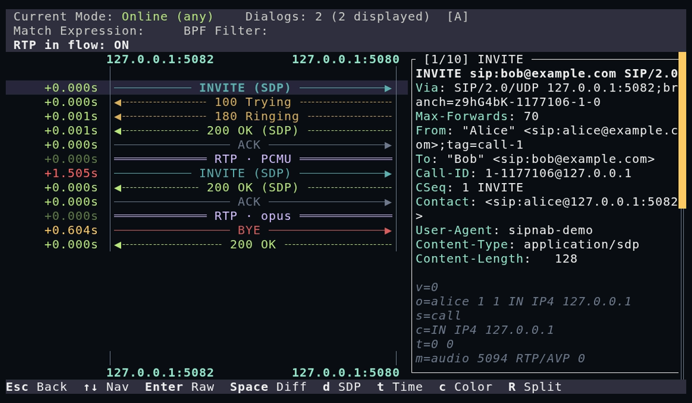

# sipnab

[](https://github.com/NormB/sipnab/actions/workflows/ci.yml)
[](https://www.bestpractices.dev/projects/13931)
[](https://www.bestpractices.dev/projects/13931)
[](https://codecov.io/gh/NormB/sipnab)

**Read a SIP call and see why it failed.** SIP is the signaling protocol that
sets up and tears down voice calls. sipnab reads that signaling from a live
network interface, a pcap (packet capture) file, or a HEP feed that your SIP
proxies send (HEP copies each SIP message to a collector over the network).
From an interface or a file it also reads the RTP audio packets underneath,
and grades their quality. It shows you the call flow, the audio quality, and
the security signals around each call.



sipnab is one binary with no database and no web UI to run. You can point it
at one box's traffic, or have every proxy in a cluster send it
HEP, so one listener sees calls across many nodes without anything installed
on the production hosts. It keeps what it sees in memory and answers through
its terminal view, a command line, a REST API, and an MCP server.

You can try it without installing anything: [sipnab.com/analyze](https://sipnab.com/analyze/)
reads a pcap in your browser without uploading it. The full documentation lives at
**[sipnab.com](https://sipnab.com)** and in [docs/](docs/README.md). The
[Glossary](docs/glossary.md) defines the terms these pages use.

## Install

On Linux (x86_64 or aarch64) or macOS:

```bash
curl -fsSL https://sipnab.com/install.sh | sh
```

The script picks the build for your OS, CPU and glibc, checks it against the
release's `.sha256` file, and installs it to `/usr/local/bin` (using `sudo`
only if that directory is not writable). You can
[read the script](https://sipnab.com/install.sh) first. To confirm the install,
run `sipnab --version`: it prints the version and the features compiled in.

Other ways in:

| You want | Do this |
|---|---|
| Homebrew on macOS | `brew install NormB/tap/sipnab` |
| A `.deb` or `.rpm`, including `-noaudio` builds for headless servers | [Install with your package manager](docs/install.md#install-with-your-package-manager) |
| A static Linux binary with no libpcap dependency (musl) | [Release artifacts](docs/install.md#release-artifacts) |
| To prove a download is genuine (checksums, build provenance, SBOM) | [Verify a download is genuine](docs/install.md#verify-a-download-is-genuine) |
| To build it yourself | [Build from source](#build-from-source), below |

## Your first ten minutes

Here are four common starting points. Each one ends with a link to the page
that goes further.

### 1. Triage a capture file

Reading a file needs no root and no network interface, so it is the easiest
place to start. This sample holds one completed call and four failed ones:

```bash
curl -LO https://github.com/NormB/sipnab/raw/main/tests/pcap-samples/sip-problem-call.pcap
```

Open it in the TUI (text user interface), the interactive full-screen view.
Press `F1` for the keys each view accepts. To quit, press `q` and then `y` to
confirm, or `Ctrl-C` to quit at once:

```bash
sipnab -I sip-problem-call.pcap
```

Or stay on the command line. `-N` skips the TUI and prints to the terminal.
List every call in the file, with its final status code, as a report table:

```bash
sipnab -N -I sip-problem-call.pcap --report --no-cli-print
```

Print only the messages of calls that failed or sounded poor, as JSON you can
pipe into `jq`:

```bash
sipnab -N --json -I sip-problem-call.pcap --problems
```

Explain one call. A Call-ID is the SIP header that names a call, and the
report table above lists them:

```bash
sipnab -N -I sip-problem-call.pcap --call-report 'busy-3a2b1c@192.0.2.30' --no-cli-print
```

Next: [Triage a capture from the command line](docs/first-cli-triage.md) walks
through these commands with their output, and
[Your first analysis in the TUI](docs/tui-walkthrough.md) does the same
interactively.

### 2. Watch live traffic

Live capture on Linux needs raw-socket access. Rather than running sipnab as
root, grant the binary the two capabilities once, then run it as yourself:

```bash
sudo sipnab --setup-caps
```

Then capture on an interface. Replace `eth0` with yours, which `ip link` lists:

```bash
sipnab -d eth0
```

For a stream of JSON, one SIP message per line, add `-N --json`:

```bash
sipnab -N -d eth0 --json
```

Re-run `--setup-caps` after each upgrade, because replacing the binary clears
its capabilities. On macOS, run live capture with `sudo` instead.
[Capture live traffic without root](docs/install.md#capture-live-traffic-without-root)
explains the privilege model, and
[Tune capture on a busy server](docs/tuning-capture.md) covers packet loss.

### 3. Receive HEP from your proxies

Kamailio, OpenSIPS and Asterisk can each mirror their SIP traffic over HEP, so
one sipnab listener sees the calls of every node without anything installed on
the production hosts. A listener on a routable address must name the senders
it accepts (`--hep-allow`) or share a secret with them (`--hep-auth-file`).
Otherwise sipnab refuses to start it:

```bash
sipnab -N -L 0.0.0.0:9060 --hep-allow 192.0.2.10
```

To try it on one machine, bind to loopback and replay a capture into it from a
second terminal with `-H` (HEP send):

```bash
sipnab -N -L 127.0.0.1:9060
```

```bash
sipnab -N -I sip-problem-call.pcap -H 127.0.0.1:9060
```

A proxy's HEP feed carries its SIP signaling, not the call audio, so for audio
quality run sipnab where the media flows as well.
[Run sipnab beside OpenSIPS](docs/opensips-sipnab.md),
[Run sipnab beside Kamailio](docs/kamailio-sipnab.md) and
[Connect sipnab to Homer](docs/homer-sipnab.md) set this up end to end, TLS
transport included.

### 4. Serve the REST API, metrics and MCP

sipnab can answer other programs while it captures. Choose an API key and keep
it in the environment, where sipnab reads it and where `ps` cannot see it:

```bash
export SIPNAB_API_KEY="$(openssl rand -hex 32)"
```

Serve the REST API and Prometheus metrics on loopback. The process keeps
serving until you press `Ctrl-C`:

```bash
sipnab -N -I sip-problem-call.pcap --api 127.0.0.1:8080 --metrics 127.0.0.1:9100
```

```bash
curl -H "Authorization: Bearer $SIPNAB_API_KEY" http://127.0.0.1:8080/v1/dialogs
```

MCP (Model Context Protocol) lets an AI agent, such as Claude Code, call
sipnab's analysis as tools. Over stdio, the default transport, the agent
starts sipnab itself, so this is the command you register with your MCP
client (`--mcp-transport http` serves remote agents instead):

```bash
sipnab --mcp -N -I sip-problem-call.pcap --mcp-tools core
```

The server offers 70 tools, and every tool costs the agent context before it
asks anything. `--mcp-tools core` loads a small set that still answers a whole
call. Named bundles such as `signaling` and `media`, and your own in the config
file, landed after release 0.5.196
([Choosing which tools load](docs/mcp-tools.md#choosing-which-tools-load)).

Next: [REST API and metrics](docs/rest-api.md),
[Prometheus metrics](docs/prometheus-metrics.md),
[MCP server](docs/mcp.md), and
[Connect an AI agent to sipnab](docs/mcp-deploy.md).

## Security basics

- **Privileges.** Reading files needs none. For live capture, prefer
  `sudo sipnab --setup-caps` to running as root. Started as root, sipnab opens
  the capture device and then drops to an unprivileged user (`nobody`, or
  `--user`); `--chroot` confines it further.
- **Listeners bind to loopback by default.** On a routable address, the REST
  API refuses to start without `--api-key` or `--api-signing-key`, MCP over
  HTTP without `--mcp-token` or `--mcp-signing-key`, and the metrics endpoint
  without `--metrics-auth`. [Set up authentication](docs/auth.md) covers
  signed tokens, rotation and revocation.
- **TLS.** The REST API serves HTTPS itself with `--api-tls-cert` and
  `--api-tls-key` ([API TLS](docs/rest-api.md#api-tls)); this landed after
  release 0.5.196, which still refuses the two flags. The metrics endpoint and
  MCP over HTTP have no TLS of their own: keep them on loopback, or put a
  TLS-terminating reverse proxy in front. HEP can use TLS in both directions
  (`--hep-listen-transport tls`, `--hep-send-transport tls`).
- **Sending.** Capture is passive. The features that send are off until you
  ask for them, for example HEP forwarding (`-H`), reverse DNS
  (`--reverse-dns`), and `--kill-scanner` and `-K`, which on a live interface
  answer scanners with SIP responses. When sipnab reads a capture file, it
  sends no scanner responses.
- **The threat model.** [Threat model and security assessment](docs/threat-model.md)
  lists the assets, trust boundaries, mitigations and known gaps.

## What it does

- **Several ways to read the results.** The interactive TUI, the
  non-interactive CLI (`-N`), JSON (`--json`, one message per line), reports,
  the REST API, and the MCP server
- **Call analysis.** Dialog state, PDD (post-dial delay, the wait before
  ringing), SIP header matching (`--from`, `--to` and the rest), and a
  [filter language](docs/filter-dsl.md)
- **Diagnostic aliases.** `--problems`, `--slow-setup`, `--short-calls`,
  `--one-way` and `--nat-issues` as flags; `codec-asym`, `ptime-asym`,
  `payload-asym`, `duration-asym` and `late-media` through `--filter`
  (for example `sipnab -N -I capture.pcap --filter codec-asym`)
- **RTP quality.** Jitter, loss, MOS (mean opinion score, an estimate of how
  the call sounded; [where it comes from](docs/mos-and-codecs.md)), and
  one-way audio
- **Security analysis.** Scanner detection, registration floods, digest
  credential leaks, STIR/SHAKEN, and fraud heuristics, with alerts to syslog,
  JSON or a command of your own (`--alert`, `--alert-exec`)
- **HEP v3** send over UDP, TCP or TLS, and HEP v2/v3 receive
- **TLS and SRTP decryption.** From an SSLKEYLOGFILE (TLS 1.2 and 1.3), an RSA
  private key (`--tls-key`, TLS 1.2 RSA key exchange only), SDES SRTP keys
  (`--srtp-keys`), and DTLS-SRTP (`--dtls-keylog`,
  [RFC 5764](https://www.rfc-editor.org/rfc/rfc5764)).
  [Capture SIP over TLS](docs/tls-capture.md) helps you choose
- **SIPREC metadata.** Reads the recording metadata
  ([RFC 7866](https://www.rfc-editor.org/rfc/rfc7866)) that a session recording
  client sends. sipnab is not a recording client or server
- **Relay correlation.** Ties media on an rtpengine relay
  ([rtpengine](docs/rtpengine.md)) or an rtpproxy relay (`--rtpproxy-control`)
  back to its call
- **vCon export.** Writes one observed call as a vCon, a conversation
  container ([Export a call as a vCon](docs/vcon.md))
- **pcap in and out.** Reads and writes pcap and pcapng, with rotation and
  splitting; reads directories, tar archives and password-protected ZIP and 7z
- **MCP server.** 70 tools over stdio or HTTP. Out of the box they only read.
  The tools that save files, swap the capture, query a relay, attach to TLS
  processes or shut the server down stay off until you enable them.
  [MCP server](docs/mcp.md) has a first working example

## The TUI

- **Call list** with sortable columns, multi-select, inline search and filters
- **Call flow ladder** with color-coded arrows, SDP codecs, and PDD
- **Four timestamp modes:** absolute, delta from the previous message, delta
  from the first, and scaled to time
- **Split view:** the raw SIP message beside the ladder, resized with `+`/`-`
- **Message diff:** select two messages with `Space` to compare them
- **Extended flow:** merge the legs of one call through a proxy or B2BUA into
  one ladder (`x` or `F4`)
- **RTP streams** with jitter, loss and MOS (`Tab`), audio playback, and WAV
  export (`F2`)

[Keybindings](docs/keybindings.md) lists every key, per view.

## Build from source

You need **Rust 1.98+** (edition 2024) and the libpcap headers:

- macOS: included with the Xcode Command Line Tools (`xcode-select --install`)
- Debian/Ubuntu: `apt install libpcap-dev`
- Fedora/RHEL: `dnf install libpcap-devel`

```bash
cargo build --release
```

The binary is at `target/release/sipnab`.
[Install with cargo](docs/install.md#install-with-cargo) installs the
published crate instead.

At run time, sipnab loads the system libpcap (`libpcap.so.1` on Linux). Only
the static musl release binary carries its own. Audio playback in the TUI also
needs `libasound` (ALSA), but loads it only when you press play: playback lives
in a separate plugin, `libsipnab_audio.so`, so a binary built with audio
starts fine on a host without libasound, and WAV export still works there.

### Feature flags

| Flag | What it adds | Default |
|---|---|---|
| `native` | Live and file capture, output writers, the CLI. Needed by every feature below except `tls`, `audio` and `wasm` | yes |
| `tui` | The interactive terminal UI | yes |
| `audio` | RTP audio playback in the TUI, through the lazily loaded `sipnab-audio` plugin, and WAV export | yes |
| `metrics` | Standalone Prometheus metrics server (`--metrics`) | yes |
| `tls` | TLS and DTLS decryption, SRTP key extraction | no |
| `hep` | HEP v3 send, HEP v2/v3 receive | no |
| `api` | REST API and its Prometheus endpoint, over HTTP or HTTPS | no |
| `mcp` | MCP server, stdio transport | no |
| `mcp-http` | MCP server over HTTP (Streamable HTTP). Implies `mcp` and `api` | no |
| `plugins` | WASM plugin host (`--plugin`): sandboxed third-party detections | no |
| `vcon` | vCon export of one observed call | no |
| `archive` | Password-protected ZIP and 7z input | no |
| `bpf` | eBPF TLS capture (`--uprobe-backend bpf`). Needs a nightly toolchain and `bpf-linker` to build, and a kernel with BTF to run. Outside `full` | no |
| `wasm` | WebAssembly build for in-browser pcap analysis | no |
| `full` | `native`, `tui`, `audio`, `metrics`, `tls`, `hep`, `api`, `mcp`, `mcp-http`, `plugins`, `vcon`, `archive` | no |

Every feature:

```bash
cargo build --release --features full
```

A headless capture host, with the HEP listener, REST API and MCP over HTTP,
and no TUI or audio:

```bash
cargo build --release --no-default-features --features native,hep,api,mcp,mcp-http
```

[Installation](docs/install.md#build-it-from-source) covers the other builds,
[cross-compilation](docs/install.md#cross-compilation) included.

## Where to read next

[docs/README.md](docs/README.md) indexes every page by what you are trying to
do. The ones most people need:

| When you want to | Read |
|---|---|
| Find out why calls fail, drop, or carry one-way audio | [Troubleshooting](docs/troubleshooting.md) |
| Copy a recipe for a common task | [Examples and recipes](docs/examples.md) |
| Narrow to the calls that matter | [Filter DSL](docs/filter-dsl.md) |
| Look up a flag | [CLI reference](docs/cli-reference.md) |
| Write a config file | [Config reference](docs/config-reference.md), starting from [contrib/sipnabrc.example](contrib/sipnabrc.example) |
| Parse sipnab's JSON or export pcap | [Output formats](docs/output-formats.md) |
| Use sipnab as a Rust library | [Library API](docs/library.md) |
| Understand how it works inside | [Architecture](docs/architecture.md) and [Fault model](docs/fault-model.md) |

## Getting help

Ask usage questions in
[Discussions](https://github.com/NormB/sipnab/discussions), and report bugs in
[Issues](https://github.com/NormB/sipnab/issues/new/choose).
[SUPPORT.md](SUPPORT.md) explains which is which, and
[MAINTAINERS.md](MAINTAINERS.md) says who answers and how fast.

## Contributing

We welcome contributions. [CONTRIBUTING.md](CONTRIBUTING.md) covers the build
and test workflow, the git hooks, and the pull request checklist. Before we can
merge a pull request, you sign the
[Contributor License Agreement](CONTRIBUTING.md#contributor-license-agreement)
once, and a pull request cannot merge until the `license/cla` check passes.
If your change adds a dependency,
read [Dependencies](CONTRIBUTING.md#dependencies) first. This project follows
the [Contributor Covenant Code of Conduct](CODE_OF_CONDUCT.md).

## Security

Found a vulnerability? **Do not open a public issue.** [SECURITY.md](SECURITY.md)
gives the private reporting address, the response timeline, and what is in
scope, such as parser crashes, key-material leaks, privilege-drop and chroot
escapes, API and MCP authentication bypass, and command injection through the
`--alert-exec` family.

## Support the project

[](https://www.patreon.com/c/NormB975)
[](https://github.com/sponsors/NormB)
[](https://cla-assistant.io/NormB/sipnab)

## License

Licensed under either of

- [Apache License, Version 2.0](LICENSE-APACHE)
- [MIT License](LICENSE-MIT)

at your option.

Copyright 2024-2026 Norm Brandinger
