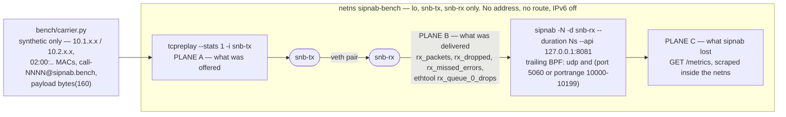

# Benchmark harness

Everything needed to reproduce the numbers on the [benchmarks
page](../docs/benchmarks.md). Nothing here depends on a private repository.

That is the point of this directory. For twenty-nine releases the benchmarks
page claimed "every number here is reproducible … the exact commands above are
the full recipe" while the corpus generator and comparison harness lived in an
unpublished internal repo. Nobody could re-run those numbers — not even on the
reference host named in the methodology. The first three scripts below are that
missing recipe. `live-capture.sh` is a different animal: an operator-only
harness that measures the *live* capture path, needs root, and produces no
number on the benchmarks page.

## Contents

| script | what it does |
|---|---|
| `carrier.py` | generates the synthetic carrier corpus (stdlib Python 3, no deps) |
| `scaling.sh` | sipnab throughput + peak RSS across `--cores` values |
| `compare.sh` | sipnab against sngrep / sipgrep / voipmonitor on one corpus |
| `live-capture.sh` | live-capture loss under synthetic load in a private netns (root) |

## Reproducing the published tables

Benchmarks are measured against a **checksum-verified release artifact**, never
a local dev build, on an otherwise idle host:

```sh
# Run all of these, in order.
gh release download v0.5.47 -R NormB/sipnab \
  -p 'sipnab-0.5.47-aarch64-unknown-linux-gnu.tar.gz*'
sha256sum -c sipnab-0.5.47-aarch64-unknown-linux-gnu.tar.gz.sha256
tar xzf sipnab-0.5.47-aarch64-unknown-linux-gnu.tar.gz
BIN=./sipnab-0.5.47-aarch64-unknown-linux-gnu/sipnab
```

**Multi-core scaling** and the **tool comparison** use the fixed-state corpus —
a bounded pool of 100 Call-IDs and 200 RTP streams, so dialog state stays
constant and the measurement isolates the packet path:

```sh
# Run all of these, in order.
python3 bench/carrier.py --calls 5000 --out corpus.pcap
# 535000 packets (35000 SIP, 500000 RTP = 93.5%), 100 Call-IDs, 200 streams

bench/scaling.sh "$BIN" corpus.pcap 535000 --cores 1,2,4,8 --runs 5
bench/compare.sh "$BIN" corpus.pcap 535000 --runs 5
```

**The carrier sweep** uses unique dialogs per call (`--call-ids 0
--stream-pairs 0`), because a memory sweep has to let state grow with call
volume. With the bounded pools it measures buffer memory and mislabels it as
state growth:

```sh
# Run all of these, in order.
for c in 500 2000 8000 20000; do
  python3 bench/carrier.py --calls $c --call-ids 0 --stream-pairs 0 \
    --out sweep-$c.pcap
done
bench/scaling.sh "$BIN" sweep-20000.pcap 2140000 --cores 4 --runs 5
```

## Method

- **median-of-5 after one discarded warmup**, so the corpus is in page cache for
  every timed run
- wall clock from a nanosecond clock, not `time -f %e` — the latter resolves to
  10 ms, which on a sub-second corpus is two significant figures
- peak RSS from GNU `time -f %M`
- `pkts/s = packets ÷ wall-clock seconds`, startup included
- output is deterministic: same arguments in, byte-identical pcap out

## Live capture

`live-capture.sh` measures something the three scripts above cannot: what
happens to packets between the wire and sipnab's parser.

An offline run cannot lose a packet on the way in. It never touches the kernel
ring, the in-kernel BPF, the TPACKET_V2/V3 choice or `poll(2)`, and although it
does traverse the same capture→processing channel, a file read is self-paced —
backpressure slows the reader rather than dropping anything, because the file
waits. A live capture has none of those luxuries, and four of the changes
shipped in 0.5.77 land squarely on that difference: the 64 MiB default kernel
buffer, TPACKET_V3 on headless runs, `poll(2)` off the per-packet path, and the
auto-grow effects queue. **Every throughput claim about them is still reasoned
from syscall counts and ring arithmetic. Nothing has been measured. This script
is the instrument, not the result.**



The three planes are reported side by side and **never summed**: they answer
different questions, and adding them together would hide which one moved.

**It accepts no capture path.** Where its siblings take `<corpus.pcap>` as their
second argument, this script has no such argument — no flag, no environment
variable, no config key. It invokes `carrier.py` itself and writes the corpus
into a run-scoped temporary directory. That is deliberate: the real corpus at
`/home/gator/pcaps` carries PII, and deleting the capability to point at it
beats blocklisting a path that a copy or a symlink defeats. `carrier.py` is
wholly synthetic and byte-identical for identical arguments.

Run the self-test first — it needs no root, no namespace and no capture device,
and it is what CI runs:

```sh
bash bench/live-capture.sh --self-test
```

Then the measurement itself, against a checksum-verified release artifact
(`$BIN` from the download block above — a default `cargo build` has no `api`
feature, so `--api` binds nothing and the whole measurement plane is silently
absent):

```sh
sudo bench/live-capture.sh "$BIN"
```

It needs root because it creates and destroys the network namespace
`sipnab-bench` and opens a capture handle. It refuses to start if that namespace
already exists, and it never deletes one it did not create.

### What it cannot measure

- **A NIC.** The capture interface is one end of a `veth` pair. There is no
  hardware ring, no NAPI budget, no interrupt coalescing, no RSS, and no
  meaningful offload — `ethtool -K` on a veth mostly changes nothing, and
  `tcpreplay` sends via `AF_PACKET` raw, which bypasses segmentation offload
  anyway. A veth figure bounds the software path; it is not a line-rate result
  and must not be quoted as one.
- **1 Gbps.** `carrier.py` paces media by integer division of a 20 ms packet
  time (`writer.step = max(1, PTIME_USEC // (2 * len(state)))`,
  `carrier.py:326`), so only rungs that divide evenly give an exact rate. The
  two either side of a gigabit are 500,000 pps (≈856 Mbps of 214-byte frames)
  and 1,000,000 pps (≈1.712 Gbps). **The ladder straddles 1 Gbps and cannot hit
  it.** No result from this harness may be written up as "passed at 1 Gbps".
- **Queue depth and backpressure.** `sipnab_capture_queue_depth_packets` and
  `sipnab_capture_backpressure_blocks_total` are emitted unconditionally by
  `format_metrics` (`src/output/prometheus.rs:333` and `:345`), but the only
  code that ever populates them is the standalone `--metrics` server
  (`src/output/prometheus_server.rs`), whose sole call site is
  `src/app/tui_mode.rs:156` — the TUI arm. `grep -c CaptureMeter
  src/output/api.rs` returns `0`, so on the `--api` route both series are a hard
  zero no matter what the queue is doing. The harness reports them as
  unavailable with that reason. Recording either as `0` would be fabrication,
  not measurement.
- **MOS, jitter and loss on a bounded-pool rung.** The rate ladder holds dialog
  state constant (`--call-ids 100 --stream-pairs 100`) so that only pps varies,
  which means many calls share one 5-tuple and SSRC and sequence numbers repeat
  (`carrier.py:266`). Every reconstruction figure on those rungs is meaningless
  by construction. Only the unique-dialog headline run (`--call-ids 0
  --stream-pairs 0`) produces interpretable ones.

A word on the BPF: sipnab auto-generates `portrange 5060-5061` from
`--portrange` when a live source is given no filter (`src/app/bootstrap.rs:307`).
Under that default the kernel discards 100% of the RTP and the run reports a
pristine baseline having measured nothing, which is why the harness always
passes an explicit trailing filter covering both the signalling port and the
generated media range.

## voipmonitor

voipmonitor is not packaged for most distributions and a host install pulls in
a database service, so it is built from source in a container:

```sh
# Run all of these, in order.
docker build -f bench/voipmonitor.Dockerfile -t voipmonitor:bench bench/
VM_IMAGE=voipmonitor:bench VM_CONF=bench/vm.conf \
  bench/compare.sh "$BIN" corpus.pcap 535000 --runs 5
```

`compare.sh` uses a native `voipmonitor` if one is on `PATH`; otherwise it uses
`VM_IMAGE`. With neither, it reports voipmonitor as `MISSING` rather than
omitting the row — a comparison table with a silently absent competitor reads
exactly like a comparison it won.

Three things keep the container measurement fair, and all three matter:

- **The timing loop runs inside one container.** Timing `docker run` per
  invocation charges voipmonitor ~0.8 s of container startup, which on the 535k
  corpus is longer than sipnab's entire run. That alone would fabricate a
  several-fold sipnab win out of the measurement apparatus.
- **`sdp_multiplication = 0`.** The corpus reuses SDP media endpoints, so
  voipmonitor's default DoS guard (`=3`) suppresses the duplicate-SDP streams —
  it would do *less* RTP association than sipnab and flatter sipnab's numbers.
- **The config disables spooling, not analysis.** Verify this rather than trust
  it: re-run with `savesip`/`savertp` set to `yes` and a writable `spooldir`,
  and voipmonitor should emit one SIP and one RTP capture per call, each
  carrying both directions. sipnab itself will read those files back
  (`sipnab -N -I <spooled>.pcap --report`), which is a convenient cross-check.

What remains asymmetric: voipmonitor runs containerised while sngrep, sipgrep
and sipnab run natively. On Linux that is namespaces, not virtualisation, so
CPU-bound parsing is near native — but the cost, whatever it is, lands on
voipmonitor's number.
