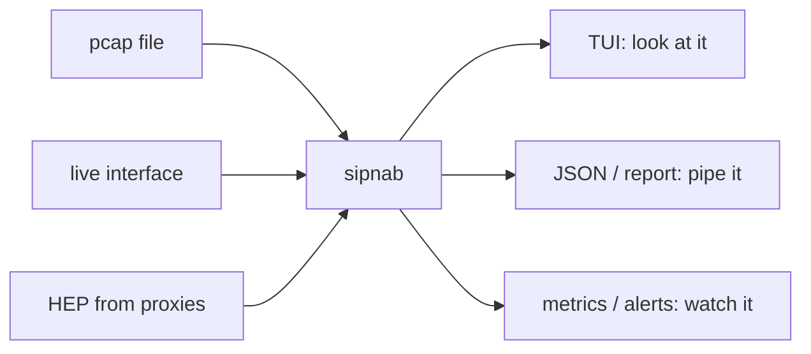

# Cookbook

Recipe-style walkthroughs for the things people actually want to do. Each recipe states the problem, gives exact commands, tells you what to look for in the output, and flags common pitfalls.

Each recipe stands alone — nothing here depends on anything above it. If you
are new, recipe 1 is the broadest starting point.

## What do you want to do?

| I want to… | Recipe |
|---|---|
| Work out whether anything is wrong with a capture | [1. Triage a pcap fast](#1-triage-a-pcap-fast) |
| Watch one user's traffic live | [2. Live capture, narrow to a single user](#2-live-capture-narrow-to-a-single-user) |
| See which calls failed, and why | [3. Find every failed call, grouped by response code](#3-find-every-failed-call-grouped-by-response-code) |
| Chase a "no audio" or "one-way audio" complaint | [4. Diagnose a one-way audio complaint](#4-diagnose-a-one-way-audio-complaint) |
| Work out why a call sounds bad in one direction | [11. Find why a call sounds bad in one direction only](#11-find-why-a-call-sounds-bad-in-one-direction-only) |
| Write a filter for common triage | [5. Filter for the five things you look for most](#5-filter-for-the-five-things-you-look-for-most) |
| Collect traffic from proxies I cannot install on | [6. Wire HEP from your SIP stack to a central sipnab](#6-wire-hep-from-your-sip-stack-to-a-central-sipnab) |
| Read encrypted SIP or SRTP | [7. Decrypt SIP/TLS via SSLKEYLOGFILE](#7-decrypt-siptls-via-sslkeylogfile) |
| Read TLS with **no keys at all** (eBPF) | [7g. Read TLS with no keys](#7g-read-tls-with-no-keys-at-all) and [7h. …and who the peer was](#7h-read-tls-and-who-the-peer-was) |
| Understand what reading TLS without keys costs and requires | [TLS-without-keys walkthrough](uprobe-walkthrough.md) — security implications, and whether your kernel supports it |
| Drive sipnab from an AI agent | [8. Run sipnab as an MCP server](#8-run-sipnab-as-an-mcp-server) |
| Graph traffic over time | [9. Graph call rate, response codes and PDD over time](#9-graph-call-rate-response-codes-and-pdd-over-time) |
| Detect and block scanners or fraud | [10. Detect SIP scanners and auto-block via fail2ban](#10-detect-sip-scanners-and-auto-block-via-fail2ban) |
| Hand someone a written summary of a call | [12. Generate a call report (text / Markdown / JSON)](#12-generate-a-call-report-text--markdown--json) |
| Listen to the audio | [13. Export RTP audio as WAV](#13-export-rtp-audio-as-wav) |
| Look at a pcap with nothing installed | [14. Analyze a pcap without installing anything](#14-analyze-a-pcap-without-installing-anything) |
| Just find a command to copy | [Look up a one-liner by task](#look-up-a-one-liner-by-task) |

### Where a recipe fits

Most recipes are one of three shapes. Knowing which you are in tells you what
the commands are doing:



- **Look at it** — the TUI, for a human working a ticket.
- **Pipe it** — JSON, reports, WAV, Wireshark filters, for tooling.
- **Watch it** — metrics, scanner detection, alerts, for something long-running.

## 1. Triage a pcap fast

**Problem:** Someone handed you a `capture.pcap` and asked "is anything wrong?"

**Commands:**

Open the call list and scan it visually — the interactive TUI:

```bash
sipnab -I capture.pcap
```

The same capture as a headless overview: dialog count, methods, average PDD.

```bash
sipnab -N -I capture.pcap
```

A one-flag diagnostic sweep — retransmits and failed dialogs:

```bash
sipnab -N -I capture.pcap --problems
```

The same sweep in JSON, for piping into another tool:

```bash
sipnab -N -I capture.pcap --problems --json
```

The same sweep spelled the long way. `--problems` expands to the `problems` DSL alias, so this selects exactly the same calls.

```bash
sipnab -N -I capture.pcap --filter problems
```

The `--problems` sweep prints one line per SIP message of each flagged call, then the end-of-capture summary. You should see something like (abridged):

```text
INVITE +15551234 -> +15559876  192.0.2.6:5060 -> 192.0.2.7:5060  Failed  408 Request Timeout
...
852 packets captured, 10 SIP messages, 839 RTP packets across 2 streams
```

**What to look for:**

- The `--problems` **flag** and the **DSL alias** reached with `--filter problems` expand to one and the same expression: `state == 'Failed' OR one_way == true OR rtp.loss > 5.0 OR rtp.jitter > 50.0 OR nat_mismatch == true OR retransmits > 3 OR pdd > 11.0 OR codec_asymmetry == true OR ptime_asymmetry == true OR payload_asymmetry == true OR duration_asymmetry == true OR late_media == true`. Either spelling flags the same calls, so an empty answer means the capture is probably clean.
- The end-of-capture summary distinguishes RTP packets from RTP streams: `852 packets captured, 10 SIP messages, 839 RTP packets across 2 streams`. A capture with media but no SIP usually means the SIP signaling happened off-pcap (different VLAN, different host, different port).

**Pitfalls:**

- The TUI requires a tty. If you're SSH'd in without `-t`, force `-N` mode.
- For large pcaps (>1 GB), prefer `-N` first; the TUI loads everything into memory.

---

## 2. Live capture, narrow to a single user

**Problem:** A user reports their calls are flaky. Capture only their traffic in real time.

**Commands:**

Capture on eth0, keeping only this user's calls — the filter matches From or To:

```bash
sudo sipnab -d eth0 --filter "from.user == '1001' OR to.user == '1001'"
```

The same capture with a CLI summary line per dialog instead of the TUI:

```bash
sudo sipnab -N -d eth0 --filter "from.user == '1001' OR to.user == '1001'" --json
```

**What to look for:**

- The TUI's call list updates as new dialogs appear. Press `Tab` to switch to the RTP stream view; press `Enter` on a stream to see jitter/loss/MOS history.
- In CLI mode, each completed dialog is one line of JSON. Pipe to `jq` or `tee` to a log.

**Pitfalls:**

- Live capture needs `CAP_NET_RAW` (Linux) or root. `setcap cap_net_raw,cap_net_admin=eip $(which sipnab)` lets you skip `sudo` after the first run.
- The filter DSL evaluates against complete dialog records — once the dialog state machine has enough information (typically after the first response, or earlier for fields that only depend on the request). For per-header regex filtering on individual messages, use the older `--from`, `--to`, `--contact`, `--ua` flags listed in `sipnab --help`.

---

## 3. Find every failed call, grouped by response code

**Problem:** "We had a spike in failures around 14:00. What was it?"

**Commands:**

`sipnab -N --json` emits per-message records (one JSON line per SIP message), not per-dialog summaries. The `status_code` field is on response messages. Combined with `--filter` (which evaluates against the dialog so all messages from matched dialogs flow through), you get a histogram of every response code seen during failed dialogs:

Every failed call's response messages — Call-ID, status_code and reason:

```bash
sipnab -N -I capture.pcap --filter "state == 'Failed'" --json \
  | jq 'select(.is_request == false) | {call_id, status_code, reason}'
```

A histogram of the response codes seen in failed dialogs:

```bash
sipnab -N -I capture.pcap --filter "state == 'Failed'" --json \
  | jq -r 'select(.is_request == false) | .status_code' \
  | sort | uniq -c | sort -rn
```

A detailed report for one failure, in Markdown, ready to paste into a ticket:

```bash
sipnab -N -I capture.pcap --call-report 'abc123@host' --markdown > failure-report.md
```

The histogram output looks like (`uniq -c` count, then status code):

```text
     23 100
     14 486
      6 503
      3 488
```

**What to look for:**

- A 401/407 spike usually means a credential-rotation push hit the wrong realm.
- A 408 spike on outbound is upstream timeout — check rtpengine / SBC.
- A 488 spike (Not Acceptable Here) usually means a codec mismatch — combine with Recipe 11.

**Pitfalls:**

- The histogram counts *all* response codes seen in messages of failed dialogs (so a single failed call with `100 Trying → 488` contributes both 100 and 488). For just the final response per call, use `--call-report <id>` per dialog.
- The dialog summary returned by the REST API (`/v1/dialogs`) has no `status_code` field; that's a per-message field only available in CLI `--json` output or via `/v1/dialogs/{id}` (which includes the full message list).

---

## 4. Diagnose a one-way audio complaint

**Problem:** A user said "I can hear them but they can't hear me." There's a Call-ID in the ticket.

**Commands:**

First, confirm the diagnosis engine flagged it. The diagnosis block lives on the dialog-level JSON that `--call-report` emits, not on per-message records.

```bash
sipnab -N -I capture.pcap --call-report 'abc123@host' --json --no-cli-print \
  | jq '{call_id, state, diagnosis}'
```

Then get the human-readable call report — NAT mismatch, SDP offer/answer, media path:

```bash
sipnab -N -I capture.pcap --call-report 'abc123@host' --markdown --no-cli-print
```

Finally, inspect the actual RTP streams for that call in the TUI:

```bash
sipnab -I capture.pcap
#   → press '/' to filter, type 'abc123', Enter
#   → Tab to switch to RTP streams view
#   → Enter on each stream to see packet count, jitter, loss
```

The first command should print a diagnosis object like:

```json
{
  "call_id": "abc123@host",
  "state": "Completed",
  "diagnosis": {
    "one_way_audio": true,
    "nat_mismatch": true,
    "no_media": false,
    "hints": [
      "RTP flowed 203.0.113.7:41002 -> 192.0.2.5:16386 only (SSRC 0x1a2b3c4d). No reverse media flow detected.",
      "RTP arrived from 203.0.113.7:41002 at 192.0.2.5:16386, and no SDP in this dialog advertised 203.0.113.7 (it offered 198.51.100.20:16384) — the media source was rewritten, typically by NAT, so replies sent to 198.51.100.20:16384 never reach it.",
      "One-way audio combined with NAT mismatch — media likely being sent to the wrong address."
    ]
  }
}
```

**What to look for:**

- `diagnosis.one_way_audio: true` confirms the engine saw RTP in only one direction for ≥6s after call establishment.
- The ports in the hint are where the fix goes. Each side advertises a receive port in its SDP and, under symmetric RTP ([RFC 4961](https://www.rfc-editor.org/rfc/rfc4961)), should send from that same port. A hint reading `advertised 16384 but sends from 41002` means the far end is replying to a port nothing is sending from, so no NAT pinhole was ever opened there — that is the firewall rule, port-forward or RTP port range to go and check. When the ports agree, the hint stays quiet about them.
- `diagnosis.nat_mismatch: true` is the usual root cause — the Contact header / Via address differs from the SDP `c=` line. Common when the upstream SBC isn't rewriting Contact.
- In the TUI's RTP stream view, look for one stream with packets and one with `0 packets received` — that's the silenced direction.

**Pitfalls:**

- If both streams show packets but the user still reports silence, the issue is downstream of sipnab (codec mismatch, jitter buffer underflow, bad headset). Use Recipe 11 for codec asymmetry checks.

---

## 5. Filter for the five things you look for most

The filter DSL has 30 fields and 7 operators. These five cover most operational triage:

Slow setup — every dialog that took more than 3 seconds from INVITE to 200 OK:

```bash
sipnab -N -I capture.pcap --filter "pdd > 3.0" --json
```

REGISTER dialogs that failed:

```bash
sipnab -N -I capture.pcap --filter "method == 'REGISTER' AND state == 'Failed'" --json
```

Short calls — completed, but under 10 seconds, which usually points at a UX or cancellation problem:

```bash
sipnab -N -I capture.pcap --filter "duration < 10.0 AND state == 'Completed'" --json
```

Heavy retransmits, the signature of packet loss on the SIP path:

```bash
sipnab -N -I capture.pcap --filter "retransmits > 5" --json
```

A specific User-Agent, matched as a regex:

```bash
sipnab -N -I capture.pcap --filter "ua =~ '(?i)friendly.*scanner|sipvicious'" --json
```

For per-call asymmetry checks (different codec on each leg, late media, etc.), see Recipe 11.

**Pitfalls:**

- String comparisons are case-sensitive. State names must match exactly (`'Completed'`, not `'completed'`). Use `=~ '(?i)...'` if you want case-insensitive.
- Boolean fields only support `==` and `!=` — `one_way > true` is a parse error.

---

## 6. Wire HEP from your SIP stack to a central sipnab

**Problem:** You want one sipnab box collecting traffic mirrors from multiple SIP servers.

### 6a. Set up the listener

Build sipnab with HEP support — skip this if you installed a package that already has it:

```bash
cargo build --release --no-default-features \
    --features native,hep,api,mcp,mcp-http
```

Run it as a daemon. UDP :9060 receives HEP, TCP :9100 serves REST + Prometheus. sipnab refuses a routable bind that nothing guards, so the command carries a HEP source allowlist and an API signing key:

```bash
sipnab -N --hep-listen 0.0.0.0:9060 --hep-allow 192.0.2.0/24 --api 0.0.0.0:9100 --api-signing-key-file /etc/sipnab/signing.key --no-priv-drop --syslog
```

A ready-to-deploy systemd unit lives at [`contrib/observability/sipnab-hep.service`](https://github.com/NormB/sipnab/blob/main/contrib/observability/sipnab-hep.service) — see [Remote-sipnab deployment](install.md) in the install guide.

### 6b. Configure the SIP server to mirror

**OpenSIPS:**

```cfg
loadmodule "proto_hep.so"
modparam("proto_hep", "hep_id", "[hep_central]udp:capture.example.com:9060;version=3")

loadmodule "siptrace.so"
modparam("siptrace", "trace_id", "[hep_central]uri=hep:hep_central")

route {
    sip_trace("hep_central", "d", "sip");
    ...
}
```

Reload with `opensipsctl restart` (or `systemctl reload opensips` for graceful reload).

**rtpengine:**

```ini
# /etc/rtpengine/rtpengine.conf
homer = capture.example.com:9060
homer-protocol = udp
homer-id = 1
```

Restart with `systemctl restart rtpengine`.

**Kamailio:**

```cfg
loadmodule "siptrace.so"
modparam("siptrace", "duplicate_uri", "sip:capture.example.com:9060")
modparam("siptrace", "hep_mode_on", 1)
modparam("siptrace", "hep_version", 3)

route {
    sip_trace();
    ...
}
```

**FreeSWITCH (mod_sofia):**

```xml
<!-- conf/sip_profiles/external.xml -->
<param name="capture-server" value="udp:capture.example.com:9060;hep=3"/>
<param name="sip-capture" value="yes"/>
```

### 6c. Verify packets are arriving

On the sipnab host, tcpdump the HEP socket to see whether anything is arriving at all:

```bash
sudo tcpdump -i eth0 -n udp port 9060
```

Confirm the HEP feed is producing dialogs:

```bash
curl -s http://localhost:9100/v1/stats | jq
```

Watch dialogs accumulate live:

```bash
watch -n 1 'curl -s http://localhost:9100/v1/dialogs?limit=5 | jq ".dialogs[] | {call_id, state}"'
```

**Pitfalls:**

- HEP is UDP — silently drops if the listener can't keep up. The `--hep-rate-limit 50000` default lets you tune.
- A routable HEP listener needs a guard: sipnab refuses a non-loopback `--hep-listen` bind unless you pass `--hep-allow 192.0.2.0/24` (repeatable) or `--hep-auth`/`--hep-auth-file`. A loopback bind needs neither.
- If your central host is reachable by hostname only, set `--mcp-allowed-host` for the MCP transport too (see Recipe 8).

---

## 7. Decrypt SIP/TLS via SSLKEYLOGFILE

**Problem:** TLS-encrypted SIP captures are unreadable without keys.

### 7a. Live decryption (UA produces keys, sipnab follows)

Build sipnab with the `tls` feature, or use `--features full`:

```bash
cargo build --release --features tls,hep,api
```

On the SIP user agent — a different machine from the capture host — set `SSLKEYLOGFILE` in its environment:

```bash
SSLKEYLOGFILE=/tmp/sipua.keylog /opt/myua/bin/start
```

Then, on the capture host, start sipnab watching that keylog file for live updates:

```bash
sudo sipnab -N -d eth0 \
            --keylog /tmp/sipua.keylog --keylog-watch
```

### 7b. Decrypt a capture you already recorded

Capture the encrypted pcap normally:

```bash
sudo sipnab -N -d eth0 -O encrypted.pcap
```

Later — minutes or months — decrypt it using the keylog the UA wrote during the call:

```bash
sipnab -I encrypted.pcap --keylog /tmp/sipua.keylog
```

### 7c. Export decrypted pcap for Wireshark

The default mode writes decrypted plaintext payloads to the output pcap:

```bash
sipnab -I encrypted.pcap --keylog /tmp/sipua.keylog \
       -O decrypted.pcap --pcap-export-mode decrypted
```

The `encrypted+dsb` mode instead keeps the encrypted bytes and adds a Decryption Secrets Block, so Wireshark itself can decrypt:

```bash
sipnab -I encrypted.pcap --keylog /tmp/sipua.keylog \
       -O wireshark-friendly.pcap --pcap-export-mode encrypted+dsb
```

Accepted values for `--pcap-export-mode`: `decrypted` (default), `encrypted+dsb`, `raw`.

### 7d. Decrypt SRTP from a DTLS keylog

```bash
sipnab -I capture.pcap --dtls-keylog /tmp/dtls.keylog
```

### 7e. Decrypt traffic from a daemon you cannot restart

Everything above needs the SIP daemon to cooperate: `SSLKEYLOGFILE` has to be in
its environment when it starts. On a running production Kamailio, OpenSIPS or
Asterisk that means a restart, and a restart is usually the reason you are
looking at the capture in the first place.

[eCapture](https://github.com/gojue/ecapture) reads the TLS master secrets
straight out of the process with eBPF uprobes on the TLS library. It needs
nothing from the daemon — no environment variable, no configuration, no
restart — and it writes the same NSS keylog format sipnab already consumes.

On the SIP host, as root:

```bash
ecapture tls -m keylog --keylogfile=/tmp/sip.keylog
```

Then point sipnab at that file, exactly as in 7a:

```bash
sudo sipnab -N -d eth0 --keylog /tmp/sip.keylog --keylog-watch
```

`-m keylog` is the mode that matters. eCapture's other modes emit *plaintext*,
which would mean writing capture files whose packets never existed on the wire.
Taking the keys instead keeps the real encrypted bytes on the wire and the real
secrets beside them, so `--pcap-export-mode encrypted+dsb` (7c) still produces
an artifact Wireshark verifies independently.

**Measured, not assumed** (2026-08-14): a TLS 1.3 `REGISTER` over
`TLS_AES_256_GCM_SHA384`, keys taken from a running process with no
`SSLKEYLOGFILE` anywhere, decoded by sipnab as
`127.0.0.1:53810 -> 127.0.0.1:15300 REGISTER TLS`. Verified on both aarch64
(kernel 6.8, no BTF — eCapture falls back to its non-CO-RE bytecode
automatically) and x86_64 (Debian 13, OpenSSL 3.5.6, BTF present).

**Pitfalls:**

- `tls` is a **build-time** feature, not a runtime flag. There is no `sipnab --features tls` invocation; pass `--features` to `cargo build` and use the resulting binary. `sipnab --version` only prints the version string and a commit hash — it does *not* enumerate the features in the build. To verify support, `sipnab --help | grep -E '\-\-keylog|\-\-tls-key'` — if the flags appear, the build has `tls`.
- The keylog format is the standard NSS `SSLKEYLOGFILE` (one line per session). Same format Firefox/Chrome/curl produce.
- TLS 1.3 + ECDH ephemeral handshakes are fully supported via the `ring` backend.
- eCapture is a separate program under Apache-2.0; sipnab neither bundles nor links it. It needs `CAP_BPF`/`CAP_PERFMON` or root, and Linux 4.18+ on x86_64 or 5.5+ on aarch64.
- A keylog is key material. It decrypts every session it covers, so treat the file as a secret: sipnab disables core dumps once decryption is active for the same reason.
- Keys only appear for handshakes eCapture was running for. Start it before the calls you care about — it cannot recover a session whose handshake it missed.

### 7f. Decrypt without writing the keys to disk

7e leaves master secrets in a file, and that file decrypts every session it
covers — which is why the pitfall above says to treat it as a secret. sipnab can
take the same keylog lines over a pipe instead, so they never reach a disk at
all.

Hand sipnab the read end of a pipe with `--keylog-fd`:

```bash
sudo sh -c 'ecapture tls -m keylog --keylogfile=/dev/stdout | sipnab -N -d eth0 --keylog-fd 0'
```

Or use a named pipe, when a supervisor starts the two halves separately:

Create the pipe once:

```bash
sudo mkfifo -m 600 /run/sip.keys
```

then read it as a live stream:

```bash
sudo sipnab -N -d eth0 --keylog /run/sip.keys --keylog-watch
```

`--keylog` accepts a FIFO and reads it as a live stream. `--keylog-fd` implies
`--keylog-watch`, since a descriptor from a running producer has nothing to read
at startup and everything to read later. Pass one or the other, never both.

**sipnab cannot start the extractor for you, and that is deliberate.** It sets
`PR_SET_NO_NEW_PRIVS` at startup and every child inherits it, so a process
sipnab spawns can never acquire the `CAP_BPF` eCapture needs. Start the
extractor from a supervisor and hand sipnab the read end.

**Pitfalls:**

- sipnab opens a FIFO named by `--keylog` **before** it drops privileges, for
  the same reason it opens capture devices there. A path under `/run` is
  unreachable once sipnab has dropped to an unprivileged user or entered a
  `--chroot`.
- An inherited descriptor needs no privilege at all, so `--keylog-fd` works
  whatever sipnab drops to afterwards.
- Core dumps are still disabled, exactly as for a keylog file: the secrets
  arrive over a pipe but land in the same process memory.

### 7g. Read TLS with no keys at all

7e and 7f still need session secrets from somewhere. This recipe needs none:
sipnab puts a kernel uprobe on the TLS library's write function and reads the
plaintext **before encryption**. No certificate, no private key, no
keylog, and nothing restarted.

**Look before you probe.** This installs nothing and answers whether the
capture is worth starting:

```bash
sudo sipnab --uprobe-list
```

```
FLAVOR        INODE  PIDS  LIBRARY
OpenSSL     14166752     1  /proc/982690/root/usr/lib/aarch64-linux-gnu/libssl.so.3
wolfSSL     17433084     1  /proc/982702/root/usr/lib/aarch64-linux-gnu/libwolfssl.so.42.2.0
OpenSSL        21143    12  /usr/lib/aarch64-linux-gnu/libssl.so.3
```

Then capture. sipnab probes every library listed, not one — a host commonly
runs both OpenSSL and wolfSSL, and probing only the one you had in mind
misses the rest without saying so:

```bash
sudo sipnab -N --uprobe-tls
```

Narrow it if only one stack is yours to read:

```bash
sudo sipnab -N --uprobe-tls --uprobe-flavor openssl
```

Or name a library yourself, which is the only way to attach to a daemon that
has **not started yet** — discovery can only see what is already mapped:

```bash
sudo sipnab -N --uprobe-tls --uprobe-library /usr/lib/x86_64-linux-gnu/libssl.so.3
```

**What this gives up.** A uprobe sees the bytes an application handed its TLS
library and nothing about the socket beneath, so dialogs from this source carry
**no addresses and port 0**. sipnab labels them `uprobe:<comm>/<pid>` instead —
the process, not a peer. It never invents an address it did not observe.

**Pitfalls:**

- Needs root (or `CAP_SYS_ADMIN` + `CAP_PERFMON`) and a mounted `tracefs`.
  Unprivileged, `/proc/<pid>/maps` is readable only for your own processes, so
  `--uprobe-list` quietly shows a fraction of the host — run it as root before
  concluding a daemon is not using TLS.
- **Containers.** The path a containerised process sees names a *different
  file* from sipnab's namespace. sipnab handles this by matching inodes and
  probing through `/proc/<pid>/root`, which is why the listing above shows such
  paths. If you pass `--uprobe-library` by hand for a container, pass the
  `/proc/<pid>/root/...` form, or the probe attaches to the host's copy and
  captures nothing.
- GnuTLS is not probed. Its write function has a different signature, and
  attaching the OpenSSL probe shape to it would read the wrong register.
- This input can never transmit. `--hep-allow-kill` has an equivalent for HEP
  input; there is deliberately no such flag here, because sipnab has no
  observed peer to answer to.
- A write larger than 2048 bytes arrives truncated, and sipnab marks it as
  such rather than presenting a fragment as a whole message.

### 7h. Read TLS *and* who the peer was

7g gives you the plaintext but no addresses: a uprobe sees the bytes an
application handed its TLS library and nothing about the socket beneath, so
those dialogs name a process rather than a peer.

The `bpf` backend closes that gap. It pairs each write with the `tcp_sendmsg`
that carried it — same thread, back to back — and reports the addresses the
plaintext actually went out on:

```bash
sudo sipnab -N --uprobe-tls --uprobe-backend bpf --portrange 0-65535
```

```text
200 OK     127.0.0.1:15061 -> 127.0.0.1:36160  TCP  uprobe:python3/349147#0
REGISTER   127.0.0.1:36160 -> 127.0.0.1:15061  TCP  uprobe:python3/349147#1
200 OK     127.0.0.1:15061 -> 127.0.0.1:36172  TCP  uprobe:python3/349147#2
```

Each request and its response share an ephemeral port, and a second connection
gets a different one — the pairing binds each write to **its own** socket.

**What it needs, and what it refuses:**

- a sipnab built with `--features bpf`, which needs a nightly toolchain and
  `cargo install bpf-linker`. Without them sipnab still builds and every other
  backend still works; this one refuses at runtime and names the missing tool;
- a kernel with `CONFIG_DEBUG_INFO_BTF` — BTF is the **BPF Type Format**, the
  kernel's description of its own structs and where each member sits. Check
  with `ls /sys/kernel/btf/vmlinux`. sipnab reads the socket layout out of that BTF
  at load time, so the program keeps working across kernels instead of
  matching only the one that compiled it;
- root, as 7g does.

Asked for on a build or a kernel that cannot run it, sipnab **refuses** rather
than falling back to `tracefs`. The addresses are the only reason to choose
this backend, and a silent downgrade would hand you a capture with none.

**Pitfalls:**

- **Widen `--portrange`.** A TLS trunk on 5061 is the exception, and the port a
  uprobe reports is whatever the socket actually used — often ephemeral. The
  default range drops them.
- A write the TLS library buffered rather than sent arrives with **no
  addresses**, exactly like a 7g capture. sipnab does not guess a peer for it,
  because a guessed one would be indistinguishable from an observed one.
- The kernel and the daemon may disagree about which symbol carries the
  plaintext: OpenSSL 3 applications increasingly call `SSL_write_ex`. Check with
  `nm -D --undefined-only /path/to/app | grep SSL_write` and pass
  `--uprobe-symbol` if it differs.

---

---

## 8. Run sipnab as an MCP server

**Problem:** You want an AI agent (Claude Code, Claude Desktop, anything MCP-capable) to query a capture without you typing CLI flags.

<!-- The sub-section markers below ("8a.", "10d.") are labels, not sentences, so
the word after them opens the heading and takes a capital. Vale reads "10a." as
the first word and wants everything after it lowercased. Purely numeric markers
("13.") it skips correctly; only the alphanumeric ones misfire. -->
<!-- vale sipnab.Headings = NO -->

### 8a. Drive sipnab from an agent on the same machine

One-shot: the agent reads a pcap you already have.

```bash
sipnab -N --mcp -I capture.pcap --quiet
```

The same, against a live capture instead of a file:

```bash
sudo sipnab -N --mcp -d eth0 --quiet
```

**Claude Desktop config** (`~/Library/Application Support/Claude/claude_desktop_config.json` on macOS):

```json
{
  "mcpServers": {
    "sipnab": {
      "command": "sipnab",
      "args": ["--mcp", "-N", "-I", "/path/to/capture.pcap", "--quiet"]
    }
  }
}
```

**Claude Code** (in your project directory):

```bash
claude mcp add sipnab -- sipnab -N --mcp -I "$PWD/capture.pcap" --quiet
```

### 8b. Drive sipnab from an agent on another machine

Generate the bearer token once, when you first set the host up. `openssl rand` overwrites `/etc/sipnab/mcp-token` — run it against a live server and it starts serving a secret none of the configured agents hold, with no way to recover the old one.

```bash
# Run all of these, in order.
mkdir -p /etc/sipnab && chmod 0755 /etc/sipnab
openssl rand -hex 32 > /etc/sipnab/mcp-token
chmod 0600 /etc/sipnab/mcp-token
```

Then run sipnab listening on a private network interface. This is the every-boot command: it reads the token file, it does not create one.

```bash
sipnab -N --mcp --mcp-transport http \
       --mcp-bind 0.0.0.0:8731 \
       --mcp-token-file /etc/sipnab/mcp-token \
       --mcp-allowed-host capture.example.com \
       --hep-listen 0.0.0.0:9060 --hep-allow 192.0.2.0/24 --quiet
```

The agent connects to `http://capture.example.com:8731/mcp` with `Authorization: Bearer <token>`.

### 8c. Test the JSON-RPC handshake from a shell

Each probe below sends the bearer token, so read it into the shell first. The three requests are independent — none of them carries a session on to the next, so run whichever one you need.

```bash
TOKEN=$(cat /etc/sipnab/mcp-token)
```

Initialize, pretending to be an MCP client. Keep the session id the server
returns: every later request must carry it in `Mcp-Session-Id`. The transport
rejects one that does not, answering HTTP 422 `Unexpected message, expect
initialize request`:

```bash
SID=$(curl -sS -D - -o /dev/null http://capture.example.com:8731/mcp \
     -H "Content-Type: application/json" \
     -H "Accept: application/json, text/event-stream" \
     -H "Authorization: Bearer $TOKEN" \
     -d '{"jsonrpc":"2.0","id":1,"method":"initialize",
          "params":{"protocolVersion":"2025-06-18",
                    "capabilities":{},
                    "clientInfo":{"name":"curl","version":"0"}}}' \
     | awk 'tolower($1) == "mcp-session-id:" { print $2 }' | tr -d '\r')
```

Send the `initialized` notification the protocol requires before any tool call.
It answers `202 Accepted` with no body:

```bash
curl -sS http://capture.example.com:8731/mcp \
     -H "Content-Type: application/json" \
     -H "Accept: application/json, text/event-stream" \
     -H "Authorization: Bearer $TOKEN" \
     -H "Mcp-Session-Id: $SID" \
     -d '{"jsonrpc":"2.0","method":"notifications/initialized"}'
```

List every registered tool:

```bash
curl -sS http://capture.example.com:8731/mcp \
     -H "Content-Type: application/json" \
     -H "Accept: application/json, text/event-stream" \
     -H "Authorization: Bearer $TOKEN" \
     -H "Mcp-Session-Id: $SID" \
     -d '{"jsonrpc":"2.0","id":2,"method":"tools/list"}'
```

Call `find_problems` and get JSON of the problematic dialogs:

```bash
curl -sS http://capture.example.com:8731/mcp \
     -H "Content-Type: application/json" \
     -H "Accept: application/json, text/event-stream" \
     -H "Authorization: Bearer $TOKEN" \
     -H "Mcp-Session-Id: $SID" \
     -d '{"jsonrpc":"2.0","id":3,"method":"tools/call",
          "params":{"name":"find_problems",
                    "arguments":{"kinds":["one-way","nat-issues"]}}}'
```

The `tools/list` response is a standard JSON-RPC envelope with a `result.tools` array (descriptions and input schemas truncated here):

```json
{"jsonrpc":"2.0","id":2,"result":{"tools":[
  {"name":"list_dialogs","description":"...","inputSchema":{"type":"object","properties":{"...":{}}}},
  {"name":"get_dialog_report","description":"...","inputSchema":{"...":"..."}},
  {"name":"find_problems","description":"...","inputSchema":{"...":"..."}}
]}}
```

Every registered tool appears, grouped here by what they do. The table in
[`docs/mcp.md`](mcp.md) is the authoritative list, and
`mcp_tool_table_lists_every_registered_tool` in [`tests/docs_drift_test.rs`](https://github.com/NormB/sipnab/blob/main/tests/docs_drift_test.rs)
asserts it against the registry — the grouping below is a reading aid, not a
second source of truth. (This list said "all 25 tools" and enumerated 25 until
2026-08-05, by which point the registry held 31. The six it had never gained
were `capture_health`, `explain_rule`, `find_correlated`, `lint_dialog`,
`save_findings` and `validate_message`.)

- **Browse and quote the capture** — `list_dialogs`, `get_dialog`, `get_dialog_report`, `get_message`, `search_messages`, `search_by_time`, `tail_dialogs`, `render_ladder`, `compare_dialogs`, `find_correlated`, `show_evidence`
- **Diagnose** — `find_problems`, `triage_call`, `diagnose_registration`, `check_codec_negotiation`, `explain_response_code`, `get_sdp_timeline`, `rtp_stats`, `security_findings`, `capture_health`
- **Check a message or dialog against the RFCs** — `lint_dialog`, `validate_message`, `explain_rule`
- **Ask about the session itself** — `capture_status`, `server_capabilities`, `list_captures`
- **Write a file or a note, swap the capture, or end the run** — `export_capture`, `export_audio`, `save_findings`, `open_capture`, `shutdown_server`

Only that last group reaches past the query surface, and each member needs a flag you passed at startup: the two exports write only under `--mcp-file-root`, `save_findings` records only under `--mcp-allow-save-findings`, `open_capture` acts only under `--mcp-allow-open-capture`, and `shutdown_server` only under `--mcp-allow-shutdown`. All five still appear in `tools/list` when you omit those flags, because sipnab registers the tools unconditionally and refuses the call instead. Seeing `shutdown_server` listed does not mean an agent can stop your capture.

**Pitfalls:**

- Stdout is the JSON-RPC wire in stdio mode. Use `--quiet` and don't combine with `--json`/`--report`/etc. — sipnab refuses to start.
- Non-loopback bind without a token: refused at startup. Loopback bind needs no token.
- Pass `--mcp-allowed-host` when the client connects via the actual hostname (rmcp's default Host allowlist is just `localhost`/`127.0.0.1`/`::1`).

---

## 9. Graph call rate, response codes and PDD over time

**Problem:** You want a dashboard tracking call rate, response codes, and PDD over time.

### 9a. Use the bundled stack

Clone the repository and take a copy of the sample environment. Do this once per host: `cp .env.example .env` overwrites `.env`, so on a host where you have already edited it, skip straight to starting the stack.

```bash
# Run all of these, in order.
git clone https://github.com/NormB/sipnab.git
cd sipnab/contrib/observability
cp .env.example .env
```

If sipnab runs on a different host, point the stack at it before starting: `echo 'SIPNAB_HOST=192.0.2.10' >> .env`, or the hostname (`capture.example.com`) if that is how it resolves.

Start the stack from [`contrib/observability`](https://github.com/NormB/sipnab/tree/main/contrib/observability) — `docker compose` reads its compose file out of the working directory, so a fresh shell needs the `cd` above first:

```bash
docker compose up -d
```

This boots Prometheus (`:9090`), Grafana (`:3000`, admin/admin), an OTel Collector (`:4317`/`:4318`), and Tempo. The included Grafana dashboard provisions automatically — log in and look for the `sipnab` folder.

### 9b. Run sipnab so Prometheus can scrape it

Both listeners below bind a routable address, and sipnab refuses either one without a credential — so each command supplies one, and the scrape job has to send the matching half.

A standalone metrics endpoint, which takes HTTP Basic:

```bash
sipnab -N -d eth0 --metrics 0.0.0.0:9100 --metrics-auth-file /etc/sipnab/metrics.cred --json
```

Or serve the metrics from the REST API, so one port carries both. That side takes the same Bearer token as every other REST route:

```bash
sipnab -N -d eth0 --api 0.0.0.0:9100 --api-signing-key-file /etc/sipnab/signing.key
```

### 9c. Verify the scrape

From the Prometheus host, confirm the target is up:

```bash
curl -s http://localhost:9090/api/v1/query?query=up{job=\"sipnab\"} | jq
```

Then spot-check a metric value:

```bash
curl -s 'http://localhost:9090/api/v1/query?query=rate(sipnab_messages_total[1m])' | jq
```

### 9d. Query the metrics with PromQL

```promql
# Call rate (per method)
rate(sipnab_messages_total[5m])

# Active dialogs (in-progress)
sum(sipnab_dialogs_total{state=~"trying|ringing|incall"})

# Setup time p95
histogram_quantile(0.95, rate(sipnab_pdd_seconds_bucket[5m]))

# RTP MOS p10 (worst 10%)
histogram_quantile(0.1, rate(sipnab_mos_bucket[5m]))
```

**Pitfalls:**

- The dashboard ships with the metric names sipnab actually emits. If you wrote a custom panel using older docs, double-check against [the metrics list in the API page](rest-api.md).
- Some metrics (`sipnab_responses_total`, `sipnab_security_alerts_total`) exist in name only, with nothing wired — they'll stay empty until upstream populates them. Don't put alerts on them today.

---

## 10. Detect SIP scanners and auto-block via fail2ban

**Problem:** Your honeypot or edge box is getting probed by `friendly-scanner`, `sipvicious`, etc.

### 10a. Detect + log

```bash
sudo sipnab -N -d eth0 \
            --kill-scanner \
            --alert syslog \
            --json
```

`--kill-scanner` actively responds to known scanner User-Agents (uses the isolated kill-child process). The response code defaults to **200**. Pass `--kill-response 403` (or any 100–699 code) to change it. `--alert syslog` writes alerts to `LOCAL0` so you can pick them up from `/var/log/syslog` (`--syslog` is the equivalent boolean form).

### 10b. Wire to fail2ban

`--fail2ban` is a boolean flag — it switches sipnab's stdout to fail2ban-friendly log lines. Pipe to a file (or run under systemd and capture the unit's stdout).

`--fail2ban` writes **detections**, so it needs a detector switched on beside it: `--kill-scanner` for `scanner_detected`, `--reg-flood` for `reg_flood`. On its own it selects the format and nothing produces lines for it, and a jail reading an always-empty file never says so.

```bash
# Run sipnab with fail2ban-format output, write to a logfile
sudo sipnab -N -d eth0 --kill-scanner --fail2ban \
     >> /var/log/sipnab/fail2ban.log 2>&1
```

**Measure it against your own traffic before any of it reaches fail2ban.** Point sipnab at a capture of a normal hour and count who it would have banned:

```bash
sipnab -N -I trunk.pcap --kill-scanner --fail2ban | grep -oE 'src=[^ ]+' | sort | uniq -c | sort -rn
```

Every address in that list is one the jail below would ban. Use `ignoreip` in the jail for the peers you already trust.

#### What the behavioral rules actually test

Neither behavioral rule fires on volume, because volume does not separate reconnaissance from operation. A trunk sends OPTIONS keepalives continuously by design — that is how each end learns the other is alive — and an SBC fronting a hunt group reaches dozens of distinct extensions a second. Both rules therefore need an OUTCOME as well as a rate:

| Signal | What it counts | What arms it |
|---|---|---|
| `behavioral` | More than 10 probe transactions from one source in 5s | Probing evidence |
| `enumeration` | More than 5 distinct target extensions in 5s | Probing evidence |

Probing evidence means one of two things inside that window:

- **5 refusals** — final responses past `4xx` that are neither an auth challenge (`401`, `407`) nor an ordinary call outcome (`408`, `480`, `486`, `487`, `488`, `491`, `600`, `603`). A `5xx` blames the server, so it counts for nothing. Only a refusal on a probe transaction counts, matched by the `Via` branch: a `481` answering a stray `NOTIFY` says nothing about the OPTIONS beside it.
- **5 probes with no answer**, still unanswered half a second later, and outnumbering the ones that drew a reply. Any response settles a probe, including a `100 Trying` — the question is whether anything is there, and waiting for the final response would count every ringing call as a probe into a hole. Retransmissions of one request count once, so a peer resending an INVITE is one probe rather than four.

A source that has completed a registration or a call — a `2xx` to its REGISTER or its INVITE — needs four times either number. Answering its OPTIONS earns it nothing, because sipnab answers anyone's.

Two consequences follow for anyone reading a file rather than watching an interface. A capture of one direction holds no responses, so sipnab stands the unanswered test down entirely and leaves only the signature and refusal rules. And a capture taken upstream of whatever generates your `404`s — between two proxies, say — never shows the refusals either.

Sample log line shape (from [`src/output/fail2ban.rs`](https://github.com/NormB/sipnab/blob/main/src/output/fail2ban.rs)):

```text
2026-05-05 12:34:56 sipnab[12345]: scanner_detected src=203.0.113.42 ua="friendly-scanner" method="OPTIONS"
2026-05-05 12:34:57 sipnab[12345]: scanner_detected src=203.0.113.43 ua=- method="REGISTER"
2026-05-05 12:34:57 sipnab[12345]: reg_flood src=203.0.113.42 count=37
```

The `ua=` and `method=` values are **quoted**, and a bare `-` means the request
carried none — an absent `User-Agent` is itself a scanner signal, so it is worth
keeping distinct from a client that sends the string `-`, which renders as
`"-"`. Both fields carry attacker-influenced text (`method` can be a
non-standard token), so quoting is also what stops a crafted value forging a
second `src=` field inside the line, and sipnab escapes embedded `"` and `\`. `src=`
carries no quotes: it holds a parsed IP address, not text from the wire.

`/etc/fail2ban/filter.d/sipnab.conf`:

```ini
[Definition]
failregex = ^.*sipnab\[\d+\]: scanner_detected src=<HOST>.*$
            ^.*sipnab\[\d+\]: reg_flood src=<HOST>.*$
ignoreregex =
```

`/etc/fail2ban/jail.d/sipnab.local`:

```ini
[sipnab]
enabled = true
filter = sipnab
logpath = /var/log/sipnab/fail2ban.log
# Never ban the boxes the phone system needs. List every carrier SBC, every
# trunk peer and the PBX itself, before enabling the jail — these are the
# addresses that talk to you most, so they are the ones a detector tuned for a
# honeypot flags first.
ignoreip = 127.0.0.1/8 ::1 203.0.113.0/24 198.51.100.10
findtime = 600
# Several detections inside findtime, not one. A single enumeration alert is
# how a busy trunk looks, and `maxretry = 1` turns any one of them into a ban.
maxretry = 5
# An hour, not a day. Long enough to shed a scan, short enough that a wrong
# ban of your own carrier heals without an engineer.
bantime = 3600
action = iptables-allports
```

Verify the filter against a real log file before enabling the jail, and check the ban list afterwards — `fail2ban-regex` reports what it would have matched without banning anything:

```bash
fail2ban-regex /var/log/sipnab/fail2ban.log /etc/fail2ban/filter.d/sipnab.conf
```

### 10c. Detect toll fraud and wangiri call-back bait

**Symptom:** an unexpected spike of international or premium-rate calls, bursts of short calls to one number prefix (wangiri call-back bait), or sequential dialing through a number range.

```bash
# Live fraud heuristics on the edge box (batch mode required)
sudo sipnab -N -d eth0 --fraud-detect --alert syslog
```

`--fraud-detect` runs three heuristics over INVITE traffic per source IP: **VolumeSpike** (call rate far above the rolling baseline), **Wangiri** (repeated short calls to the same number prefix), and **SequentialScanning** (consecutive destination numbers). Alerts fire through the same alert engine as the scanner detectors, so `--alert syslog` and `--alert-exec` both work.

You should see alert lines like:

```text
[ALERT] fraud src=203.0.113.42 Wangiri: 4 short calls to prefix '+44900' in 60s
[ALERT] fraud src=203.0.113.42 SequentialScanning: sequential dialing detected: 3 consecutive numbers ending at 15550104
[ALERT] fraud src=203.0.113.42 VolumeSpike: 40 calls in 60s (baseline: 1.5/min)
```

**What to look for:** a `Wangiri` alert on a premium-rate prefix (`+44 9xx`, `+2xx` IRSF ranges) is the classic revenue-fraud signature — block the destination prefix at the trunk, not just the source IP. `SequentialScanning` from an external source usually precedes a toll-fraud attempt: feed the source IP to fail2ban (10b) and review outbound dial permissions.

### 10d. Run your own script when an alert fires

For exec hooks instead of syslog/fail2ban:

```bash
sudo sipnab -N -d eth0 --kill-scanner \
            --alert-exec '/usr/local/bin/notify-slack.sh "$SIPNAB_RULE" "$SIPNAB_SRC" "$SIPNAB_DETAIL"'
```

Alert data reaches the hook as the `SIPNAB_RULE`, `SIPNAB_SRC`, and `SIPNAB_DETAIL` environment variables — never interpolated into the command string. sipnab rewrites only the three legacy placeholders `%rule`, `%src`, and `%detail` into those `$SIPNAB_*` references for you. Anything else (`%type%`, `%source_ip%`, …) reaches the shell verbatim.

The hook is rate-limited (`--exec-rate-limit 10` default) and runs in a sandboxed process.

**Pitfalls:**

- The kill-child process needs `CAP_NET_RAW` to forge SIP responses. Run sipnab as root or with capabilities — privilege drop happens after the kill-child starts.
- `--kill-ua "<regex>"` adds a custom User-Agent pattern beyond the built-in scanner list.

---

<!-- vale sipnab.Headings = YES -->

## 11. Find why a call sounds bad in one direction only

**Problem:** A call sounds bad in one direction. The codec/ptime might differ between legs.

The asymmetry signals (Phase 8.7) live on sipnab's internal `MediaDiagnosis` struct and surface through the filter DSL — not the dialog JSON output's `diagnosis` block. `--filter` accepts the alias name directly (`codec-asym`) and falls back to the raw DSL expression if it isn't an alias. Both forms are equivalent.

All five asymmetry checks at once, via the `problems` DSL alias — the `--problems` flag expands to the same expression, so either spelling works:

```bash
sipnab -N -I capture.pcap --filter problems --json
```

Targeted, one signal at a time:

- `sipnab -N -I capture.pcap --filter codec-asym    --json` — different codec on each leg
- `sipnab -N -I capture.pcap --filter ptime-asym    --json` — different packetization interval on each leg
- `sipnab -N -I capture.pcap --filter payload-asym  --json` — same codec, different dynamic payload type
- `sipnab -N -I capture.pcap --filter duration-asym --json` — the two streams ran for noticeably different lengths
- `sipnab -N -I capture.pcap --filter late-media    --json` — media started well after the answering 200 OK

The equivalent raw-DSL forms, for the two most common of those:

- `sipnab -N -I capture.pcap --filter "codec_asymmetry == true"  --json`
- `sipnab -N -I capture.pcap --filter "ptime_asymmetry == true"  --json`

Multiple signals OR'd together require raw DSL — an alias name covers only one signal each:

```bash
sipnab -N -I capture.pcap \
       --filter "codec_asymmetry == true OR ptime_asymmetry == true OR late_media == true" \
       --json
```

From an MCP client, multiple alias names go through `find_problems` instead: `tools/call find_problems {"kinds": ["codec-asym", "ptime-asym", "late-media"]}`. See the MCP docs for the full client-side syntax.

**What to look for:**

- `codec_asymmetry: true` on a call from PSTN to internal: usually a transcoding policy that fired in one direction only.
- `ptime_asymmetry: true` between two SIP UAs: one is using `ptime=20`, the other `ptime=30`. Some downstream jitter buffers can't handle the mismatch.
- `payload_asymmetry: true`: same codec, but each side picked a different dynamic payload type number. Causes audio cut-out on RFC-strict implementations.
- `late_media: true`: media starts noticeably after the answering 200 OK. Usually means an SBC is doing late-attach NAT — first real RTP arrives only after media-binding.

**Pitfalls:**

- `sipnab -N --filter '<expr>' --json` emits **per-message** records for every message of every matching dialog. Pipe through `jq -s 'unique_by(.call_id)'` if you want one record per affected call.
- The `diagnosis` block in CLI `--json` output and in the REST API today only exposes `one_way_audio`, `nat_mismatch`, `no_media`, and free-form `hints`. The five asymmetry booleans are filterable via the DSL but aren't in the JSON shape — if you need them in your output, generate a `--call-report` per dialog (which does include them) or use the MCP `find_problems` tool.

---

## 12. Generate a call report (text / Markdown / JSON)

**Problem:** A support ticket needs full call details attached.

In `-N` (non-interactive) mode, sipnab normally prints each captured SIP message to stdout and then emits the report. Pass `--no-cli-print` to suppress the per-message dump so only the report reaches stdout. (`-N` is not optional: without it sipnab tries to start the TUI and the report output never reaches stdout.)

Markdown, to paste into a ticket or a markdown editor:

```bash
sipnab -N -I capture.pcap --call-report 'abc123@host' --markdown --no-cli-print > ticket.md
```

Plain text, the default report format:

```bash
sipnab -N -I capture.pcap --call-report 'abc123@host' --no-cli-print > ticket.txt
```

JSON, for a tool on the other end:

```bash
sipnab -N -I capture.pcap --call-report 'abc123@host' --json --no-cli-print > ticket.json
```

The report covers: SIP message timeline, SDP offers/answers, RTP stream stats per direction, computed timing (PDD, setup time, retransmits), and the diagnosis engine's findings.

**Tip:** combine with Recipe 3's filter to bulk-generate reports for every failed call. The CLI `--filter` outputs per-message records, so deduplicate to call_ids first:

```bash
# Run all of these, in order.
mkdir -p /tmp/reports
# First pass: enumerate matching calls (no --no-cli-print here — we want the
# per-message JSON so jq can extract call_id).
sipnab -N -I capture.pcap --filter "state == 'Failed'" --json 2>/dev/null \
  | jq -r '.call_id' | sort -u \
  | while read cid; do
      # Second pass per call: --no-cli-print so only the report is written.
      sipnab -N -I capture.pcap --call-report "$cid" --markdown --no-cli-print \
        > "/tmp/reports/$(echo "$cid" | tr '/' '_').md"
    done
```

> **Compatibility note:** `--no-cli-print` arrived in v0.3.2. On older binaries strip the leading per-message text by piping through `sed -n '/^# Call Report:/,$p'` (markdown) or `awk '/^{$/{found=1} found'` (JSON).

---

## 13. Export RTP audio as WAV

**Problem:** A call sounds bad. You want the actual audio to listen to or share.

### Export a WAV from the TUI

```bash
sipnab -I capture.pcap
#   → select the call in the call list (Up/Down)
#   → press 'r' or Tab to switch to the RTP stream view
#   → highlight a stream
#   → F2 to open the Save dialog
#   → cycle the format (Left/Right) until you reach "WAV — Decoded G.711 audio per RTP stream"
#   → Enter to save
```

A timestamped `.wav` lands at the path you choose. The Save dialog also exposes PCAP, PCAP-NG, TXT, JSON, NDJSON, CSV, HTML, Markdown, RTP JSON, and SIPp XML formats — WAV is the format you want for audio.

### Live audio playback (TUI)

If you've built with the `audio` feature (in default), `P` in the RTP stream view plays the highlighted stream through your local audio device.

**Pitfalls:**

- Supported codecs for WAV decode and playback: G.711 µ-law (PT 0), G.711 A-law (PT 8), Opus (dynamic PT). Other codecs (G.729, AMR, etc.) aren't decoded today.
- A failed audio device (headless servers, Tegra without ALSA) no longer crashes the TUI — it disables playback gracefully and surfaces a message suggesting F2 → WAV as an offline alternative.
- A CLI batch audio-export flag does **not** exist today. The library functions (`rtp::audio_export::export_stream_to_wav`, `export_dialog_to_wav`) are available if you want to build it; until then, scripted batch export means driving the TUI under `expect`/`tmux` or writing a small Rust binary that links the library.

---

## 14. Analyze a pcap without installing anything

**Problem:** You don't want to install anything. The pcap is on your laptop. You want to look at it.

Open <https://sipnab.com/analyze/> in any modern browser. Drag-and-drop a pcap or `.pcapng` file. Everything runs locally via WebAssembly — the pcap never leaves your machine.

The analyze page supports `.pcap`, `.pcapng`, `.cap` (pcap format), and their gzip-compressed variants (`.pcap.gz`, `.pcapng.gz` — decompressed transparently, with a notice), and gives you the same call list, ladder diagram, RTP stream view, search, and filter DSL as the native TUI. Keyboard shortcuts match the TUI (`?` opens the help popup).

**Pitfalls:**

- WASM has no network access — live capture is native-only.
- Very large pcaps (>200 MB) may strain browser memory. Use the native `sipnab -N` for those.

---

## Look up a one-liner by task

The recipes above walk through a problem end to end. This section is the
other shape: dense one-line commands to copy when you already know what
you want and just need the invocation. Every flag used here appears in
[cli-reference.md](cli-reference.md).

### Triage a capture fast

- `sudo sipnab -d eth0` — watch SIP interactively on an interface (TUI)
- `sipnab -N -I capture.pcap --problems` — show only problem calls from a pcap. The flag expands to the `problems` DSL alias, so it covers the whole diagnostic set (Failed state, one-way audio, loss/jitter, NAT mismatch, retransmits, PDD, asymmetry, late media) and `sipnab -N -I capture.pcap --filter problems` returns the same calls
- `sipnab -N -I capture.pcap --call-report 'abc123@192.0.2.1'` — deep-dive one call: ladder, timing, SDP, RTP quality, diagnosis
- `sipnab -N -I capture.pcap --call-report 'abc123@192.0.2.1' --markdown > call.md` — the same as a Markdown report for a ticket
- `sipnab -N -I capture.pcap --report --no-cli-print` — post-capture aggregate summary only, no per-message noise

### Narrow a capture to the calls you care about

- `sudo sipnab -N -d eth0 --from '^1001@' --to '^18005551212'` — calls from/to specific users, matched as regexes
- `sipnab -N -I capture.pcap --filter "method == 'INVITE' and rtp.mos < 3.5"` — filter DSL: INVITE dialogs that ended with bad audio quality
- `sipnab -N -I capture.pcap --filter codec-asym` — diagnostic aliases go through the same flag (see docs/filter-dsl.md); `sipnab -N -I capture.pcap --filter late-media` is the same flag with the late-media alias
- `sipnab -N -I capture.pcap --slow-setup` — slow call setup, meaning long post-dial delay

### Feed NDJSON into jq and other tools

NDJSON to jq, counting failures by status code:

```bash
sipnab -N -I capture.pcap --json \
  | jq -s 'map(select(.status_code >= 400)) | group_by(.status_code)
           | map({code: .[0].status_code, n: length})'
```

Every Call-ID seen on the wire, ready to feed back into `--call-report`:

```bash
sipnab -N -I capture.pcap --json | jq -r '.call_id // empty' | sort -u
```

More in [output-formats.md](./output-formats.md).

### Record traffic to disk, encrypted or not

Capture SIP+RTP to rotating pcapng files, 50 MiB chunks:

```bash
sudo sipnab -N -d eth0 -O /var/capture/sip.pcapng --pcapng --split filesize:50
```

Run that capture forever inside 400 MiB, keeping the newest eight chunks:

```bash
sudo sipnab -N -d eth0 -O /var/capture/sip.pcapng --pcapng \
     --split filesize:50 --split-keep 8
```

`--split-keep` **deletes** capture files — the older chunks, as rotation
creates new ones. sipnab deletes nothing without the flag, and deletes only
the files that running process created and named, so anything else in
`/var/capture` stays. Leave it off whenever the capture is evidence you cannot
retake.

Decrypt SIPS signaling with a TLS key log and export decryptable pcapng. `--keylog` is the SIP/TLS NSS keylog — signaling only, and it does not decrypt media.

```bash
sudo sipnab -N -d eth0 --keylog /tmp/sslkeys.log --keylog-watch \
     -O decrypted.pcapng --pcapng
```

SRTP needs media keys instead:

- `sipnab -N -I capture.pcap --dtls-keylog /tmp/dtls.keylog` — keys recovered from DTLS-SRTP handshakes
- `sipnab -N -I capture.pcap --srtp-keys /tmp/srtp-keys.txt` — AES-CM master keys; SDES `a=crypto` keys are also learned from SDP

### Detect scanners and block abuse

- `sudo sipnab -N -d eth0 --kill-scanner --alert syslog` — detect SIP scanners and answer them, rate-limited
- `sudo sipnab -N -d eth0 --fail2ban` — emit fail2ban-compatible lines for scanner/flood sources

### Run a command when a call or its quality changes

- `sudo sipnab -N -d eth0 --on-dialog-exec '/usr/local/bin/call-logger'` — run a command on every dialog state change; details arrive as `SIPNAB_*` env vars plus a `SIPNAB_JSON` payload, never shell-interpolated
- `sudo sipnab -N -d eth0 --on-quality-exec '/usr/local/bin/page-noc'` — alert when RTP quality drops

### Exchange HEP with Kamailio, OpenSIPS or Homer

- `sipnab -N -L 0.0.0.0:9060 --hep-allow 192.0.2.0/24` — receive HEP from Kamailio/OpenSIPS/Asterisk and analyze live. A routable bind needs the allowlist (or `--hep-auth`), or sipnab refuses to start. `-L`/`--hep-listen` decodes HEP on its own; `--hep-parse` is only for unwrapping HEP that arrives inside ordinary UDP capture
- `sudo sipnab -N -d eth0 -H homer.example.net:9060` — mirror captured traffic to Homer

---

## Next steps

- [keybindings.md](keybindings.md) — the interactive TUI these captures feed
- [filter-dsl.md](filter-dsl.md) — the full filter language behind `--filter`
- [mcp.md](mcp.md) — drive the same analysis from an AI agent
