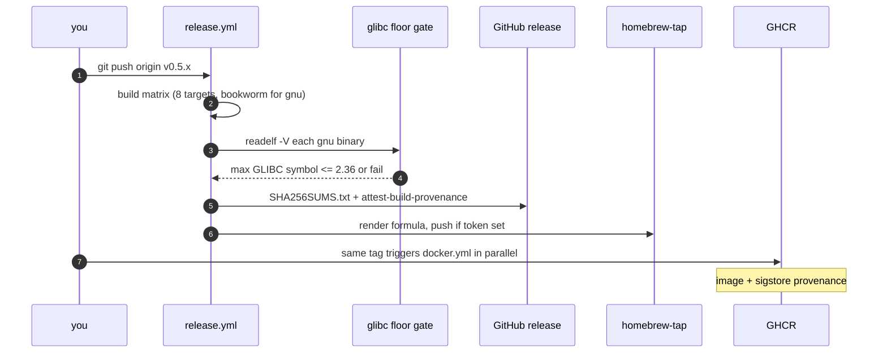

# Build, CI and release

What compiles, what gates a merge, what runs on a tag, and which of those you
can safely ignore.

## Features

`Cargo.toml` defines eleven features. `default` is
`native, tui, audio, metrics`; `full` is everything except `wasm`.

| Feature | Implies | Gates |
|---|---|---|
| `native` | — | Everything that cannot compile to WASM: libpcap capture, clap, the pcap file writer, the tracing subscriber. Most other features imply it. |
| `tui` | `native` | The ratatui/crossterm terminal UI. |
| `tls` | — | TLS/SRTP decryption: `ring`, `rustls`, keylog parsing, and `zeroize` for key material. **Does not imply `native`** — decryption is useful in the WASM analyzer too. |
| `hep` | `native` | HEP/EEP capture source, with HMAC auth. |
| `metrics` | `native` | The standalone Prometheus `/metrics` listener. Raw TCP and threads, deliberately independent of `api` — you can ship metrics without the axum stack. |
| `audio` | — | The `sipnab-audio` plugin loader for TUI playback. **Does not imply `native`**; it is a `dlopen` of a separate cdylib. |
| `api` | `native` | The axum REST API. |
| `mcp` | `native` | The MCP server over stdio. |
| `mcp-http` | `mcp` + `api` | Streamable-HTTP MCP transport; depends on `api` so the axum stack is shared rather than duplicated. |
| `wasm` | — | The browser analyzer bindings. Lib-only: its test and bin targets are meaningless on the host. |
| `full` | everything but `wasm` | What the pre-commit hook and most local testing use. |

The implications that surprise people: **`tls` and `audio` do not pull in
`native`**, and `mcp-http` pulls in *both* `mcp` and `api`. A green
`--features full` therefore says nothing about whether `--features tls` alone
compiles, which is exactly why CI has a feature matrix.

## The eight workflows

| Workflow | Trigger | What it does |
|---|---|---|
| `ci.yml` | push, PR | The merge gate. See below. |
| `quality.yml` | push to main, PR | Coverage (`cargo-llvm-cov`) and clippy SARIF upload. Not required by `ci-success`. |
| `codeql.yml` | push to main, PR | GitHub's static analysis. |
| `fuzz.yml` | weekly cron (Mondays 05:17 UTC) + manual | Coverage-guided `cargo-fuzz` runs; crash reproducers upload as artifacts. |
| `docker.yml` | push to main, `v*` tags | Builds and pushes the image to GHCR with sigstore provenance. |
| `pages.yml` | push to main (path-filtered) | Builds and deploys the Zola website. |
| `wiki-sync.yml` | push to main (path-filtered) | Regenerates the wiki from `docs/` via `scripts/build-wiki.py`. |
| `release.yml` | `v*` tags | The release. See below. |

### What actually gates a merge

`ci-success` requires exactly four jobs: **`check`, `features`, `audit`,
`fuzz-check`**.

- **`check`** (per-OS matrix) — `cargo build --all-features`, `cargo test
  --all-features`, `cargo clippy --all-features --all-targets -D warnings`,
  `cargo fmt --check`, `cargo doc --no-deps --all-features --workspace`, plus
  the `--ignored` PTY TUI end-to-end tests.
- **`features`** — `cargo check --no-default-features --features X --tests`
  across eleven feature sets: each of `native`, `tls`, `api`, `mcp`, `hep`,
  `metrics`, then `tls,api`, `native,tui,audio`, `native,tui,tls,hep,api`,
  `native,hep,api,mcp,mcp-http` and `wasm` (lib-only). The documented headless
  server recipe (`native,hep,api,mcp,mcp-http`) gets a full `cargo test`, not
  just a compile check.
- **`audit`** — `cargo-audit` and `cargo-deny`.
- **`fuzz-check`** — the `fuzz/` workspace compiles.

**`install-sh` and `deb-package` are not in that list.** They run on every push
— the installer test suite plus shellcheck, and the `.deb` build for both the
full and `noaudio` variants — but a failure in either does **not** block a
merge. If you touch `website/static/install.sh` or `contrib/deb/`, read their
logs yourself; nothing else will make you.

## Hooks

Activate once per clone: `git config core.hooksPath .githooks`.

[`pre-commit`](../../.githooks/pre-commit) runs seven numbered gates, in order:
clippy (`--features full`, `-D warnings`); the full test suite; no
`unwrap()`/`expect()` in production code; WASM exports in sync with the site's
JS; the homepage test count matching the run it just did — plus the site and
man-page version strings matching `Cargo.toml`; no TODO stubs; and a refusal to
commit a staged `src/wasm.rs` without a rebuilt bundle beside it.

That means **every commit runs clippy and the whole test suite** and takes
minutes. It is not optional theatre: the homepage-count gate alone means adding
a test obliges you to update `website/templates/index.html` in the same commit.

[`pre-push`](../../.githooks/pre-push) adds four hard gates that `cargo test`
does not cover: `cargo fmt --check`, `cargo clippy --all-features --all-targets
-D warnings`, `cargo doc` with `RUSTDOCFLAGS=-D warnings`, and `cd fuzz &&
cargo check`. Rustdoc lints and the separate fuzz workspace compile
independently of the test build, so these are exactly the failures that
otherwise appear ten minutes later in CI. `SKIP_FMT_HOOK=1` bypasses all of
them; if you use it, expect CI to notice.

Both hooks have their own test scripts —
[`test-pre-commit.sh`](../../scripts/test-pre-commit.sh) and
[`test-pre-push.sh`](../../scripts/test-pre-push.sh).

## The toolchain

**Rust 1.97.1**, pinned in six places and enforced in none of them locally:

| Location | Form |
|---|---|
| `ci.yml` (3 jobs), `quality.yml` (2 jobs), `release.yml` | `dtolnay/rust-toolchain@1.97.1` |
| `Cargo.toml`, `crates/sipnab-audio/Cargo.toml` | `rust-version = "1.97"` (MSRV) |
| `Dockerfile`, `harness/sipnab/Dockerfile` | `FROM rust:1.97-slim-trixie` |

There is **no `rust-toolchain.toml`**, so your local `rustup default` is
whatever you last set — nothing in the repo corrects it. This is not
hypothetical: the changelog records CI pinned at 1.94.1 while local development
ran 1.97.1, and clippy consequently validated against a different compiler than
the one gating merges. If you add a `rust-toolchain.toml`, update every row
above in the same change.

## Releases

A release is a pushed `v*` tag. `release.yml` then runs a matrix of eight
builds: `x86_64` and `aarch64` for `linux-gnu` (each also in a `noaudio`
`.deb`-only variant), `x86_64` and `aarch64` `linux-musl`, and both macOS
architectures. The gnu targets build inside a `rust:1-bookworm` container so
their glibc floor is 2.36; aarch64 gnu cross-compiles inside that same
container via Debian multiarch rather than cross-rs, for the same reason.

Every gnu binary then passes a `readelf -V` gate that fails the build if it
links a `GLIBC_` symbol newer than 2.36 — a regression guard on the build
environment, not on the code. Artifacts are checksummed into `SHA256SUMS.txt`
and attested with `actions/attest-build-provenance`, so a downloader can run
`gh attestation verify <file> --repo NormB/sipnab`. Finally the `tap` job
renders the Homebrew formula and pushes it to `NormB/homebrew-tap`, skipping
with a warning if the token is absent.

The tag is what starts it, and everything after is automatic.

Version strings live in `Cargo.toml`, `website/config.toml` and `man/sipnab.1`,
and the pre-commit hook fails if they disagree — so bumping a version is one
edit plus two it will remind you about. The test count in
`website/templates/index.html` is gated the same way.

Everything a change passes through, in the order you meet it:

