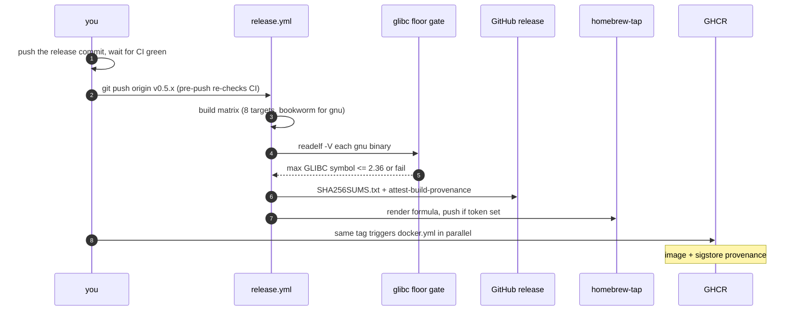
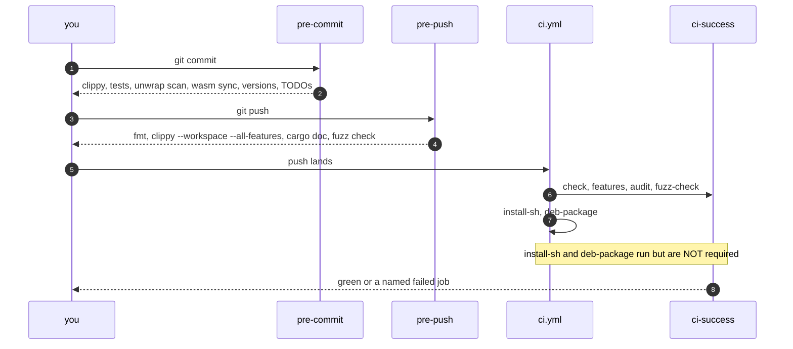

# Build, CI and release

What compiles, what gates a merge, what runs on a tag, and which of those you
can safely ignore.

## Features

`Cargo.toml`'s `[features]` table has thirteen entries: the twelve named
features below, plus `default` — which is `native, tui, audio, metrics`.
`full` is everything except `wasm` and `bpf`, and that is still true — but it
is no longer the whole story of what ships.

`bpf` sits outside `full` because building it needs a nightly toolchain and
`bpf-linker` for the kernel object, and this project cannot demand either of a
contributor. The RELEASE has both: `release.yml` builds the four `*-linux-gnu` matrix
entries with `--features full,bpf`, installs the two tools, and sets
`SIPNAB_BPF_REQUIRED=1` so a runner missing either fails the build instead of
publishing a binary that advertises the feature and refuses at runtime.

The musl and macOS artifacts do NOT carry it, for two different reasons.
`bpf` costs +589,952 bytes, and the published 0.5.117 x86_64 musl binary is
12,252,424 bytes against the 12 MB ceiling `release.yml` enforces — 330,488
bytes of headroom, so it does not fit. On macOS `Cargo.toml` declares `aya`
under `[target.'cfg(target_os = "linux")'.dependencies]`, so the feature would
compile to nothing while `--version` claimed it. On those binaries
`--uprobe-backend bpf` still refuses, and `sipnab --version` is how you tell
which build you hold: it lists every compiled feature, `bpf` and `plugins`
included.

| Feature | Implies | Gates |
|---|---|---|
| `native` | — | Everything that cannot compile to WASM: libpcap capture, clap, the pcap file writer, the tracing subscriber. Most other features imply it. |
| `tui` | `native` | The ratatui/crossterm terminal UI. |
| `tls` | — | TLS/SRTP decryption: `ring`, `rustls`, keylog parsing, and `zeroize` for key material. **Does not imply `native`** — decryption is useful in the WASM analyzer too. |
| `hep` | `native` | HEP/EEP capture source, with HMAC auth. |
| `metrics` | `native` | The standalone Prometheus `/metrics` listener. Raw TCP and threads, deliberately independent of `api` — you can ship metrics without the axum stack. |
| `audio` | — | The `sipnab-audio` plugin loader for TUI playback. **Does not imply `native`**; it is a `dlopen` of a separate cdylib. |
| `api` | `native` | The axum REST API. |
| `mcp` | `native` | The MCP server over stdio. |
| `mcp-http` | `mcp` + `api` | Streamable-HTTP MCP transport; depends on `api` so both share one axum stack rather than duplicating it. |
| `plugins` | `native` | The `wasmi` WASM plugin host. **Non-default on purpose** — someone who does not want an interpreter inside their capture tool does not get one. See [`../design/wasm-plugin-api.md`](../design/wasm-plugin-api.md), which measures the cost at +1.56 MB and 15 crates. |
| `wasm` | — | The browser analyzer bindings. Lib-only: its test and bin targets are meaningless on the host. |
| `bpf` | `native` | The eBPF uprobe backend — the only one that can report the peer address a TLS session went out to, because it pairs each write with its `tcp_sendmsg`. **Outside `full`**: the kernel half needs nightly and `bpf-linker`. Shipped on the four `*-linux-gnu` release artifacts, not on musl or macOS. |
| `full` | everything but `wasm` and `bpf` | What the pre-commit hook and most local testing use. The released gnu binaries add `bpf` on top. |

The implications that surprise people: **`tls` and `audio` do not pull in
`native`**, and `mcp-http` pulls in *both* `mcp` and `api`. A green
`--features full` therefore says nothing about whether `--features tls` alone
compiles, which is exactly why CI has a feature matrix.

## The thirteen workflows

| Workflow | Trigger | What it does |
|---|---|---|
| `ci.yml` | push, PR | The merge gate. See below. |
| `quality.yml` | push to main, PR | Coverage (`cargo-llvm-cov`), clippy SARIF upload, and the prose gates below. Not required by `ci-success`. |
| `codeql.yml` | push to main, PR | GitHub's static analysis. |
| `fuzz.yml` | weekly cron (Mondays 05:17 UTC) + manual | Coverage-guided `cargo-fuzz` runs; crash reproducers upload as artifacts. |
| `docker.yml` | push to main, `v*` tags | Builds and pushes the image to GHCR with sigstore provenance. |
| `pages.yml` | push to main (path-filtered) | Builds and deploys the Zola website. |
| `scorecard.yml` | push to main, weekly cron (Mondays 07:20 UTC), branch-protection change | OpenSSF Scorecard posture analysis → Security tab. Report-only. |
| `wiki-sync.yml` | push to main (path-filtered) | Regenerates the wiki from `docs/` via [`scripts/build-wiki.py`](../../scripts/build-wiki.py). |
| `release.yml` | `v*` tags | The release. See below. |
| `sanitizers.yml` | weekly cron (Tuesdays 06:11 UTC) + manual + on its own path | ThreadSanitizer over the threaded integration suites. Nightly as a tool, not as the toolchain. |
| `self-hosted-smoke.yml` | manual (`workflow_dispatch`) | Proves the thor-02 self-hosted runner can build sipnab before any production job runs on it. Fires on no automatic event, so no PR can execute on the box. |
| `osv-scanner.yml` | push to main, PR, weekly cron (Wednesdays 05:41 UTC) + manual | Vulnerability matching against osv.dev for EVERY lockfile, not just the crate graph. Not redundant with `cargo audit`: that reads Cargo.lock and RustSec only, so advisories against the Actions pins, the Dockerfiles or the fuzz workspace are invisible to it. It also queries a service rather than keeping a local advisory clone, so it does not share the stale-cache failure that broke every `cargo audit` for a day on 2026-08-09. |
| `bench.yml` | daily cron (03:29 UTC) + manual | 4-core offline reconstruction against the baseline in [`bench/baseline.json`](../../bench/baseline.json), failing below 80% of it. Exists because a 40% regression shipped in four releases with every test green. Nightly and wide-banded on purpose: the reference host also serves CI, so a per-push wall-clock gate would measure contention. |

### ThreadSanitizer

`sanitizers.yml` runs the threaded integration suites under
`-Zsanitizer=thread`, weekly. It exists because nothing else in the suite can
see a data race: the tests exercise the capture thread, the channel, and the
processing thread, but a test that passes and a test that raced are
indistinguishable to `cargo test`. The borrow checker does not help here either
— it stops at `unsafe`, and 41 of this crate's 49 `unsafe` blocks are libc FFI
for privilege dropping and capture setup.

Three things about it are deliberate.

**Nightly is a tool, not the toolchain.** `-Zsanitizer` is nightly-only, and so
is `cargo-fuzz`. Both run in their own workflow while the release build stays on
the pinned stable version. Moving the build to nightly would break the toolchain
pin, the MSRV promise, and the reproducibility of a released binary.

**`-Zbuild-std` is mandatory, not optional.** Without rebuilding the standard
library with instrumentation, TSan sees `std`'s synchronisation as opaque and
reports the channel itself as a race — the noise that gets a race detector
switched off.

**The scope is a sample, and the workflow says so.** Five suites run: the REST
API and its token path, HEP, MCP stdio, and the CLI behavior tests. Nothing
finds a race in a path outside that list. Add the suite rather than assuming
coverage.

[`ops/tsan/suppressions.txt`](../../ops/tsan/suppressions.txt) silences libpcap, libasound and the dynamic loader,
which TSan cannot instrument. Each entry carries the reason it is not a real
race. An unexplained suppression turns a race detector into a race ignorer.

**The sanitizer build drops mimalloc.** `RUSTFLAGS` carries
`--cfg sipnab_tsan`, and [`src/main.rs`](../../src/main.rs) skips its `#[global_allocator]` under that
cfg. mimalloc is C compiled by the `cc` crate, so `-Zsanitizer=thread`
does not instrument it, and TSan sees neither its alloc/free (no shadow reset on
a recycled block) nor its internal cross-thread synchronisation: every block
handed from one thread to another reads as a data race. The 2026-07-29 run
reported exactly that, and its stacks named `read` and
`Vec::append_elements_unreserved` with no allocator frame anywhere — so a
suppression could not have matched it. `docs/design/backlog.md` records the
bisect. The shipped binary keeps mimalloc. Only the sanitizer build differs.

**The verdict reads every process, and classifies.** The step greps rather than
trusting the exit code (TSan can report a finding and still exit 0 when the test
passes), but two things make that grep mean something. `log_path` gives each
process its own `tsan.<pid>`: the suites spawn the `sipnab` binary and consume
its stderr, so before that, a report from a child reached the log only if some
test happened to print the child's stderr into an assertion message — the first
run's "0 races" meant "nothing printed". And the verdict names the finding
it actually matched instead of calling everything a data race — an earlier draft
would have reported a thread leak as one.

`thread leak` is in the fatal set. It was briefly written off as expected, on
the reasoning that sipnab exits fail-fast paths through `std::process::exit`,
which joins nothing. That had it backwards: `bootstrap::launch` spawns the
capture thread *before* the readiness hand-shake, the chroot, and the privilege
drop, so every failure from there on abandoned a thread still holding an open
capture source — and `sipnab -I /nonexistent.pcap`, a mistyped filename, was
enough to do it. Those paths now go through `capture::stop_and_join`, which sets
the shutdown flag, drops the receiver, and joins. The suites report zero leaks,
and the fatal classification is what keeps it that way.

A missing `__tsan_init` in the built binary fails the job outright, since a
build that quietly lost its instrumentation would otherwise report a clean run
forever.

All of that lives in [`ops/tsan/verdict.sh`](../../ops/tsan/verdict.sh), not inline in the workflow, with
[`ops/tsan/test-verdict.sh`](../../ops/tsan/test-verdict.sh) beside it and a `tsan-verdict` job in `ci.yml`
running it on every push. The inline version had to move because it was
wrong in the direction nobody checks: `run:` blocks execute under
`bash -e -o pipefail`, so its bare `grep … | while read` warning loop exited 1
on a tree with **no** findings and killed the step before it could report — the
job failed silently when clean and passed while a thread leak was present. The
instrumentation guard had the mirror of it, `grep -q` closing the pipe on a
still-writing `nm` and reading SIGPIPE as "not instrumented". Nothing could have
caught either without running the logic against a fixture, which is the whole
argument for it being a script.

### The prose gates

`quality.yml`'s `Docs` job runs three tools over `docs/`, [`website/content/`](../../website/content/) and
`README.md`: Vale with the Google style package, codespell, and lychee twice —
once over the Markdown, once over the site Zola builds from it. The built-site
pass matters because it is the only place the generated pages get checked, and it
cannot run on this project's own aarch64 hardware, where no Zola binary exists.

`.vale.ini` carries the whole policy, and reading it beats re-deriving it: which
rules fail the build, which ones sit disabled with the alert count each produced,
and which ones a measurement rejected because the advice did not survive contact
with this corpus. Five rules fail the build today. Four more sit off, with their
reasoning recorded rather than left for the next reader to rediscover.

**This repo pins the style package to an exact release.** `Packages = Google`
resolves through the registry to `releases/latest/download`, and CI runs
`vale sync` on every job, so that spelling makes every prose gate depend on
whatever upstream published last. A local styles tree is only as fresh as the
last manual sync, so a green local run says nothing about CI. Google v0.7.0
landed 2026-07-30 13:43 UTC and rewrote one rule's regex. A gate measured and
enabled against the older package reported 0 alerts locally and 35 in CI, and
main went red.
`vale_style_package_is_pinned_to_a_release` holds the pin now. To upgrade: change
the version, `vale sync`, then re-run Vale and read the diff in alert counts
before committing.

### What actually gates a merge

`ci-success` requires exactly four jobs: **`check`, `features`, `audit`,
`fuzz-check`**.

- **`check`** (per-OS matrix) — `cargo build --all-features`, `cargo test
  --all-features`, `cargo clippy --workspace --all-features --all-targets -D warnings`,
  `cargo fmt --check`, `cargo doc --no-deps --all-features --workspace`, plus
  the `--ignored` PTY TUI end-to-end tests.
- **`features`** — `cargo check --no-default-features --features X --tests`
  across twelve feature sets: each of `native`, `tls`, `api`, `mcp`, `hep`,
  `metrics`, then `tls,api`, `native,tui,audio`, `native,tui,tls,hep,api`,
  `native,hep,api,mcp,mcp-http`, `bpf`, and `wasm` (lib-only). The documented
  headless server recipe (`native,hep,api,mcp,mcp-http`) gets a full `cargo
  test`, not just a compile check. `bpf` is here because every published
  `*-linux-gnu` binary now carries it: this leg compiles its userspace half and
  its test files, while `build.rs` takes its degrading default (no nightly, no
  `bpf-linker` on this runner) — the release job is where the kernel half is
  actually built, under `SIPNAB_BPF_REQUIRED=1`. `--tests` is what makes any of
  these real: without it the check compiles no test file at all, and every leg
  goes green over nothing.
- **`audit`** — `cargo-audit` and `cargo-deny`.
- **`fuzz-check`** — the `fuzz/` workspace compiles.

### Dependabot bumps fail on a generated file, not on an API break

**Every Dependabot pull request fails the same way, and it is almost never a
code break.** A script generates `THIRD-PARTY-NOTICES.md` from the dependency
graph, and the `third_party_notices_are_current` gate in [`tests/docs_drift_test.rs`](../../tests/docs_drift_test.rs)
re-runs [`scripts/build-third-party-notices.py`](../../scripts/build-third-party-notices.py) and fails when the committed file
differs. Dependabot moves `Cargo.lock` and never regenerates what derives from
it.

The fix is one command on the branch:

```bash
python3 scripts/build-third-party-notices.py
```

**Read the failure signature before you believe the job names.** Exactly the
jobs that *execute* the suite fail — `check` on both platforms, `coverage`, and
the single `features` combination that runs `cargo test` — while every
check-only `features` combination stays green. A real compile break fails those
too. `check` runs the tests, and its name reads like "compiles".

On 2026-08-02 this presented as three pull requests each failing five jobs,
which looked exactly like three simultaneous major-version API breaks.
`wasmi` 0.51 to 1.1, `rmcp` 2.2.0 to 3.0.1, and a three-crate group each needed
**zero** code changes. Verifying that cost three separate investigations, which
is why this section exists.

One caveat on `rmcp` specifically: a major bump can be genuinely wide and still
touch nothing sipnab uses. Diff the actual MCP wire traffic rather than reading
the changelog, because that is what tells you whether behavior moved.

Branch protection sets `required_status_checks.strict: true`, so a green pull
request shows `BEHIND` whenever `main` moves. Arm auto-merge per pull request
rather than racing a manual rebase against your own pushes.

**`install-sh` and `deb-package` are not in that list.** They run on every push
— the installer test suite plus shellcheck, and the `.deb` build for both the
full and `noaudio` variants — but a failure in either does **not** block a
merge. If you touch [`website/static/install.sh`](../../website/static/install.sh) or [`packaging/deb/`](../../packaging/deb/), read their
logs yourself. Nothing else makes you.

## Hooks

Activate once per clone: `git config core.hooksPath .githooks`.

[`pre-commit`](../../.githooks/pre-commit) runs nine numbered gates, starting
at 0, in order:
<!-- The nine pre-commit gates as one list. Several items carry their own commas
and parentheses ("clippy (`--features full`, `-D warnings`)"), so semicolons are
the separator; periods would make nine sentences out of one enumeration. -->
<!-- vale Google.Semicolons = NO -->

`cargo fmt --all -- --check`; clippy (`--features full`, `-D warnings`); the
full test suite; no `unwrap()`/`expect()` in production code; WASM exports in
sync with the site's JS; the homepage test count matching the run it just did —
plus the site and man-page version strings matching `Cargo.toml`; no TODO
stubs; a refusal to commit a staged [`src/wasm.rs`](../../src/wasm.rs) without a rebuilt bundle
beside it; and an
<!-- vale Google.Semicolons = YES -->

advisory notice when a commit touches a file `docs/internals/` cites without
touching `docs/internals/` itself.

Gate 0 is first because it is the cheapest check in either hook (~1.4s
against clippy's minutes), so an unformatted tree fails in seconds rather than
after a full lint and test run. `pre-push` still checks formatting, and that
copy is the one guaranteeing nothing unformatted reaches the remote. What it
cannot do is catch the slip early, and a formatting-only failure discovered at
push time costs a whole commit-and-push cycle to undo.

Two of the nine cannot fail the commit. Gate 6 prints
`WARN: N TODO/FIXME comments` and falls through — a count, not a veto. Gate 8
prints `REVIEW` and a list and returns zero, a reminder to check the developer
pages still read true, not a claim that they don't. The gate that *does* fail
is [`dev_docs_drift_test`](../../tests/dev_docs_drift_test.rs) in gate 2's test
run, and it is broader than dead links: sixteen tests covering cited paths that
no longer exist, a `()`-suffixed symbol in link text with no matching `fn` left
in the workspace, an absolute GitHub URL where a relative path belongs, a page
missing from `build-wiki.py` (which would silently never publish), and three
mermaid conventions — `sequenceDiagram` only, no markdown links inside a fence,
and a prose line above every one. What it cannot catch is prose that has
quietly become false. That is still a human's job.

A failing gate names what failed. Gate 1 prints every clippy diagnostic with
its file and line. Gate 2 prints the name of each failing test, then the panic
location and assertion message for the first three, then the
`test result: FAILED` summary and a command that re-runs one test on its own.
Both gates write the whole capture to `.git/sipnab-pre-commit-clippy.log` or
`.git/sipnab-pre-commit-tests.log` and print that path, and both cap what
reaches the terminal at twenty diagnostic lines and twelve lines of panic.
When the suite fails to compile, gate 2 prints the compile errors instead. When
it dies without naming a test at all, gate 2 prints the last twenty lines
rather than nothing. A passing run still prints one line per gate.

Both gates capture their tool's output rather than let it stream, because gate
5 reads the test run back for the homepage count and a streamed clippy would
bury the per-gate summary. That capture used to swallow the answer: a failure
printed `FAIL` and a "run it yourself" line, so whoever hit it paid for a
second full suite run to learn the name of the test, and could not tell until
that run finished whether the break was theirs or already on `HEAD`. Settling
that one question cost an extraction of a pristine `HEAD` into a scratch
directory.

That means **every commit runs clippy and the whole test suite** and takes
minutes. It is not optional theatre: the homepage-count gate alone means adding
a test obliges you to update [`website/templates/index.html`](../../website/templates/index.html) in the same commit.

Three checks stay out of the hook on purpose: the twelve-combination feature
matrix, Vale prose linting, and rustdoc. The hook already costs minutes and
each of those adds more. [`pre-push`](../../.githooks/pre-push) picks up
rustdoc and three of the twelve combinations before anything leaves the
machine, and CI runs the rest. Moving them into the pre-commit hook buys
nothing — it is the same wait, on every commit instead of every push.

[`pre-push`](../../.githooks/pre-push) adds eight hard gates that `cargo test`
does not cover: `cargo fmt --check`, `cargo clippy --workspace --all-features --all-targets
-D warnings`, `cargo doc` with `RUSTDOCFLAGS=-D warnings`, `cd fuzz &&
cargo check`, a check of the reduced feature combinations `tls`, `api` and
`wasm`, a non-Linux compile of the whole tree, and the two prose linters — Vale
and codespell. Rustdoc lints and the
separate fuzz workspace compile independently of the test build, and no cargo
command reads prose at all, so these are exactly the failures that otherwise
appear ten minutes later in CI. The prose pair arrived last and for cause: on
2026-08-03 Vale turned main red with 12 passive-voice errors and codespell
followed with two spelling hits in `src/` doc comments, each found only after
a push. A missing Vale or codespell binary reports `NOT CHECKED` rather than
passing, because a gate that goes quiet when its tool is absent is worse than
no gate. `SKIP_FMT_HOOK=1` bypasses all of them. If you use it, expect CI to
notice. After those eight comes one gate that is not hard — the corpus gate
below, which runs only when the machine holds the capture corpus.

Those gates let their tool write straight to the terminal instead of capturing
it, so a failure arrives with the rustfmt diff, the clippy lint or the rustdoc
warning already on screen. Nothing to withhold, and nothing to fix there.

The reduced-combination gate is the newest and the least obvious. Every other
check in that hook builds with `--all-features`, which cannot see `#[cfg]`-gating
rot at all: an item that needs a feature-gated module compiles perfectly until
someone builds without that feature. It has bitten twice — the `features` job
below records "at one point 7 of 8 reduced combos failed to build", and it
happened again on the 0.5.61 release commit, where a test reflecting over `Cli`
(behind `native`) took a whole test target out of every build without it. Three
combinations, not twelve: `tls` and `api` are the ones that *exclude* `native`,
where the breakage lives, and `wasm` is the most distant target. The full matrix
stays in CI. CI skips a combination the crate does not define, the way the
fuzz gate skips a missing `fuzz/`.

The non-Linux gate sits directly beneath it and answers the same question one
axis over. Feature gating is one way to write a `#[cfg]` nobody local ever
compiles. `target_os` is the other, and it is worse, because CI holds the only
non-Linux build in this project. Two macOS breaks reached it hours apart on
2026-08-07 — `cannot find value FANOUT_HASH_WITH_ROLLOVER`, then `unused
variable: fanout_group` under `-D warnings` — and every gate above said OK on
both. [`scripts/check-non-linux.sh`](../../scripts/check-non-linux.sh) copies
the tree to `target/nonlinux-shim/tree`, swaps the `target_os` values there so
that `"linux"` names nothing and `"macos"` names the host, and runs CI's own
macOS invocation over the result. The Linux arms drop out, the
`not(target_os = "linux")` arms compile, and both breaks fail the gate by name
and line.

It runs **rustdoc** over that shim tree as well as clippy, and that half covers
a gap neither CI nor a Linux developer can reach. Broken intra-doc links never
fire under build or clippy, and `ci.yml` guards its Docs step with
`if: runner.os == 'Linux'` — so a doc link into a `#[cfg(target_os = "linux")]`
module was visible to exactly one kind of machine: a Mac, at push time, as a
hard block on every push including the one that would have fixed it. Links to
`capture::uprobe` in [`src/capture/native.rs`](../../src/capture/native.rs) did precisely that, and were green
in CI the whole time.

The clippy pass costs 50 seconds the first time and 10 seconds after that, and it
touches only the copy, so an interrupt leaves the working tree alone. The rustdoc
pass is newer than those figures and is not included in them. Its
`target/nonlinux-shim` directory holds 1.3 GB after that first run and then
grows with the number of **distinct source states** it has checked, because
cargo keeps the artifacts of every version it has already built. This page
used to say "1.7 GB after a dozen", which measured a handful of trees. Across
a day of commits it reached **78 GB** on 2026-08-08 and exhausted the disk
mid-release. Delete the directory as routine maintenance,
not only when space is tight — it is disposable and the next run rebuilds it
in 50 seconds. The script's header records the four alternatives it replaced and the
evidence against each — the FreeBSD cross-check cannot escape mimalloc's C
build, and the wasm check never compiles `capture/` at all.

Two things keep it honest. It counts `target_os` predicates before and after
the rewrite and refuses when the numbers disagree, because a pattern that
quietly matches nothing would compile an unmodified tree and print OK forever.
And on a non-Linux host it prints `NOT CHECKED` instead of running: there, your
ordinary `cargo clippy` already is the non-Linux build.

### The corpus gate

The corpus gate differs from the eight hard
gates above in one way: it runs only when it can. `SIPNAB_CORPUS` names a
directory of real captures — traffic recorded off live networks, with PII in
every packet. The rule for that corpus is 100% validation, and anything short of
100% counts as a critical failure. Nothing enforced that rule between one manual
run and the next. On 2026-08-03 a corpus test turned out to have failed on every
real capture for weeks. Nobody knew, because no automation ever ran it.

CI cannot close that gap. Nobody commits, uploads, or caches those captures, and
they never leave the machine that recorded them, so a hosted runner has nothing
to validate against. The moment before a push is the only enforcement point that
remains, which is why this one gate lives in a hook and has no CI counterpart
anywhere in the ten workflows above.

**What runs.** One `cargo test` invocation, all features, under the `profiling`
profile, covering every top-level `tests/*.rs` that names `SIPNAB_CORPUS` — twelve
targets today, and the ones with `corpus` in the name are not all of them:
`input_set_accounting_test` and `rtp_quality_provenance_test` read the corpus
too. The hook greps the tree for that list instead of carrying its own copy,
because a hand-kept list cannot catch a *new* corpus binary, which is the one
thing this gate exists for. The first draft did hand-keep the list, and it went
stale inside an hour, when a twelfth binary landed mid-review.

**When it runs.** Last, after the eight hard gates. Each of those fails in
seconds, and spending a minute on the corpus only to hear that the tree does not
compile wastes the minute. The gate then reaches one of five states — a run, or
one of the four reasons not to run — and each prints its own line:

- **`SIPNAB_CORPUS` resolves to a readable directory.** The gate runs the suite
  and prints `corpus: N test binaries against <dir> ... VALIDATED`. Push allowed.
- **The same, but a corpus test fails.** The gate prints `FAIL`, names the binary
  and test that broke, and **blocks the push**.
- **`SIPNAB_CORPUS` unset.** Push allowed, and the gate prints
  `corpus: NOT VALIDATED -- SIPNAB_CORPUS is unset`.
- **`SIPNAB_CORPUS` set to anything other than a readable directory.** Push
  allowed, and the gate prints
  `corpus: NOT VALIDATED -- SIPNAB_CORPUS is not a readable directory`.
- **No `tests/*.rs` names `SIPNAB_CORPUS`.** Push allowed, and the gate prints
  `corpus: NOT VALIDATED -- no corpus test targets in this crate`.
- **`SKIP_CORPUS_HOOK=1`.** Push allowed, and the gate prints
  `corpus: BYPASSED (SKIP_CORPUS_HOOK=1) -- real captures NOT validated`.

Silence is not one of the options. Whoever lacks the corpus still pushes, and
the output still says which of those happened. `VALIDATED` and `NOT VALIDATED`
are different words on purpose: silence in a column of `OK` lines reads as a
pass, and a skipped check nobody knows about is the hole this gate closes.

A directory the process cannot read counts as unreadable, not as empty. An
unreadable directory walks to zero files, and a corpus test over zero files
passes while proving nothing.

**Naming what failed.** This gate captures cargo's output rather than letting it
stream, so it follows the same discipline as pre-commit gates 1 and 2: it prints
the binary and test name for each failure, the panic location and assertion
message for the first three, and the `test result: FAILED` summary, then writes
the whole capture to `.git/sipnab-pre-push-corpus.log` and prints that path. It
caps the terminal at ten names and twelve lines of panic. It also prints a
single-test reproduce command, because the alternative costs whoever hit it
another full pass over 8.8 GB just to learn which test broke.

That log describes the **last** run and nothing before it: a validated run
deletes it. So a file present in `.git/` always means the most recent corpus
gate failed, and its absence means the most recent one passed. Without that
removal a failure written weeks ago outlives every green push after it, and a
reader who finds it has no way to date it — which happened, twice, with a
`... FAILED` line that no run of the real corpus had ever produced.

**Why the `profiling` profile.** Measured on a 14-core machine against an 8.8 GB
corpus of 137 files with a warm page cache:

- every corpus binary, one `cargo test` invocation, `profiling` — **87 s**
- the same binaries, one `cargo test` invocation *each*, `profiling` — **379 s**
- the nine `*corpus*` binaries, one invocation, **dev** profile — **460 s**
- a `profiling` rebuild after a library change, then the run — **413 s**

Three decisions come out of those numbers. One invocation rather than a loop: the
in-process `finished in` times sum to 86 s either way, so the extra 293 s is
cargo re-resolving the dependency graph on every start and queueing on the
shared package-cache lock. An optimized profile rather than dev: 8.8 GB of
packets makes the parsers the entire workload, and the dev profile pays 460 s of
run time on *every* push without ever amortizing anything. And `profiling`
rather than `release`, because `[profile.release]` sets `panic = "abort"` — an
aborting test process dies before the test harness prints its `failures:` list,
so the gate would block a push and then fail to name what broke. `profiling`
inherits release and restores `panic = "unwind"`.

That also settles the question of a subset. At 87 s for everything, dropping a
binary saves seconds and gives up a whole class of real-capture regression:
diagnosis claims and message retention, ICMP evidence for signaling and for
media separately, conformance-rule hit rates, `nat_mismatch` and `no_media`
firing only where the capture supports them, detector clocks against the
capture's own timeline, every documented filter field and alias, behavioral
scanner alerts backed by an outcome, the two silent-loss fixes, `-I` input-set
accounting, and RTP-quality provenance. Losing any one of those is how the
failure above survived for weeks.

The build, not the run, is what makes this gate feel slow. `lto = true` and
`codegen-units = 1` relink every corpus binary with full LTO whenever the
library changes. `target/profiling` persists between pushes, so a second push
that touches no source pays 87 s rather than 413. Building those binaries under
the `profiling` profile while working moves the wait off the push entirely. The
gate's own comment in [`.githooks/pre-push`](../../.githooks/pre-push) carries the exact build-only command.

**How to bypass.** `SKIP_CORPUS_HOOK=1 git push` drops this gate and leaves the
other five standing. That is a second variable rather than a reuse of
`SKIP_FMT_HOOK`, and deliberately so: `SKIP_FMT_HOOK=1` switches off formatting,
clippy, rustdoc, fuzz, and the feature combinations as well, which is far too
much to give up because a corpus is temporarily unavailable. It is also not a
variable anybody already has in their shell history. Either way the output names
the bypass, so a push that took it stays on the record.

Both hooks have their own test scripts —
[`test-pre-commit.sh`](../../scripts/test-pre-commit.sh) and
[`test-pre-push.sh`](../../scripts/test-pre-push.sh).

[`install-from-source.sh`](../../scripts/install-from-source.sh) has nothing to do with
the hooks: it is the developer-facing source install (`cargo install --path .
--bin sipnab`, then `--setup-caps` on Linux). It passes `--bin` deliberately —
without it, `gen_fixture` also satisfies its `required-features` and lands in
the caller's `~/.cargo/bin`.

## The toolchain

**Rust 1.97.1**, pinned across seven files and enforced in none of them
locally:

| Location | Form |
|---|---|
| `ci.yml` (3 jobs), `quality.yml` (3 jobs), `release.yml` | `dtolnay/rust-toolchain@<sha> # 1.97.1` |
| `Cargo.toml`, [`crates/sipnab-audio/Cargo.toml`](../../crates/sipnab-audio/Cargo.toml) | `rust-version = "1.97"` (MSRV) |
| `Dockerfile`, [`harness/sipnab/Dockerfile`](../../harness/sipnab/Dockerfile) | `FROM rust:1.97-slim-trixie@sha256:<digest>` |

A commit SHA pins the action, so the **version lives in the trailing
comment** — which makes that comment load-bearing rather than decorative.
`rust_toolchain_pins_agree` reads it, and also asserts the ref really is a
40-hex SHA: an edit dropping back to `@1.98.0` would otherwise contribute
nothing to the comparison instead of failing it. The Dockerfiles keep the tag
beside the digest for the same reason — that gate parses `FROM rust:X.Y`.

There is **no `rust-toolchain.toml`**, so your local `rustup default` is
whatever you last set — nothing in the repo corrects it. This is not
hypothetical: the changelog records CI pinned at 1.94.1 while local development
ran 1.97.1, and clippy consequently validated against a different compiler than
the one gating merges. If you add a `rust-toolchain.toml`, update every row
above in the same change.

## Releases

**The site advertises the last PUBLISHED release, not the crate version.**
[`website/config.toml`](../../website/config.toml) carries both: `version`, which the Pages step overwrites
from `Cargo.toml` on every build, and `published_version`, which every download
link and version badge draws from. They are different facts, and conflating
them broke the download page in production — the release *commit* bumped the
crate version, Pages redeployed, and the whole of `/download` pointed at a tag
nobody had pushed yet. Every link 404ed, including `SHA256SUMS.txt` and the
checksum column. On 0.5.61 that window was not minutes: its release commit went
red and was never tagged.

So `published_version` moves **after** a release finishes publishing, in its
own commit — never while cutting one. The same split applies to the docs:
`docs/install.md`'s `SIPNAB_VERSION=`, `e.g. <version>` and `rpm -i sipnab-<v>`
lines are download instructions, so they track `published_version` too and must
NOT move when the crate version does. A blanket
`sed s/<old>/<new>/g` over `docs/install.md` at a release commit is exactly the
mistake — `docs_current_version_markers_match_cargo` splits its list on this and
fails the commit rather than shipping a documented `curl` that 404s. The
`sipnab <version> (<hash>)` samples in the same file are the opposite case: they
show what a build *of this tree* prints, so they follow `Cargo.toml`.
`site_advertises_only_a_released_version` requires a matching `v<x.y.z>` tag, so
getting this wrong fails the suite instead of the visitor.

**Tag a commit whose CI is green.** A tag is not a request to build — it
publishes immediately and irreversibly, whatever that commit contains: fourteen
installable artifacts (six `.tar.gz`, four `.deb`, four `.rpm`), a `.sha256`
beside each tarball, a combined `SHA256SUMS.txt`, two SBOMs, a provenance
attestation, a GHCR image, and a Homebrew formula — twenty-three release assets in
all. The order is therefore: push the release commit, wait for CI, then tag the
commit that passed.

A hook enforces this rather than merely advising it. [`pre-push`](../../.githooks/pre-push)
refuses a `v*` tag whose commit has a failed run, has runs still in flight, or
has no runs at all. It skips with a warning when `gh` is unavailable rather than
blocking — forcing `SKIP_FMT_HOOK=1` would switch off every other gate too, which
turns one missing optional tool into running no checks at all.

It exists because the manual version failed once already. The 0.5.61 release
commit went red in `Features (tls)`, and the only thing between that and a
published broken release was somebody happening to look.

A release is a pushed `v*` tag. `release.yml` then runs a matrix of eight
builds: `x86_64` and `aarch64` for `linux-gnu` (each also in a `noaudio`
packages-only variant, shipping a `.deb` and an `.rpm` but no tarball, since the
static musl tarballs already cover the no-audio tarball case), `x86_64` and
`aarch64` `linux-musl`, and both macOS architectures.

Eight builds, six tarballs — the number of builds is not the number of artifacts.
This page previously described a release as publishing "eight artifacts", and
called the `noaudio` variants `.deb`-only. Neither had drifted: the `noaudio`
variants landed on 2026-07-07 and gained `.rpm` on 2026-07-09, while the
`.deb`-only sentence dates from 2026-07-25 and the "eight artifacts" count from
2026-07-29. Both were wrong the day they landed, written by reading the matrix
and counting its rows. That is the failure mode a re-stated number has when
nothing produces it, so `release_artifact_counts_match_the_build_matrix` now
derives every count here from the matrix itself.

The gnu targets build inside a `rust:1-bookworm` container so
their glibc floor is 2.36. The aarch64 gnu target cross-compiles inside that
same container via Debian multiarch rather than cross-rs, for the same reason.

Every gnu binary then passes a `readelf -V` gate that fails the build if it
links a `GLIBC_` symbol newer than 2.36 — a regression guard on the build
environment, not on the code. Artifacts are checksummed into `SHA256SUMS.txt`
and attested with `actions/attest-build-provenance`, so a downloader can run
`gh attestation verify <file> --repo NormB/sipnab`.

The macOS builds carry the same kind of floor, arrived at the other way round.
Nothing set `MACOSX_DEPLOYMENT_TARGET` for a long time, so each darwin tarball
floored wherever the pinned rustc defaulted to — 11.0 for `aarch64-apple-darwin`
and 10.12 for `x86_64-apple-darwin`, a real constraint that no file in the
repository named. `/download` filled the gap with "macOS 12+" for both, which was
wrong for each and concealed that they differ. `release.yml` now pins the target
per build, at those same two values so no binary changed, and
`published_macos_floors_match_the_toolchain` holds [`website/config.toml`](../../website/config.toml) to what
the workflow pins. That gate also refuses a floor pinned *below* the compiler's
own default: the config and the workflow would agree, and the published number
would still be an OS the binary cannot run on. To move real support, change the
two `floor=` lines and let the gate walk the published numbers to match.

Two CycloneDX SBOMs ship with each release, and both the checksum file and the
attestation cover them: `sipnab-<version>.cdx.json` for the binary
and `sipnab-audio-<version>.cdx.json` for the playback plugin. Two, not one,
because the plugin is a separate workspace crate loaded with `dlopen` and it
pulls in seven dependencies the main crate's graph does not contain at all —
`alsa`, `alsa-sys`, `cpal`, `dasp_sample`, `num-bigint`, `num-rational`,
`rodio`. A single main-crate SBOM would omit precisely the C-library-adjacent
dependencies a vulnerability scan is looking for, while looking complete.

The binary SBOM uses `--features full,bpf` on purpose: the union of every
feature set the build matrix compiles. The `noaudio` and musl artifacts resolve
a strict subset of that graph — measured on 0.5.54, `full` and `noaudio` differ
by exactly one component, `libloading` — and the gnu artifacts add `bpf`, which
brings in four crates `full` alone never reaches (`aya`, `aya-obj`, `object`,
`assert_matches`). `THIRD-PARTY-NOTICES.md` comes from that same set, named
once as `RELEASE_FEATURES` in
[`scripts/build-third-party-notices.py`](../../scripts/build-third-party-notices.py). That constant said `full`
while the gnu binaries shipped `full,bpf`, and because
`third_party_notices_are_current`
compares the committed file against that same generator, both sides of the gate
agreed while both were wrong.
`the_notices_and_sbom_cover_every_released_feature_set` now runs the release
workflow's own feature-computing step for every matrix entry and fails if
either the SBOM flag or `RELEASE_FEATURES` stops covering the union, so one
document over-covers rather than under-covers every binary published, which is
the safe direction. `cargo-cyclonedx` has no `--package` flag: one workspace-level
invocation emits a document per member into that member's own directory, and
the release step renames them apart on the way into `artifacts/`.

Finally the `tap` job
renders the Homebrew formula and pushes it to `NormB/homebrew-tap`, skipping
with a warning if the token is absent.

The tag is what starts it, and everything after is automatic.



Version strings live in `Cargo.toml`, [`website/config.toml`](../../website/config.toml), [`man/sipnab.1`](../../man/sipnab.1),
[`fuzz/Cargo.lock`](../../fuzz/Cargo.lock) and several docs, and committing with any of them out of step
fails — so bumping a version is one edit plus the ones the gates point you at.

That enforcement lives in **one** place: `docs_current_version_markers_match_cargo`
and `man_page_version_and_license_match_cargo` in
[`tests/docs_drift_test.rs`](../../tests/docs_drift_test.rs), which the hook
runs via `cargo test` and CI runs again. The hook used to carry its own shell
re-implementation with a separate file list. The two diverged and it rejected a
correct release commit over a deliberately historical version reference. If you
need to change which docs carry a marker, change the Rust list.

Note which files are deliberately *excluded*: pages that record the release
something was **measured** on — the benchmarks pages — must not track the crate
version. A marker forcing them to is what kept a stale benchmark claim looking
freshly checked for twenty-nine releases.

The same mechanism gates the test count in [`website/templates/index.html`](../../website/templates/index.html), by
`ci.yml` against the real suite total. That check is Linux-only: platform-gated
tests mean the macOS leg runs a handful fewer, so one advertised number cannot
be true of both, and the figure describes the Linux run.

### The changelog

`CHANGELOG.md` follows [Keep a Changelog](https://keepachangelog.com/en/1.1.0/)
and says so in its header. Entries sit under `Added` / `Changed` /
`Fixed` / `Removed`, and the project uses a few extra headings where those four
do not fit what a release actually did.

sipnab is pre-1.0, so the header states the versioning policy rather than
claiming strict Semantic Versioning: the public API and CLI surface are not
stable and a breaking change may land in any release. Say so in the entry that
carries one.

Work that has landed but not shipped goes under a `## [Unreleased]` heading,
which cutting a release renames to `## [x.y.z] - <date>`. That heading is
load-bearing rather than decorative: `no_changelog_entry_precedes_its_version_heading`
requires every `###` section to sit under some `## [...]`, so entries added
without one are orphans and fail. The gate accepts `Unreleased` precisely so
work can accumulate between releases without doing that.

It exists because an edit whose anchor included the heading destroyed it, leaving two sections under the file header. That survived a commit, a push
and a full CI run, because the sibling gate searches for the heading naming the
*current site version* — which was still present further down.

Nothing gates the changelog's contents, which is deliberate — prose would satisfy
a gate on prose. What *is* gated is the release date: it must match
[`website/config.toml`](../../website/config.toml), asserted by `site_release_date_matches_changelog`.

### Re-measuring the benchmarks

The published throughput numbers are **not** gated by CI, deliberately. Shared
runners are too noisy for a throughput threshold: such a gate fails randomly,
gets muted, and a muted gate is worse than no gate — it reports safety it is
not providing. `quality.yml` therefore executes the criterion suites without
timing them, which is "the benchmarks still run", not "performance has not
regressed".

Detecting a real regression is a release-time step on the reference host,
because that is the only place the numbers mean anything:

```sh
# Run all of these, in order.
gh release download vX.Y.Z -p 'sipnab-*-aarch64-unknown-linux-gnu.tar.gz*'
sha256sum -c sipnab-*-aarch64-unknown-linux-gnu.tar.gz.sha256   # never a dev build
tar xzf sipnab-*.tar.gz

python3 bench/carrier.py --calls 5000 --out corpus.pcap
bench/scaling.sh ./sipnab-*/sipnab corpus.pcap 535000 --cores 1,2,4,8 --runs 5
```

Run it on an otherwise idle machine. If the numbers moved, A/B the previous
release artifact against the same corpus in the same session before concluding
anything — a corpus or session difference looks exactly like a regression, and
[the benchmarks page](../benchmarks.md) records one occasion that fooled
a reader into calling it one. Update both benchmark doc trees and the homepage tiles
together. Gates enforce that they agree.

Everything a change passes through, in the order you meet it:


