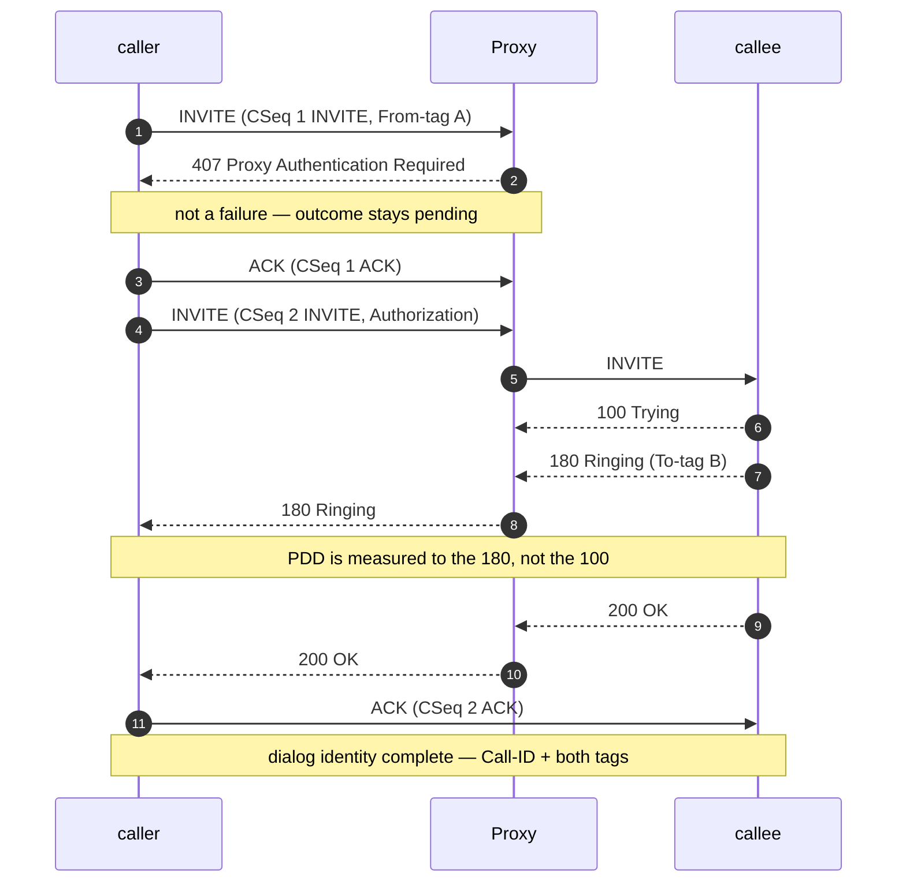
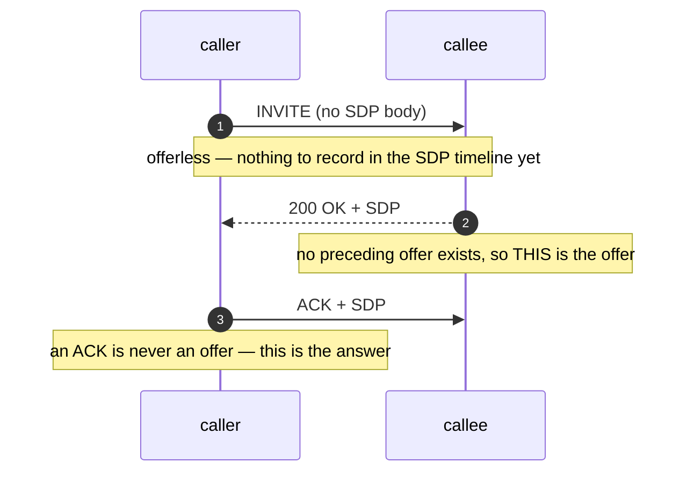
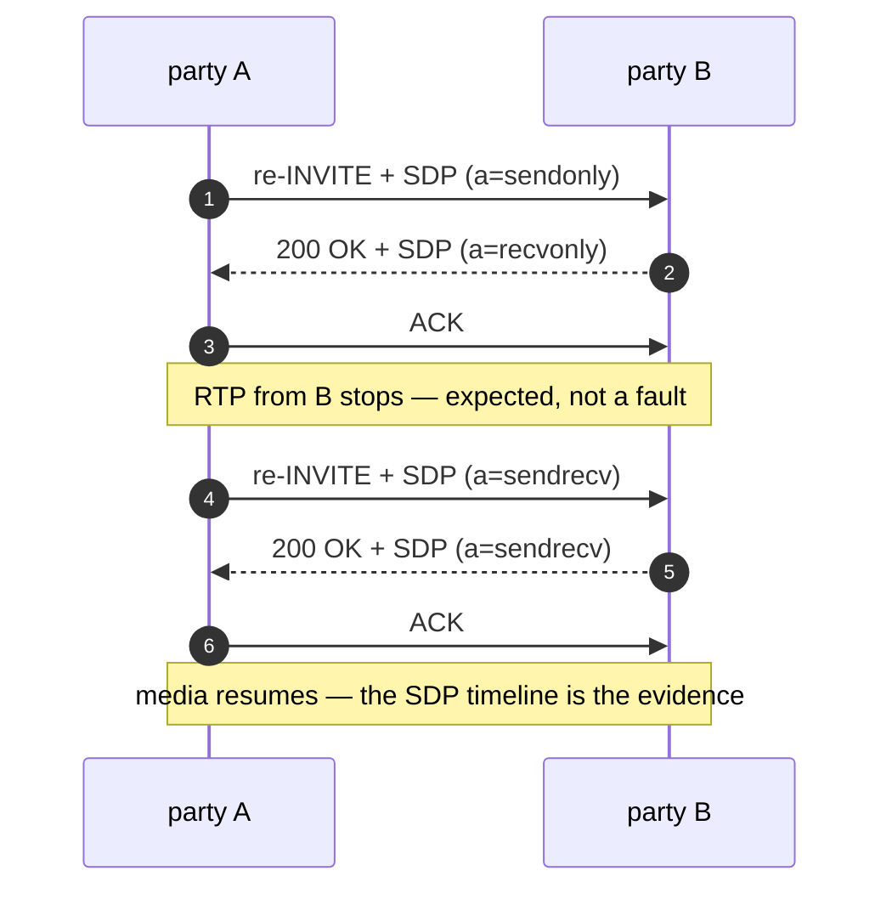
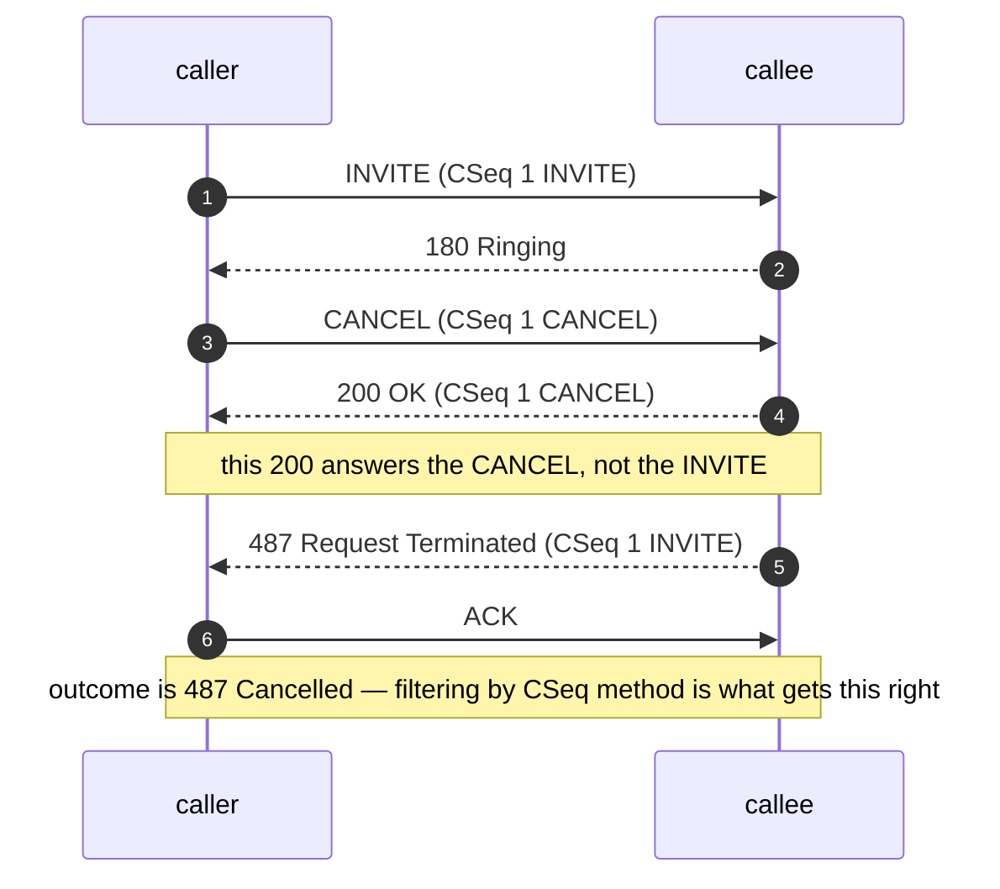
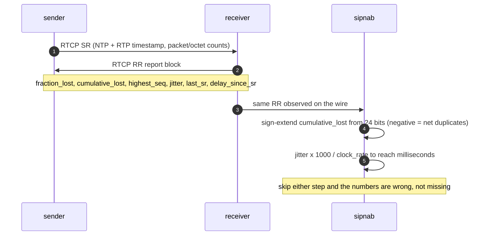
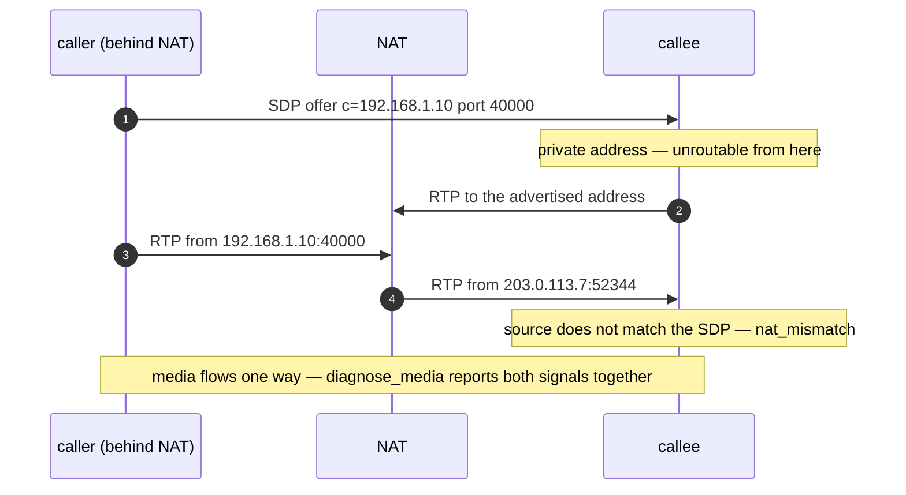

# SIP and RTP: the model the code assumes

Written for the Rust engineer who is new to VoIP. Nearly every subtle bug in
this tree is a protocol-semantics bug wearing a Rust costume — the code
compiles, the tests pass, and the number on screen is wrong because the
protocol does not mean what it looks like it means.

Each concept names the file that encodes it, so this doubles as an index into
the source.

The diagrams here use the same mermaid `sequenceDiagram` form sipnab itself
exports: press `E` in the Call Flow view to copy a diagram to the clipboard, or
`F2` and Tab through the save formats to Mermaid. You can regenerate every one
of them from a real capture.

## SIP

### Dialog, transaction, and what the store actually keys on

A **transaction** is one request plus its responses. A **dialog** is the
longer-lived relationship a successful INVITE establishes — it spans many
transactions (INVITE, re-INVITE, BYE) and is what a human means by "a call".

RFC 3261 identifies a dialog by the triple Call-ID + From-tag + To-tag.
sipnab's [`DialogStore`](../../src/sip/dialog_store.rs) keys its map on
**Call-ID alone** and keeps `from_tag`/`to_tag` as fields on
[`SipDialog`](../../src/sip/dialog.rs). That is a deliberate simplification for
a capture tool: at capture time the To-tag does not exist yet (it arrives in
the first response), so keying on the full triple would mean re-keying every
dialog mid-flight. sipnab still captures the tags — `to_tag` fills in the first
time a response carries one — and it tells forked calls that share a Call-ID
apart downstream rather than by the map key.

Two things must be knowable before a message gets a dialog at all: its Call-ID,
and its method. The method requirement is the less obvious one, and it exists
because [`SipDialog::method`](../../src/sip/dialog.rs) takes its value once at creation
and never corrected. A response derives it from CSeq, so a malformed response —
Call-ID present, CSeq absent — used to create a dialog under that Call-ID
labelled with an invented method, and the genuine INVITE arriving afterwards
matched that entry instead of creating its own. The label then outlived the
capture. Such a message now creates no dialog. It is still captured, counted, and
searchable, and the INVITE that follows creates the dialog correctly.

### CSeq pins the transaction

Every request carries `CSeq: <number> <METHOD>`. Responses echo it, and that
echo is the only reliable way to know *which* request a response answers.

This is not pedantry. [`update_timing()`](../../src/sip/timing.rs) records the
initial INVITE's CSeq number in `invite_cseq` precisely so that a **re-INVITE's
200 OK cannot overwrite `answered_at`**. Without that pin, a call put on hold
twenty minutes in reports a twenty-minute setup time — a plausible-looking
number that is simply false.

### Auth challenges are pending, not failure

A 401 or 407 is the server saying "try again with credentials". Nearly every
real call starts with one. Treating it as a final failure would report most of
a healthy carrier's traffic as failed.

[`SipDialog`](../../src/sip/dialog.rs) therefore treats 401/407 as
*intermediate*: the reported outcome is the maximum non-challenge final
response, and the challenge only becomes the answer for a call that drew a
challenge and **never** authenticated.

That rule now holds for the dialog *state* as well, not only the reported code.
It did not for a long time: only the REGISTER handler skipped challenges, so a
challenged INVITE went to `Failed` and the 2xx that followed could not lift it
back out, because that transition only admits the pre-answer states. A captured
BYE hid the result by forcing `Completed`, which is why it survived — the calls
it misreported were the ones still up, or the ones whose BYE never made it into
the capture.

The exchange, with what each hop tells the analyzer.

### The INVITE three-way handshake, and why ACK is special

INVITE alone among SIP methods takes a separate ACK transaction to confirm. Two
consequences the code encodes: sipnab records the ACK but makes **no state
transition** (the 200 already moved the dialog to `InCall`), and an ACK may
carry SDP — see delayed offer below.

Non-INVITE transactions (REGISTER, OPTIONS, MESSAGE) are simple
request/response with no ACK at all.

### Post-dial delay stops at the ringing

`pdd_ms()` in [`timing.rs`](../../src/sip/timing.rs) measures INVITE → first
180/183. A `100 Trying` **does not count**: it means "I got your request", not
"the callee's phone is ringing", and any proxy emits it immediately. Measuring to
the 100 would report an excellent PDD for a call the caller experienced as ten
seconds of silence.

### Offer/answer, and the delayed-offer inversion

Normally the request carries the SDP **offer** and the response carries the
**answer**. RFC 3261 §13.2.1 allows an offerless INVITE, and then the roles
invert: the 200 OK carries the offer and the ACK carries the answer.

[`determine_offer_answer()`](../../src/sip/sdp_timeline.rs) encodes exactly
that: an ACK is *always* an answer, and a response bearing SDP with no
preceding offer in the dialog is itself the offer. Label these by message type
alone and every delayed-offer call in the capture is backwards.

### Hold and resume are direction attributes

A re-INVITE with `a=sendonly` puts the far end on hold, and `a=sendrecv` resumes.
[`sdp.rs`](../../src/sip/sdp.rs) parses `sendonly`/`recvonly`/`inactive` into a
direction on the media description. The older RFC 2543 convention of holding by
setting the connection address to `c=0.0.0.0` is **not** recognized as hold
here — such a call reads as media simply stopping.
Media stopping mid-call is therefore not automatically a fault — check the SDP
timeline before calling it one-way audio.

### CANCEL versus 200 OK is a race

CANCEL asks to abandon an INVITE with no final response yet. If the callee's
200 OK crosses it on the wire, both exist in the capture and the naive reading
("last response wins") gives the wrong outcome.

The state machine in [`dialog.rs`](../../src/sip/dialog.rs) resolves this by
CSeq method: a CANCEL request moves the dialog to `Cancelled`, and so does the
487 on its own. Either is sufficient, because a CANCEL can travel a different
path from the response and a capture can begin mid-dialog — requiring both once
left a cancelled call sitting in `Ringing` forever. The 487 is the reported
outcome. The 200 that merely acknowledged the CANCEL transaction drops out,
because it belongs to a different CSeq.

### Multi-leg correlation

A B2BUA (SBC, PBX) terminates one call and originates another, so one
human call is two Call-IDs with no shared identifier by default.
[`dialog_store.rs`](../../src/sip/dialog_store.rs) correlates legs five ways,
each with a confidence score and each reported under its own reason:

| Reason | Score | Survives a B2BUA? |
|---|---|---|
| `SessionId` — RFC 7989 `Session-ID` | 100 | **Yes, by design** |
| `XCallId` — a configured header, `X-Call-ID` by default | 100 | Only if the SBC inserts it |
| `SdpOrigin` — the RFC 8866 SDP origin tuple | 90 | Only if the SBC forwards SDP untouched |
| `ViaBranch` — a shared branch parameter | 80 | No: a new transaction gets a new branch |
| `TimingHeuristic` — endpoint overlap plus timing | 50 | Not an identifier at all |

`SdpOrigin` compares the whole uniqueness tuple RFC 8866 defines —
`<username> <sess-id> <nettype> <addrtype> <unicast-address>` — and never
`sess-id` alone, which the RFC recommends deriving from a timestamp and which
two unrelated calls from one user agent can therefore share. It excludes
`sess-version` deliberately, so a re-INVITE for hold or a codec change does not
break the match.

Two of those scores are 100 and they are not interchangeable. `SessionId` is a
standard whose entire purpose is surviving intermediaries that rewrite
everything else. `XCallId` is a vendor convention that works only when someone
configured it. Reporting them separately is what lets a reader tell how far to
trust a call tree.

The bottom row is the one to be careful with. "Same endpoint IP within two
seconds" is a guess, and on a busy SBC many unrelated calls share an endpoint IP
inside that window. It exists because most deployments set no correlation header
at all — see
[`session_id.rs`](../../src/sip/session_id.rs) for why the halves of a
`Session-ID` swap across the SBC, and why matching is therefore set
intersection rather than string equality.

## RTP

### Streams exist without dialogs

An RTP stream carries its identity in its **SSRC**, a 32-bit random number, not in any
SIP field. It has no Call-ID, no From, nothing linking it to signaling except
the IP/port pair the SDP advertised.

That is why [`StreamStore`](../../src/rtp/stream_store.rs) is a first-class
store rather than a child of the dialog store (D13), why sipnab discovers streams
heuristically when it never saw their SDP, and why the `--cores` merge
needs a re-association pass: the media and the signaling can be sharded to
different workers.

### Sequence numbers wrap at 65536

The 16-bit sequence number wraps roughly every 20 minutes of voice. Loss
detection compares `wrapping_add(1)` against the received sequence
([`stream.rs`](../../src/rtp/stream.rs)). A plain `>` comparison reports one
enormous loss burst per wrap on every long call.

### Timestamps are not wall-clock

The RTP timestamp is a **media sample counter** at the codec's clock rate, not
a time value. Converting it needs
[`clock_rate_from_pt()`](../../src/rtp/stream.rs) for static payload types or
the `a=rtpmap` clock rate for dynamic ones.

G.722 is the trap worth knowing: RFC 3551 assigns it a **8000 Hz RTP clock
despite 16 kHz audio**, so the obvious "clock rate = sample rate" assumption
halves or doubles every derived duration.

### Jitter is a signed transit delta, not a variance

RFC 3550 §6.4.1 defines interarrival jitter as a smoothed mean of the
*difference in transit time* between consecutive packets:
`J(i) = J(i-1) + (|D(i-1,i)| - J(i-1)) / 16`. `stream.rs` computes the transit
delta as a **signed** `i32` before taking the absolute value — with unsigned
arithmetic a single reordered packet underflows and reports a jitter spike of
about 4.29 billion.

RTCP receiver reports carry a jitter field too, but **in RTP timestamp units**.
[`stream_store.rs`](../../src/rtp/stream_store.rs) converts with the stream's
clock rate before storing it, so the RTCP-reported and locally measured numbers
are comparable and MOS gets a millisecond value either way.

The report block is where two of this codebase's historical bugs lived, and
both are visible in the same six fields.

### MOS is an estimate, not a measurement

[`estimate_mos()`](../../src/rtp/quality.rs) is an E-model computation from
jitter, loss, and codec — a model output on the 1.0–4.5 scale, not an opinion
score from a listener. Say "estimated MOS" in anything user-facing. The
distinction is the difference between a tool an engineer trusts and one they
re-derive.

### Bursty loss and diffuse loss are not the same impairment

Ten percent loss in one clump is a dropped word. Ten percent scattered is a
faint crackle a codec's concealment mostly hides.
[`analyze_burst_gap()`](../../src/rtp/quality.rs) classifies which it is, and
the loss map view renders it in sequence space.

### DTMF travels out of band, and depends on the clock

RFC 4733 telephone-events carry digits as their own payload type, negotiated
in SDP. [`extract_dtmf_with_clock()`](../../src/rtp/dtmf.rs) needs both the
negotiated PT and its **rtpmap clock rate** — event duration arrives in
clock ticks, so decoding a 16 kHz telephone-event with an assumed 8 kHz clock
reports every digit as twice its real length.

### Symmetric RTP, NAT, and one-way audio

Endpoints normally send from the same port they receive on ("symmetric RTP").
Behind NAT the address in the SDP is the private one and the media actually
arrives from a translated address — so the naive match of SDP address against
observed source fails, and the stream looks unassociated.

[`diagnose_media()`](../../src/rtp/diagnosis.rs) is where sipnab untangles this:
it infers one-way audio from the directed-endpoint set, `nat_mismatch` from
SDP-versus-observed address disagreement, and the two combine into the
diagnosis an operator reads. It also checks whether comfort-noise frames
explain an asymmetry before flagging it — silence suppression is not a fault.

## What this model prevents

Every one of these was a real defect in this codebase, found and fixed. They
are worth reading as a set, because none of them is a Rust mistake — each is a
place where correct-looking code encoded a wrong protocol assumption.

| The wrong assumption | What it produced | Where it is now handled |
|---|---|---|
| A 200 OK answers the INVITE | A re-INVITE's 200 overwrote `answered_at`; held calls reported absurd setup times | `invite_cseq` pinning in [`timing.rs`](../../src/sip/timing.rs) |
| RTCP jitter is milliseconds | Reported jitter off by the clock-rate factor, and MOS fed the wrong units | Clock-rate conversion in [`stream_store.rs`](../../src/rtp/stream_store.rs) |
| `cumulative_lost` has no sign bit | A 24-bit **signed** field zero-extended: net-duplicate streams reported ~16.7M lost packets | Sign extension in [`rtcp.rs`](../../src/rtp/rtcp.rs), keeping the sign, so a net-duplicate stream reads as a small negative rather than "no loss" |
| Transit deltas never go negative | One reordered packet underflowed to a ~4.29e9 jitter spike | Signed `i32` delta in [`stream.rs`](../../src/rtp/stream.rs) |
| Sequence numbers only increase | A "loss burst" of 65,000 packets once per wrap | `wrapping_add` comparison in [`stream.rs`](../../src/rtp/stream.rs) |
| SDP role follows message type | Delayed-offer calls labeled backwards | [`determine_offer_answer()`](../../src/sip/sdp_timeline.rs) |
| 401/407 is a failure | Most of a healthy carrier's calls reported as failed | Non-challenge maximum in [`dialog.rs`](../../src/sip/dialog.rs) |

The lesson generalizes: when a number looks wrong, the bug is usually not in
the arithmetic. It is in what someone assumed the field meant.
