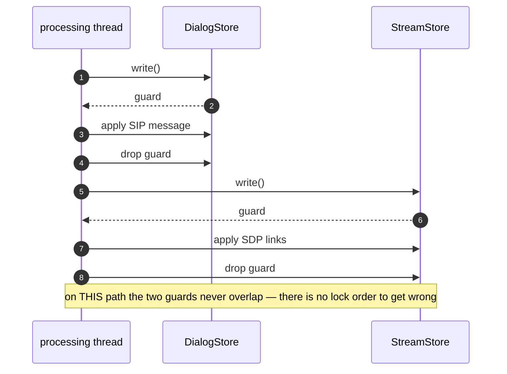
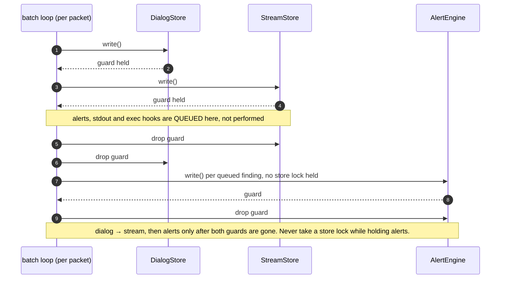
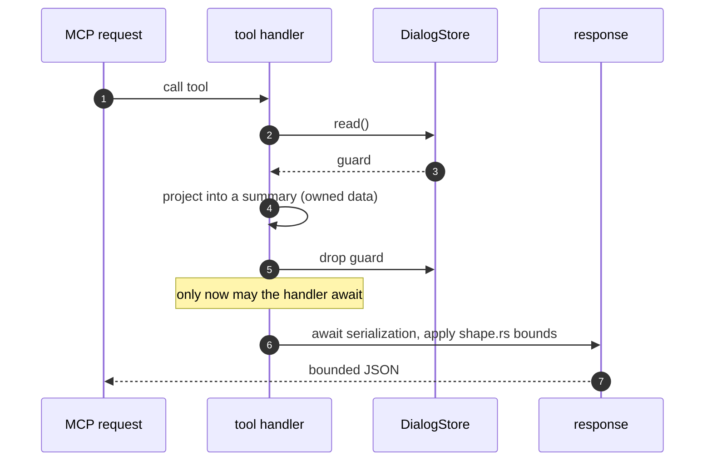

# Invariants

The rules that must not break. Each entry states the rule, why it exists, what
enforces it, and how it fails when broken. If you are about to violate one, the
enforcement usually catches you — but knowing *why* is faster than reading a
CI failure.

Threading detail belongs to [Threading](threading.md). Failure semantics — what
sipnab does when something goes wrong — belong to
[the fault model](../fault-model.md). This page links out rather than
restating.

## 1. One writer per store, per run mode

**Rule.** Exactly one thread writes `DialogStore` and `StreamStore` in a given
run: `tui-processor` in TUI mode, the main thread in batch mode, thread-local
stores in `--cores` mode. Everything else reads.

**Why.** Single-writer discipline is what makes `try_read()` on the render path
safe and cheap. It also means adding a reader cannot introduce a data race. Only adding a
writer can.

**Enforced by.** Structure rather than a lint: the spawn moves the stores into
the processing thread's closure.

**The two exceptions**, and the reason this page documents them rather than
forbidding them:
opening a pcap from inside the TUI spawns `pcap-load`, a second writer against
the live stores. Its whole design — progress via `async_messages`, never a
blocking read on the render side — exists to make that safe. See
[Threading](threading.md).

The second is the same shape with a different poller: `open_capture` spawns
`mcp-pcap-load` ([`mcp/load.rs`](../../src/mcp/load.rs)), and an agent polls
`capture_status` where the TUI polls its event loop. Two conditions admit it,
and the tool enforces both before it spawns anything — the source must be a
file rather than a live interface, and it must already have drained, so the
first writer has stopped for good. The tool refuses a live source outright,
because its writer never finishes.

**Fails as.** A second writer turns every `try_read()` contention into a
dropped frame, and the UI appears to stall under load rather than degrade.

## 2. Dialog before stream, then alerts — one consistent order

**Rule.** When a path needs both stores, take the **dialog store first, then
the stream store**. If it also needs the alert engine, take that **last**, and
never take a store lock while already holding `alerts`. Prefer not to overlap
the two store guards at all. Where they do overlap, the order above is what
makes it safe.

**Why.** Two locks acquired in opposite orders on two threads is the textbook
deadlock. Non-overlapping guards make the question moot, and a single consistent
order answers it when the code cannot keep them disjoint.

> **Corrected 2026-08-03.** This rule used to read *"never hold both write
> locks simultaneously"*, and claimed *"the batch and `--cores` appliers hold
> their stores by `&mut` and so have no ordering to get wrong."* Half of that
> was false, and it was false about the path that carries almost all of
> sipnab's packets. `--cores` workers really do own their stores outright
> (thread-local `DialogStore`/`StreamStore`, no locks at all —
> [`parallel.rs`](../../src/parallel.rs)). The **batch** applier does not: it
> takes `dialog_store.write()` and `stream_store.write()` back to back, once
> per packet, and holds **both** guards across the whole per-packet body
> ([`batch.rs`](../../src/app/batch.rs)). There is no deadlock, because the
> order is consistent everywhere — but the page described a discipline the
> main path does not follow, which is worse than describing none. The rule is
> restated above to say what is actually true and actually load-bearing.

**Enforced by.** Convention, in three shapes:

- **Disjoint guards** — [`process_packet()`](../../src/pipeline.rs) on the live
  path and [`run_pcap_load()`](../../src/tui/controllers/file_open.rs) on the
  TUI file-open path (rule 1's documented exception). Each locks a store once,
  briefly, and releases it before touching the other. This is the shape to copy.
- **Overlapping guards in the documented order** — the batch applier
  ([`batch.rs`](../../src/app/batch.rs)), dialog then stream, held across
  `process_parsed_packet`. Every other thread that wants both takes them in the
  same order, so the cycle never closes.
- **No guards at all** — the `--cores` workers
  ([`parallel.rs`](../../src/parallel.rs)), which own their stores by `&mut`
  and merge at EOF.

Nothing rejects a fourth lock-taking applier that gets it backwards, which is
exactly why this page writes the rule down.

**The `stores → alerts` edge — closed on the batch path, and the rule stays
anyway.** Until `LK1`, the batch loop took `alert_engine.write()` *inside* the
locked body, so the real order on that path was dialog → stream → alerts, and
nobody had written it down. That is no longer so: findings, per-message output and
the `--alert-exec` / `--on-dialog-exec` / `--on-quality-exec` spawns queue up
while the code holds the guards, and `DeferredEffects::drain` replays them after both
guards drop ([`batch.rs`](../../src/app/batch.rs)). The alert engine's write
lock is now taken with **no** store lock held.

The ordering rule above still says "alerts last", because nothing enforces
that and the edge is one line away from coming back. What made it survivable
before was luck rather than design: `security_findings`
([`mcp/server.rs`](../../src/mcp/server.rs)) takes `alerts.read()` and **no**
store lock, so the reverse edge that would have closed the cycle never
existed. That was a property of which tools somebody happened to write. The
first MCP tool or REST handler that reads an alert and *then* a dialog creates
`alerts → stores`. The first packet-path change that re-nests the alert lock
recreates `stores → alerts`. Either alone is harmless, and both together
deadlock the capture thread. Written down here because nothing else says it.
Background: `LK1` in [`backlog.md`](../design/backlog.md), analyzed as R2 in
[`process-isolation-and-hot-path-cost.md`](../design/process-isolation-and-hot-path-cost.md)
§4.

**The sub-rule `LK1` leaves behind: decide under the guard, perform after it.**
Nothing that can block runs under a store guard — no `fork`/`exec`, no
`write(2)`, no third lock. A packet's side effects are *decided* while the
code holds the guards, because that is where the store is, and *performed* once
the guards drop, because that is where nothing waits on them.
[`DeferredEffects::drain()`](../../src/app/batch.rs) is what carries them
across: the output, the alert findings and the queued hook commands travel out
of the locked body as data, and
[`EventExecEngine::dispatch_pending()`](../../src/output/event_exec.rs) spawns
the children afterwards. A rate limit survives the split in half because a
decision parked between the two halves reaches the window at the moment
it happens —
[`TumblingWindow::allows_with_reserved()`](../../src/security/alerting.rs) — so
`--exec-rate-limit N` still means N and not N plus whatever was in flight.

A regression here does not announce itself. It is one line: a `fire_*` call, an
`alert_engine.write()` or a `sink.write_str` reappearing inside
[`process_parsed_packet()`](../../src/app/batch.rs) — and the capture's answer
is byte-identical either way, so no output test can see it. The only thing that
notices is `side_effects_are_raised_under_the_guards_and_performed_after_them`,
which asserts on *when* rather than *what*: both guards still unreadable
(`try_read().is_none()`) while nothing has spawned yet and the queue holds the
decision.

**Fails as.** A hang, not a crash: the TUI stops repainting, the REST API stops
answering, and the capture thread never takes another packet — with no error
anywhere.

The disjoint shape is short enough to state exactly, and `pcap-load` repeats it
packet for packet.

The batch applier is the other shape, and the one to check a new lock against.
Both guards stay live for the whole per-packet body. Everything with a side
effect queues up inside it, and replays once they lift:

## 3. All four paths classify through one function

**Rule.** Protocol behavior lives in
[`classify_packet()`](../../src/pipeline.rs). Appliers apply a `PacketAction`.
They do not decide what a packet means.

**Why.** Before the unification the four paths had drifted — heuristic
RTP discovery and WebSocket-SIP unwrap worked on some and not others, so the
same capture gave different answers depending on which path read it.

**Enforced by.** The `PacketAction` enum (an applier that ignores a new variant
fails to compile) plus
[`pipeline_test`](../../tests/pipeline_test.rs) and
[`parse_path_test`](../../tests/parse_path_test.rs).

**Fails as.** Silent divergence: `--cores 4` and `--cores 1` report different
stream counts for the same file, and neither is obviously wrong.

## 4. Every attacker-keyed map has a bound and a stated eviction policy

**Rule.** Any collection keyed by something a remote party controls — Call-ID,
SSRC, IP, reassembly key — has a cap and a defined behavior at that cap.

**Why.** Otherwise a flood of unique keys is a remote OOM, and a capture tool
is by definition exposed to attacker-chosen input.

**Enforced by.**
[`resource_bounds_test`](../../tests/resource_bounds_test.rs), which floods
each map with unique keys and asserts the cap holds. The dialog store offers
both policies explicitly: `rotate=true` evicts LRU (in batches, because
one-at-a-time removal from the index is O(n) under sustained pressure) and
`rotate=false` drops new arrivals once full. The stream store evicts
oldest-out at `max_streams`. TCP/IP reassembly caps entries, per-datagram size
and per-stream buffered bytes in [`reassembly.rs`](../../src/capture/reassembly.rs).
The digest detector in [`digest_leak.rs`](../../src/security/digest_leak.rs)
remembers at most `MAX_NONCE_ENTRIES` (10,000) challenge nonce values, each
with the transaction that carried it, and drops an arbitrary one to admit the
next. The per-source maps of the other four security detectors are
[`LruMap`](../../src/lru.rs)s: `MAX_SOURCE_ENTRIES` (10,000) sources in the
registration flood detector and `MAX_PENDING_PER_SOURCE` (1,024) open
transactions under each, `MAX_BEHAVIORAL_ENTRIES` (10,000) in the scanner
detector, `MAX_PATTERN_ENTRIES` (10,000) in the fraud detector, and
`MAX_COOLDOWN_ENTRIES` (10,000) for both the alert engine's cooldown and
event maps, with `MAX_EXEC_SOURCE_ENTRIES` the same figure for its per-source
exec budgets. Admitting a key past the cap evicts the least recently used
entry in constant time. Each of these used to pick its victim with
`min_by_key` over the whole map, ten thousand comparisons per packet once a
spoofed-source flood had filled it, on the capture thread under both store
write locks.

**Fails as.** Memory growth under a scan that looks like a leak, on a process
that is often running as a long-lived capture.

## 5. Key material is toxic waste

**Rule.** Anything that can decrypt media — TLS keylog secrets, SDES keys,
derived SRTP session keys — is zeroized on drop and never printed, logged, or
serialized to any output surface.

**Why.** D11. A capture tool holding decryption material is a high-value target
on disk, in a core dump, and in swap. Zeroizing on drop addresses none of the
last one on its own: it clears the RAM copy, not a page the kernel already
wrote to the swap device, which outlives the process.

**Enforced by.** `zeroize` on the keylog material in
[`capture/tls.rs`](../../src/capture/tls.rs) (the `tls` feature pulls the crate
in), a hand-rolled `Drop` zeroization in
[`rtp/srtp.rs`](../../src/rtp/srtp.rs) so non-`tls` builds do not leak session
keys to freed heap, redaction on the output paths, and
`privilege::lock_key_memory` (`mlockall(MCL_CURRENT | MCL_FUTURE)`, called on
the same trigger as the core-dump hardening) so the kernel cannot page them
out in the first place. That last one is best-effort and says so: a low
`RLIMIT_MEMLOCK` is common and not always the operator's to change, so it
reports whether it succeeded rather than claiming hardening it did not do.

**Fails as.** Keys recoverable from a crash report, a core file, or a swap
device read long after the process exited — an exposure with no error message
attached to it.

## 6. A bearer token is valid on exactly one surface, and only as far as its scope

**Rule.** A signed token binds on two axes, and verification checks both.

*Which surface* (`aud`): the token names the surface it belongs to, and each
verifier accepts only its own audience. A token minted from
`--api-signing-key` must never authenticate against HTTP MCP, and vice versa —
including when both surfaces share one signing key.

*How much of it* (`scope`): `full` reaches everything on that surface,
`metrics` reaches `GET /metrics` and nothing else. A `full` token satisfies
every requirement. A narrower one satisfies only its own.

**Why.** The REST API and HTTP MCP read separate flags and separate
environment variables, so an operator putting one secret in both
`SIPNAB_API_SIGNING_KEY` and `SIPNAB_MCP_SIGNING_KEY` looks like tidy
configuration. Before audience binding that silently made every API token a
valid MCP token, with no warning and nothing in the logs.

For `scope`: sipnab decrypts TLS, so `/v1/dialogs` and `/v1/streams` return
message bodies — the call content itself. Without a scope split, a monitoring
system that needs one counter must hold the keys to all of it. That is the one
division of the surface worth having. The rest of it is a single trust domain.

**Enforced by.** The `aud` check in
[`verify_signed()`](../../src/auth.rs), which requires an `s2` token's audience
to equal the verifier's own. Each surface sets its audience once in
[`resolve_api_verifier_config()`](../../src/app/servers.rs) and
[`resolve_mcp_verifier_config()`](../../src/app/servers.rs), and at mint time in
[`mint_token()`](../../src/app/bootstrap.rs). The version prefix is part of the
signed input, so an `s2` token cannot be rewritten as `s1` to shed the binding.
An empty configured audience matches nothing, so a verifier built without one
fails closed. Tests pin cross-surface rejection in both directions in
[`auth.rs`](../../src/auth.rs) and
[`cli_flag_behavior_test`](../../tests/cli_flag_behavior_test.rs).

The `scope` check sits in the same function, immediately before the expiry test,
and the claim is part of the signed payload — so a holder cannot widen their own
token by editing it. Routes demand a scope through
[`guard_scoped()`](../../src/output/api.rs). The plain `guard()` demands `full`,
which is the RESTRICTIVE default: demanding `full` admits only full tokens,
while demanding `metrics` admits both. A route added later and wired to the
plain guard therefore inherits "full tokens only" rather than silently accepting
a scrape-only credential. Tests pin enforcement at all three layers —
the verifier in [`auth.rs`](../../src/auth.rs), the CLI flag in
[`cli_flag_behavior_test`](../../tests/cli_flag_behavior_test.rs), and the real
routes in [`api_token_test`](../../tests/api_token_test.rs) — because a route
wired to the wrong guard passes every unit test and still serves the call
content to a scrape job.

**Fails as.** A token meant for a read-only metrics scrape quietly granting an
AI agent full MCP tool access, or reading dialog bodies on its own surface —
a privilege boundary that exists in the documentation but not in the code.

**Coverage.** (Named so rather than "Scope", which now means a claim.) The
audience check is unconditional: the pre-`aud` `s1` format is no longer
accepted, so there is no token version that reaches a surface without an
audience. The scope check is deliberately *not* symmetric with it — an absent
`scope` means `full`, where an absent `aud` fails closed. `aud` arrived with a
format bump that stopped accepting the old tokens outright. Tokens minted
before `scope` existed are still valid `s2` tokens in the field, and denying
them would revoke live credentials on upgrade. Static `--api-key` /
`--mcp-token` secrets remain audience-less and `full` by design — they name
shared secrets, not tokens, and an operator who sets the same static secret on
both surfaces has deliberately shared one credential.

## 7. MCP tools never edit the analysis, and every response has a ceiling

**Rule.** No MCP tool edits a store in place, and every response hits a size
ceiling before serialization. One tool replaces a store wholesale —
`open_capture`, behind `--mcp-allow-open-capture` — and it rotates the capture
identity in the same critical section that clears the stores, so no answer can
change meaning without saying so.

One tool accepts a WRITE: `save_findings`, behind `--mcp-allow-save-findings`.
It does not weaken this rule, and it appears here so nobody has to discover it
by reading the tool list. What an agent writes goes to the log and reaches
nothing else — no store, no detector, no report, and no other tool, so it cannot
return later as evidence the agent then cites. There is no `list_findings`, and
that omission is the feature. The compiler enforces the dead end, rather than
this paragraph: the annotation types are `pub(in crate::mcp)`, so no
analysis path can name them, and widening that visibility is what a reviewer
should treat as the change that breaks the invariant.

**Why.** An LLM agent drives the MCP surface: it must not be able to
change what an operator is looking at *and leave it looking like what they were
looking at*, and an unbounded response is a denial-of-service against the
agent's context window as much as against sipnab. The rule used to read "no
tool mutates a store", which was true until a capture swap existed and is the
wrong test anyway: what protects the operator is the identity on the wire, not
the absence of the verb.

**Enforced by.** [`shape.rs`](../../src/mcp/shape.rs) — `DEFAULT_LIMIT` 50,
`HARD_LIMIT` 1000, `DEFAULT_MAX_BODY_BYTES` 4096, applied by
[`resolve_limit()`](../../src/mcp/shape.rs) — with
[`mcp_stdio_test`](../../tests/mcp_stdio_test.rs) and
[`mcp_http_test`](../../tests/mcp_http_test.rs) end to end. The identity half is
[`provenance.rs`](../../src/provenance.rs), stamped on every whole-store
response and checked by
[`mcp_open_capture_test`](../../tests/mcp_open_capture_test.rs).

**Fails as.** An agent that quietly truncates or floods, and an operator who
cannot tell which.

## 8. No lock across `.await`

**Rule.** Never hold a `parking_lot` guard across an await point.

**Why.** `parking_lot` guards are not async-aware. Holding one across a yield
parks the runtime thread with the lock still taken. In a current-thread runtime
— which is what [`servers.rs`](../../src/app/servers.rs) builds — that is an
immediate deadlock.

**Enforced by.** `clippy::await_holding_lock = "deny"` in the workspace lint
table. Not a warning: the build fails.

**Fails as.** The API and MCP servers stop responding while capture keeps
running, so the process looks healthy from the outside.

The correct shape is snapshot-then-await, and it is worth seeing in order.

## 9. One wire shape per concept

**Rule.** Every surface that serializes a dialog or a stream projects through
[`output/model.rs`](../../src/output/model.rs). No surface builds its own JSON
object for these.

**Why.** Five call sites implemented it, and they had already drifted: MCP said
`message_count` where CLI and REST said `msg_count`, and MCP emitted
Debug-formatted `Invite` where the API emitted `INVITE`. Consumers wrote
per-surface parsers to compensate.

**Enforced by.**
[`summary_consistency_test`](../../tests/summary_consistency_test.rs) and
[`json_schema_test`](../../tests/json_schema_test.rs).

**Fails as.** A field name that means one thing in `--json` and another over
MCP, discovered by a user's broken script rather than by CI.

## 10. The render pass never mutates and never blocks

**Rule.** Every store access on the render path is `try_read()`. The render
pass computes, it does not mutate.

**Why.** A blocking read on the render thread makes the whole UI hostage to
capture throughput. Skipping a frame is always better than freezing one.

**Enforced by.** [`sync_caches()`](../../src/tui/mod.rs) and
[`draw_frame()`](../../src/tui/mod.rs), which fall back to the previous
snapshot on contention. `draw_frame()` forces a blocking frame after a bounded
number of skips so the display cannot freeze permanently.

**Fails as.** A UI that stutters exactly when the operator most needs it — under
a flood.

## 11. Warn and continue on malformed input

**Rule.** No parser reachable from packet bytes may panic, `unwrap()`, or exit.
sipnab logs malformed input, at most once and rate-limited, then skips it.

**Why.** D17. Every byte sipnab parses is attacker-controlled, so a panic in a
parser is a remote denial of service against a capture process — often one
nobody is watching.

**Enforced by.** Three layers: the pre-commit gate that rejects
`unwrap()`/`expect()` in production code, the always-on
[`smoke_fuzz_test`](../../tests/smoke_fuzz_test.rs) floor under `catch_unwind`,
and the coverage-guided targets in
[`fuzz/fuzz_targets/`](../../fuzz/fuzz_targets). Parsers return typed errors —
`ParseError`, `CaptureError` — rather than panicking, and
[`error_types_test`](../../tests/error_types_test.rs) pins that surface.

**Fails as.** A single crafted packet ends the capture, and the evidence you
were capturing is what you lose.

## 12. A fatal exit never abandons the capture thread

**Rule.** Every fatal exit taken after
[`start_capture()`](../../src/capture/native.rs) goes through
[`stop_and_join()`](../../src/capture/native.rs) — shutdown flag set, receiver
dropped, thread joined — before the process ends. A function that cannot reach
the handle returns the failure to one that can rather than exiting where it
stands.

**Why.** [`launch()`](../../src/app/bootstrap.rs) spawns the capture thread
*before* the readiness hand-shake, the chroot and the privilege drop, because
the source must be open while the process still holds `CAP_NET_RAW`. Every
failure from there on happens with that thread running and holding its source,
and `std::process::exit` joins nothing and runs no destructors. Nineteen exits
in `launch` and four more in
[`BatchRunner::new()`](../../src/app/batch.rs) abandoned it — and the trigger
was not exotic: `sipnab -I /nonexistent.pcap`, a mistyped filename, was enough.

**Enforced by.** ThreadSanitizer, which classes `thread leak` as fatal rather
than warning about it, over the five suites `sanitizers.yml` runs. Also
[`cli_flag_behavior_test`](../../tests/cli_flag_behavior_test.rs), which
exercises both shapes — a source that never opens, and a failure after it opened
— so a regression fails on every push instead of waiting for the weekly
sanitizer run.

**Fails as.** A process that exits while a thread still holds an open capture
device, mid-read. Benign on most exits and invisible without a sanitizer, which
is why it survived until a sanitizer ran over it.

## Two cultural norms

No test enforces them, which is precisely why this page writes them down.

**Cite the standard.** A new analysis claim names the RFC or ITU
recommendation it implements. The
[pull-request template](../../.github/PULL_REQUEST_TEMPLATE.md) asks for it
directly: *"Any new analysis claim is honest and backed by the implementation
(cite the RFC/ITU standard where relevant)."* Jitter is [RFC 3550 §6.4.1](https://www.rfc-editor.org/rfc/rfc3550#section-6.4.1) signed
transit deltas, not a variance. MOS is an E-model estimate, not a measurement.
Saying which one you implemented is the difference between a tool an engineer
can trust and one they have to re-derive.

**Refute your own claims in place.** When a performance claim turns out to be
wrong, the page that made it says so, on the same page, rather
than quietly dropping it. [Zero-copy payloads](zero-copy-payloads.md) does exactly
this: it documents the zero-copy spine and then records that the predicted
20–30% hot-path win *did not hold*, and the change costs nothing measurable on
the workload. The architecture is still right for other reasons, and the reader
gets to see both. A doc tree that only ever records wins is a doc tree nobody
can use to make a decision.

## Who reads this?

**Rule.** A caveat, a limit or a disclosure belongs where its consumer looks.
Writing it somewhere else is not disclosure, and it reads as one.

**Why.** Four defects in a single week shared this shape and nothing else:

- `--portrange` dropped a third of the SIP in a capture. The fix printed the
  loss beside the CLI summary, so a human saw it. the capture-status tools (then `stats` and
  `capture_status`, since folded into one) returned a byte-identical key set whether the run dropped a third of it or
  none of it — so a model driving the MCP tools answered from two thirds of the
  capture with full confidence, and had no way to learn otherwise.
- The SIP-over-WebSocket skip tally repeated the `--portrange` defect above,
  months after that rule landed, with the fixed field one line away to copy.
  It reached the operator as a stderr warning and a CLI summary line and
  reached an MCP client not at all, so on a capture whose WSS lands on 8081 —
  Kamailio, OpenSIPS, Janus and any reverse proxy — `capture_status` answered
  `dialog_count: 0`, `unanalysed_sip_messages: 0` and `degraded: false`, which
  is character for character what a perfect read of a capture holding no SIP
  produces, while an entire WebRTC signaling leg went unreported. Adding a
  disclosure to one surface is not the fix; the fix is adding it to every
  surface that answers the question it qualifies.
- `export_capture` re-synthesizes a frame per SIP message rather than writing
  the packets it read. The function's own doc comment said so plainly and
  called the result "honest about the rest". The tool description an MCP client
  reads said "writes the packets sipnab is holding to a pcap file".
- `the_reporter_is_never_the_unreachable_endpoint` asserted its invariant
  against the parser, where the router and the dead host arrive already
  separated. Swapping them one layer later, in the code that fills the evidence
  a reader sees, left the test green.
- `--hep-send` forwards a whole capture to an operator-named collector. That is
  a legitimate feature. Nothing said it happens, and it sits outside the permit
  system, so an audit of "what can transmit" finds `TransmitPermit` and stops.

None of these were oversights in implementation. In three of the four, someone
had written the truth down carefully — in a code comment, in a doc paragraph below the
example, in a test whose name matched the invariant exactly. The reader who
needed it never saw it.

**In practice.** Ask it of the specific consumer, not of "the docs":

| The consumer | Reads | Does not read |
|---|---|---|
| An MCP client | the tool description, once | `docs/`, code comments, stderr |
| A pcap forwarded to a carrier | the bytes | anything sipnab printed |
| An operator scanning a summary | stdout/stderr of that run | the manual |
| A future reviewer | the diff and the test name | your reasoning |
| A test | the layer it asserts against | the layer the bug lives in |

The last row is the one that catches people: a test named after an invariant is
no evidence that anything guards it. Mutation testing tells the two apart — and
apply the mutation where the code USES the value, not only where it computes it.
