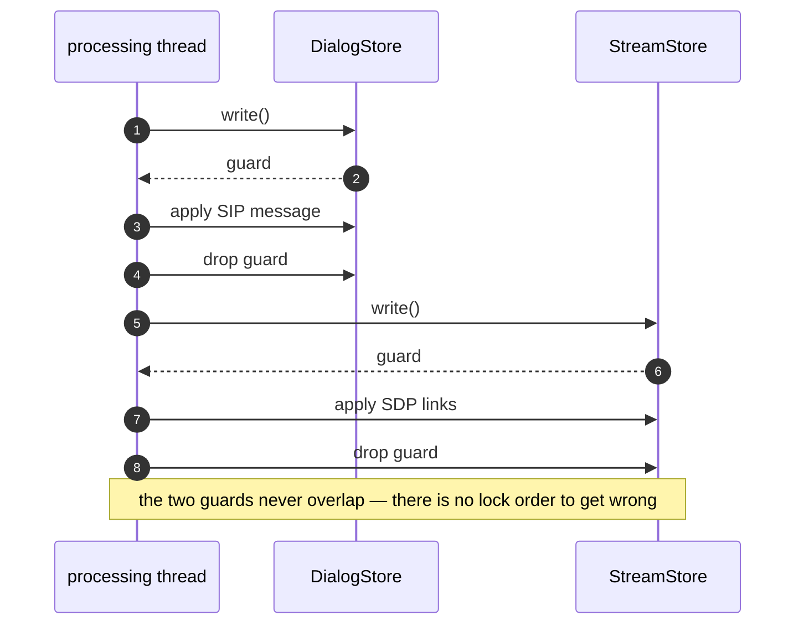
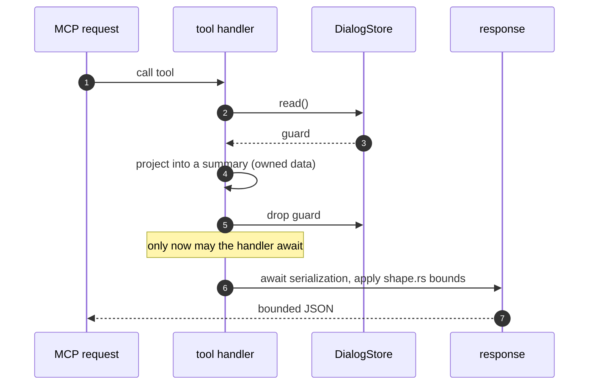

# Invariants

The rules that must not break. Each entry states the rule, why it exists, what
enforces it, and how it fails when broken. If you are about to violate one, the
enforcement will usually catch you — but knowing *why* is faster than reading a
CI failure.

Threading detail belongs to [Threading](threading.md); failure semantics — what
sipnab does when something goes wrong — to
[the fault model](../fault-model.md). This page links out rather than
restating.

## 1. One writer per store, per run mode

**Rule.** Exactly one thread writes `DialogStore` and `StreamStore` in a given
run: `tui-processor` in TUI mode, the main thread in batch mode, thread-local
stores in `--cores` mode. Everything else reads.

**Why.** Single-writer discipline is what makes `try_read()` on the render path
safe and cheap. It also means a data race cannot be introduced by adding a
reader, only by adding a writer.

**Enforced by.** Structure rather than a lint: the stores are moved into the
processing thread's closure at spawn.

**The one exception**, and the reason it is documented rather than forbidden:
opening a pcap from inside the TUI spawns `pcap-load`, a second writer against
the live stores. Its whole design — progress via `async_messages`, never a
blocking read on the render side — exists to make that safe. See
[Threading](threading.md).

**Fails as.** A second writer turns every `try_read()` contention into a
dropped frame, and the UI appears to stall under load rather than degrade.

## 2. Dialog before stream, never both at once

**Rule.** When a packet needs both stores, lock the dialog store, release it,
then lock the stream store. Never hold both write locks simultaneously.

**Why.** Two locks acquired in opposite orders on two threads is the textbook
deadlock; keeping them disjoint makes the ordering question moot.

**Enforced by.** [`process_packet()`](../../src/pipeline.rs), which is the only
applier that takes locks at all — it locks each store once, briefly, and
releases before touching the other.

**Fails as.** A hang, not a crash: the TUI stops repainting with no error
anywhere.

The sequence is short enough to state exactly.

## 3. All four paths classify through one function

**Rule.** Protocol behavior lives in
[`classify_packet()`](../../src/pipeline.rs). Appliers apply a `PacketAction`;
they do not decide what a packet means.

**Why.** Before the pipeline was unified the four paths had drifted — heuristic
RTP discovery and WebSocket-SIP unwrap worked on some and not others, so the
same capture gave different answers depending on how it was read.

**Enforced by.** The `PacketAction` enum (an applier that ignores a new variant
fails to compile) plus
[`pipeline_test`](../../tests/pipeline_test.rs) and
[`parse_path_test`](../../tests/parse_path_test.rs).

**Fails as.** Silent divergence: `--cores 4` and `--cores 1` report different
stream counts for the same file, and neither is obviously wrong.

## 4. Every attacker-keyed map is bounded, with a stated eviction policy

**Rule.** Any collection keyed by something a remote party controls — Call-ID,
SSRC, IP, reassembly key — has a cap and a defined behavior at that cap.

**Why.** Otherwise a flood of unique keys is a remote OOM, and a capture tool
is by definition exposed to attacker-chosen input.

**Enforced by.**
[`resource_bounds_test`](../../tests/resource_bounds_test.rs), which floods
each map with unique keys and asserts the cap holds. The dialog store offers
both policies explicitly: `rotate=true` evicts LRU (in batches, because
one-at-a-time removal from the index is O(n) under sustained pressure) and
`rotate=false` drops new arrivals once full. The stream store evicts
oldest-out at `max_streams`; TCP/IP reassembly caps entries, per-datagram size
and per-stream buffered bytes in [`reassembly.rs`](../../src/capture/reassembly.rs).

**Fails as.** Memory growth under a scan that looks like a leak, on a process
that is often running as a long-lived capture.

## 5. Key material is toxic waste

**Rule.** Anything that can decrypt media — TLS keylog secrets, SDES keys,
derived SRTP session keys — is zeroized on drop and never printed, logged, or
serialized to any output surface.

**Why.** D11. A capture tool holding decryption material is a high-value target
on disk and in a core dump.

**Enforced by.** `zeroize` on the keylog material in
[`capture/tls.rs`](../../src/capture/tls.rs) (the crate is pulled in by the
`tls` feature), a hand-rolled `Drop` zeroization in
[`rtp/srtp.rs`](../../src/rtp/srtp.rs) so non-`tls` builds do not leak session
keys to freed heap, and redaction on the output paths.

**Fails as.** Keys recoverable from a crash report or a core file — an
exposure with no error message attached to it.

## 6. A bearer token is valid on exactly one surface

**Rule.** A signed token names the surface it was minted for (`aud`), and each
verifier accepts only its own audience. A token minted from
`--api-signing-key` must never authenticate against HTTP MCP, and vice versa —
including when both surfaces are configured with the same signing key.

**Why.** The REST API and HTTP MCP read separate flags and separate
environment variables, so an operator putting one secret in both
`SIPNAB_API_SIGNING_KEY` and `SIPNAB_MCP_SIGNING_KEY` looks like tidy
configuration. Before audience binding that silently made every API token a
valid MCP token, with no warning and nothing in the logs.

**Enforced by.** The `aud` check in
[`verify_signed()`](../../src/auth.rs), which requires an `s2` token's audience
to equal the verifier's own; the audience is set once per surface in
[`resolve_api_verifier_config()`](../../src/app/servers.rs) and
[`resolve_mcp_verifier_config()`](../../src/app/servers.rs), and at mint time in
[`mint_token()`](../../src/app/bootstrap.rs). The version prefix is part of the
signed input, so an `s2` token cannot be rewritten as `s1` to shed the binding.
An empty configured audience matches nothing, so a verifier built without one
fails closed. Cross-surface rejection is pinned in both directions by tests in
[`auth.rs`](../../src/auth.rs) and
[`cli_flag_behavior_test`](../../tests/cli_flag_behavior_test.rs).

**Fails as.** A token scoped to a read-only metrics scrape quietly granting an
AI agent full MCP tool access, or the reverse — a privilege boundary that
exists in the documentation but not in the code.

**Known gap.** Legacy `s1` tokens carry no audience and are still accepted by
either surface so pre-existing tokens keep working until they expire. They are
never minted, and accepting one logs a one-time deprecation warning. Static
`--api-key` / `--mcp-token` secrets are also audience-less by design.

## 7. MCP tools are read-only and bounded

**Rule.** No MCP tool mutates a store, and every response is size-bounded
before it is serialized.

**Why.** The MCP surface is driven by an LLM agent: it must not be able to
change what an operator is looking at, and an unbounded response is a
denial-of-service against the agent's context window as much as against
sipnab.

**Enforced by.** [`shape.rs`](../../src/mcp/shape.rs) — `DEFAULT_LIMIT` 50,
`HARD_LIMIT` 1000, `MAX_BODY_BYTES` 4096, applied by
[`resolve_limit()`](../../src/mcp/shape.rs) — with
[`mcp_stdio_test`](../../tests/mcp_stdio_test.rs) and
[`mcp_http_test`](../../tests/mcp_http_test.rs) end to end.

**Fails as.** An agent that quietly truncates or floods, and an operator who
cannot tell which.

## 8. No lock across `.await`

**Rule.** A `parking_lot` guard must not be held across an await point.

**Why.** `parking_lot` guards are not async-aware; holding one across a yield
parks the runtime thread with the lock still taken. In a current-thread runtime
— which is what [`servers.rs`](../../src/app/servers.rs) builds — that is an
immediate deadlock.

**Enforced by.** `clippy::await_holding_lock = "deny"` in the workspace lint
table. Not a warning: the build fails.

**Fails as.** The API and MCP servers stop responding while capture keeps
running, so the process looks healthy from the outside.

The correct shape is snapshot-then-await, and it is worth seeing in order.

## 9. One wire shape per concept

**Rule.** Every surface that serializes a dialog or a stream projects through
[`output/model.rs`](../../src/output/model.rs). No surface builds its own JSON
object for these.

**Why.** It was implemented five times and had already drifted: MCP said
`message_count` where CLI and REST said `msg_count`, and MCP emitted
Debug-formatted `Invite` where the API emitted `INVITE`. Consumers wrote
per-surface parsers to compensate.

**Enforced by.**
[`summary_consistency_test`](../../tests/summary_consistency_test.rs) and
[`json_schema_test`](../../tests/json_schema_test.rs).

**Fails as.** A field name that means one thing in `--json` and another over
MCP, discovered by a user's broken script rather than by CI.

## 10. The render pass is read-only and never blocks

**Rule.** Every store access on the render path is `try_read()`. The render
pass computes, it does not mutate.

**Why.** A blocking read on the render thread makes the whole UI hostage to
capture throughput. Skipping a frame is always better than freezing one.

**Enforced by.** [`sync_caches()`](../../src/tui/mod.rs) and
[`draw_frame()`](../../src/tui/mod.rs), which fall back to the previous
snapshot on contention; `draw_frame()` forces a blocking frame after a bounded
number of skips so the display cannot freeze permanently.

**Fails as.** A UI that stutters exactly when the operator most needs it — under
a flood.

## 11. Warn and continue on malformed input

**Rule.** No parser reachable from packet bytes may panic, `unwrap()`, or exit.
Malformed input is logged (at most, and rate-limited) and skipped.

**Why.** D17. Every byte sipnab parses is attacker-controlled, so a panic in a
parser is a remote denial of service against a capture process — often one that
was left running unattended.

**Enforced by.** Three layers: the pre-commit gate that rejects
`unwrap()`/`expect()` in production code, the always-on
[`smoke_fuzz_test`](../../tests/smoke_fuzz_test.rs) floor under `catch_unwind`,
and the coverage-guided targets in
[`fuzz/fuzz_targets/`](../../fuzz/fuzz_targets). Parsers return typed errors —
`ParseError`, `CaptureError` — rather than panicking, and
[`error_types_test`](../../tests/error_types_test.rs) pins that surface.

**Fails as.** A single crafted packet ends the capture, and the evidence you
were capturing is what you lose.

## Two cultural norms

They are not enforced by a test, which is precisely why they are written down.

**Cite the standard.** A new analysis claim names the RFC or ITU
recommendation it implements. The
[pull-request template](../../.github/PULL_REQUEST_TEMPLATE.md) asks for it
directly: *"Any new analysis claim is honest and backed by the implementation
(cite the RFC/ITU standard where relevant)."* Jitter is RFC 3550 §6.4.1 signed
transit deltas, not a variance; MOS is an E-model estimate, not a measurement.
Saying which one you implemented is the difference between a tool an engineer
can trust and one they have to re-derive.

**Refute your own claims in place.** When a performance claim turns out to be
wrong, the page that made it is corrected to say so, in the same page, rather
than quietly deleted. [Zero-copy payloads](zero-copy-payloads.md) does exactly
this: it documents the zero-copy spine and then records that the predicted
20–30% hot-path win *is refuted* and the change is cost-neutral on the measured
workload. The architecture is still right for other reasons, and the reader
gets to see both. A doc tree that only ever records wins is a doc tree nobody
can use to make a decision.
