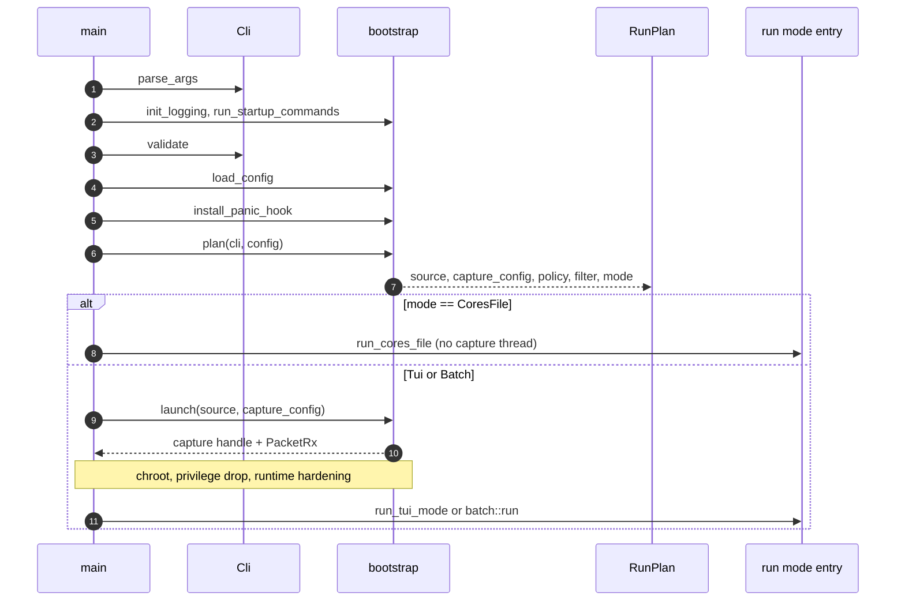
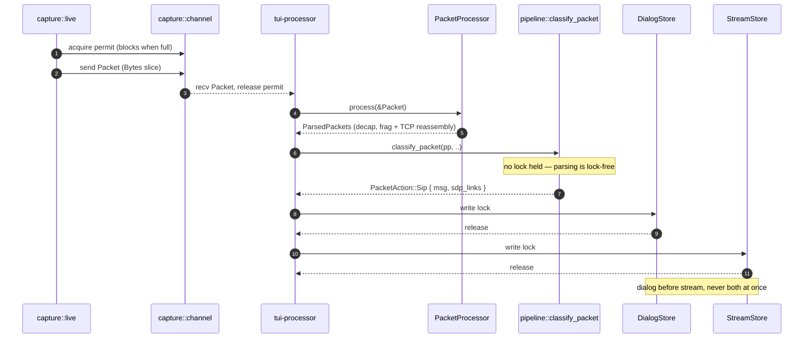
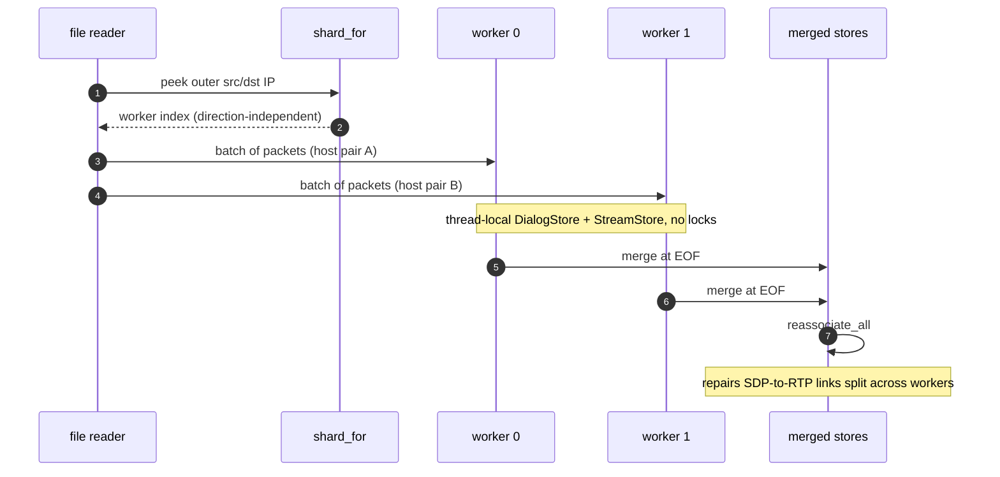

# Subsystem guide

One packet's journey, from the wire to the screen. Read
[`ARCHITECTURE.md`](../../ARCHITECTURE.md) first for the one-screen map of the
tree; this page is the function-level trace through it.

## The program spine

`main()` is deliberately thin — ten numbered steps in 94 lines of
[`main.rs`](../../src/main.rs), each delegating to
[`app/bootstrap.rs`](../../src/app/bootstrap.rs). The order matters: logging
before anything can log, immediate commands (`--setup-caps`,
`--strip-secrets`) before config is loaded, signal handlers and CLI validation
before any resource is acquired, the crash hook armed before the first
fallible step, and only then the plan.

[`plan()`](../../src/app/bootstrap.rs) decides *everything* up front and
touches nothing: capture-source precedence (`-I file` > `-d device` > config
device > `--hep-listen` > auto-detect), capture config, port range, output and
autostop policy, the compiled filter expression, and the run mode. It starts
no capture, changes no privileges, and never exits the process — every fatal
misconfiguration comes back as a `PlanError` for `main()` to handle. The
result is a `RunPlan`, and `RunPlan::mode` is one of three variants:

| `RunMode` | Entry point | Shape |
|---|---|---|
| `Tui` | [`run_tui_mode()`](../../src/app/tui_mode.rs) | Capture thread → channel → `tui-processor` thread → shared stores; main thread renders. |
| `Batch` | [`run()`](../../src/app/batch.rs) | Capture thread → channel → the main thread's own receive loop. |
| `CoresFile` | [`run_cores_file()`](../../src/app/batch.rs) | No capture thread at all: the file reader shards straight to worker threads. |

`CoresFile` is dispatched *before*
[`launch()`](../../src/app/bootstrap.rs) — multi-core file reconstruction owns
its own reader, so the capture thread, channel, and privilege-drop handshake
are all skipped. For the other two modes `launch()` builds the channel, starts
the capture thread, waits for the readiness handshake, then chroots, drops
privileges, and applies runtime hardening. Privileges are shed after the
socket exists and before the first packet is parsed.

Startup is a straight line with exactly one branch, which is easier to follow
as a sequence.



## The six hops

Every mode is the same six hops; only who performs hop 5 differs.

1. **Source.** [`capture/live.rs`](../../src/capture/live.rs),
   [`capture/file.rs`](../../src/capture/file.rs) or
   [`capture/hep.rs`](../../src/capture/hep.rs) produce a `Packet` whose
   `data` is a `bytes::Bytes` slice of the captured frame — no copy, here or
   anywhere downstream.
2. **Channel.** [`capture::channel`](../../src/capture/channel.rs) moves it to
   the consumer: an unbounded crossbeam channel with a count-capped permit
   pool, so idle memory returns to ~0 while a saturated pipeline still blocks
   the capture loop rather than growing without bound.
3. **Parse.** [`PacketProcessor::process()`](../../src/capture/mod.rs) turns
   one `Packet` into zero or more `ParsedPacket`s — link-layer decap, IP
   defragmentation, TCP reassembly, tunnel unwrapping — via
   [`parse_packet()`](../../src/capture/parse.rs). One frame can yield several
   messages, which is why the return type is plural.
4. **Classify.** [`classify_packet()`](../../src/pipeline.rs) decides what the
   packet *means* and returns a `PacketAction` — `Sip { msg, sdp_links }`,
   `Rtp { .. }`, `Rtcp(..)` or `None`. WebSocket-SIP unwrap, SDP link
   extraction via [`extract_sdp_links()`](../../src/pipeline.rs), SRTP/DTLS
   key learning and heuristic RTP discovery all happen here. **No store is
   touched and no lock is held.**
5. **Apply.** The caller applies that action to its stores —
   [`DialogStore`](../../src/sip/dialog_store.rs) and
   [`StreamStore`](../../src/rtp/stream_store.rs). This is the only hop that
   differs between paths.
6. **Present.** The TUI renders from the stores under `try_read()`; every
   serializing surface — CLI, NDJSON, REST, MCP, TUI save — projects through
   [`output/model.rs`](../../src/output/model.rs).

## The four appliers

Four call sites apply a `PacketAction`, and all four classify with the same
function. That is the whole point of the split: classification is protocol
logic that must not vary, application is store access that legitimately does.

| Path | Applier | Store access |
|---|---|---|
| Live (TUI) | [`process_packet()`](../../src/pipeline.rs) | Brief per-store `write()` locks, one store at a time. |
| Batch | [`process_parsed_packet()`](../../src/app/batch.rs) | Plain `&mut` — single-threaded, no locks. |
| `--cores N` | [`reconstruct()`](../../src/parallel.rs) | Plain `&mut` on thread-local stores. |
| TUI file open | [`run_pcap_load()`](../../src/tui/controllers/file_open.rs) | `write()` locks on the live stores, concurrent with the render thread. |

Before the pipeline was unified (WS1), each of these had its own copy of the
classification logic, and they had already drifted: heuristic RTP discovery
and WebSocket unwrap worked on some paths and not others. The rule now is
absolute — **a new protocol behavior goes in `classify_packet()`, never in an
applier** — and `PacketAction` is what makes it enforceable, since an applier
that ignores a variant fails to compile once the variant is added.

The live path is the one with locks, and its ordering is the deadlock-relevant
detail.



## The TUI tick

The render side never blocks on the stores. One iteration of the loop in
[`run_tui_with_pause()`](../../src/tui/mod.rs) polls background work, refreshes
its caches under `try_read()`, draws, then runs deferred work and drains every
queued input event before the next redraw.

The ordering is deliberate at two points: deferred saves and audio playback run
*after* the frame that painted their status, and input is drained in full so a
paste burst is not metered out one keystroke per frame.

```mermaid
sequenceDiagram
    autonumber
    participant Loop as TUI event loop
    participant Load as pcap-load worker
    participant App
    participant DS as DialogStore
    participant Term as terminal

    Loop->>Load: poll_pcap_load (progress or completion)
    Loop->>App: drain_async_messages
    Loop->>App: sync_caches
    App->>DS: try_read
    alt guard acquired
        DS-->>App: snapshot counts and rows
    else contended
        DS-->>App: keep last frame's caches
    end
    Loop->>Term: draw_frame
    Term-->>Loop: drew = true or skipped
    opt drew
        Loop->>App: run_pending_save, run_pending_audio
    end
    Loop->>Term: poll(adaptive timeout)
    Term-->>Loop: key or mouse events
    Loop->>App: handle every queued event, then loop
```

A skipped frame is not a bug: a contended `try_read()` means a writer holds the
lock, so the frame renders from the previous snapshot and the adaptive cadence
(10 fps active, 2 fps idle) bounds how stale that can be. `draw_frame()` forces
a blocking frame after a bounded number of skips so the display cannot freeze.

## `--cores N`

Offline reconstruction shards by **host pair**, not by packet or by call. The
reader peeks only the link and IP headers —
[`peek_host_pair()`](../../src/capture/parse.rs) reads fixed offsets with no
transport parse and no allocation — then
[`shard_for()`](../../src/parallel.rs) maps that pair to a worker. The mapping
is direction-independent, so a call's request and response legs land on the
same worker and its bidirectional RTP is reconstructed without any
cross-thread coordination.

Each worker owns a private `PacketProcessor` and thread-local stores, so the
hot path takes no locks at all; the stores are folded together only at EOF.



Two dispatch shapes exist. [`run_offline_parallel()`](../../src/parallel.rs)
consumes a `PacketRx` one packet at a time;
[`run_offline_parallel_file()`](../../src/parallel.rs) reads the file itself
and sends packets in batches of 128, because the per-packet channel hop —
not the reconstruction work — was what capped throughput past two cores.

The merge is a union, since a host pair belongs to exactly one worker. The
exception is the case that makes [`reassociate_all()`](../../src/rtp/stream_store.rs)
necessary: when SDP advertises a media address on a different host pair than
the signaling, one worker sees the offer and another sees the media. Each
[`merge()`](../../src/rtp/stream_store.rs) carries its endpoints along, and the
re-association pass after merging links those streams to their calls.

## Presentation

Everything that serializes a dialog or a stream goes through
[`output/model.rs`](../../src/output/model.rs). It exists because "dialog
summary" was once implemented five times and had already drifted on the wire —
MCP said `message_count` where the CLI and REST API said `msg_count`, and MCP
emitted Debug-formatted `Invite` where the API emitted `INVITE`. One
`DialogSummary` and one `StreamSummary` constructor now feed CLI, NDJSON,
REST, MCP, TUI save and reports alike, and
[`summary_consistency_test`](../../tests/summary_consistency_test.rs) pins it.

These are the *compact* projections; the full-fidelity forms — every header,
SDP timelines, quality intervals — live in
[`output/json.rs`](../../src/output/json.rs). Adding a field to one surface
only means adding it to the model, which is the point.
