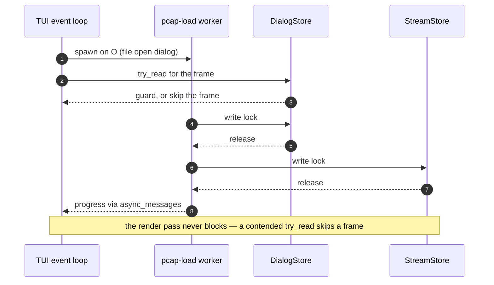

# Threading model

The topology below is the reality on `main` today. The core principle
(design decision D2): the packet path is synchronous threads + channels.
tokio exists only inside the optional servers.

## Topology

```text
                       ┌──────────────────────────────────────────────────┐
                       │                 shared state                     │
                       │  Arc<RwLock<DialogStore>>  Arc<RwLock<StreamStore>>
                       │        (parking_lot, single writer)              │
                       └───────▲──────────────────────────▲───────────────┘
                        write  │                     read │ (try_read in TUI)
capture thread(s)              │                          │
  live device / file / HEP     │                          │
  (capture::start_multi_capture)                          │
        │ Packet               │                          │
        ▼                      │                          │
  capture::channel  ────► processing thread ──────► TUI event loop (main thread)
  (capped channel)        (TUI mode: pipeline::            crossterm events, render
                           process_packet;                 TUI MODE ONLY
                           batch mode: main.rs loop
                           on the main thread)

  auxiliary threads, by the RUN MODE that starts each — none of them is a
  child of the TUI event loop:

  both modes
    ├── server runtime thread          app::servers::start_servers
    │     one shared current-thread tokio runtime hosting every enabled
    │     async server as a task: api (axum), mcp (rmcp), mcp-http
    ├── metrics-server thread          app::servers::start_servers
    │     raw std::net::TcpListener accept loop + one short-lived
    │     metrics-conn thread per scrape
    ├── DNS resolver thread            app::build_resolver
    │     std::mpsc queue; spawned only when reverse DNS is enabled
    └── rtpengine reconciler           app::relay_reconciler::spawn
          bounded hand-off queue; starts only when --rtpengine-control
          names a relay on a live run

  batch mode only
    └── scanner-kill worker            process_isolation::spawn_scanner_kill_worker
          bounded crossbeam channel; --kill-scanner has no TUI path
```

The mode column above is the part to keep true, and it is worth saying why.
An earlier revision of this diagram drew every auxiliary thread as a child of
the TUI event loop. Not one of them is: both run modes start four of them, and
batch alone starts the scanner-kill worker. That is not a cosmetic error —
`--metrics` really did ship wired to the TUI path alone, so every
headless `-N` deployment (which is every container and systemd unit) got no
metrics at all, and this page said nothing that would have contradicted it.
A diagram that groups threads by *who spawns them* rather than by *which mode
runs them* reads as reassurance and hides exactly that class of defect.

The four spawn sites, none of which is the TUI event loop:
[`start_servers()`](../../src/app/servers.rs) for the server runtime and the
metrics listener, [`build_resolver()`](../../src/app/mod.rs) for the reverse-DNS
worker, [`spawn_scanner_kill_worker()`](../../src/process_isolation.rs) for the
kill worker, and
[`relay_reconciler::spawn()`](../../src/app/relay_reconciler.rs) for the
rtpengine reconciler.

The Prometheus listener is **not** a task on the shared tokio runtime, and the
distinction matters when reasoning about blocking: it is a raw
[`TcpListener`](../../src/output/prometheus_server.rs) accept loop on its own
thread, deliberately independent of tokio and axum so metrics stay scrapable
when the async servers are not compiled in at all. Each accepted scrape runs
on a short-lived `metrics-conn` thread, and a `ConnGate` bounds those
to 16 in flight — beyond that new connections get an immediate `503` rather
than a thread (SN-02, CWE-770).
[`start_metrics_server()`](../../src/output/prometheus_server.rs) spawns the
thread itself, and `start_servers` calls it for both run modes.

## Named threads

Every long-lived thread and its spawn site. A name in a backtrace maps
straight back to a row here.

**Modes** is the column to trust when asking "does this run headless?" — the
question `--metrics` got wrong. `both` means the thread exists under `-N` as
well as in the TUI. `TUI` and `batch` mean it does not.

| Thread name | Modes | Spawned by | Role |
|---|---|---|---|
| `capture-<device>` | both | [`capture/native.rs`](../../src/capture/native.rs) | One per live device: pcap loop producing `Packet`s. |
| `capture-file` | both | [`capture/native.rs`](../../src/capture/native.rs) | Offline pcap reader feeding the same channel as live capture. |
| `capture-hep` | both | [`capture/native.rs`](../../src/capture/native.rs) | HEP/EEP UDP receiver; packets carry asserted addresses and carry a flag HEP-origin. |
| `capture-multi` | both | [`capture/native.rs`](../../src/capture/native.rs) | Supervisor for a multi-device capture set. |
| `tui-processor` | TUI | [`app/tui_mode.rs`](../../src/app/tui_mode.rs) | The single store writer in TUI mode: drains the channel and runs the pipeline. |
| (unnamed workers) | batch | [`parallel.rs`](../../src/parallel.rs) | `--cores N` reconstruction workers, spawned with bare `thread::spawn` — they own thread-local stores, so they show as unnamed in a backtrace. |
| (unnamed per-file readers) | batch | [`parallel.rs`](../../src/parallel.rs) | `--cores N` over a **multi-file** `-I` set: one scoped thread per reader, each reading whole files and handing per-shard batches to the dispatcher, which releases them to the workers in file order. A single-file `-I` has one file and therefore one reader, so it gets none of these — the calling thread reads it, exactly as before. |
| `servers` | both | [`app/servers.rs`](../../src/app/servers.rs) | One current-thread tokio runtime hosting api, mcp and mcp-http as `JoinSet` tasks. |
| `metrics-server` | both | [`output/prometheus_server.rs`](../../src/output/prometheus_server.rs) | Raw TCP accept loop for Prometheus scrapes. |
| `metrics-conn` | both | [`output/prometheus_server.rs`](../../src/output/prometheus_server.rs) | One short-lived thread per accepted scrape, capped at 16 concurrent. |
| `sipnab-dns` | both | [`names.rs`](../../src/names.rs) | Reverse-DNS resolver draining an `std::sync::mpsc` queue so the render path never blocks on a lookup. Starts only when the run turns reverse DNS on. |
| `scanner-kill` | batch | [`process_isolation.rs`](../../src/process_isolation.rs) | Isolated worker that transmits kill responses — the only thread that answers an address the capture supplied. `--kill-scanner` has no TUI path. |
| `rtpengine-reconcile` | both | [`app/relay_reconciler.rs`](../../src/app/relay_reconciler.rs) | Asks an rtpengine relay which calls it holds, over the relay's read-only `list` and `query`, so a stream the signaling does not explain still gets a Call-ID. Starts only when `--rtpengine-control` names a relay on a live run, and keeps the round trip off the packet path. |
| `pcap-load` | TUI | [`tui/controllers/file_open.rs`](../../src/tui/controllers/file_open.rs) | Loads a pcap chosen from inside the TUI, writing the live stores. |
| `clipboard` | TUI | [`tui/clipboard.rs`](../../src/tui/clipboard.rs) | Holds the X11/Wayland selection alive after a copy without stalling the UI. |
| `crash-probe` | tests | [`crash.rs`](../../src/crash.rs) | **Not a production thread.** Only `mod tests` spawns this name, to prove the panic hook records a thread name. It appears in no shipped backtrace. This row exists so the next reader who greps the name does not re-add it as one. |

## How the capture thread ends

Every fatal exit taken *after* [`start_capture()`](../../src/capture/native.rs)
has to go through
[`stop_and_join()`](../../src/capture/native.rs). There is no second correct
way out.

The reason is where the thread starts.
[`bootstrap::launch()`](../../src/app/bootstrap.rs) spawns it **before** the
readiness hand-shake, the chroot and the privilege drop, because the capture
source must be open while the process still holds `CAP_NET_RAW`. Every failure
from that point on — an unopenable source, an unusable `--chroot`, a refused
privilege drop, a hardening step the kernel rejects, a companion server that
cannot start — happens with a capture thread already running and holding its
source. `std::process::exit` joins nothing and runs no destructors, so exiting
directly abandons it.

`stop_and_join` sets the global shutdown flag, drops the packet receiver, and
joins. Both signals matter and neither is redundant: dropping the receiver
ends a thread blocked on a send, and the flag ends one blocked elsewhere in its
loop — a live capture waiting out its read timeout reaches the flag check first.
The join has no timeout, matching the one the batch receive loop already performs
at end of capture. A HEP listener blocked on its socket returns in milliseconds
rather than hanging it.

One consequence for callers that cannot reach the handle:
[`BatchRunner::new()`](../../src/app/batch.rs) does not own it, so its four fatal
paths return a `PlanError` instead of exiting, and `batch::run` — which holds
both the handle and the receiver — does the teardown. A function that cannot
clean up must hand the failure to one that can.

**How a gate holds this.** ThreadSanitizer treats `thread leak` as a fatal
finding, not a warning, and `cli_flag_behavior_test` exercises both shapes (a
source that never opens, and a failure after it opened) so a regression fails
there rather than waiting for the weekly sanitizer run. Before this rule,
`sipnab -I /nonexistent.pcap` — a mistyped filename — leaked a thread.

## The second writer: `pcap-load`

Opening a pcap from inside the TUI spawns a second writer: the `pcap-load`
worker writes the same stores the render thread is reading, which is why every
render-side access is `try_read()` and never `read()`.



`--cores N` offline mode replaces the single processing thread with a
dispatcher + N workers: the dispatcher does a cheap host-pair peek and shards
raw packets over bounded channels. Each worker owns a private
`PacketProcessor` + thread-local `DialogStore`/`StreamStore` (no locks on the
hot path), and the stores merge at EOF. Flow correctness holds because a
flow's packets share a host pair and therefore a worker.

## Lock discipline

- **Parse outside the lock.** SIP/RTP/SDP parsing happens before any store
  lock appears ([`classify_packet()`](../../src/pipeline.rs) touches no store
  at all). Each store is then locked for writing **once per packet**, which
  makes writes the most frequent lock operation in the process, not the rarest.
- **Lock ordering:** when a path needs both stores, dialog store first, then
  stream store; if it also needs the alert engine, that comes last. The
  ordering is what carries the safety, because the guards are **not** always
  disjoint. [`process_packet()`](../../src/pipeline.rs) on the live path and
  [`run_pcap_load()`](../../src/tui/controllers/file_open.rs) for the file-open
  worker above each take one store at a time and release it before the other
  — *"briefly"* is accurate there. The batch applier
  ([`batch.rs`](../../src/app/batch.rs)) does **not** work that way: it holds
  **both** write guards across the entire per-packet body. This page
  previously said both write locks were never held at once; that was never
  true of the batch path.
- **The guards queue side effects rather than performing them.** Alert
  findings, per-message output and the `--alert-exec` / `--on-dialog-exec` /
  `--on-quality-exec` spawns accumulate while the code holds the guards, and
  replayed by `DeferredEffects::drain` after both drop, so no `fork`/`exec`, no
  stdout write and no `AlertEngine` lock happens inside the critical section.
  Until that change the batch loop took the alert engine's write lock nested
  inside both store guards — a third lock deep in the hot path, with a
  `posix_spawn` beside it. The full rule and what would re-create that edge are
  in [Invariants](invariants.md) §2.
- **The TUI never blocks:** all render-side store access is `try_read()`.
  On contention the frame renders with the previous data (counts may be one
  frame stale — this is deliberate; an adaptive 10 fps active / 2 fps idle
  tick bounds staleness).
- **Pause** is an `AtomicBool` checked by the processing thread; no lock.
- `mcp/` denies `clippy::await_holding_lock` — parking_lot guards must never
  live across an `.await`.

## Channels in use

| Edge | Flavor |
|---|---|
| capture → processing | [`capture::channel`](../../src/capture/channel.rs) — a count-capped permit pool over an unbounded crossbeam channel, so idle memory returns to ~0 while backpressure still blocks the sender. A live source pays one channel item per packet (the kill path reacts to single packets); a file source sends batches of 128 through the same channel, one item per batch, with the slot pool divided to keep the same in-flight packet cap |
| batch main loop | the same [`capture::channel`](../../src/capture/channel.rs) wrapper, not a bare bounded channel: [`batch.rs`](../../src/app/batch.rs) receives on a `capture::channel::PacketRx` exactly as the TUI processor does |
| `--cores` dispatcher → workers, channel-fed | crossbeam `bounded::<Packet>(8192)` ([`run_offline_parallel()`](../../src/parallel.rs)) |
| `--cores` reader → workers, file input | crossbeam `bounded::<Vec<Packet>>(64)` carrying batches of 128 ([`run_offline_parallel_file()`](../../src/parallel.rs)) — same ~8192 in-flight packet cap, one channel hop per 128 packets instead of per packet |
| `--cores` per-file reader → dispatcher, multi-file input | crossbeam `bounded` carrying one batch per item ([`shard_set_parallel()`](../../src/parallel.rs)). The queue depth is not the bound that matters: `READ_AHEAD_BYTES` caps in **bytes** how far a LATER file's reader may run ahead of the file the dispatcher holds, because a batch is 128 packets of any size and the default snaplen is 65535 |
| scanner-kill request / response | crossbeam `bounded(256)` in each direction ([`process_isolation.rs`](../../src/process_isolation.rs)) |
| packet path → rtpengine reconciler | `std::sync::mpsc::sync_channel(1024)` ([`orphan_channel()`](../../src/relay/reconcile.rs)) — the capture path offers a relay-side socket and never waits on it: a full queue drops the offer and counts it, because stalling packet processing on a relay round trip is the trade `--rtpengine-control` exists to avoid |
| DNS resolve queue | `std::sync::mpsc` ([`names.rs`](../../src/names.rs)) |
| inside api/mcp servers | tokio (axum/rmcp internals) |
