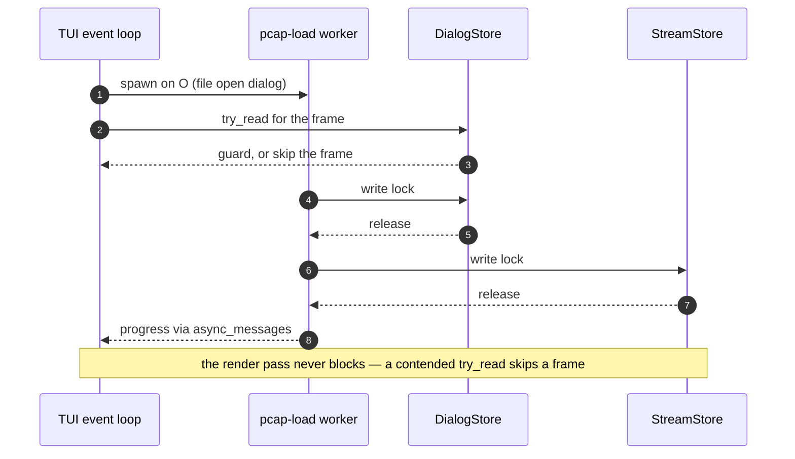

# Threading model

The topology below is the reality on `main` today. The core principle
(design decision D2): the packet path is synchronous threads + channels;
tokio exists only inside the optional servers.

## Topology

```text
                       ┌──────────────────────────────────────────────────┐
                       │                 shared state                     │
                       │  Arc<RwLock<DialogStore>>  Arc<RwLock<StreamStore>>
                       │        (parking_lot, single writer)              │
                       └───────▲──────────────────────────▲───────────────┘
                        write  │                     read │ (try_read in TUI)
capture thread(s)              │                          │
  live device / file / HEP     │                          │
  (capture::start_multi_capture)                          │
        │ Packet               │                          │
        ▼                      │                          │
  capture::channel  ────► processing thread ──────► TUI event loop (main thread)
  (capped channel)        (TUI mode: pipeline::         │ crossterm events, render
                           process_packet;              │
                           batch mode: main.rs loop     ├── server runtime thread
                           on the main thread)          │     one shared current-thread
                                                        │     tokio runtime hosting every
                                                        │     enabled async server as a
                                                        │     task: api (axum), mcp (rmcp),
                                                        │     mcp-http (src/app/servers.rs)
                                                        ├── metrics-server thread
                                                        │     raw std::net::TcpListener
                                                        │     accept loop + one short-lived
                                                        │     metrics-conn thread per scrape
                                                        ├── DNS resolver thread (names)
                                                        │     std::mpsc queue
                                                        └── scanner-kill worker
                                                              (process_isolation, bounded
                                                               crossbeam channel)
```

The Prometheus listener is **not** a task on the shared tokio runtime, and the
distinction matters when reasoning about blocking: it is a raw
[`TcpListener`](../../src/output/prometheus_server.rs) accept loop on its own
thread, deliberately independent of tokio and axum so metrics stay scrapable
when the async servers are not compiled in at all. Each accepted scrape is
handled by a short-lived `metrics-conn` thread, and a `ConnGate` bounds those
to 16 in flight — beyond that new connections get an immediate `503` rather
than a thread (SN-02, CWE-770). It is started by
[`start_metrics_server()`](../../src/output/prometheus_server.rs).

## Named threads

Every long-lived thread and its spawn site. A name in a backtrace maps
straight back to a row here.

| Thread name | Spawned by | Role |
|---|---|---|
| `capture-<device>` | [`capture/native.rs`](../../src/capture/native.rs) | One per live device: pcap loop producing `Packet`s. |
| `capture-file` | [`capture/native.rs`](../../src/capture/native.rs) | Offline pcap reader feeding the same channel as live capture. |
| `capture-hep` | [`capture/native.rs`](../../src/capture/native.rs) | HEP/EEP UDP receiver; packets carry asserted addresses and are flagged HEP-origin. |
| `capture-multi` | [`capture/native.rs`](../../src/capture/native.rs) | Supervisor for a multi-device capture set. |
| `tui-processor` | [`app/tui_mode.rs`](../../src/app/tui_mode.rs) | The single store writer in TUI mode: drains the channel and runs the pipeline. |
| (unnamed workers) | [`parallel.rs`](../../src/parallel.rs) | `--cores N` reconstruction workers, spawned with bare `thread::spawn` — they own thread-local stores, so they show as unnamed in a backtrace. |
| `servers` | [`app/servers.rs`](../../src/app/servers.rs) | One current-thread tokio runtime hosting api, mcp and mcp-http as `JoinSet` tasks. |
| `metrics-server` | [`output/prometheus_server.rs`](../../src/output/prometheus_server.rs) | Raw TCP accept loop for Prometheus scrapes. |
| `metrics-conn` | [`output/prometheus_server.rs`](../../src/output/prometheus_server.rs) | One short-lived thread per accepted scrape, capped at 16 concurrent. |
| `sipnab-dns` | [`names.rs`](../../src/names.rs) | Reverse-DNS resolver draining an `std::sync::mpsc` queue so the render path never blocks on a lookup. |
| `scanner-kill` | [`process_isolation.rs`](../../src/process_isolation.rs) | Isolated worker that transmits kill responses; the only thread allowed to send. |
| `pcap-load` | [`tui/controllers/file_open.rs`](../../src/tui/controllers/file_open.rs) | Loads a pcap chosen from inside the TUI, writing the live stores. |
| `clipboard` | [`tui/clipboard.rs`](../../src/tui/clipboard.rs) | Holds the X11/Wayland selection alive after a copy without stalling the UI. |
| `crash-probe` | [`crash.rs`](../../src/crash.rs) | Startup probe that classifies the crash-report directory before any report is written. |

## How the capture thread ends

Every fatal exit taken *after* [`start_capture()`](../../src/capture/native.rs)
has to go through
[`stop_and_join()`](../../src/capture/native.rs). There is no second correct
way out.

The reason is where the thread starts.
[`bootstrap::launch()`](../../src/app/bootstrap.rs) spawns it **before** the
readiness hand-shake, the chroot and the privilege drop, because the capture
source must be open while the process still holds `CAP_NET_RAW`. Every failure
from that point on — an unopenable source, an unusable `--chroot`, a refused
privilege drop, a hardening step the kernel rejects, a companion server that
cannot start — happens with a capture thread already running and holding its
source. `std::process::exit` joins nothing and runs no destructors, so exiting
directly abandons it.

`stop_and_join` sets the global shutdown flag, drops the packet receiver, and
joins. Both signals are needed and neither is redundant: dropping the receiver
ends a thread blocked on a send, and the flag ends one blocked elsewhere in its
loop — a live capture waiting out its read timeout reaches the flag check first.
The join is unbounded, matching the one the batch receive loop already performs
at end of capture; a HEP listener blocked on its socket returns in milliseconds
rather than hanging it.

One consequence for callers that cannot reach the handle:
[`BatchRunner::new()`](../../src/app/batch.rs) does not own it, so its four fatal
paths return a `PlanError` instead of exiting, and `batch::run` — which holds
both the handle and the receiver — does the teardown. A function that cannot
clean up must hand the failure to one that can.

**How this is enforced.** ThreadSanitizer treats `thread leak` as a fatal
finding, not a warning, and `cli_flag_behavior_test` exercises both shapes (a
source that never opens, and a failure after it opened) so a regression fails
there rather than waiting for the weekly sanitizer run. Before this rule,
`sipnab -I /nonexistent.pcap` — a mistyped filename — leaked a thread.

## The second writer: `pcap-load`

Opening a pcap from inside the TUI spawns a second writer: the `pcap-load`
worker writes the same stores the render thread is reading, which is why every
render-side access is `try_read()` and never `read()`.



`--cores N` offline mode replaces the single processing thread with a
dispatcher + N workers: the dispatcher does a cheap host-pair peek and shards
raw packets over bounded channels; each worker owns a private
`PacketProcessor` + thread-local `DialogStore`/`StreamStore` (no locks on the
hot path), and the stores merge at EOF. Flow correctness holds because a
flow's packets share a host pair and therefore a worker.

## Lock discipline

- **Parse outside the lock.** SIP/RTP/SDP parsing happens before any store
  lock is taken; each store is write-locked once per packet, briefly
  ([`classify_packet()`](../../src/pipeline.rs) touches no store at all).
- **Lock ordering:** when both stores are needed, dialog store first, then
  stream store; never hold both write locks at once. Two appliers take locks
  and both follow it — see the doc comment on
  [`process_packet()`](../../src/pipeline.rs) for the live path and
  [`run_pcap_load()`](../../src/tui/controllers/file_open.rs) for the
  file-open worker above — and it is stated as an invariant in
  [Invariants](invariants.md).
- **The TUI never blocks:** all render-side store access is `try_read()`.
  On contention the frame renders with the previous data (counts may be one
  frame stale — this is deliberate; an adaptive 10 fps active / 2 fps idle
  tick bounds staleness).
- **Pause** is an `AtomicBool` checked by the processing thread; no lock.
- `mcp/` denies `clippy::await_holding_lock` — parking_lot guards must never
  live across an `.await`.

## Channels in use

| Edge | Flavor |
|---|---|
| capture → processing | [`capture::channel`](../../src/capture/channel.rs) — a count-capped permit pool over an unbounded crossbeam channel, so idle memory returns to ~0 while backpressure still blocks the sender |
| batch main loop | the same [`capture::channel`](../../src/capture/channel.rs) wrapper, not a bare bounded channel: [`batch.rs`](../../src/app/batch.rs) receives on a `capture::channel::PacketRx` exactly as the TUI processor does |
| `--cores` dispatcher → workers, channel-fed | crossbeam `bounded::<Packet>(8192)` ([`run_offline_parallel()`](../../src/parallel.rs)) |
| `--cores` reader → workers, file input | crossbeam `bounded::<Vec<Packet>>(64)` carrying batches of 128 ([`run_offline_parallel_file()`](../../src/parallel.rs)) — same ~8192 in-flight packet cap, one channel hop per 128 packets instead of per packet |
| scanner-kill request / response | crossbeam `bounded(256)` in each direction ([`process_isolation.rs`](../../src/process_isolation.rs)) |
| DNS resolve queue | `std::sync::mpsc` ([`names.rs`](../../src/names.rs)) |
| inside api/mcp servers | tokio (axum/rmcp internals) |
