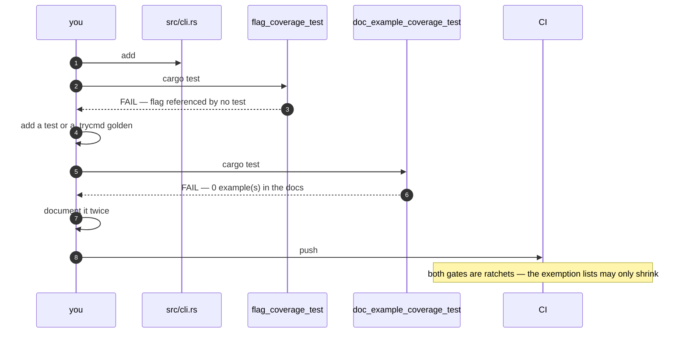
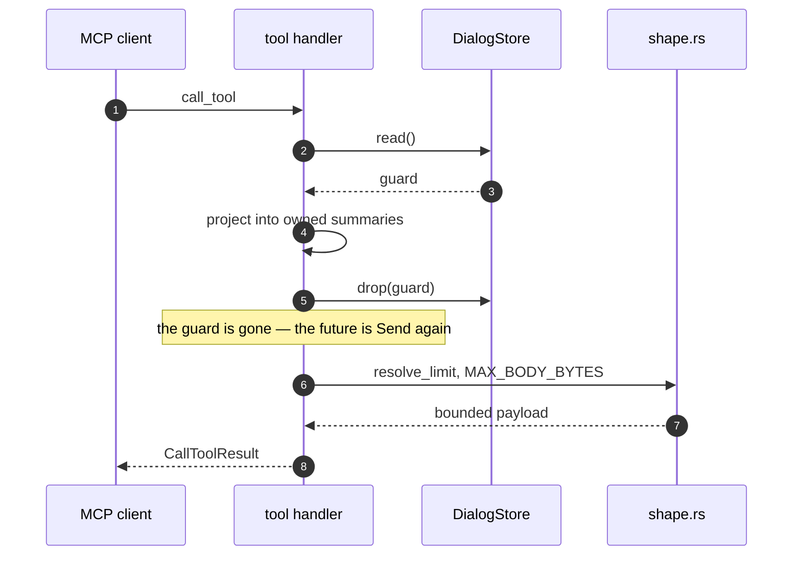

# Contributor walkthroughs

Six ordered checklists for the changes people actually make. Each step names
the test that fails if you skip it. Where no test enforces a step, it carries
**(unenforced)** — that is prose, and prose is what gets forgotten, so those
are the steps to be deliberate about.

Checking the enforcement claims here meant making the change and watching the
gate fail — or, more often than expected, watching it pass. Where the first
draft of this page and reality disagreed, reality won: adding a CLI flag does
*not* trip `docs_drift_test`, the compiler turns away an MCP tool that holds a
lock across an await before clippy gets a word in, and **three of the six
checklists turned out to name gates that do not fire at all** for the change
they sat beside. Those steps now carry **(unenforced)**.

The pattern behind all three: a gate that hardcodes its subjects — three flood
scenarios, two output-flag behaviors, and until it was rewritten to enumerate
the directory, a list of schema filenames — cannot see a *new* subject. It
protects what exists from regressing. It does not notice an addition. Assume
nothing enforces a new thing until you have watched it fail.

## Add a CLI flag

1. Add the `#[arg]` field to `Cli` in [`cli.rs`](../../src/cli.rs), with a
   `help_heading` matching its group.
   → [`cli_help_test`](../../tests/cli_help_test.rs) checks the grouping of the
   ~140-flag help output.
2. Wire it wherever it takes effect — usually
   [`plan()`](../../src/app/bootstrap.rs), so the flag becomes part of
   `RunPlan` rather than at the point of use.
3. Give it a config fallback in [`config.rs`](../../src/config.rs) if its peers
   have one.
   → [`config_wiring_test`](../../tests/config_wiring_test.rs) catches a config
   key that is never read.
4. Add a test that references the flag by name — any test, anywhere under
   `tests/`, including a `.trycmd` golden.
   → [`flag_coverage_test`](../../tests/flag_coverage_test.rs) **fails
   immediately** without one: `zzz-gate-probe` in its message is the flag you
   just added.
5. Document it in at least **two** examples across the docs.
   → [`doc_example_coverage_test`](../../tests/doc_example_coverage_test.rs)
   fails with `--your-flag: 0 example(s)` until you do.
6. Add a default-value case to
   [`cli_defaults_test`](../../tests/cli_defaults_test.rs). **(unenforced —
   that test does not enumerate the CLI, so a missing case passes silently.)**

Verified: adding a throwaway `#[arg(long = "zzz-gate-probe")]` failed
`flag_coverage_test` and `doc_example_coverage_test`, while `docs_drift_test`,
`cli_defaults_test` and `config_wiring_test` all stayed green. `docs_drift_test`
guards the *other* direction — a flag named in the docs that the CLI does not
have.

The two gates that do fire, in the order you meet them:

## Add a TUI view

Model it on the newest one, `StreamLossMap`, whose commit touched exactly these
places.

1. Add the variant to `View` in [`state.rs`](../../src/tui/state.rs).
2. Add the renderer — a module beside
   [`loss_map.rs`](../../src/tui/loss_map.rs) — and register it in
   [`render/mod.rs`](../../src/tui/render/mod.rs).
3. Keep the computation out of the renderer. `StreamLossMap`'s binning core
   lives in [`rtp/loss_map.rs`](../../src/rtp/loss_map.rs) with its own unit
   tests, so the view logic is testable without a terminal.
4. Add the controller in [`controllers/`](../../src/tui/controllers) and route
   it in [`controllers/mod.rs`](../../src/tui/controllers/mod.rs).
5. Add the key that opens it, in whatever view it opens *from*.
6. Document that key in `HELP_TEXT` in [`help.rs`](../../src/tui/help.rs) **and**
   in [`docs/keybindings.md`](../keybindings.md).
   → [`keybinding_drift_test`](../../tests/keybinding_drift_test.rs) fails with
   `these handled KeyCode::Char keys are neither in the F1 help nor
   allow-listed` and names both the view and the character.
7. Add snapshot coverage in
   [`tui_snapshot_test`](../../tests/tui_snapshot_test.rs) — at minimum the
   populated case and the empty/degenerate case.
8. Mirror the keybinding into `website/content/docs/keybindings.md`.
   **(unenforced for a new key — the mirroring obligation is a convention; see
   CONTRIBUTING.)**

Verified: binding `KeyCode::Char('Y')` in the call-list controller without
touching the help failed two assertions in `keybinding_drift_test`.

## Add an MCP tool

1. Add the handler to [`server.rs`](../../src/mcp/server.rs) under the
   `#[tool_router]` impl, with a `#[tool(name = …, description = …)]`
   attribute.
2. Write the description as a **statement of what the tool returns**. Never
   instruct the model to "trust", "verify", "act on" or "ensure" anything about
   the content — that is the prompt-injection rule (D22 in
   [`../design/implementation-plan-phases-8-10.md`](../design/implementation-plan-phases-8-10.md)).
   **(unenforced — the module comment in `server.rs` cites
   `scripts/check-tool-descriptions.sh`, which does not exist; the lint is
   still an open backlog item.)**
3. Take the store guard, project what you need into owned data, **drop the
   guard**, and only then `.await`.
4. Bound the response with [`resolve_limit()`](../../src/mcp/shape.rs) and the
   `MAX_BODY_BYTES` cap.
5. Add an end-to-end case to
   [`mcp_stdio_test`](../../tests/mcp_stdio_test.rs) and, for HTTP-visible
   tools, [`mcp_http_test`](../../tests/mcp_http_test.rs).

Step 3 is not a style preference. The rmcp router requires each handler's
future to be `Send`, and a `parking_lot` guard held across an await makes it
non-`Send` — so the build fails on the `#[tool]` attribute with *"future cannot
be sent between threads safely"* before `clippy::await_holding_lock` (denied at
the workspace level) is even consulted. Two independent mechanisms, and the
stricter one is the compiler.

## Add a security detector

1. Add the module under [`src/security/`](../../src/security) beside
   [`scanner_detect.rs`](../../src/security/scanner_detect.rs) or
   [`reg_flood.rs`](../../src/security/reg_flood.rs) and export it from
   [`security/mod.rs`](../../src/security/mod.rs).
2. Keep detector state bounded and attacker-keyed maps capped — a detector is
   by definition fed hostile input.
   **(unenforced — [`resource_bounds_test`](../../tests/resource_bounds_test.rs)
   is three hand-written scenarios over `DialogStore` and `RtpStream`. It has no
   way to discover your module.)**
3. Emit through the alert engine in
   [`alerting.rs`](../../src/security/alerting.rs) rather than printing, so
   every sink (CLI, TUI, `fail2ban`, MCP `security_findings`) gets it.
4. Add regression coverage to
   [`security_test`](../../tests/security_test.rs), including the
   false-positive case — a detector that fires on normal traffic is worse than
   no detector. **(unenforced — nothing requires a new detector to have a
   test.)**

Verified: a new `src/security/` module holding an uncapped `HashMap<IpAddr, u64>`,
exported from `mod.rs`, left `resource_bounds_test` at 3/3 and `security_test`
at 38/38. Both steps above are real obligations with no gate behind them —
which is exactly why this page writes them down.
5. If it can *transmit* anything, it must be opt-in and must respect the
   HEP-origin restriction (SN-01): HEP-sourced packets are ineligible for
   active response without `--hep-allow-kill`.

## Add an output format

1. Project through [`output/model.rs`](../../src/output/model.rs). Do not build
   a bespoke JSON object for a dialog or a stream.
   **(unenforced for a new surface —
   [`summary_consistency_test`](../../tests/summary_consistency_test.rs) pins
   the three surfaces that already exist, CLI/API/MCP, against
   `DialogSummary`/`StreamSummary`. A fourth writer is invisible to it.)**
2. Add the writer beside [`json.rs`](../../src/output/json.rs) /
   [`cli_print.rs`](../../src/output/cli_print.rs) and emit through
   [`sink.rs`](../../src/output/sink.rs).
3. If it is machine-readable, add or extend a schema in
   [`tests/schemas/`](../../tests/schemas). No registration step: the
   `all_schemas_compile` case in
   [`json_schema_test`](../../tests/json_schema_test.rs) enumerates the
   directory, so a new file becomes a validator the moment it lands
   and a malformed one fails there. What is still on you is *live-output*
   validation — proving the surface actually emits what the schema describes.
4. Add behavior coverage to
   [`output_behavior_test`](../../tests/output_behavior_test.rs). **(unenforced
   — it is two tests about `--json-pretty` and `--call-report` exit codes.)**

History, and the reason step 3 now reads that way: a deliberately malformed
`zzz_gate_probe.schema.json` dropped into `tests/schemas/` once left
`json_schema_test` at 6 passed, 0 failed — the test walked a hardcoded list of
four filenames and never opened the file. That experiment is what motivated
the switch to directory enumeration, and the test's own doc comment records
it. Steps 1, 2 and 4 are still convention with no gate behind them.
5. Document it in [`docs/output-formats.md`](../output-formats.md), and mirror
   into the website page. The flag that selects it then owes the CLI-flag
   checklist above.

## Add a fuzz target

1. Add `fuzz/fuzz_targets/<name>.rs` calling one parser entry point on
   `&[u8]`.
2. Register the `[[bin]]` in `fuzz/Cargo.toml`. **(unenforced, and this is the
   trap: an unregistered file under `fuzz_targets/` is not a broken build, it
   is an invisible one. Cargo never compiles it, so `fuzz-check` and the
   pre-push `cd fuzz && cargo check` both pass and your target silently never
   runs.)**
3. Seed [`fuzz/corpus/`](../../fuzz/corpus) with at least one real input.
   **(unenforced — despite the name,
   [`fuzz_corpus_replay`](../../tests/fuzz_corpus_replay.rs) never opens
   `fuzz/corpus/`. It has no filesystem access at all: it drives the parsers
   with an adversarial seed set and a mutation sweep defined in the file
   itself.)**
4. Add the same entry point to
   [`smoke_fuzz_test`](../../tests/smoke_fuzz_test.rs). Coverage-guided fuzzing
   needs nightly and runs weekly; the smoke floor runs in every `cargo test`,
   and it is what actually catches the regression.
5. When a target finds a crash, commit the reproducer into the corpus in the
   same change as the fix — and, because step 3's replay does not read the
   corpus, add the input to `smoke_fuzz_test` too if you want it replayed on
   every `cargo test`.

Verified: an unregistered `fuzz/fuzz_targets/zzz_gate_probe.rs` containing a
hard compile error left `cd fuzz && cargo check` at exit 0. Registering the
same file made the same error fail the build with exit 101. The gate only ever
sees registered targets.
