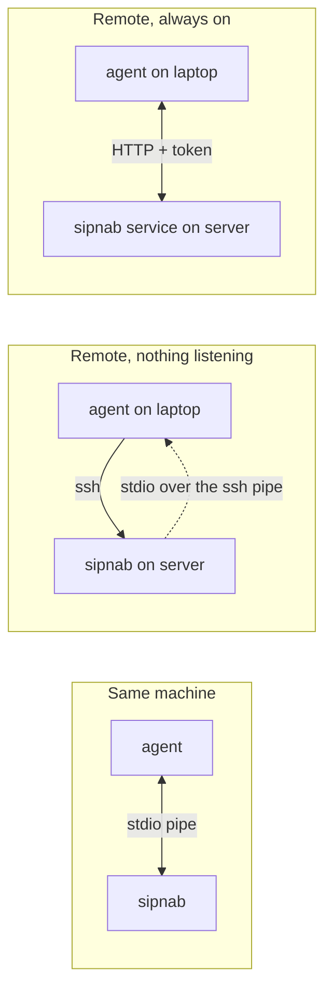
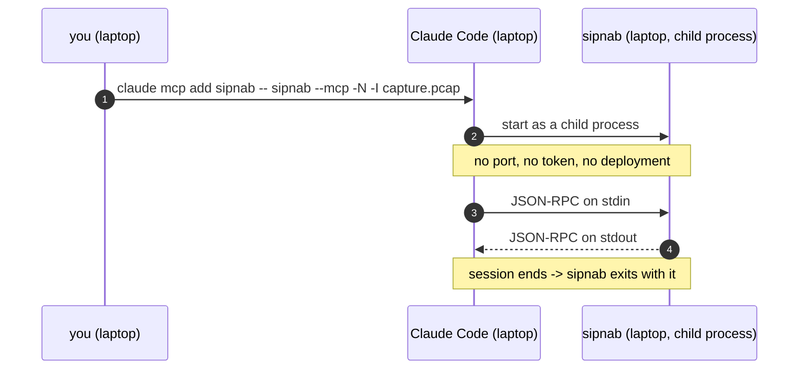
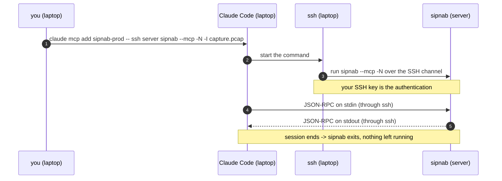
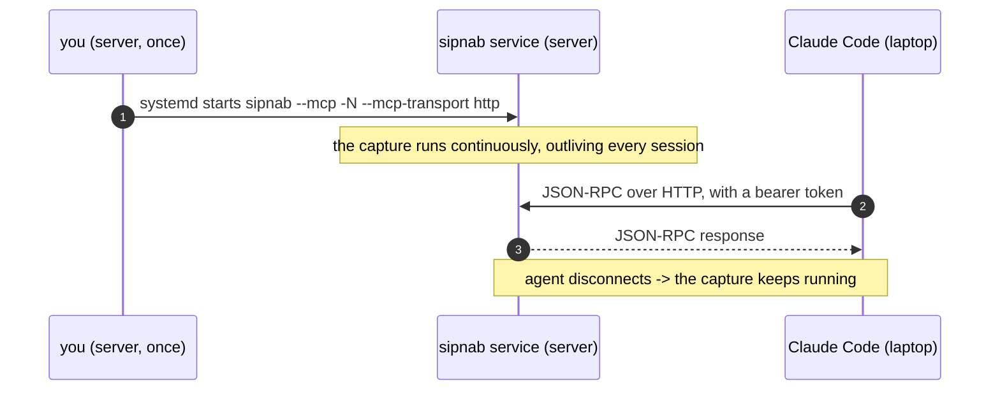
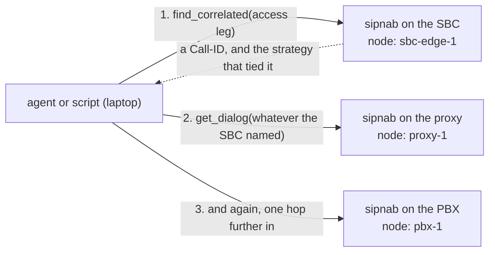
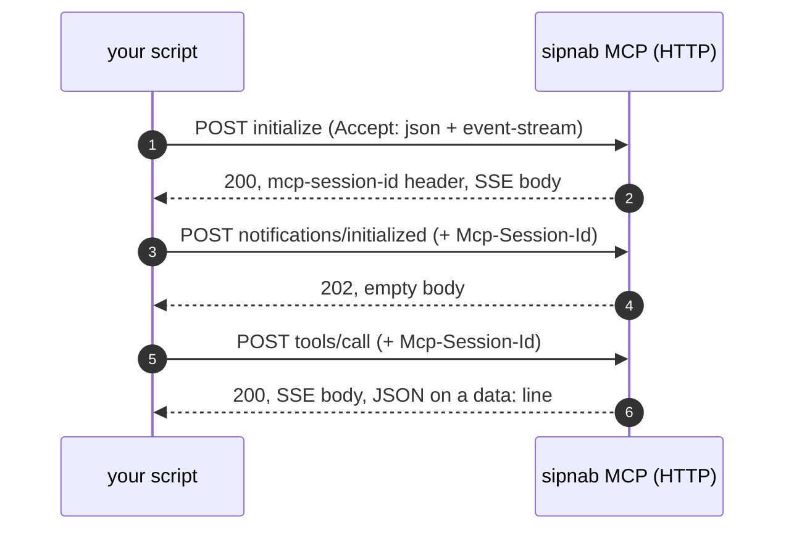
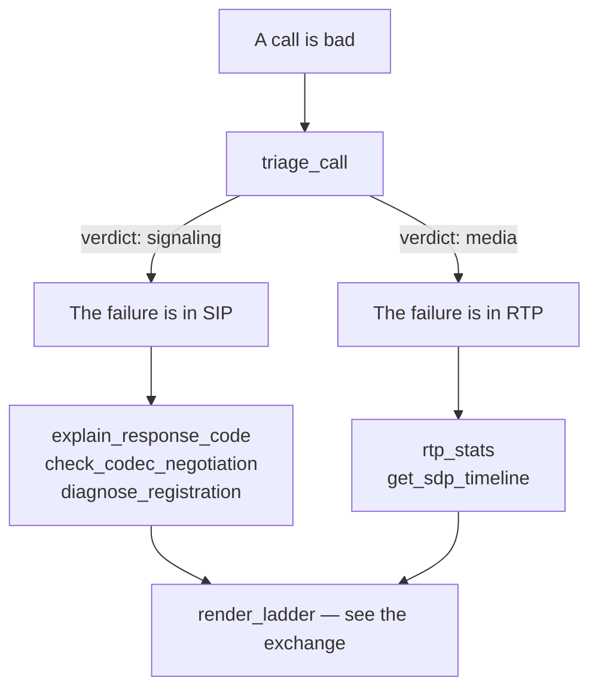

# MCP walkthrough — every deployment scenario, step by step

[MCP Server](mcp.md) is the reference: every flag, tool, and error code. This
page walks a **first-time sipnab user** through each deployment scenario,
command by command, on every machine involved. Each step carries a tag with the
host they run on: **[server]** (where sipnab runs), **[laptop]** (where
your MCP client / Claude Code runs), or **[proxy]** (your SIP proxy, in
the HEP scenario).

Every command here ran end to end against a real build at 0.5.20. The
`docs_drift_test` holds the flag names to the current CLI, but most of the
walkthrough has not been re-run since, so treat those transcripts as
illustrative rather than freshly measured. Two sections are the exception:
everything under [Follow one call across an SBC and its PBXes](#follow-one-call-across-an-sbc-and-its-pbxes)
and [Drive it from a script](#drive-it-from-a-script) were re-run end to end
against 0.5.95 — three sipnab processes on one box, against captures this repo
ships — and where no run could confirm a claim, those sections say so outright
rather than presenting it as fact.

The client steps use Claude Code; the server side is identical for every
MCP-capable agent. If you drive Codex CLI, Cursor, VS Code, Gemini CLI, or
Windsurf instead, do the same scenario and swap the registration step —
[Registering other MCP clients](#use-an-agent-other-than-claude-code)
has the exact config for each.

## Find your setup

**This page is a set of independent how-tos, not a sequence.** Find the row that
matches what you want and jump straight to it. Nothing here depends on anything
above it.

| I want to… | Go to |
|---|---|
| Analyze a pcap with an agent on this same machine | [Analyze a capture file you already have](#analyze-a-capture-file-you-already-have) |
| Watch live traffic on the machine I am sitting at | [Watch live traffic on the machine you are sitting at](#watch-live-traffic-on-the-machine-you-are-sitting-at) |
| **Run sipnab on a remote server and drive it from Claude Code on my laptop** | [Connect Claude Code on your laptop to sipnab on a server](#connect-claude-code-on-your-laptop-to-sipnab-on-a-server) |
| Keep a capture running between agent sessions | [Keep a capture running between agent sessions](#keep-a-capture-running-between-agent-sessions) |
| Do that without opening a port on the server | [Keep a capture running without exposing a port](#keep-a-capture-running-without-exposing-a-port) |
| Capture from proxies I cannot install sipnab on | [Collect captures from several SIP servers in one place](#collect-captures-from-several-sip-servers-in-one-place) |
| Let agents outside my network reach it | [Reach sipnab from outside your network](#reach-sipnab-from-outside-your-network) |
| Point one agent at many capture hosts | [Query many capture hosts from one agent](#query-many-capture-hosts-from-one-agent) |
| **See one call cross an SBC, a proxy and a PBX** | [Follow one call across an SBC and its PBXes](#follow-one-call-across-an-sbc-and-its-pbxes) |
| Work out whether my SBC was a B2BUA on this call | [Read what matched, because the topology is not fixed](#read-what-matched-because-the-topology-is-not-fixed) |
| Decide whether to add a correlation identifier | [Choose a correlation identifier](#choose-a-correlation-identifier) |
| Drive the tools from a script, no agent involved | [Drive it from a script](#drive-it-from-a-script) |
| Run diagnostics on a schedule, no human involved | [Run diagnostics on a schedule, with no agent attached](#run-diagnostics-on-a-schedule-with-no-agent-attached) |
| Use Codex, Cursor, VS Code, Gemini CLI or Windsurf instead | [Use an agent other than Claude Code](#use-an-agent-other-than-claude-code) |
| Work out why it does not connect | [Fix it when it does not connect](#fix-it-when-it-does-not-connect) |
| **Actually diagnose something, now that sipnab answers** | [Diagnose a real problem with the tools](#diagnose-a-real-problem-with-the-tools) |
| Find out why one call failed | [Find out why a single call failed](#find-out-why-a-single-call-failed) |
| Work out whether codecs caused a 488 | [Confirm whether a codec mismatch caused a 488](#confirm-whether-a-codec-mismatch-caused-a-488) |
| Work out why a phone cannot register | [Find out why an endpoint cannot register](#find-out-why-an-endpoint-cannot-register) |
| Explain bad audio on a call that connected | [Explain bad audio on a call that connected](#explain-bad-audio-on-a-call-that-connected) |
| Save a live capture before shutting it down | [Save a live capture before stopping it](#save-a-live-capture-before-stopping-it) |
| Check what sipnab currently holds | [Check what sipnab holds before trusting an answer](#check-what-sipnab-holds-before-trusting-an-answer) |

### The three shapes, at a glance

Everything on this page is one of three arrangements. The only question that
really matters is **where sipnab runs** and **whether anything has to keep
listening**:



Each shape has its own section, which opens with a detailed diagram of that
one arrangement:

| Shape | What it costs you | Where to read it |
|---|---|---|
| **1 — Same machine** | Nothing. No network, no credentials; the agent starts sipnab. | [Run sipnab and your agent on the same machine](#run-sipnab-and-your-agent-on-the-same-machine) |
| **2 — Remote, nothing listening** | An SSH key you almost certainly already have. The agent starts sipnab *through SSH*, so the server needs no configuration at all. **Most people want this one.** | [Connect Claude Code on your laptop to sipnab on a server](#connect-claude-code-on-your-laptop-to-sipnab-on-a-server) |
| **3 — Remote, always on** | A token, a port, and usually a unit file. Buys you a capture that survives between agent sessions. | [Keep a capture running between agent sessions](#keep-a-capture-running-between-agent-sessions) |

Two invariants that apply everywhere:

1. **The binary must have MCP compiled in.** All released artifacts
   (installer script, tarballs, `.deb`, `.rpm`) carry the full
   feature set, so this is only a concern for source builds — but always
   confirm with `sipnab --version`: the features list must include `mcp`
   (stdio) and, for the HTTP scenarios, `mcp-http`.
2. **`--mcp` requires `-N`.** In stdio mode stdout *is* the JSON-RPC wire,
   so the TUI and stdout-writing flags (`--json`, `--report`, …) are
   rejected. Corollary: one sipnab process is either your TUI **or** your
   MCP server, never both — run two processes if you want both.

---

## Step 0 — install sipnab (every server, once)

On each machine that *runs* sipnab (in scenario 1 that's the laptop
itself):

1. **[server]** Install. The installer picks the right build for your OS,
   CPU, and glibc, verifies its sha256, and installs to `/usr/local/bin`:

   ```bash
   curl -fsSL https://sipnab.com/install.sh | sh
   ```

   Debian/Ubuntu and RHEL/Fedora users can use the `.deb` / `.rpm`
   packages instead (headless servers: the `-noaudio` variant skips the
   ALSA dependency) — see [the install guide](install.md) for all channels.

2. **[server]** Verify the features:

   ```bash
   sipnab --version
   # sipnab 0.5.121 (...) features: native,tui,audio,tls,hep,api,mcp,mcp-http,metrics,plugins,bpf
   ```

   If `mcp` is missing you have a source build without features — rebuild
   with `cargo install sipnab --features full`.

3. **[server]** Smoke-test the MCP server with no client involved. Use any
   pcap you have (or grab a public sample first:
   `curl -LO https://github.com/NormB/sipnab/raw/main/tests/pcap-samples/SIP_CALL_RTP_G711`):

   ```bash
   # Run all of these, in order.
   {
     echo '{"jsonrpc":"2.0","id":1,"method":"initialize","params":{"protocolVersion":"2025-06-18","capabilities":{},"clientInfo":{"name":"test","version":"0"}}}'
     sleep 0.3
     echo '{"jsonrpc":"2.0","method":"notifications/initialized"}'
     sleep 0.1
     echo '{"jsonrpc":"2.0","id":2,"method":"tools/call","params":{"name":"capture_status","arguments":{}}}'
     sleep 0.5
   } | sipnab --mcp -N -I SIP_CALL_RTP_G711 --quiet | tail -1
   ```

   Expected: a JSON-RPC result whose `text` payload contains
   `"dialog_count"`. If you see that, sipnab's MCP server works on this
   machine and every remaining problem is wiring, not sipnab.

---

## Run sipnab and your agent on the same machine

*Shape 1. Nothing listens, nothing to configure, nothing outlives the session.*



The MCP client launches sipnab as a child process and talks JSON-RPC over
the pipe. No port, no token, nothing to deploy. Because stdout *is* the wire,
this process cannot also be your TUI — run a second one if you want both.

<!-- "1A."/"1B." are labels, not sentences: the word after opens the heading.
Same Vale misfire as the numbered sections in examples.md. -->
<!-- vale sipnab.Headings = NO -->

### Analyze a capture file you already have

1. **[laptop]** Do [Step 0](#step-0--install-sipnab-every-server-once) on
   this machine (here the "server" is your laptop).

2. **[laptop]** Register the server with Claude Code. The `--` separates
   `claude mcp add`'s own flags from the command it should launch:

   ```bash
   claude mcp add sipnab -- sipnab --mcp -N -I "$PWD/capture.pcap" --quiet
   ```

   Claude Desktop instead: edit
   `~/Library/Application Support/Claude/claude_desktop_config.json`
   (macOS) or `%APPDATA%\Claude\claude_desktop_config.json` (Windows):

   ```json
   {
     "mcpServers": {
       "sipnab": {
         "command": "sipnab",
         "args": ["--mcp", "-N", "-I", "/path/to/capture.pcap", "--quiet"]
       }
     }
   }
   ```

   and restart Claude Desktop.

3. **[laptop]** Verify the client sees it:

   ```bash
   claude mcp list          # sipnab ✓ connected
   ```

4. **[laptop]** Use it. Start `claude` and ask:

   > which calls in this capture had one-way audio, and why?

   Watch the agent call `find_problems {"kinds":["one-way"]}`, then
   `rtp_stats` / `get_dialog_report` on what it finds.

### Watch live traffic on the machine you are sitting at

Live interface capture needs `CAP_NET_RAW`, and your MCP client isn't
running as root.

1. **[laptop]** Grant the capability to the binary once:

   ```bash
   sudo setcap cap_net_raw+ep /usr/local/bin/sipnab
   ```

2. **[laptop]** Find your interface name (`ip -br link`), then:

   ```bash
   claude mcp add sipnab-live -- sipnab --mcp -N -d eth0 --quiet
   ```

3. **[laptop]** Verify with `claude mcp list`, generate or wait for SIP
   traffic, and ask the agent for `capture_status` — `dialog_count` should climb.

State is per-session: the capture starts when the agent connects and dies
with it. For "always capturing, query whenever" on one box, use the
scenario-2B service bound to `127.0.0.1` (loopback needs no token) and add
it with `claude mcp add --transport http sipnab http://127.0.0.1:8731/mcp`.

---

<!-- vale sipnab.Headings = YES -->

## Use Claude Code on your laptop against a remote server

A designed-for use case, not a workaround: **no tool alters the analysis**
(none sends SIP, none mutates the dialog, stream and alert stores), every
response has a ceiling, and non-loopback HTTP binds refuse to start without a
bearer token. Three wirings, in increasing order of setup.

### Connect Claude Code on your laptop to sipnab on a server

*Shape 2. Ad-hoc. Nothing listens on the server; SSH-launched stdio.*



The MCP "command" is `ssh`. Claude Code starts it on your laptop, SSH carries
it to the server, and sipnab's JSON-RPC travels back down the same pipe. So
nothing listens on the server, your SSH key is the authentication, there is no
token to manage, and when the session ends nothing keeps running.

1. **[server]** Do [Step 0](#step-0--install-sipnab-every-server-once).
   That's *all* the server setup there is.

2. **[laptop]** Confirm non-interactive SSH works — a password prompt
   would hang the MCP client forever:

   ```bash
   ssh -o BatchMode=yes prod01.example.net true && echo SSH OK
   ```

   If that fails, set up key auth first (`ssh-keygen`, `ssh-copy-id`).

3. **[laptop]** Register the server. Use the **absolute path** to sipnab —
   non-interactive SSH sessions get a minimal PATH that often misses
   `/usr/local/bin`:

   ```bash
   claude mcp add sipnab-prod -- \
     ssh prod01.example.net /usr/local/bin/sipnab --mcp -N \
         -I /var/spool/captures/outage-0722.pcap --quiet
   ```

   (The pcap path is a path **on the server**.)

4. **[laptop]** Verify the client picked it up — the entry should read
   `sipnab-prod ✓ connected`:

   ```bash
   claude mcp list
   ```

   Then start an agent against it and ask, for example, *"summarize the
   failed calls in this capture"*:

   ```bash
   claude
   ```

#### Live traffic instead of a capture file

The steps above analyze a **pcap that already exists**. To watch **live
traffic** on the server instead, swap the input flag:

| You want | Flag | Meaning |
|---|---|---|
| Read a capture file | `-I /path/to.pcap` | Read packets from a file *instead of* live capture |
| Watch live traffic | `-d eth0` | Capture from a network interface |

So the live version of step 3 drops `-I` entirely:

```bash
claude mcp add sipnab-prod-live -- \
  ssh prod01.example.net /usr/local/bin/sipnab --mcp -N \
      -d eth0 --quiet
```

One extra server step: live capture needs the packet-capture capability, once:

```bash
sudo setcap cap_net_raw+ep /usr/local/bin/sipnab
```

> **Do not pass both `-I` and `-d`.** `-I` wins: sipnab reads the file and never
> touches the interface. It warns on stderr, but the run still succeeds and the
> output looks exactly like a live capture — so an agent reading stdout answers
> questions about a stale file with complete confidence. If you are adapting the
> pcap command above, **delete the `-I` line**; do not just add `-d` beside it.

Each agent session spawns a fresh sipnab, so capture starts when the session
starts and stops when it ends. That is right for a post-mortem and wrong for
accumulating live state — for a capture that must keep running between
sessions, see [Keep a capture running between agent
sessions](#keep-a-capture-running-between-agent-sessions).

### Keep a capture running between agent sessions

*Shape 3. Persistent HTTP service with a bearer token.*



For a capture that runs continuously and answers agents whenever they ask.
Keep this shape on a trusted network (LAN/VPN): the token authenticates,
but the transport is plaintext HTTP. Across untrusted networks, use
[an SSH tunnel](#keep-a-capture-running-without-exposing-a-port) or
[put it behind a proxy that terminates TLS](#reach-sipnab-from-outside-your-network)
instead.

1. **[server]** Do [Step 0](#step-0--install-sipnab-every-server-once).

2. **[server]** Create the unprivileged user the service runs as:

   ```bash
   sudo useradd --system --home /nonexistent --shell /usr/sbin/nologin sipnab
   ```

   Then grant the binary capture rights. Skip this second command if you'll
   feed HEP instead (scenario 3): a HEP listener is a plain UDP socket, so
   `cap_net_raw` would be privilege the service never uses.

   ```bash
   sudo setcap cap_net_raw+ep /usr/local/bin/sipnab
   ```

3. **[server]** Generate the bearer token file:

   ```bash
   # Run all of these, in order.
   sudo mkdir -p /etc/sipnab
   head -c 32 /dev/urandom | base64 | sudo tee /etc/sipnab/mcp.token >/dev/null
   sudo chmod 600 /etc/sipnab/mcp.token
   ```

4. **[server]** Install the systemd unit as
   `/etc/systemd/system/sipnab-mcp.service`. `--mcp-allowed-host` must
   name whatever the laptop puts in the URL — without it, DNS-rebind
   protection answers `403 Forbidden: Host header is not allowed`:

   ```ini
   [Unit]
   Description=sipnab MCP server
   After=network-online.target
   Wants=network-online.target

   [Service]
   Type=simple
   ExecStart=/usr/local/bin/sipnab --mcp -N --mcp-transport http \
       --mcp-bind 0.0.0.0:8731 \
       --mcp-token-file /etc/sipnab/mcp.token \
       --mcp-allowed-host prod01.example.net \
       -d eth0
   User=sipnab
   Group=sipnab
   NoNewPrivileges=true
   ProtectSystem=strict
   ProtectHome=true
   PrivateTmp=true
   ReadOnlyPaths=/etc/sipnab
   Restart=on-failure
   RestartSec=5

   [Install]
   WantedBy=multi-user.target
   ```

5. **[server]** Start it and check it came up:

   ```bash
   # Run all of these, in order.
   sudo systemctl daemon-reload
   sudo systemctl enable --now sipnab-mcp
   systemctl status sipnab-mcp --no-pager
   ```

   If it exits immediately with a token error, you bound non-loopback
   without a readable token file — that refusal is deliberate (fail
   closed).

6. **[server]** Verify locally before involving the laptop. The `curl` reads
   `$TOKEN` out of the shell the first line sets, so the two only work
   together:

   ```bash
   # Run all of these, in order.
   TOKEN=$(sudo cat /etc/sipnab/mcp.token)
   curl -sS http://127.0.0.1:8731/mcp \
     -H "Content-Type: application/json" \
     -H "Accept: application/json, text/event-stream" \
     -H "Authorization: Bearer $TOKEN" \
     -d '{"jsonrpc":"2.0","id":1,"method":"initialize","params":{"protocolVersion":"2025-06-18","capabilities":{},"clientInfo":{"name":"curl","version":"0"}}}'
   ```

   Expected: a `serverInfo` block naming the sipnab instructions string.

7. **[server]** Open tcp/8731 to your laptop's network in whatever
   firewall governs this host (nftables/ufw/cloud security group) —
   ideally to specific source addresses, not the world.

8. **[laptop]** Copy the token, then register the server. First, somewhere
   to keep it that only you can read:

   ```bash
   mkdir -p ~/.config/sipnab && chmod 700 ~/.config/sipnab
   ```

   Now fetch the token. Run this one by itself and read what it prints: your
   local shell creates and truncates `prod01.token` *before* `ssh` runs, so a
   failed connection or a `sudo` that wants a password leaves you holding an
   empty file rather than no file at all.

   ```bash
   ssh prod01.example.net sudo cat /etc/sipnab/mcp.token > ~/.config/sipnab/prod01.token
   ```

   Check that the file is non-empty and matches the server's, then close its
   permissions:

   ```bash
   chmod 600 ~/.config/sipnab/prod01.token
   ```

   Finally register the server. The `$(cat …)` resolves when you run this, so
   an empty token file here registers an empty bearer and every later call
   comes back `401`:

   ```bash
   claude mcp add --transport http \
     --header "Authorization: Bearer $(cat ~/.config/sipnab/prod01.token)" \
     sipnab-prod http://prod01.example.net:8731/mcp
   ```

9. **[laptop]** Verify the client connected — the entry should read
   `sipnab-prod ✓ connected`:

   ```bash
   claude mcp list
   ```

   Then start an agent and ask it something only the running capture can
   answer, for example *"any calls with one-way audio right now?"*:

   ```bash
   claude
   ```

### Keep a capture running without exposing a port

*SSH tunnel to loopback HTTP. Persistent, nothing exposed.*

The best of both: the service runs continuously but binds only loopback,
so there's no token to manage and no port to firewall. The SSH tunnel is
the auth *and* the encryption.

1. **[server]** Follow 2B steps 1–2, then install the same unit **with two
   changes**: bind loopback and drop the token/allowed-host flags
   (loopback binds require neither):

   ```ini
   ExecStart=/usr/local/bin/sipnab --mcp -N --mcp-transport http \
       --mcp-bind 127.0.0.1:8731 \
       -d eth0
   ```

   ```bash
   sudo systemctl daemon-reload && sudo systemctl enable --now sipnab-mcp
   ```

2. **[server]** Verify locally — same curl as 2B step 6, minus the
   `Authorization` header.

3. **[laptop]** Open the tunnel (add `autossh` or a systemd user unit if
   you want it self-healing):

   ```bash
   ssh -f -N -L 8731:127.0.0.1:8731 prod01.example.net
   ```

4. **[laptop]** Register against localhost — the default host allowlist
   already accepts `127.0.0.1`:

   ```bash
   claude mcp add --transport http sipnab-prod http://127.0.0.1:8731/mcp
   ```

   Then confirm the client reaches the server through the tunnel:

   ```bash
   claude mcp list
   ```

5. **[laptop]** When the tunnel drops (laptop sleep, network change), MCP
   calls fail with connection errors; re-run step 3. That's the one
   operational cost of this shape.

### Which remote setup should I use?

| | 2A ssh-stdio | 2B HTTP+token | 2C tunnel |
|---|---|---|---|
| Server setup | install only | unit + token | unit |
| Open port | none | 8731 | none |
| Live state persists between sessions | no | yes | yes |
| Several people/agents at once | one server each | yes | yes (each tunnels) |
| Crosses untrusted networks safely | yes (SSH) | no — use 4 | yes (SSH) |

---

## Collect captures from several SIP servers in one place

*Central capture host fed by HEP.*

You usually can't (and shouldn't) run a packet-capturing debugger on every
production SIP proxy. Instead the proxies mirror signaling to one capture
host via HEP — OpenSIPS, Kamailio, and FreeSWITCH all speak it — and one
sipnab MCP service sees calls from the whole estate. The HEP listener is a
plain UDP socket: **no capture privileges, no setcap, fully unprivileged.**

1. **[server]** Do [Step 0](#step-0--install-sipnab-every-server-once)
   and create the user (2B step 2, *without* the `setcap`).

2. **[server]** Install `/etc/systemd/system/sipnab-mcp.service` — this
   variant listens for HEP on udp/9063 and serves MCP on loopback (pair it
   with the 2C tunnel; for the 2B token shape instead, use its
   `--mcp-bind`/token/allowed-host lines):

   ```ini
   [Unit]
   Description=sipnab MCP server (HEP listener)
   After=network-online.target
   Wants=network-online.target

   [Service]
   Type=simple
   ExecStart=/usr/local/bin/sipnab --mcp -N --mcp-transport http \
       --mcp-bind 127.0.0.1:8731 \
       -L 0.0.0.0:9063 --hep-parse
   User=sipnab
   Group=sipnab
   NoNewPrivileges=true
   ProtectSystem=strict
   PrivateTmp=true
   Restart=on-failure
   RestartSec=5

   [Install]
   WantedBy=multi-user.target
   ```

   ```bash
   sudo systemctl daemon-reload && sudo systemctl enable --now sipnab-mcp
   ```

3. **[server]** Open udp/9063 from the proxies' addresses in the host
   firewall.

4. **[proxy]** Point each proxy's HEP mirror at the capture host.

   OpenSIPS (3.x) — `opensips.cfg`:

   ```text
   loadmodule "proto_hep.so"
   loadmodule "tracer.so"
   modparam("tracer", "trace_id",
       "[sipnab]uri=hep:capture01.example.net:9063;version=3;transport=udp")
   ```

   and in the main route (traces the dialog's SIP both ways):

   ```text
   trace("sipnab", "t", "sip");
   ```

   Kamailio — the `siptrace` module with `duplicate_uri` pointed at
   `sip:capture01.example.net:9063` and HEP mode enabled. See the
   [siptrace docs](https://kamailio.org/docs/modules/stable/modules/siptrace.html)
   for the handful of modparams.

5. **[server]** Verify HEP is arriving. Place a test call through a
   proxy, then:

   ```bash
   curl -sS http://127.0.0.1:8731/mcp \
     -H "Content-Type: application/json" \
     -H "Accept: application/json, text/event-stream" \
     -d '{"jsonrpc":"2.0","id":1,"method":"initialize","params":{"protocolVersion":"2025-06-18","capabilities":{},"clientInfo":{"name":"curl","version":"0"}}}'
   ```

   then watch `journalctl -u sipnab-mcp -f` — a
   `no packets for 30s` warning means the HEP sender isn't reaching the
   `-L` port (firewall, wrong port, wrong host).

6. **[laptop]** Wire up exactly as scenario
   [2C](#keep-a-capture-running-without-exposing-a-port)
   steps 3–4 (or 2B steps 8–9 for the token shape). Then ask across the
   estate: *"search all proxies' traffic for Call-ID X and render the
   ladder."*

### Coexisting with Homer (or any observability host)

A Homer / heplify-server box is a natural home for sipnab — the HEP
plumbing from the proxies already exists. Two things to arrange:

- **Port**: heplify-server owns udp/9060, so sipnab takes its own
  (udp/9063 above) and each proxy mirrors to **both** destinations —
  OpenSIPS: add a second `trace_id` and a second `trace()` call;
  Kamailio: a second duplicate destination. If a sender can't dup, put a
  small UDP fan-out (e.g. socat) in front.
- **Budget**: cap sipnab's footprint with `[limits]`
  ([below](#understand-the-load-on-a-busy-server)) so the box's primary tenant keeps its
  headroom.

Anything else on the host — an OpenTelemetry collector, Prometheus, etc. —
is simply a neighbor process. sipnab neither speaks OTLP nor conflicts
with it.

---

## Reach sipnab from outside your network

*Internet-exposed endpoint with nginx TLS in front.*

When agents connect from outside your network and SSH isn't an option:
keep sipnab on loopback and let nginx own the public endpoint.

1. **[server]** Build the loopback service with a token: 2B steps 1–3,
   then a unit whose ExecStart binds loopback but keeps auth and allows
   the public hostname (nginx forwards the client's `Host:` header):

   ```ini
   ExecStart=/usr/local/bin/sipnab --mcp -N --mcp-transport http \
       --mcp-bind 127.0.0.1:8731 \
       --mcp-token-file /etc/sipnab/mcp.token \
       --mcp-allowed-host capture.example.com \
       -d eth0
   ```

2. **[server]** Install nginx and certbot:

   ```bash
   sudo apt install nginx certbot python3-certbot-nginx
   ```

   Then issue the certificate. certbot needs `capture.example.com` already
   resolving to this host, asks for a contact address, and rewrites the nginx
   config in place — run it on its own so you can answer it:

   ```bash
   sudo certbot --nginx -d capture.example.com
   ```

3. **[server]** Site config (`/etc/nginx/sites-available/sipnab-mcp`,
   symlink into `sites-enabled`, `sudo nginx -t && sudo systemctl reload
   nginx`):

   ```nginx
   server {
       listen 443 ssl;
       server_name capture.example.com;
       ssl_certificate     /etc/letsencrypt/live/capture.example.com/fullchain.pem;
       ssl_certificate_key /etc/letsencrypt/live/capture.example.com/privkey.pem;

       location /mcp {
           proxy_pass http://127.0.0.1:8731;
           proxy_set_header Host $host;
           proxy_buffering off;          # SSE responses must stream
           proxy_read_timeout 3600s;
       }
   }
   ```

   `proxy_buffering off` is load-bearing: the streamable-HTTP transport
   answers with `text/event-stream`, and buffering proxies stall it.

4. **[server]** Firewall: open tcp/443 only; 8731 stays closed to the
   outside.

5. **[laptop]** Token copy as in 2B step 8, then:

   ```bash
   claude mcp add --transport http \
     --header "Authorization: Bearer $(cat ~/.config/sipnab/capture.token)" \
     sipnab-prod https://capture.example.com/mcp
   ```

6. **[laptop]** Verify with `claude mcp list`; on failure, test the path
   layer by layer: curl against `https://capture.example.com/mcp` from
   the laptop, then the loopback curl (2B step 6) on the server.

---

## Query many capture hosts from one agent

Run scenario 2B, 2C, or 4 on each capture host, then give each its own
entry in one client config:

1. **[each server]** Any persistent wiring above (2B shown here).

2. **[laptop]** Register them all — the loop is one command and does nothing
   unless you take the whole of it:

   ```bash
   # Run all of these, in order.
   for h in nyc1 chi1 lax1; do
     claude mcp add --transport http \
       --header "Authorization: Bearer $(cat ~/.config/sipnab/$h.token)" \
       "sipnab-$h" "https://$h.example.net/mcp"
   done
   ```

   Then confirm all three registered:

   ```bash
   claude mcp list
   ```

3. **[laptop]** Ask cross-fleet questions — tool names are namespaced per
   server (`mcp__sipnab-nyc1__list_dialogs`,
   `mcp__sipnab-chi1__list_dialogs`, …), so the agent can fan out:

   > the caller says the 14:02 UTC call dropped; find its Call-ID on all
   > three sites and compare the ladders.

---

## Follow one call across an SBC and its PBXes

*Federated tracing. Each node keeps its own capture; the agent does the joining.*



The previous section registers several servers. This one is about the ORDER to
ask them in, and about what the answer is worth.

### Wire up three nodes from one laptop

Three hops means three MCP servers and one client. Nothing about the wiring is
different from a single node — you register each one, and the client namespaces
the tools per server. What changes is only how the laptop reaches each server.

**The laptop reaches all three directly.** Nothing between them, so use the
2C shape on each node — a loopback bind plus an SSH tunnel per node, which
needs no token and opens no port:

```bash
# Run all of these, in order.
ssh -f -N -L 8811:127.0.0.1:8731 sbc-edge-1.example.net
ssh -f -N -L 8812:127.0.0.1:8731 proxy-1.example.net
ssh -f -N -L 8813:127.0.0.1:8731 pbx-1.example.net
```

The local port differs per node; the remote port does not, because each node
binds its own loopback. Then register the three:

```bash
# Run all of these, in order.
claude mcp add --transport http sipnab-sbc   http://127.0.0.1:8811/mcp
claude mcp add --transport http sipnab-proxy http://127.0.0.1:8812/mcp
claude mcp add --transport http sipnab-pbx   http://127.0.0.1:8813/mcp
```

Give each node a `--node-name` that matches how you think of it, because that
string is what comes back in `capture_identity.node` and it is the only thing
that attributes a fact to a box:

```ini
ExecStart=/usr/local/bin/sipnab --mcp -N --mcp-transport http \
    --mcp-bind 127.0.0.1:8731 --node-name sbc-edge-1 -d eth0
```

**The nodes are behind NAT.** The tunnel commands above still work, because SSH
dials outward from the laptop and the tunnel carries the MCP traffic back — no
inbound rule, no port forward, no change to the MCP wiring. What does not work
is 2B (HTTP plus a token) against a node behind NAT: there is no address to put
in the URL. If SSH itself cannot reach the node, the node has to reach out
instead, which means the HEP shape —
[Collect captures from several SIP servers in one place](#collect-captures-from-several-sip-servers-in-one-place)
— and then you have one server, not three.

**A jump host sits in the way.** Put the hop in your SSH config rather than in
the sipnab wiring, and every command above still works word for word:

```text
Host sbc-edge-1.example.net proxy-1.example.net pbx-1.example.net
    ProxyJump bastion.example.net
```

For the 2A stdio shape, `ssh -J bastion.example.net sbc-edge-1.example.net
/usr/local/bin/sipnab --mcp -N …` does the same thing inline.

> **Not measured.** Everything in this subsection above the `--node-name` line
> is the same wiring the 2A/2B/2C sections document, applied three times. The
> tunnel, NAT and `ProxyJump` commands were **not** run against three real
> hosts for this page: there was one machine available. The behavior that
> *was* measured — on three sipnab servers on one host, each with its own
> `--node-name` and its own capture — is everything below, and the transcripts
> say which build produced them.

### Ask the SBC first

The SBC is the only box that saw **both** sides of the call, so its
`find_correlated` result names the core-side Call-ID to look up next. Querying
the PBXes first means guessing which one took the call, and usually means asking
all of them.

That ordering also matters for a reason the section on performance makes
concrete: server-side query time is under a millisecond, while each agent
round trip costs seconds. Following one pointer beats fanning out.

Ask it first even when you expect the box to stay a proxy on this call. If it
did, `find_correlated` returns nothing and you carry the same Call-ID inward,
which costs one query; if it did not, you now hold the identifier the next hop
knows the call by. The next section is about telling those two apart.

### Read what matched, because the topology is not fixed

Here is the thing that makes this hard, and it is not a corner case: **an SBC or
proxy may run back-to-back on one call and stay a proxy on the next.** Whether it
re-originates depends on the call type, on which endpoints take part, and on
configuration that can change while you are watching. So you cannot pick a
correlation strategy in advance, and any procedure that says "our SBC is a
B2BUA, therefore look for X" is right until the day it quietly is not.

The way out is to stop predicting and start reading. You ask the same question
every time — `find_correlated` on the leg you have — and the answer tells you
which topology you were in:

- **A call that stayed in proxy mode keeps its Call-ID across the hop.**
  Nothing correlates, because there is nothing to correlate *to*: the same
  identifier is simply present on the next node. `find_correlated` returning
  zero legs is not a failure here, it is the finding.
- **A call that went back-to-back gets a new Call-ID**, and `strategy` names what
  tied the two together — or admits to a guess.

Every leg carries the strategy that matched it, and the strategies are not
degrees of one thing:

| `strategy` | Crosses a B2BUA? | What a match is worth | `identifier_match` |
|---|---|---|---|
| `session_id` | **Yes, by design** ([RFC 7989](https://www.rfc-editor.org/rfc/rfc7989)) | An identifier both ends agreed on | `true` |
| `x_call_id` | Only if the box inserts it | An identifier, by vendor convention | `true` |
| `charging_vector_related_icid` | **Yes** — but only when the B2BUA chose to emit it ([RFC 7315](https://www.rfc-editor.org/rfc/rfc7315) makes it a `MAY`) | The intermediary declared the link itself, in the parameter the RFC provides for it | `true` |
| `sdp_origin` | Only if the box forwards SDP untouched | An identifier of the MEDIA session, not the dialog | `true` |
| `charging_vector_icid` | Not by design — an ICID names ONE dialog and a B2BUA is two | An intermediary carried a per-dialog identifier onto a second dialog | `true` |
| `via_branch` | **No** — a B2BUA opens a new transaction | Same transaction, so: same hop, not across one | `true` |
| `timing_heuristic` | No | A guess from endpoint overlap and elapsed time | `false` |

Listed in evaluation order, which is descending score. The loop stops at the
first match, then sorts by score, so a leg that satisfies two strategies comes
back as the stronger one.

Four fields decide how much of that tree you should act on:

| Field | Read it as |
|---|---|
| `strategy` | Which of the seven above matched, per leg |
| `identifier_match` | `true`: two ends agreed on an identifier. `false`: a guess |
| `heuristic_only` | `true`: **every** returned leg rests on a guess, so the whole tree is a hypothesis |
| `timing_clock` | Present only when the answer contains a time-based match. Absent means no leg needed one |

sipnab omits `timing_clock` rather than sending a healthy-looking default when
every leg matched on an identifier — a clock reading beside an identifier match
invites you to weigh one against the other, and they do not trade off.

**Check the clock before believing a `timing_heuristic` match across nodes.**
The window is two seconds unless `--leg-correlation-window` says otherwise, and
the failure is silent in both directions: a fast clock misses legs that belong
together, a slow one pulls unrelated calls in.
`timing_clock` reports the answering node's NTP discipline at the moment of the
query (`synchronized`, `max_error_us`, `est_error_us`, `available`), and
`capture_health` reports the same under `clock` for any node you want to check
without running a correlation. `synchronized: false` means treat the tree as a
hypothesis. `synchronized: true` with a `max_error_us` approaching the two-second
window means the same thing — the flag says a time daemon is disciplining the
clock, not that the clock is accurate to within the window you are matching in.

#### Compare the two answers to the same question

Both transcripts below are real output from sipnab 0.5.95, from the script in
[Drive it from a script](#drive-it-from-a-script), against sipnab servers reading
[`tests/pcap-samples/`](https://github.com/NormB/sipnab/tree/main/tests/pcap-samples). Same command shape, opposite evidence.

**The hop stayed a proxy.** Zero legs, and the Call-ID turns up unchanged one
node in — which is what proxy mode looks like, not what a lost call looks like:

```text
[proxy] sipnab 0.5.97 node=proxy-1
[pbx] sipnab 0.5.97 node=pbx-2
[proxy] 0 leg(s) correlated to proxied-call-synth@192.0.2.101
  (nothing correlated: a call that stayed in proxy mode keeps its
   Call-ID, so ask the other nodes for the SAME id.)
[pbx] holds proxied-call-synth@192.0.2.101  (node=pbx-2, state=Completed, 11 msgs)
```

**The hop went back-to-back.** A leg comes back, and the strategy names a guess
from a 3 ms gap and a shared endpoint — no identifier crossed the box:

```text
[sbc] sipnab 0.5.97 node=sbc-edge-1
[sbc] 1 leg(s) correlated to b2bua-leg-synth@203.0.113.101:5060
  b2bua-caller-synth@203.0.113.1
      via timing_heuristic [GUESS] score 50, gap 3ms
  !! every leg was a timing guess, not an identifier match.
     clock on sbc: synchronized=True max_error_us=295000
     The window is 2s. Skew larger than that invents legs and hides legs.
```

Read the second one carefully, because it is the case operators act on wrongly.
A leg came back. It has a Call-ID, a score, and a plausible-looking 3 ms gap. It
is still a guess: `identifier_match` is `false` and `heuristic_only` is `true`.
Two unrelated calls through the same SBC inside the same window produce output
that looks exactly like this.

Now read `max_error_us`, and do not read it once. It is a live reading, not a
constant, and on this one host it has reported **0.295 s** (the run above),
**1.944 s** and **2.38 s** — an order of magnitude apart, all three while
saying `synchronized=True`, and the last of them past the 2 s correlation
window entirely. At the high end the clock could account for the entire match
on its own; at the low end it could not. Nothing in the output tells you which
run you are looking at except the number itself, so read yours each time. A
figure quoted from another run — including the ones on this page — says nothing
about your box.

### Check what federation cannot prove

If the box emits no `Session-ID` and no `X-Call-ID`, and re-originates SDP, then
**nothing in the signaling proves the two legs are one call**. The honest answer
is that they may be, and sipnab says so rather than drawing a tree on a timing
guess. Configuring the box to insert a correlation identifier is the fix —
[Choose a correlation identifier](#choose-a-correlation-identifier) covers the
options. sipnab watches a wire and cannot add one, because the SBC forwards its
own message to the far side regardless of what sipnab saw.

Attribution needs one more step than you might expect. **Not every response
carries `capture_identity`** — the whole-store answers do, the per-dialog ones do
not. Measured against 0.5.98:

| Carries `capture_identity.node` | Does not |
|---|---|
| `capture_status`, `list_dialogs`, `tail_dialogs`, `find_correlated`, `search_messages`, `search_by_time` | `get_dialog`, `get_dialog_report`, `triage_call`, `capture_health` |

So call `capture_status` once per node and hold the name, rather than expecting
every answer to carry it. It matters: "answered 407" is incomplete until you
know which box answered, and with three servers registered the agent has three
places that sentence could have come from. Per-message answers carry a `frame`
pointer instead (`tests/pcap-samples/sip-proxy.pcap#0@a57665bcdb62f03a`), which
names the capture the message came out of rather than the node.

### Choose a correlation identifier

The transcript above ends in a guess. The durable fix is not a better guess, it
is an identifier that survives the hop. Three options get raised, and they are
not equally good.

**1. Configure the SBC, proxy and PBX to insert one. Do this.** RFC 7989
`Session-ID` exists for exactly this problem: it is a *pair* of UUIDs, one
contributed by each endpoint, and each side reports the pair from its own point
of view, so it survives a box that rewrites Call-ID, From tag and Via. sipnab
already reads it — [`src/sip/session_id.rs`](https://github.com/NormB/sipnab/blob/main/src/sip/session_id.rs) parses the header, intersects the
non-nil halves rather than comparing strings (the halves swap direction across a
B2BUA, so string equality would find nothing and look exactly like "unrelated
calls"), and correlation on it reports `strategy: session_id` with
`identifier_match: true`. Nothing on the sipnab side needs changing. The work is
one config line per box, and it converts every future trace from a guess into
evidence.

**2. Use an identifier the network already carries.** This is what `x_call_id`,
`sdp_origin` and the two `P-Charging-Vector` strategies are: sipnab is already
looking for them, so if your SBC emits `X-Call-ID` by vendor convention,
forwards SDP untouched so the [RFC 8866](https://www.rfc-editor.org/rfc/rfc8866) origin tuple survives, or sits in a
carrier network where RFC 7315 charging headers are on the wire anyway, you get
an identifier match today with no configuration at all. Check before you plan
work — run `find_correlated` on a known B2BUA call and see what `strategy` comes
back. Three caveats worth knowing: `sdp_origin` identifies the *media session*
rather than the dialog, so it goes away the moment anything re-originates SDP;
`via_branch`, though it is an identifier match, never crosses a B2BUA, because a
back-to-back user agent opens a new transaction by definition; and
`charging_vector_icid` is the weaker of the two charging strategies for the same
reason the note below gives — a conformant B2BUA gives each of its two dialogs
its own icid, so plain equality across one is a vendor behavior rather than
something the RFC promises.

**3. Have sipnab compute its own identical id on each node. Do not.** The
appeal is obvious — no config change on any SIP box — and it is the wrong trade.
sipnab is a passive wire observer: it cannot inject a header, so "the same id on
both nodes" would have to be *computed* from what each node independently sees.
Across a re-originating B2BUA there is no guaranteed invariant to compute it
from. Call-ID, From tag, Via branch, Contact and usually the SDP are all
legitimately new on the far side — that is what re-origination *means*, not a
defect to work around. Any id derived from the remainder is a heuristic dressed
as an identifier, and that is worse than the labeled heuristic already in the
output: `timing_heuristic` announces itself as a guess and sets
`heuristic_only`, whereas a computed id would arrive looking like proof and
correlate two unrelated calls with no field left to catch it.

That is the same judgement this codebase makes elsewhere. sipnab records the
[RFC 7329](https://www.rfc-editor.org/rfc/rfc7329) legacy `Session-ID` form as an interop **notice**, not a violation,
because a single message cannot distinguish a legacy implementation from a
broken one — so the finding states what arrived on the wire and declines to
assert which. A computed cross-node id would be the opposite move: asserting an
identity the wire never established.

> **For IMS and carrier readers: sipnab now reads `P-Charging-Vector`, in two
> strategies, and the difference between them decides whether it helps you.**
> [RFC 7315 §4.6](https://www.rfc-editor.org/rfc/rfc7315#section-4.6) says the ICID identifies *a dialog*, and a B2BUA is two
> dialogs — so a conformant B2BUA emits a **different** `icid-value` on each
> side, and plain `icid-value` equality does **not** solve the re-origination
> case. What crosses that hop is the separate `related-icid` parameter
> (§4.6.4.1), whose value is the icid of the original dialog, and which the
> B2BUA *MAY* emit rather than must. So:
>
> * `charging_vector_related_icid` (95) — the intermediary declared the link.
>   This is the one that crosses a B2BUA, and only when the box chose to send it.
> * `charging_vector_icid` (85) — the two legs carry the same `icid-value`.
>   Useful where it happens, and it means some intermediary copied a per-dialog
>   identifier onto a second dialog; no RFC grants that.
>
> Two further limits, both from the RFC rather than from the implementation.
> The first proxy generates the icid (§5.6), so the leg arriving from an
> endpoint carries none and this is useless at the access edge. And §4.6.2.2
> permits the next hop to *"modify the contents"*, which §6.6 calls normal
> behavior — there is no end-to-end constancy requirement of any kind, so this
> is not a substitute for `Session-ID`. Full argument, including what is still
> unverified: [`docs/design/icid-correlation.md`](design/icid-correlation.md).

### Choose between federated and centralised

Both work, and the choice is about where packet data lives rather than which is
newer.

| | Federated (this section) | Centralised (HEP) |
|---|---|---|
| Setup | Register N servers with the client | `--hep-send` on each node into one `--hep-listen` collector |
| Packet data | Never leaves the node | Concentrates on the collector |
| Correlation | Agent joins the answers | One store, `find_correlated` runs unchanged |
| Cost | More round trips, one per node | Bandwidth, and a PII decision |

Centralising needs no new code. See
[Collect captures from several SIP servers in one place](#collect-captures-from-several-sip-servers-in-one-place).
It is also what Homer does, at the scale of a whole enterprise system; sipnab is
one binary, and it can feed Homer rather than replace it.

---

## Drive it from a script

*No agent, no model, no `pip install`. The MCP server is a JSON-RPC API and you
can talk to it directly.*

[`contrib/mcp/trace-call.py`](../contrib/mcp/trace-call.py) does the whole
federated trace above from a script: connect to each node, ask the edge node
first, print each leg with the strategy that matched it and whether that was an
identifier or a guess. Standard library only, because a support laptop may not
permit installing anything.

### Run it against a local server first

You do not need three machines to prove the wiring — three sipnab processes on
one box behave, to a client, exactly like three nodes. From a source checkout,
against captures the repo already ships (an installed `sipnab` works the same;
the paths are what tie these to the repo):

```bash
# Run all of these, in order. Each backgrounds itself with &.
./target/debug/sipnab -N --mcp --mcp-transport http --mcp-bind 127.0.0.1:8811 \
    --node-name sbc-edge-1 -I tests/pcap-samples/b2bua-asterisk.pcapng &
./target/debug/sipnab -N --mcp --mcp-transport http --mcp-bind 127.0.0.1:8822 \
    --node-name proxy-1 -I tests/pcap-samples/sip-proxy.pcap &
./target/debug/sipnab -N --mcp --mcp-transport http --mcp-bind 127.0.0.1:8823 \
    --node-name pbx-1 -I tests/pcap-samples/sip-rtp-g711.pcap &
```

Give each one its own `--node-name`: that is the string the client reads back
as `capture_identity.node`, and with three servers answering it is the only
thing that says which box a fact came from.

Confirm they are serving before involving the client — this endpoint needs no
headers and no token, so a non-200 is a wiring problem and nothing else:

```bash
curl -sS -w '\n%{http_code}\n' http://127.0.0.1:8811/health
```

```text
ok
200
```

**A loopback bind needs no authentication at all**, which is worth stating
because it is easy to read the token machinery as mandatory and then distrust a
request that succeeds without one. It is deliberate: a non-loopback bind
*refuses to start* without a token, so the only way to reach a sipnab that
authenticates nobody is from the box it runs on. Try it and the refusal is
explicit:

```bash
./target/debug/sipnab -N --mcp --mcp-transport http --mcp-bind 0.0.0.0:8812 \
    -I tests/fixtures/sip_call.pcap
```

```text
ERROR sipnab::app::servers: MCP HTTP server error: MCP HTTP refuses to start:
--mcp-bind 0.0.0.0:8812 is non-loopback but no --mcp-token / --mcp-token-file /
SIPNAB_MCP_TOKEN / --mcp-signing-key / --mcp-signing-key-file /
SIPNAB_MCP_SIGNING_KEY was supplied.
```

Now run the script. Nodes are `NAME=URL`, repeated, **edge node first** — the
order is the argument, for the reason
[Ask the SBC first](#ask-the-sbc-first) gives:

```bash
python3 contrib/mcp/trace-call.py \
    --node sbc=http://127.0.0.1:8811 \
    --node proxy=http://127.0.0.1:8822 \
    --node pbx=http://127.0.0.1:8823
```

```text
[sbc] sipnab 0.5.97 node=sbc-edge-1
[proxy] sipnab 0.5.97 node=proxy-1
[pbx] sipnab 0.5.97 node=pbx-1
[sbc] 1 leg(s) correlated to b2bua-leg-synth@203.0.113.101:5060
  b2bua-caller-synth@203.0.113.1
      via timing_heuristic [GUESS] score 50, gap 3ms
  !! every leg was a timing guess, not an identifier match.
     clock on sbc: synchronized=True max_error_us=295000
     The window is 2s. Skew larger than that invents legs and hides legs.
```

Omit `--call-id` and it traces the newest INVITE the edge node holds, which is
enough to prove the plumbing before you have a complaint to chase. Add
`--token-file ~/.config/sipnab/prod01.token` for the 2B shape.

### Get the transport right, because three details are not obvious

Running a client turned up each of these; reading the spec did not. Each one
fails in a way that does not look like its cause.

**1. The response is `text/event-stream`, not JSON.** A single reply still
arrives as Server-Sent Events, so `requests.post(...).json()` raises on the
first character. The JSON-RPC message sits on a `data:` line, and the first
frame carries an empty `data:` keepalive that a naive parser tries to parse and
dies on. Skip empty payloads, then parse:

```python
for line in body.splitlines():
    if not line.startswith("data:"):
        continue
    chunk = line[len("data:"):].strip()
    if not chunk:            # keepalive frame — not an error, not a message
        continue
    msg = json.loads(chunk)
```

Seen on the wire, that is:

```text
HTTP/1.1 200 OK
content-type: text/event-stream
mcp-session-id: cca996f4-b3f8-4913-89c4-deae5999e7fc

data:
id: 0
retry: 3000

data: {"jsonrpc":"2.0","id":1,"result":{"protocolVersion":"2025-06-18", ... }}
```

**2. `Accept` must offer both types.** Not one, not the wrong one:

```bash
curl -sS -o /dev/null -w '%{http_code}\n' http://127.0.0.1:8811/mcp \
  -H 'Content-Type: application/json' -H 'Accept: application/json' \
  -d '{"jsonrpc":"2.0","id":1,"method":"initialize","params":{"protocolVersion":"2025-06-18","capabilities":{},"clientInfo":{"name":"curl","version":"0"}}}'
```

```text
406
```

`Accept: application/json, text/event-stream` returns 200. The rejection happens
before any tool runs, so nothing in the error mentions sipnab, the capture, or
the tool you were calling.

**3. `initialize` hands back a session id you must echo.** The response carries
an `mcp-session-id` header; every later request must send it back as
`Mcp-Session-Id`. Drop it and the server does not answer "no session" — it
answers as though you never completed the handshake at all:

```text
422 Unexpected message, expect initialize request
```

Then send `notifications/initialized` (a notification: no `id`, and the server
answers `202` with an empty body) before calling tools. The protocol version is
`2025-06-18`. On 0.5.87 a `tools/list` sent *before* the notification was still
answered — but that is leniency in one build, not a promise, and a client that
skips the notification is relying on behavior no server owes it.

The full sequence, which is what the script does:



One more shape to know: every tool wraps its payload in an MCP text content
block, so your client parses JSON **twice** — once out of the SSE frame, and
once out of `result.content[0].text`. That is protocol, not a sipnab quirk, and
it catches everyone once.

### Know which errors mean what

The script maps each status to its cause, because the raw codes are terse and
three of the four are wiring rather than sipnab:

| Status | Cause | Fix |
|---|---|---|
| `401` | Wrong or missing bearer token | Check the token file is non-empty |
| `403` | `Host:` not in the allowlist | `--mcp-allowed-host <what the client sends>` |
| `404` | The request never reached sipnab's MCP route | Check for a proxy rewrite. **Not** a trailing slash: `/mcp` and `/mcp/` both answer `200` |
| `406` | `Accept` missing a type | Offer `application/json, text/event-stream` |
| `422` | Session id not echoed | Send `Mcp-Session-Id` on every post after `initialize` |

An unknown Call-ID is different from all of these: `get_dialog` answers with a
JSON-RPC error (`-32602`, `call_id … not found`) rather than an empty result.
The script leans on that to tell "this node never saw that dialog" apart from
"this node saw it and it correlated to nothing" — which, as
[Read what matched](#read-what-matched-because-the-topology-is-not-fixed)
explains, are opposite findings that look identical if you only count legs.

---

## Run diagnostics on a schedule, with no agent attached

Nothing about MCP requires an interactive session.

**Agent-in-cron** — headless Claude Code against any wiring above:

1. **[laptop or ops host]** Confirm the MCP server appears
   (`claude mcp list`), then test a one-shot run:

   ```bash
   claude -p "Using the sipnab MCP tools: list problem dialogs from the \
   last 24h, get reports for the worst three, and summarize likely root \
   causes." --allowedTools "mcp__sipnab-prod__*"
   ```

2. **[laptop or ops host]** Wrap it in cron/systemd-timer, writing to a
   file or a ticket system:

   ```text
   0 7 * * * claude -p "..." --allowedTools "mcp__sipnab-prod__*" \
             > /var/log/sipnab/daily-triage.md 2>&1
   ```

**No LLM at all** — the MCP server is also just a stable JSON-RPC API for
scripts: [Drive it from a script](#drive-it-from-a-script) has a working
standard-library client with the transport details spelled out, and the
Python/TypeScript clients in
[mcp.md § Client cookbook](mcp-deploy.md#connect-a-specific-client) drive the same tools
through the official MCP SDK (e.g. a nightly job calling `find_problems` and
opening a ticket when the count is nonzero).

---

## Use an agent other than Claude Code

Every scenario above is client-agnostic on the server side: stdio wirings
(1, 2A) hand the client a command to launch, HTTP wirings (2B, 2C, 4) hand
it a URL plus a bearer token. Only the registration step differs per
agent. The table maps it, and snippets follow.

| Client | Config lives in | stdio | Streamable HTTP |
|---|---|---|---|
| Claude Code | `claude mcp add` | ✓ | ✓ `--transport http` + header |
| Claude Desktop | `claude_desktop_config.json` | ✓ | via Settings → Connectors |
| Codex CLI | `~/.codex/config.toml` | ✓ `command`/`args` | ✓ `url` + `bearer_token_env_var` |
| Cursor | `~/.cursor/mcp.json` | ✓ `command`/`args` | ✓ `url` + `headers` |
| VS Code (Copilot agent mode) | `.vscode/mcp.json` | ✓ `type: stdio` | ✓ `type: http` + `headers` |
| Gemini CLI | `~/.gemini/settings.json` | ✓ `command` | ✓ `httpUrl` + `headers` |
| Windsurf (Cascade) | `~/.codeium/windsurf/mcp_config.json` | ✓ `command`/`args` | ✓ `serverUrl` + `headers` |

For the remote-stdio wiring (scenario 2A), every stdio snippet below works
unchanged with `command` set to `ssh` and the sipnab invocation moved into
`args` — exactly as in the Claude Code example there.

### Codex CLI

`~/.codex/config.toml` (shared by the ChatGPT desktop app and IDE
extension), one TOML table per server — `command` means stdio, `url` means
streamable HTTP, and mixing both fails:

```toml
# stdio — scenario 1/2A
[mcp_servers.sipnab]
command = "sipnab"
args = ["--mcp", "-N", "-I", "/path/to/capture.pcap", "--quiet"]

# streamable HTTP — scenario 2B/2C/4; token read from the named env var
[mcp_servers.sipnab-prod]
url = "https://capture.example.com/mcp"
bearer_token_env_var = "SIPNAB_MCP_TOKEN"
```

`bearer_token_env_var` names a variable read from the environment that launched
codex with, so the export and the launch have to happen in the same shell:

```bash
# Run all of these, in order.
export SIPNAB_MCP_TOKEN=$(cat ~/.config/sipnab/prod01.token)
codex   # then e.g.: "which calls had one-way audio?"
```

Or from the CLI: `codex mcp add sipnab -- sipnab --mcp -N -I capture.pcap --quiet`

### Cursor

`~/.cursor/mcp.json` (or per-project `.cursor/mcp.json`). `${env:VAR}`
interpolation keeps the token out of the file:

```json
{
  "mcpServers": {
    "sipnab": {
      "command": "sipnab",
      "args": ["--mcp", "-N", "-I", "/path/to/capture.pcap", "--quiet"]
    },
    "sipnab-prod": {
      "url": "https://capture.example.com/mcp",
      "headers": { "Authorization": "Bearer ${env:SIPNAB_MCP_TOKEN}" }
    }
  }
}
```

### VS Code (GitHub Copilot agent mode)

`.vscode/mcp.json` — note the root key is `servers` and every entry needs
an explicit `type`. MCP tools appear in **agent mode** only (invisible in
Ask/Edit):

```json
{
  "servers": {
    "sipnab": {
      "type": "stdio",
      "command": "sipnab",
      "args": ["--mcp", "-N", "-I", "/path/to/capture.pcap", "--quiet"]
    },
    "sipnab-prod": {
      "type": "http",
      "url": "https://capture.example.com/mcp",
      "headers": { "Authorization": "Bearer ${env:SIPNAB_MCP_TOKEN}" }
    }
  }
}
```

### Gemini CLI

`~/.gemini/settings.json` — exactly one transport key per server:
`command` (stdio), `httpUrl` (streamable HTTP), or `url` (legacy SSE).
Use `httpUrl` for sipnab:

```json
{
  "mcpServers": {
    "sipnab": {
      "command": "sipnab",
      "args": ["--mcp", "-N", "-I", "/path/to/capture.pcap", "--quiet"]
    },
    "sipnab-prod": {
      "httpUrl": "https://capture.example.com/mcp",
      "headers": { "Authorization": "Bearer your-token-here" }
    }
  }
}
```

### Windsurf (Cascade)

`~/.codeium/windsurf/mcp_config.json` — remote servers use `serverUrl`,
and `${file:...}` interpolation reads the token straight from the file you
copied in scenario 2B step 8:

```json
{
  "mcpServers": {
    "sipnab": {
      "command": "sipnab",
      "args": ["--mcp", "-N", "-I", "/path/to/capture.pcap", "--quiet"]
    },
    "sipnab-prod": {
      "serverUrl": "https://capture.example.com/mcp",
      "headers": { "Authorization": "Bearer ${file:/home/you/.config/sipnab/prod01.token}" }
    }
  }
}
```

Two universal gotchas, regardless of client: the `Host:` your client sends
must be in sipnab's `--mcp-allowed-host` allowlist (403 otherwise), and
plaintext-HTTP registrations belong on trusted networks only — the same
rules as scenarios 2B and 4.

---

## Diagnose a real problem with the tools

*Everything above gets sipnab connected. This is what to do once it answers.*



`triage_call` first, always. It answers the one question that decides which
half of the stack to look at, and getting it wrong costs an hour.

Each recipe below is a question an operator actually arrives with, the tool
calls that answer it, and **real output** — every block comes from running the
tool against a capture in [`tests/pcap-samples/`](https://github.com/NormB/sipnab/tree/main/tests/pcap-samples), not from writing plausible
JSON. You can reproduce any of them.

You do not type these calls. You ask your agent the question in the heading and
it selects the tools. The calls appear here so you can tell whether it picked
well, and so you can recognize the answer when it comes back. The full
per-tool reference is in [MCP server](mcp.md).

### Find out why a single call failed

You have a Call-ID from a complaint or a billing record. Start with the split:

```json
{"name": "triage_call", "arguments": {"call_id": "1-1966@10.0.2.20"}}
```

```json
{
  "call_id": "1-1966@10.0.2.20",
  "final_status_code": 200,
  "state": "Completed",
  "verdict": "media",
  "signaling": { "problem": false, "hints": [] },
  "media": {
    "problem": true,
    "one_way_audio": true,
    "stream_count": 1,
    "hints": ["RTP flowed 10.0.2.15:27942 -> 10.0.2.20:6000 only (SSRC 0x343da99b). No reverse media flow detected."]
  }
}
```

Read the `verdict` before anything else. This call **answered 200 OK** — the
signaling is clean and a SIP-side investigation would find nothing. The
problem is one-way audio, and the hint names the direction that is missing.

### Confirm whether a codec mismatch caused a 488

`488 Not Acceptable Here` is usually blamed on codecs. Check rather than assume:

```json
{"name": "check_codec_negotiation", "arguments": {"call_id": "codec-reject-synth"}}
```

```json
{
  "call_id": "codec-reject-synth",
  "final_status_code": 488,
  "offered": ["PCMU"],
  "answered": [],
  "common": [],
  "result": "no_answer",
  "sdp_exchange_count": 2
}
```

`result` distinguishes five outcomes, and they lead different places:

| `result` | What it means |
|---|---|
| `ok` | Both sides agreed a codec. The 488 came from something else |
| `no_common_codec` | A genuine mismatch — compare the two lists |
| `no_answer` | The offer was never answered with SDP |
| `sdp_present_but_no_codecs` | Both sides exchanged SDP, but neither listed a codec |
| `no_sdp_in_capture` | No SDP at all; nothing to negotiate |

Here it is `no_answer`: the far end rejected the call without returning SDP, so
there is no mismatch to fix. Note that `offered` lists PCMU even though the
INVITE carries no `a=rtpmap` — payload type 0 is PCMU permanently under
[RFC 3551](https://www.rfc-editor.org/rfc/rfc3551), and an rtpmap is only required for the dynamic range.

Pair it with the registry text rather than an agent's recollection:

```json
{"name": "explain_response_code", "arguments": {"code": 488}}
```

```json
{
  "code": 488,
  "class": "failure",
  "registered": true,
  "explanation": "488 Not Acceptable Here — Codec negotiation failed. Compare the SDP offer against the callee's supported codecs and ptime values."
}
```

### Find out why an endpoint cannot register

Start from the whole capture — you may not know which Call-ID to ask about:

```json
{"name": "find_problems", "arguments": {}}
```

```json
{
  "dialogs": [
    {
      "call_id": "YzAwMDllYjUyNmVlZWFhZjE0NDViMWRkNDUyNzJmZDU.",
      "state": "Failed",
      "method": "REGISTER",
      "from_user": "telephone1",
      "msg_count": 4
    }
  ],
  "returned": 1,
  "total_matched": 1,
  "truncated": false,
  "next_cursor": null
}
```

`total_matched` against `returned` is the field to read first. They differ
whenever the capture holds more problems than one page, and `truncated` says so
outright — a bare list of 50 rows used to be indistinguishable from a capture
that had exactly 50 problems.

Then ask the registration-specific tool, which knows the shape of a healthy
REGISTER exchange:

```json
{"name": "diagnose_registration",
 "arguments": {"call_id": "YzAwMDllYjUyNmVlZWFhZjE0NDViMWRkNDUyNzJmZDU."}}
```

```json
{
  "applicable": true,
  "auth_loop": null,
  "hints": [
    "Call failed: 403 Forbidden.",
    "Registration rejected: 403 Forbidden. The endpoint answered an authentication challenge and the registrar refused the credentials it offered, so the fault is in the account, its password or its permission to register — none of which is a reachability problem."
  ],
  "registration_failure": {
    "kind": "rejected",
    "code": 403,
    "requested_expiry_sec": 3600,
    "granted_expiry_sec": null,
    "evidence": [0, 3]
  }
}
```

Three fields carry the diagnosis. `kind` separates a **rejection** from an
**auth loop** — a phone retrying forever against a bad password looks nothing
like a 403 and needs a different fix. `evidence` gives message indices you
can pull with `get_message`. And `requested_expiry_sec` against
`granted_expiry_sec` catches the case where registration *succeeds* but the
server grants a shorter lifetime than the phone asked for, so it silently drops
off between refreshes.

`auth_loop` being `null` here matters: this failed once and stopped.

### Explain bad audio on a call that connected

When `triage_call` returns `verdict: media`, go to the streams:

```json
{"name": "rtp_stats", "arguments": {"call_id": "1-1966@10.0.2.20"}}
```

```json
{
  "streams": [{
    "ssrc": "0x343da99b",
    "codec": "PCMU",
    "payload_type": 0,
    "src": "10.0.2.15:27942",
    "dst": "10.0.2.20:6000",
    "packets": 425,
    "jitter_ms": 0.454,
    "loss_pct": 0.0,
    "mos": 4.357850103492538,
    "mos_grounded": true
  }],
  "diagnosis": {
    "one_way_audio": true,
    "nat_mismatch": false,
    "hints": ["RTP flowed 10.0.2.15:27942 -> 10.0.2.20:6000 only (SSRC 0x343da99b). No reverse media flow detected."]
  }
}
```

**Check `mos_grounded` before you act on `mos`.** `true` means ITU-T G.113
publishes an impairment factor for this codec and the score is a real estimate.
`false` means it is a placeholder meaning *unknown* — and the number still
looks like 4.2, so nothing about the value itself gives it away. A `mos_note`
accompanies every false value. See [MOS and codecs](mos-and-codecs.md) for
which codecs have a published basis.

Here jitter is sub-millisecond and loss is zero: the audio path that *exists*
is clean, which confirms the problem is the missing return direction rather
than degradation. One stream where you expect two is the finding.

### Check what sipnab holds before trusting an answer

Worth doing first when you join a session someone else started, and it is the
only way to tell a live capture from a replayed file:

```json
{"name": "capture_status", "arguments": {}}
```

```json
{
  "source": "file",
  "name": "tests/pcap-samples/sip-rtp-g711.pcap",
  "uptime_sec": 1,
  "dialog_count": 2,
  "stream_count": 2,
  "source_exhausted": true,
  "writing_to": null,
  "unsaved": false
}
```

`source_exhausted: true` says sipnab read the file to the end, so counts are
final. On a **live** capture it is `false` and the numbers are still moving —
an empty result may just mean *not yet*. `unsaved: true` warns that a live
capture has no write target and its packets exist only in memory.

Then confirm the build can do what you are about to ask of it:

```json
{"name": "server_capabilities", "arguments": {}}
```

```json
{
  "version": "0.5.121",
  "features": ["api", "audio", "hep", "mcp", "mcp-http", "metrics",
               "native", "plugins", "tls", "tui"],
  "can_decrypt": true,
  "can_hep": true,
  "can_plugins": true
}
```

Asking for TLS decryption on a build without `tls` otherwise fails in a way
that reads like a key problem.

### Save a live capture before stopping it

A live capture does not replay. Once the process ends, only what sipnab wrote
to disk survives. Write it out first:

```json
{"name": "export_capture", "arguments": {"filename": "incident-4471.pcap"}}
```

The argument is `filename`, a **bare name** inside `--mcp-file-root` — never a
path. Sending `path` instead fails the call outright with a missing-field error,
and the response to a good call names the resolved path the bytes went to.

Then stop the server. `shutdown_server` needs `--mcp-allow-shutdown` on the
server, which is **off by default**, and its first call is always a dry run:

```json
{"name": "shutdown_server", "arguments": {}}
```

It reports what would happen and changes nothing. Stopping takes a second,
explicit call with `dry_run: false`, and it refuses to discard unsaved live
data unless you either name a `save_to` target or pass `discard_unsaved: true`.
An agent that misreads "we can stop looking at this now" as an instruction
should not be able to end an afternoon of capture.

## Understand the load on a busy server

Two distinct costs. Both are small, and you can cap both.

**The capture path** dwarfs the MCP path and is the one to size. Reference
numbers ([benchmarks](benchmarks.md), modest 14-core aarch64 host):
1.28M pkts/s single-core offline reconstruction on a 93.5%-RTP corpus, 2.17M
at two cores. For scale: a proxy doing 100 CPS with ~10 SIP messages per
call generates ~1k signaling packets/s — three orders of magnitude below
one core's budget. What actually costs:

- **Live `-d` capture of media**: RTP dominates packet counts. If you only
  need signaling analysis, don't capture media (BPF filter on port 5060,
  or feed HEP — proxies mirror signaling only), and RTP tracking cost
  disappears.
- **HEP ingest** is the cheapest input: an unprivileged UDP socket, and
  `hep_rate_limit` (default 50k pps) hard-caps what sipnab accepts.
- **Memory has a ceiling, not an open end**: `[limits]` defaults cap tracked
  dialogs (100k), RTP streams (50k), messages per dialog (500), and TCP
  reassembly (10k). Tighten these on a shared box; a
  `dialog_limit = 20000`-class config keeps sipnab a well-behaved tenant.

**The MCP query path** is noise by comparison: read-only lookups against
in-memory stores, every response bounded (`limit` ≤ 1000, snippets ≤ 4 KB,
≤ 1000 messages per page). An agent conversation makes a handful of tool
calls. There is no polling loop unless you build one. If you want *zero*
load on the SIP server itself, that's scenario 3: the proxy pays only for
HEP mirroring and sipnab lives elsewhere.

## Security implications

What the design already gives you (details in
[mcp.md § Security model](mcp-protocol.md#security-model)):

- **No control plane, and no tool sends SIP.** No MCP tool puts a packet on
  the wire, so a compromised or confused agent can disclose data rather than
  take over the server. The tools that reach past the query surface stay off
  until you enable them, each behind its own flag. `export_capture` and
  `export_audio` write files, and only under the directory `--mcp-file-root`
  names — name no root and they refuse. `shutdown_server` ends the run only
  under `--mcp-allow-shutdown`. `open_capture` replaces the loaded capture only
  under `--mcp-allow-open-capture`.
- **One tool creates kernel state, and it has the sharpest opt-in.**
  `start_tls_capture` installs uprobes on a running process's TLS library and
  reads its plaintext — sessions belonging to processes the agent does not own.
  It needs `--mcp-allow-tls-capture`, deliberately separate from
  `--mcp-allow-open-capture`, because reading a file an operator placed in a
  directory and attaching probes to a live daemon are not the same act. It also
  needs the server to still be root, and refuses if a live source is already
  running. `list_tls_libraries` — which only *reports* what a capture would
  see — needs no opt-in at all, so an agent can always tell you whether the
  answer is reachable without being able to go and get it.
- **Fail-closed remote access.** Non-loopback HTTP binds refuse to start
  without a bearer token; tokens compare in constant time; DNS-rebind
  protection rejects unexpected `Host:` headers; the listener binds after
  privilege drop.

What remains **your** call:

- **Captured SIP is sensitive.** Dialogs carry phone numbers, IPs,
  User-Agents, digest `Authorization` headers, and (if captured) media
  stats. Two consequences: treat the MCP endpoint with the same care as
  the pcaps themselves, and remember that whatever a tool returns goes
  to the agent's model provider — if that's a cloud LLM, capture content
  leaves your network by design. Scope what the server can see (BPF
  filter, signaling-only HEP) to what you're comfortable exporting.
- **Prefer wirings with no listening surface.** 2A/2C expose nothing;
  2B is plaintext HTTP (LAN/VPN only); 4 is the only shape that belongs
  on the public internet, and even there sipnab stays on loopback behind
  TLS with a token.
- **Token hygiene.** Use `--mcp-token-file` (0600, root-owned) rather than
  `--mcp-token`/env — flags and environments leak via `ps` and unit files.
  Rotation/expiry via signed tokens is available ([auth.md](auth.md)).
- **Contain the process.** Run as a dedicated user with the systemd
  hardening shown above (`NoNewPrivileges`, `ProtectSystem`); HEP ingest
  needs no capabilities at all.

## Fix it when it does not connect

Work outward from the server. Each layer has a definitive test.

| Layer | Test | Good sign |
|---|---|---|
| Binary | `sipnab --version` | features include `mcp` / `mcp-http` |
| MCP core | Step 0's stdio one-liner | `"dialog_count"` in the reply |
| HTTP service | loopback curl (2B step 6) | `serverInfo` block |
| Network path | same curl from the laptop | same |
| Client | `claude mcp list` | ✓ connected |

HTTP status decoder: `401` wrong/missing bearer token · `403` `Host:` not
in the allowlist (`--mcp-allowed-host`) · `404` the request never reached the MCP route (a proxy rewrite, not a trailing slash) ·
`406` missing `Accept: application/json, text/event-stream`. More in
[mcp.md § Troubleshooting](mcp-deploy.md#troubleshooting). The
[raw HTTP test](mcp-deploy.md#test-the-http-wire-by-hand) there is a working curl carrying every
required header.

## Run the agent on your laptop and sipnab on a server

**Use this when Claude Code runs on your laptop and the captures live on a
server you can already SSH into.** The MCP "command" is just `ssh`. Nothing
listens on the server, your SSH key is the authentication, and when the session
ends nothing keeps running.

Each step names the machine you type it on.

### Step 1 — install sipnab on the server

Only once per server. See [install.md](install.md). Note the absolute path:

```bash
command -v sipnab
```

Expect something like `/usr/local/bin/sipnab`. Write it down — step 3 needs it.

### Step 2 — check SSH works without a prompt

Do not skip this. If SSH would prompt for anything, the MCP client hangs
forever with no error, which is the single most common failure of this setup:

```bash
ssh -o BatchMode=yes prod01.example.net true && echo SSH OK
```

- Prints `SSH OK` → continue.
- Prompts or fails → set up key auth first: `ssh-keygen`, then
  `ssh-copy-id prod01.example.net`. Re-run until it prints `SSH OK`.

### Step 3 — register the server with Claude Code

```bash
claude mcp add sipnab-prod -- \
  ssh prod01.example.net /usr/local/bin/sipnab --mcp -N \
      -I /var/spool/captures/outage.pcap --quiet
```

Substituting: `prod01.example.net` is your server, `/usr/local/bin/sipnab` is
the path from step 1, and `/var/spool/captures/outage.pcap` is a path **on the
server** — not on your laptop.

Everything after `--` is the command Claude Code runs to start the server, and
it runs on your laptop. `ssh` is what carries it to the server.

### Step 4 — verify the connection

```bash
claude mcp list
```

Expect `sipnab-prod ✓ connected`. If it says failed, see step 6.

### Step 5 — ask it something

```bash
claude
```

Then ask in plain language, for example *"summarize the failed calls in this
capture"* or *"which calls had one-way audio?"*. The agent calls sipnab's tools
on the server, and the capture never leaves it.

### Step 6 — when it does not connect

| Symptom | Cause | Fix |
|---|---|---|
| Hangs, no error | SSH wanted a password or a host-key confirmation | Redo step 2 until `SSH OK` |
| `command not found` | Non-interactive SSH gets a minimal `PATH` | Use the absolute path from step 1 |
| Connects, then errors on every tool | pcap path is wrong, or unreadable by your SSH user | `ssh prod01.example.net ls -l /path/to.pcap` |
| `Permission denied` on a live capture | Binary lacks `CAP_NET_RAW` | On the server: `sudo setcap cap_net_raw+ep /usr/local/bin/sipnab` |

Run the underlying command by hand to see the real error — it prints to your
terminal, where the MCP client hides it:

```bash
ssh prod01.example.net /usr/local/bin/sipnab --mcp -N -I /path/to.pcap --quiet
```

It should sit silently waiting for JSON-RPC on stdin. Anything else is the
error the MCP client was swallowing. Press `Ctrl-C` to exit.

### Watch live traffic instead of reading a pcap

Once the remote binary has the capability
(`sudo setcap cap_net_raw+ep /usr/local/bin/sipnab`, once, on the server):

```bash
claude mcp add sipnab-prod-live -- \
  ssh prod01.example.net /usr/local/bin/sipnab --mcp -N -d eth0 --quiet
```

Each agent session spawns a fresh sipnab, so it starts capturing when the
session starts. That is right for post-mortems and wrong for accumulating live
state — for a capture that must keep running between sessions, use HTTP below.

[The MCP walkthrough](mcp-deploy.md) covers this end to end, including an
SSH-tunnel variant that keeps a persistent capture reachable with nothing
exposed to the network.

## Keep sipnab listening as a service

Use HTTP when the capture must keep running between agent sessions, not merely
because the agent is on another host — SSH covers that with less setup. This
listens:

```bash
sipnab --mcp -N --mcp-transport http \
       --mcp-bind 127.0.0.1:8731 \
       --mcp-token-file /etc/sipnab/mcp.token \
       -I capture.pcap
```

The agent then connects to `https://your-host/mcp` with a `Bearer
<token>` header.

- The default bind is loopback. Non-loopback binds **must** supply a
  credential — either a static token (`--mcp-token` / `--mcp-token-file` /
  `SIPNAB_MCP_TOKEN`) or a signing key for self-describing signed bearer
  tokens (`--mcp-signing-key` / `--mcp-signing-key-file` /
  `SIPNAB_MCP_SIGNING_KEY`); otherwise sipnab refuses to start (D18).
- Prefer `--mcp-token-file` to `--mcp-token`/`SIPNAB_MCP_TOKEN`
  (no token in `ps` output or unit files).
- For TLS, terminate it in nginx in front of sipnab. Bind sipnab to
  `127.0.0.1:8731` and let nginx handle the public 443 endpoint.

### Issue a token the client can present

Non-loopback binds require a bearer token. Generate one once — the middle
command overwrites any token already in that file, and every agent still
configured with the old value is then locked out:

```bash
# Run all of these, in order.
sudo mkdir -p /etc/sipnab
head -c 32 /dev/urandom | base64 | sudo tee /etc/sipnab/mcp.token >/dev/null
sudo chmod 600 /etc/sipnab/mcp.token
```

Give the client the token:

```bash
sudo cat /etc/sipnab/mcp.token
```

and configure it as a bearer token for `http://capture01.example.net:8731`.

### Stop a browser reaching your server (`--mcp-allowed-host`)

The HTTP transport refuses requests whose `Host` header isn't in its
allowlist. The default set is `localhost`, `127.0.0.1`, `::1`. When
clients reach sipnab via a hostname or non-loopback IP, add it to the
allowlist (repeatable). Otherwise rmcp returns
`403 Forbidden: Host header is not allowed`:

```bash
sipnab --mcp -N --mcp-transport http \
       --mcp-bind 0.0.0.0:8731 \
       --mcp-token-file /etc/sipnab/mcp.token \
       --mcp-allowed-host capture.example.com \
       --mcp-allowed-host 203.0.113.7 \
       -I capture.pcap
```

The literal `*` disables host checking entirely — only do that behind a
network-level source-IP allowlist as the substitute defense.

### Start it at boot with systemd

`/etc/systemd/system/sipnab-mcp.service` (a packaged variant ships in
[`packaging/sipnab.service`](https://github.com/NormB/sipnab/blob/main/packaging/sipnab.service)),
here fed by a HEP listener — common on a capture host:

```ini
[Unit]
Description=sipnab MCP server (HEP listener)
After=network-online.target
Wants=network-online.target

[Service]
Type=simple
ExecStart=/usr/local/bin/sipnab --mcp -N --mcp-transport http \
    --mcp-bind 127.0.0.1:8731 \
    --mcp-token-file /etc/sipnab/mcp.token \
    -L 0.0.0.0:9060 --hep-parse
User=sipnab
Group=sipnab
NoNewPrivileges=true
ProtectSystem=strict
ReadOnlyPaths=/etc/sipnab
Restart=on-failure
RestartSec=5

[Install]
WantedBy=multi-user.target
```

```bash
# Run all of these, in order.
sudo systemctl daemon-reload
sudo systemctl enable --now sipnab-mcp
```

The HEP listener needs no capture privileges (plain UDP socket), so the
unit runs as an unprivileged user. For live interface capture instead of
HEP, grant the binary `CAP_NET_RAW`:

```bash
sudo setcap cap_net_raw+ep /usr/local/bin/sipnab
```


## Build a binary with MCP support

```toml
mcp       # stdio transport (rmcp dep, ~3 MB binary cost)
mcp-http  # HTTP transport (mcp + api; rmcp/transport-streamable-http-server)
full      # native + tui + tls + hep + api + audio + mcp + mcp-http
```

The default build does not include `mcp` — operators who'll never
expose the MCP surface pay zero binary size for it.

## Troubleshooting

| Symptom | Cause / fix |
|---------|-------------|
| `--mcp-transport http` rejected | Built without `mcp-http`. Rebuild with `--features mcp-http` (run `sipnab --version` to see compiled features). |
| 401 from the server | Token mismatch — compare the client's bearer token with the token file; check for a trailing newline stripped by your client. |
| 403 / host rejected | DNS-rebind protection: add the hostname clients use via `--mcp-allowed-host`. |
| Server starts, then "no packets" | If feeding via HEP, confirm the sender targets the `-L` port and watch for the idle warning (`no packets for 30s`) in the logs. |

## Connect a specific client

Concrete examples for the MCP clients people actually use.

### Connect Claude Desktop

Edit `~/Library/Application Support/Claude/claude_desktop_config.json` (macOS) or `%APPDATA%\Claude\claude_desktop_config.json` (Windows):

```json
{
  "mcpServers": {
    "sipnab": {
      "command": "sipnab",
      "args": ["--mcp", "-N", "-I", "/path/to/capture.pcap", "--quiet"]
    }
  }
}
```

For a live capture (requires `CAP_NET_RAW` or root — Claude Desktop won't grant either, so this is for environments where you'll manually `setcap` the binary):

```json
{
  "mcpServers": {
    "sipnab-live": {
      "command": "sudo",
      "args": ["-n", "sipnab", "-N", "--mcp", "-d", "eth0", "--quiet"]
    }
  }
}
```

(`sudo -n` fails fast if no NOPASSWD rule is in place — keeps the agent from hanging on a password prompt.)

Restart Claude Desktop. The agent lists `sipnab` under "Connected" — ask it "what dialogs failed in this capture?" and watch it call `find_problems` for you.

### Connect Claude Code

Run these from your project directory. For stdio against a fixed pcap, the
`--` ends the `claude mcp add` flags so `claude` reads the trailing `sipnab -N --mcp ...`
 as the command to launch:

```bash
claude mcp add sipnab -- sipnab -N --mcp -I "$PWD/capture.pcap" --quiet
```

For HTTP against a remote sipnab, the flags come before the positional name
and URL:

```bash
claude mcp add --transport http \
       --header "Authorization: Bearer $(cat ~/.config/sipnab/token)" \
       sipnab-remote https://capture.example.com/mcp
```

Either way, confirm the server registered:

```bash
claude mcp list
```

### Test the stdio wire by hand

This is the simplest way to confirm the server is alive without an MCP
client. The whole block is one pipeline — the brace group feeds sipnab's
stdin and the `sleep`s pace the handshake — so paste it as a unit:

```bash
# Run all of these, in order.
{
  echo '{"jsonrpc":"2.0","id":1,"method":"initialize","params":{"protocolVersion":"2025-06-18","capabilities":{},"clientInfo":{"name":"test","version":"0"}}}'
  sleep 0.3
  echo '{"jsonrpc":"2.0","method":"notifications/initialized"}'
  sleep 0.1
  echo '{"jsonrpc":"2.0","id":2,"method":"tools/list"}'
  sleep 0.5
} | sipnab -N --mcp -I capture.pcap --quiet | head -c 2000
```

Expected first line of response:

```json
{"jsonrpc":"2.0","id":1,"result":{"protocolVersion":"2025-06-18","capabilities":{"tools":{}},"serverInfo":{"name":"sipnab","version":"0.5.73"},"instructions":"sipnab MCP server — queries captured SIP dialogs ..."}}
```

### Test the HTTP wire by hand

Set the token and endpoint once. Every request below expands `$TOKEN` and
`$URL`, so run them in the same shell:

```bash
# Run all of these, in order.
TOKEN=$(cat /etc/sipnab/mcp.token)
URL="http://capture.example.com:8731/mcp"
```

Initialize the session, keeping the session id the server hands back. Every
later request must carry it in `Mcp-Session-Id`. The transport rejects a
`tools/call` without one, answering HTTP 422 `Unexpected message, expect
initialize request`, because it has no session to attach the call to:

```bash
SID=$(curl -sS -D - -o /dev/null "$URL" \
  -H "Content-Type: application/json" \
  -H "Accept: application/json, text/event-stream" \
  -H "Authorization: Bearer $TOKEN" \
  -d '{"jsonrpc":"2.0","id":1,"method":"initialize","params":{"protocolVersion":"2025-06-18","capabilities":{},"clientInfo":{"name":"curl","version":"0"}}}' \
  | awk 'tolower($1) == "mcp-session-id:" { print $2 }' | tr -d '\r')
```

Then send the `initialized` notification the protocol requires before any tool
call. It answers `202 Accepted` with no body:

```bash
curl -sS "$URL" \
  -H "Content-Type: application/json" \
  -H "Accept: application/json, text/event-stream" \
  -H "Authorization: Bearer $TOKEN" \
  -H "Mcp-Session-Id: $SID" \
  -d '{"jsonrpc":"2.0","method":"notifications/initialized"}'
```

Call `find_problems` with several diagnostic aliases at once:

```bash
curl -sS "$URL" \
  -H "Content-Type: application/json" \
  -H "Accept: application/json, text/event-stream" \
  -H "Authorization: Bearer $TOKEN" \
  -H "Mcp-Session-Id: $SID" \
  -d '{"jsonrpc":"2.0","id":2,"method":"tools/call",
       "params":{"name":"find_problems",
                 "arguments":{"kinds":["one-way","late-media","codec-asym"]}}}'
```

The `find_problems` response (formatted for readability). Every sipnab
tool wraps its payload in the standard MCP envelope: the JSON result is
**serialized as a string** inside `result.content[0].text` (a `"text"`
content block), so clients parse `content[0].text` a second time to get
the page object:

```json
{
  "jsonrpc": "2.0",
  "id": 2,
  "result": {
    "content": [
      {
        "type": "text",
        "text": "{\"schema_version\":1,\"dialogs\":[{\"call_id\":\"abc123@host\",\"state\":\"InCall\",\"method\":\"INVITE\",\"from_user\":\"1001\",\"to_user\":\"1002\",\"msg_count\":5,\"duration_sec\":12.4,\"created_at\":\"2026-06-12T14:03:21+00:00\",\"updated_at\":\"2026-06-12T14:03:33+00:00\",\"timing\":{\"pdd_ms\":180,\"setup_ms\":2134,\"retransmits\":0,\"duration_ms\":null},\"frame\":\"capture.pcap#0@a57665bcdb62f03a\"}],\"returned\":1,\"total_matched\":1,\"truncated\":false,\"next_cursor\":null,\"capture_identity\":{\"node\":\"capture01\",\"instance\":\"1f4a17c8e2b91d40-1\",\"dialog_generation\":412,\"stream_generation\":96}}"
      }
    ],
    "isError": false
  }
}
```

**That inner text parses to an object, not to a bare array.** The rows live
under `dialogs`, so a client indexes `parsed.dialogs[0]` and reads
`total_matched` beside it. Each row is a dialog summary (`call_id`, `state`,
`method`, `from_user`, `to_user`, `msg_count`, `duration_sec`, `created_at`,
`updated_at`, `timing`, `frame`) — the compact projection. The full aggregated
dialog document is what `get_dialog_report` returns (the
[REST API](rest-api.md) returns the same shape).

Fetch one dialog a page at a time, starting at the first message:

```bash
curl -sS "$URL" \
  -H "Content-Type: application/json" \
  -H "Accept: application/json, text/event-stream" \
  -H "Authorization: Bearer $TOKEN" \
  -H "Mcp-Session-Id: $SID" \
  -d '{"jsonrpc":"2.0","id":3,"method":"tools/call",
       "params":{"name":"get_dialog",
                 "arguments":{"call_id":"abc123@host","cursor":0,"max_messages":50}}}'
```

Pull recent security findings, narrowed to two rule names:

```bash
curl -sS "$URL" \
  -H "Content-Type: application/json" \
  -H "Accept: application/json, text/event-stream" \
  -H "Authorization: Bearer $TOKEN" \
  -H "Mcp-Session-Id: $SID" \
  -d '{"jsonrpc":"2.0","id":4,"method":"tools/call",
       "params":{"name":"security_findings",
                 "arguments":{"kinds":["scanner","reg_flood"],"limit":20}}}'
```

Common failure modes:

| Status | Cause |
|---|---|
| `401` | Missing or wrong `Authorization: Bearer ...` |
| `403 Forbidden: Host header is not allowed` | Your `Host:` doesn't match the rmcp allowlist. Either send `Host: localhost` explicitly, or start sipnab with `--mcp-allowed-host <your-host>` |
| `404` | Wrong path — must be exactly `/mcp` |
| `406 Not Acceptable` | Missing `Accept: application/json, text/event-stream` |

### Drive it from Python

```python
"""Minimal MCP client driving sipnab over stdio."""
import asyncio

from mcp import ClientSession, StdioServerParameters
from mcp.client.stdio import stdio_client


async def main(pcap: str) -> None:
    params = StdioServerParameters(
        command="sipnab",
        args=["--mcp", "-N", "-I", pcap, "--quiet"],
    )
    async with stdio_client(params) as (read, write):
        async with ClientSession(read, write) as session:
            await session.initialize()

            # 1. List tools
            tools = await session.list_tools()
            for t in tools.tools:
                print(f"{t.name:20s}  {t.description[:60]}")

            # 2. Find one-way audio + late-media problems
            res = await session.call_tool(
                "find_problems",
                {"kinds": ["one-way", "late-media"], "limit": 50},
            )
            for content in res.content:
                if content.type == "text":
                    print(content.text[:500])


if __name__ == "__main__":
    import sys
    asyncio.run(main(sys.argv[1] if len(sys.argv) > 1 else "capture.pcap"))
```

Install + run:

```bash
# Run all of these, in order.
pip install 'mcp>=1.0'
python sipnab_mcp.py /path/to/capture.pcap
```

### Drive it from TypeScript

```typescript
// npm i @modelcontextprotocol/sdk
import { Client } from "@modelcontextprotocol/sdk/client/index.js";
import { StdioClientTransport } from "@modelcontextprotocol/sdk/client/stdio.js";

const transport = new StdioClientTransport({
  command: "sipnab",
  args: ["--mcp", "-N", "-I", process.argv[2] ?? "capture.pcap", "--quiet"],
});

const client = new Client({ name: "sipnab-demo", version: "0.1" });
await client.connect(transport);

const tools = await client.listTools();
console.log(`${tools.tools.length} tools available`);

const result = await client.callTool({
  name: "find_problems",
  arguments: { kinds: ["nat-issues", "one-way"], limit: 20 },
});
console.log(JSON.stringify(result, null, 2));

await client.close();
```
