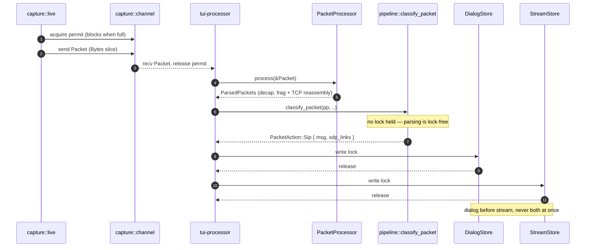

# Developer Documentation Implementation Plan

> **For agentic workers:** REQUIRED SUB-SKILL: Use superpowers:subagent-driven-development (recommended) or superpowers:executing-plans to implement this plan task-by-task. Steps use checkbox (`- [ ]`) syntax for tracking.

**Goal:** Ship eight developer-facing pages under `docs/internals/`, carrying 17 mermaid sequence diagrams, guarded by a new drift test, on a base of corrected existing docs.

**Architecture:** Three phases. Phase 0 corrects existing documentation defects that the new pages will link into, each fix driven by a failing test added to an existing gate. Phase 1 builds the drift test and the pages it guards. Phase 2 adds the remaining pages and wires the integration points. Every page is authored against source, never against this plan.

**Tech Stack:** Rust integration tests (`tests/*.rs`, `regex` 1, no feature gate), Markdown, mermaid `sequenceDiagram`, Python 3 (`scripts/build-wiki.py`).

## Global Constraints

- **Toolchain:** Rust 1.97.1. MSRV is `1.97` (`Cargo.toml`). There is no `rust-toolchain.toml`; do not add one.
- **Code references in docs are markdown links, not backticked prose.** Docs and code share one repo, so the reader clicks through. Relative from `docs/internals/`, so a repo-root file is `../../`. Link text carries the symbol, `()`-suffixed:

  ```markdown
  The router is [`classify_packet()`](../../src/pipeline.rs), reached by
  [batch](../../src/app/batch.rs) and [sharded](../../src/parallel.rs) paths alike.
  ```

  **Never `file:line`.** Never an absolute `https://github.com/...` URL — it pins a branch and goes stale. Directories may be linked when the reference is to a subsystem rather than a definition.
- **A change to linked code updates the page that links it.** Enforced hard in CI by `dev_docs_drift_test` (a rename fails the build) and advisorily at commit time by pre-commit gate 8.
- **Diagrams:** mermaid `sequenceDiagram` only. Participants are real code identifiers. No markdown-link syntax inside labels. No hardcoded colors, no `%%{init}%%`.
- **Every mermaid fence is immediately preceded by a prose line** (not a heading, not a blank line, not another fence).
- **Authoring rule:** this plan and the spec are leads, not sources. Verify every factual claim against the source file before writing it. If it cannot be verified, omit it — do not hedge.
- **`docs/internals/` is wiki-only.** Never mirror these pages into `website/content/docs/`.
- **Commits:** conventional-commit style matching `git log` (`docs(internals): …`, `test(docs): …`, `fix(docs): …`). No AI attribution trailers.
- **Pre-commit hook** runs `cargo clippy --features full -D warnings` and `cargo test --features full` on every commit. Expect each commit to take minutes.

---

## File Structure

**Created:**

| File | Responsibility |
|---|---|
| `tests/dev_docs_drift_test.rs` | Six drift assertions over `docs/internals/**` |
| `docs/internals/README.md` | Developer index, corpus map, glossary |
| `docs/internals/subsystem-guide.md` | Packet journey, all four paths (4 diagrams) |
| `docs/internals/invariants.md` | Consolidated must-not-break list (2 diagrams) |
| `docs/internals/testing.md` | Test tiers, support helpers, gate-test roster |
| `docs/internals/walkthroughs.md` | Add view/detector/flag/tool/format/fuzz target (2 diagrams) |
| `docs/internals/build-ci-release.md` | Features, workflows, hooks, release (2 diagrams) |
| `docs/internals/domain-primer.md` | SIP + RTP mental model (6 diagrams) |

**Modified:**

| File | Change |
|---|---|
| `tests/link_integrity_test.rs` | Extend merged-away-page scan to root markdown |
| `tests/docs_drift_test.rs` | Add `../../architecture.md` to the flag corpus; add a feature-table gate |
| `README.md` | 2 dead links; feature table |
| `../../architecture.md` | `--jobs` → `--cores` ×3; delegate depth to `subsystem-guide.md` |
| `docs/internals/threading.md` | Prometheus placement, `pcap-load` thread (1 diagram), channel table |
| `docs/README.md` | One "Contributing to sipnab" pointer |
| `CONTRIBUTING.md` | Developer-index link, pre-commit gates, doc-mirroring obligation, citation form |
| `scripts/build-wiki.py` | 5 new `PAGES` entries, `GROUPS` placement, **code-link rewriting to blob URLs** |
| `.githooks/pre-commit` | **Gate 8: advisory code↔docs coupling notice** |

---

# Phase 0 — Correct the base

## Task 1: Root README dead links

`README.md` links to two pages merged into `mcp.md`. They survive because `no_references_to_merged_away_mcp_pages` scans `docs/` and `website/content/docs/` but not root-level markdown.

**Files:**
- Modify: `tests/link_integrity_test.rs` (`no_references_to_merged_away_mcp_pages`)
- Modify: `README.md`

**Interfaces:**
- Consumes: existing `md_files_recursive()`, `read()`, `repo()` helpers in that file.
- Produces: nothing later tasks depend on.

- [ ] **Step 1: Re-scope the test corpus to the published surface**

The scan currently walks all of `docs/**`. That is both too narrow and too wide: it misses root markdown, where the live bug is, and it sweeps `docs/superpowers/` planning material, where a spec that *documents* a dead page trips the gate that guards it. This file already has a name for the right set — `wiki_source_files()`, described in its own doc comment as "the wiki-source pages whose links a reader actually walks".

In `tests/link_integrity_test.rs`, inside `no_references_to_merged_away_mcp_pages`, replace the two `files` lines with:

```rust
    // The published surface, not every markdown file on disk. Two changes
    // from the old `md_files_recursive("docs")`:
    //   - gains root markdown: README.md links into docs/ and shipped two
    //     dead mcp-*.md links precisely because the scan stopped at docs/;
    //   - drops docs/superpowers/ and docs/design/: planning material that
    //     is never published, and that must be free to name a merged-away
    //     page while describing the merge.
    let mut files = wiki_source_files();
    files.extend(md_files_recursive("website/content/docs"));
    for name in ["README.md", "CONTRIBUTING.md", "../../architecture.md", "SECURITY.md"] {
        files.push(PathBuf::from(name));
    }
```

- [ ] **Step 2: Run the test to verify it fails**

Run: `cargo test --test link_integrity_test no_references_to_merged_away_mcp_pages`
Expected: FAIL, listing `README.md:30: references mcp-overview.md` and `README.md:166: references mcp-setup.md`, and **no longer** listing anything under `docs/superpowers/`.

- [ ] **Step 3: Fix the two links**

`README.md` line 30 — replace the trailing sentence:

```markdown
See [`docs/mcp.md`](./docs/mcp.md).
```

`README.md` line 166 — replace the list entry:

```markdown
- [MCP Server](../../mcp.md) -- tools, transports, token bootstrap, systemd unit, troubleshooting
```

- [ ] **Step 4: Run the test to verify it passes**

Run: `cargo test --test link_integrity_test no_references_to_merged_away_mcp_pages`
Expected: PASS.

- [ ] **Step 5: Commit**

```bash
git add tests/link_integrity_test.rs README.md
git commit -m "fix(docs): repair README links to merged-away MCP pages

Extend the merged-away-page scan to root markdown; it stopped at docs/
and let two dead links ship in README.md."
```

---

## Task 2: README feature table

The table omits `metrics` (a **default** feature), and misstates both `full` and `native`.

**Files:**
- Modify: `tests/docs_drift_test.rs`
- Modify: `README.md` (Feature Flags table)

**Interfaces:**
- Produces: `readme_feature_table_covers_every_cargo_feature` — a test later phases must keep green when features change.

- [ ] **Step 1: Write the failing test**

Append to `tests/docs_drift_test.rs`:

```rust
/// Every `[features]` key in Cargo.toml must appear in the README feature
/// table. `metrics` is a DEFAULT feature that was absent for several
/// releases, so a reader could not discover it existed.
#[test]
fn readme_feature_table_covers_every_cargo_feature() {
    let manifest = include_str!("../Cargo.toml");
    let readme = include_str!("../README.md");

    let features_block = manifest
        .split("[features]")
        .nth(1)
        .expect("Cargo.toml has a [features] section")
        .split("\n[")
        .next()
        .expect("features section terminates");

    let mut missing = Vec::new();
    let mut seen = 0;
    for line in features_block.lines() {
        let line = line.trim();
        if line.is_empty() || line.starts_with('#') {
            continue;
        }
        let Some((name, _)) = line.split_once('=') else {
            continue;
        };
        let name = name.trim();
        if name == "default" {
            continue;
        }
        seen += 1;
        if !readme.contains(&format!("`{name}`")) {
            missing.push(name.to_string());
        }
    }

    assert!(seen >= 10, "feature extraction found only {seen} features");
    assert!(
        missing.is_empty(),
        "README feature table is missing: {}",
        missing.join(", ")
    );
}
```

- [ ] **Step 2: Run the test to verify it fails**

Run: `cargo test --features native --test docs_drift_test readme_feature_table_covers_every_cargo_feature`
Expected: FAIL with `README feature table is missing: metrics`.

- [ ] **Step 3: Correct the table**

In `README.md`, insert a `metrics` row after the `mcp-http` row and correct the two wrong rows. Verify each claim against `Cargo.toml` `[features]` before writing:

```markdown
| `metrics`  | Standalone Prometheus metrics server (raw TCP, no tokio)             | yes     |
```

Correct the `full` row to list every member including `metrics`, and correct any statement that `native` is required by every other feature — `tls` and `audio` do **not** imply `native`, and CI builds bare `tls`.

- [ ] **Step 4: Run the test to verify it passes**

Run: `cargo test --features native --test docs_drift_test readme_feature_table_covers_every_cargo_feature`
Expected: PASS.

- [ ] **Step 5: Verify the default-set claim is now accurate**

Run: `grep -A2 '^default' Cargo.toml`
Confirm the README's stated default set matches exactly.

- [ ] **Step 6: Commit**

```bash
git add tests/docs_drift_test.rs README.md
git commit -m "fix(docs): README feature table omitted metrics, misstated full and native

metrics is a default feature that appeared in no user-facing table. Gate
the table against Cargo.toml [features] so the next addition cannot be
silently undocumented."
```

---

## Task 3: ../../architecture.md `--jobs` → `--cores`

`../../architecture.md` names a flag that does not exist. `readme_long_flags_exist_in_cli` would catch it, but `../../architecture.md` is not in that test's corpus.

**Files:**
- Modify: `tests/docs_drift_test.rs` (the `docs` corpus array)
- Modify: `../../architecture.md` (3 sites)

- [ ] **Step 1: Add ../../architecture.md to the flag corpus**

In `tests/docs_drift_test.rs`, in the `(label, include_str!(...))` array inside `readme_long_flags_exist_in_cli`, add:

```rust
        ("../../architecture.md", include_str!("../../architecture.md")),
```

- [ ] **Step 2: Run the test to verify it fails**

Run: `cargo test --features native --test docs_drift_test readme_long_flags_exist_in_cli`
Expected: FAIL naming `--jobs` in `../../architecture.md`.

- [ ] **Step 3: Confirm no `--jobs` alias exists before editing**

Run: `grep -n 'jobs' src/cli.rs`
Expected: no `#[arg]` long name or alias `jobs`. If one exists, stop — the doc is right and the test corpus addition is wrong.

- [ ] **Step 4: Replace all three sites**

Run: `grep -n -- '--jobs' ../../architecture.md`
Expected: lines 38, 58, 125. Replace `--jobs` with `--cores` at each, keeping surrounding prose intact.

- [ ] **Step 5: Run the test to verify it passes**

Run: `cargo test --features native --test docs_drift_test readme_long_flags_exist_in_cli`
Expected: PASS.

- [ ] **Step 6: Fix the same drift in source comments**

Run: `grep -rn -- '--jobs' src/`
Replace each occurrence in doc comments with `--cores`. These are rustdoc-visible and CI runs `RUSTDOCFLAGS=-D warnings cargo doc`.

- [ ] **Step 7: Commit**

```bash
git add tests/docs_drift_test.rs ../../architecture.md src/
git commit -m "fix(docs): --jobs does not exist; the flag is --cores

Add ../../architecture.md to the flag-drift corpus so a phantom flag in the
codemap fails CI the way one in README already does."
```

---

## Task 4: glibc floor — documentation only

`release.yml` enforces a 2.36 floor; `docs/install.md`, `website/config.toml` and `website/static/install.sh` all still say 2.39.

**Deliberately scoped to documentation.** `SIPNAB_GLIBC_FLOOR` in `website/static/install.sh` is a *runtime* value — lowering it changes which artifact glibc 2.36–2.38 users receive. That is a product decision, not a doc fix, and is recorded for separate confirmation.

**Files:**
- Modify: `docs/install.md` (prose floor only)
- Modify: `tasks/todo.md` (record the installer decision)

- [ ] **Step 1: Confirm the enforced floor**

Run: `grep -n 'GLIBC\|2\.36\|2\.39' .github/workflows/release.yml`
Expected: the `readelf -V` gate rejects symbols above `GLIBC_2.36`.

- [ ] **Step 2: Locate the version markers that must NOT move**

Run: `grep -n 'SIPNAB_VERSION\|e\.g\. \|\.rpm\|sipnab .* (' docs/install.md`
These four patterns are pinned by `docs_current_version_markers_match_cargo`. The glibc edit must not touch them.

- [ ] **Step 3: Correct the stated floor in docs/install.md**

Replace the glibc-2.39 statements with 2.36, noting that releases are built in a Debian bookworm container and the floor is enforced in CI.

- [ ] **Step 4: Record the installer decision**

Append under the P5 section of `tasks/todo.md`:

```markdown
- [ ] **glibc floor: installer runtime value** — `release.yml` enforces a 2.36
  floor (bookworm container + `readelf -V` gate) but
  `website/static/install.sh` still selects musl below
  `SIPNAB_GLIBC_FLOOR="2.39"`. Lowering it to 2.36 would serve the gnu build
  to glibc 2.36–2.38 users (Debian 12). Behavior change — confirm before
  editing. `website/config.toml` already documents the 2.36 intent.
```

- [ ] **Step 5: Verify the version-marker gate still passes**

Run: `cargo test --features native --test docs_drift_test docs_current_version_markers_match_cargo`
Expected: PASS.

- [ ] **Step 6: Commit**

```bash
git add docs/install.md tasks/todo.md
git commit -m "docs: state the enforced glibc floor (2.36, not 2.39)

Release builds run in a bookworm container with a readelf gate at 2.36.
The installer's runtime SIPNAB_GLIBC_FLOOR is a behavior change and is
filed separately rather than changed here."
```

---

# Phase 1 — The drift test and the pages it guards

## Task 5: Drift test, assertions 1–3

**Files:**
- Create: `tests/dev_docs_drift_test.rs`
- Create: `docs/internals/README.md`
- Modify: `scripts/build-wiki.py`

**Interfaces:**
- Produces: `internals_pages() -> Vec<PathBuf>`, `mermaid_fences(&str) -> Vec<(usize, String)>`, and the six-assertion contract every later page must satisfy.

- [ ] **Step 1: Write the failing test**

Create `tests/dev_docs_drift_test.rs`:

```rust
// SPDX-License-Identifier: MIT OR Apache-2.0

//! Drift guards for the developer documentation under `docs/internals/`.
//!
//! These pages cite code by path and symbol. Unguarded, they rot silently
//! into the next refactor: a moved file or a renamed function leaves prose
//! that reads authoritatively and is wrong. The project already gates the
//! user-facing docs this way (`docs_drift_test`, `link_integrity_test`);
//! this is the same contract for the developer tree.
//!
//! Conventions enforced here (see
//! `docs/superpowers/specs/2026-07-25-developer-documentation-design.md`):
//!
//! 1. cited repo paths exist,
//! 2. symbols named in link text — `()`-suffixed — resolve to a definition,
//! 3. every page is registered for wiki publication,
//! 4. every mermaid fence is a `sequenceDiagram`,
//! 5. no markdown-link syntax inside a mermaid fence (`build-wiki.py`
//!    rewrites links with no fence awareness),
//! 6. every mermaid fence is preceded by prose, so the page reads where
//!    mermaid does not render.

use std::path::{Path, PathBuf};

fn repo() -> &'static Path {
    Path::new(env!("CARGO_MANIFEST_DIR"))
}

fn read(rel: impl AsRef<Path>) -> String {
    let p = repo().join(rel.as_ref());
    std::fs::read_to_string(&p).unwrap_or_else(|e| panic!("read {}: {e}", p.display()))
}

/// Every `.md` directly under `docs/internals/`, as repo-relative paths.
fn internals_pages() -> Vec<PathBuf> {
    let dir = repo().join("docs/internals");
    let mut out: Vec<PathBuf> = std::fs::read_dir(&dir)
        .unwrap_or_else(|e| panic!("read_dir {}: {e}", dir.display()))
        .map(|e| e.expect("dir entry").path())
        .filter(|p| p.extension().and_then(|e| e.to_str()) == Some("md"))
        .map(|p| p.strip_prefix(repo()).expect("under repo").to_path_buf())
        .collect();
    out.sort();
    out
}

/// Every markdown link on a page as `(link_text, target)`.
fn links(text: &str) -> Vec<(String, String)> {
    let re = regex::Regex::new(r"\[([^\]]*)\]\(([^)\s]+)\)").expect("link regex");
    re.captures_iter(text)
        .map(|c| (c[1].to_string(), c[2].to_string()))
        .collect()
}

/// Links that point into the code rather than at another document. Anchored
/// on a known top-level tree so an ordinary `../fault-model.md` doc link and
/// an external URL are both excluded.
fn code_links(text: &str) -> Vec<(String, String)> {
    const TREES: &[&str] = &[
        "src", "tests", "crates", "benches", "fuzz", "scripts", "contrib", "harness", "ops",
        "man", "demos", ".github", ".githooks",
    ];
    links(text)
        .into_iter()
        .filter(|(_, target)| {
            if target.ends_with(".md") || target.starts_with('#') {
                return false;
            }
            // An absolute link into THIS repo is a code link written the wrong
            // way, and must be reported. An absolute link anywhere else (an
            // RFC, a crate doc) is an ordinary external reference — not ours.
            if target.starts_with("http") {
                return target.contains("github.com/NormB/sipnab");
            }
            // trim_start_matches strips repeatedly, so this handles ../../.
            let stripped = target.trim_start_matches("./").trim_start_matches("../");
            TREES
                .iter()
                .any(|t| stripped == *t || stripped.starts_with(&format!("{t}/")))
        })
        .collect()
}

/// The `()`-suffixed symbol inside a link's text, if any: `` `foo()` ``,
/// `` `Type::method()` ``. The final identifier is what must resolve.
fn symbol_in(link_text: &str) -> Option<String> {
    let re = regex::Regex::new(r"(?:[A-Za-z_][A-Za-z0-9_]*::)*([A-Za-z_][A-Za-z0-9_]*)\(\)")
        .expect("symbol regex");
    re.captures(link_text).map(|c| c[1].to_string())
}

/// Resolve a page-relative link target to a repo-relative path.
fn resolve(page: &Path, target: &str) -> PathBuf {
    let dir = page.parent().expect("page has a parent");
    let mut out = dir.to_path_buf();
    for part in target.split('/') {
        match part {
            "" | "." => {}
            ".." => {
                out.pop();
            }
            p => out.push(p),
        }
    }
    out
}

/// Concatenated Rust source across the workspace, for symbol resolution.
fn all_rust_source() -> String {
    let mut out = String::new();
    let mut stack = vec![repo().join("src"), repo().join("crates")];
    while let Some(dir) = stack.pop() {
        for entry in std::fs::read_dir(&dir).unwrap_or_else(|e| panic!("read_dir {dir:?}: {e}")) {
            let p = entry.expect("dir entry").path();
            if p.is_dir() {
                stack.push(p);
            } else if p.extension().and_then(|e| e.to_str()) == Some("rs") {
                out.push_str(&std::fs::read_to_string(&p).unwrap_or_default());
                out.push('\n');
            }
        }
    }
    out
}

#[test]
fn linked_code_targets_exist() {
    let mut missing = Vec::new();
    let mut seen = 0;
    for page in internals_pages() {
        for (text, target) in code_links(&read(&page)) {
            if target.starts_with("http") {
                continue; // reported by linked_code_uses_relative_paths
            }
            seen += 1;
            if !repo().join(resolve(&page, &target)).exists() {
                missing.push(format!(
                    "{}: [{text}]({target}) points at nothing",
                    page.display()
                ));
            }
        }
    }
    assert!(seen >= 40, "code-link extraction found only {seen} links");
    assert!(
        missing.is_empty(),
        "developer docs link to code that has moved or been deleted:\n  {}",
        missing.join("\n  ")
    );
}

#[test]
fn linked_symbols_resolve_to_a_definition() {
    let source = all_rust_source();
    let mut missing = Vec::new();
    let mut seen = 0;
    for page in internals_pages() {
        for (text, target) in code_links(&read(&page)) {
            let Some(sym) = symbol_in(&text) else {
                continue; // a plain file/subsystem link carries no symbol claim
            };
            seen += 1;
            if !source.contains(&format!("fn {sym}")) {
                missing.push(format!(
                    "{}: [{text}]({target}) — no `fn {sym}` in the workspace",
                    page.display()
                ));
            }
        }
    }
    assert!(seen >= 30, "symbol extraction found only {seen} claims");
    assert!(
        missing.is_empty(),
        "developer docs name functions that no longer exist:\n  {}",
        missing.join("\n  ")
    );
}

#[test]
fn linked_code_uses_relative_paths() {
    // An absolute blob URL pins a branch and goes stale silently; the relative
    // form is what build-wiki.py rewrites into a blob URL for the wiki.
    let mut offenders = Vec::new();
    for page in internals_pages() {
        for (text, target) in code_links(&read(&page)) {
            if target.starts_with("http") {
                offenders.push(format!(
                    "{}: [{text}]({target}) — use a relative path",
                    page.display()
                ));
            }
        }
    }
    assert!(
        offenders.is_empty(),
        "code links must be repo-relative:\n  {}",
        offenders.join("\n  ")
    );
}

#[test]
fn every_internals_page_is_registered_for_the_wiki() {
    let wiki = read("scripts/build-wiki.py");
    let mut unregistered = Vec::new();
    for page in internals_pages() {
        let key = format!(
            "internals/{}",
            page.file_name().expect("file name").to_string_lossy()
        );
        let quoted = format!("\"{key}\"");
        // PAGES maps the key to a title; GROUPS places it in the sidebar.
        // build-wiki.py errors on a PAGES entry with no file, but silently
        // declines to publish a file with no PAGES entry — this closes that.
        if wiki.matches(&quoted).count() < 2 {
            unregistered.push(key);
        }
    }
    assert!(
        unregistered.is_empty(),
        "docs/internals pages missing from build-wiki.py PAGES and/or GROUPS \
         (they would never publish to the wiki):\n  {}",
        unregistered.join("\n  ")
    );
}
```

- [ ] **Step 2: Run the tests to verify they fail**

Run: `cargo test --test dev_docs_drift_test`
Expected: `linked_code_targets_exist` and `linked_symbols_resolve_to_a_definition` FAIL on the anti-vacuity floors — the three existing internals pages link to almost no code. `linked_code_uses_relative_paths` and `every_internals_page_is_registered_for_the_wiki` PASS.

- [ ] **Step 3: Write `docs/internals/README.md`**

The developer index. Required sections:

1. **Start here** — a reading order: `domain-primer.md` if you are not a VoIP engineer, then `subsystem-guide.md`, then `invariants.md` before your first PR, then `testing.md` when a gate fails you.
2. **The corpus, live vs archaeological** — one line each for `../../architecture.md` (live codemap), `../../design/maintainability-perf-spec.md` (live rationale, linked from nowhere else), `../../design/compact-headers-spec.md`, `../../design/kill-target-spoofing-spec.md`, `../../research/codex-analysis.md`, and the two `implementation-plan-*.md` files (historical design record; `../../design/implementation-plan-v6.md` still contains phantom `tls-wolfssl`/`tls-openssl`/`grpc` feature tables — say so).
3. **Glossary** — D1–D21, WS0–WS8, P0–P5, SN-01/02/03, "the gate suite", "the drift tests", "the smoke fuzz floor". Verify each expansion against `../../design/implementation-plan-v6.md`, `../../design/maintainability-perf-spec.md` and `tasks/todo.md` before writing it.

Link at least 12 code targets, using the relative form from the Global Constraints, so the anti-vacuity floor progresses. No mermaid on this page.

- [ ] **Step 4: Register the page in `scripts/build-wiki.py`**

In `PAGES`, after the three existing `internals/` entries:

```python
    "internals/README.md": "Internals-Index",
```

In `GROUPS`, prepend it to the `"Development & internals"` path list so it leads the section.

- [ ] **Step 5: Confirm code links are dead on the wiki today**

Run: `python3 scripts/build-wiki.py build/wiki && grep -n '](\.\./\.\./src' build/wiki/Internals-Index.md`
Expected: MATCHES — `LINK_RE` requires `.md`, so relative code links pass through untouched. On the flat wiki, `../../src/...` resolves to nothing. This is the defect the next step fixes.

- [ ] **Step 6: Teach `build-wiki.py` to rewrite code links**

`rewrite_link()` already contains the `../`-climbing → `BLOB` logic; the only reason code links miss it is that `LINK_RE` requires a `.md` suffix. Add a second pattern next to `LINK_RE` in `scripts/build-wiki.py`:

```python
# Links into the code tree. LINK_RE only matches .md, so without this a
# relative `../../src/pipeline.rs` link survives verbatim into the flat wiki
# and resolves to nothing. Anchored on the top-level trees so a bare
# `foo.txt` in prose is not mistaken for a repo path.
CODE_LINK_RE = re.compile(
    r"\]\(\s*((?:\.{1,2}/)*(?:src|tests|crates|benches|fuzz|scripts|contrib"
    r"|harness|ops|man|demos|\.github|\.githooks)/[^)\s]*)\s*\)"
)


def rewrite_code_link(m: re.Match) -> str:
    target = m.group(1)
    parts = [p for p in target.split("/") if p not in ("", ".")]
    prefix = ["docs"]
    while parts and parts[0] == "..":
        parts.pop(0)
        if prefix:
            prefix.pop()
    return f"]({BLOB}/{'/'.join(prefix + parts)})"
```

Then extend `transform()`:

```python
def transform(src_text: str) -> str:
    body = strip_leading_h1(src_text)
    body = LINK_RE.sub(rewrite_link, body)
    return CODE_LINK_RE.sub(rewrite_code_link, body)
```

- [ ] **Step 7: Verify the rewrite**

```bash
python3 scripts/build-wiki.py build/wiki
grep -c "$BLOB_PREFIX" build/wiki/Internals-Index.md 2>/dev/null || \
  grep -c 'github.com/NormB/sipnab/blob/main/src' build/wiki/Internals-Index.md
grep -n '](\.\./\.\./src' build/wiki/Internals-Index.md && echo "STILL RELATIVE — FAIL" || echo "all code links rewritten"
```

Expected: blob URLs present, no relative code links survive, builder exits 0.

- [ ] **Step 8: Guard the rewrite with a test**

Append to `tests/dev_docs_drift_test.rs`:

```rust
/// build-wiki.py must rewrite code links to blob URLs. A relative code link
/// that reaches the flat wiki resolves to nothing — the wiki has no repo tree.
#[test]
fn build_wiki_rewrites_code_links() {
    let script = read("scripts/build-wiki.py");
    assert!(
        script.contains("CODE_LINK_RE"),
        "build-wiki.py must rewrite relative code links to {{BLOB}} URLs; \
         LINK_RE only matches .md, so code links would reach the wiki dead"
    );
    assert!(
        script.contains("CODE_LINK_RE.sub"),
        "CODE_LINK_RE is defined but never applied in transform()"
    );
}
```

- [ ] **Step 9: Run the registration test**

Run: `cargo test --test dev_docs_drift_test every_internals_page_is_registered_for_the_wiki`
Expected: PASS.

- [ ] **Step 10: Temporarily lower the anti-vacuity floors**

The floors (40 links, 30 symbols) are calibrated for the finished doc set and cannot pass with one page written. Set both to `1` with an inline `// RAISED IN TASK 13` comment. Task 13 restores them.

- [ ] **Step 11: Run the full test file**

Run: `cargo test --test dev_docs_drift_test`
Expected: all five PASS.

- [ ] **Step 12: Commit**

```bash
git add tests/dev_docs_drift_test.rs docs/internals/README.md scripts/build-wiki.py
git commit -m "docs(internals): developer index + drift guard

Adds the start-here page and the first drift assertions: linked code
exists, linked symbols resolve, links stay relative, every page is
registered for the wiki. Teaches build-wiki.py to rewrite code links to
blob URLs — LINK_RE matches .md only, so they reached the wiki dead."
```

---

## Task 6: Drift test assertions 4–6, and the corrected `threading.md`

Introduces the first mermaid diagram, so the mermaid rules land with it.

**Files:**
- Modify: `tests/dev_docs_drift_test.rs`
- Modify: `docs/internals/threading.md`

**Interfaces:**
- Consumes: `internals_pages()`, `read()` from Task 5.
- Produces: `mermaid_fences()`, used by no later task directly but enforced against every later page.

- [ ] **Step 1: Write the three failing tests**

Append to `tests/dev_docs_drift_test.rs`:

```rust
/// Fenced mermaid blocks as `(line_index_of_opening_fence, body)`.
fn mermaid_fences(text: &str) -> Vec<(usize, String)> {
    let lines: Vec<&str> = text.lines().collect();
    let mut out = Vec::new();
    let mut i = 0;
    while i < lines.len() {
        if lines[i].trim_start().starts_with("```mermaid") {
            let start = i;
            let mut body = String::new();
            i += 1;
            while i < lines.len() && !lines[i].trim_start().starts_with("```") {
                body.push_str(lines[i]);
                body.push('\n');
                i += 1;
            }
            out.push((start, body));
        }
        i += 1;
    }
    out
}

#[test]
fn every_mermaid_block_is_a_sequence_diagram() {
    let mut offenders = Vec::new();
    for page in internals_pages() {
        for (line, body) in mermaid_fences(&read(&page)) {
            let first = body.lines().find(|l| !l.trim().is_empty()).unwrap_or("");
            if first.trim() != "sequenceDiagram" && !first.trim().starts_with("sequenceDiagram") {
                offenders.push(format!(
                    "{}:{}: mermaid block opens with {first:?}, not sequenceDiagram",
                    page.display(),
                    line + 1
                ));
            }
        }
    }
    assert!(
        offenders.is_empty(),
        "developer docs use sequenceDiagram only:\n  {}",
        offenders.join("\n  ")
    );
}

#[test]
fn no_markdown_links_inside_mermaid_blocks() {
    // scripts/build-wiki.py applies LINK_RE.sub() to the whole page body with
    // no fence awareness, so a link inside a diagram label gets rewritten into
    // a wiki link and corrupts the diagram source.
    let link = regex::Regex::new(r"\]\([^)\s]+\.md").expect("link regex");
    let mut offenders = Vec::new();
    for page in internals_pages() {
        for (line, body) in mermaid_fences(&read(&page)) {
            if link.is_match(&body) {
                offenders.push(format!(
                    "{}:{}: markdown link inside a mermaid block",
                    page.display(),
                    line + 1
                ));
            }
        }
    }
    assert!(
        offenders.is_empty(),
        "build-wiki.py rewrites links without fence awareness:\n  {}",
        offenders.join("\n  ")
    );
}

#[test]
fn every_mermaid_block_is_introduced_by_prose() {
    // A diagram must never carry meaning the prose does not, so the page still
    // reads in a plain-text viewer, a diff, or a renderer without mermaid.
    let mut offenders = Vec::new();
    for page in internals_pages() {
        let text = read(&page);
        let lines: Vec<&str> = text.lines().collect();
        for (line, _) in mermaid_fences(&text) {
            let prev = lines[..line]
                .iter()
                .rev()
                .find(|l| !l.trim().is_empty())
                .copied()
                .unwrap_or("");
            let t = prev.trim();
            if t.is_empty() || t.starts_with('#') || t.starts_with("```") || t.starts_with('|') {
                offenders.push(format!(
                    "{}:{}: mermaid block is preceded by {t:?}, not a prose sentence",
                    page.display(),
                    line + 1
                ));
            }
        }
    }
    assert!(
        offenders.is_empty(),
        "every diagram needs a one-sentence prose summary above it:\n  {}",
        offenders.join("\n  ")
    );
}
```

- [ ] **Step 2: Run to verify they pass vacuously**

Run: `cargo test --test dev_docs_drift_test mermaid`
Expected: PASS — no mermaid exists yet. This confirms the helpers compile before any page depends on them.

- [ ] **Step 3: Verify the threading facts against source before editing**

Run each and record the answer:

```bash
grep -n 'TcpListener\|thread::Builder' src/output/prometheus_server.rs
grep -n 'thread::Builder\|pcap-load' src/tui/controllers/file_open.rs
grep -n 'thread::Builder' src/tui/clipboard.rs src/output/event_exec.rs
grep -n 'packet_channel\|channel::' src/app/batch.rs
grep -n 'const BATCH' src/parallel.rs
```

Do not write a correction you have not confirmed.

- [ ] **Step 4: Correct the Prometheus placement**

In `docs/internals/threading.md`, remove Prometheus from the shared-tokio-runtime task list in the topology block. Add it as its own thread with a note that it is a raw `std::net::TcpListener` accept loop, deliberately independent of tokio/axum, plus one short-lived connection thread per scrape bounded by a connection gate.

- [ ] **Step 5: Add the named-thread roster**

Add a table of every named thread, its spawn site as a backticked path, and its role. Include at minimum: the capture threads, `tui-processor`, the `--cores` workers, `servers`, `metrics-server`, `metrics-conn`, `sipnab-dns`, `scanner-kill`, `pcap-load`, `clipboard`. Every path must be one you confirmed in Step 3.

- [ ] **Step 6: Add the `pcap-load` diagram**

Add a subsection documenting the only case where two writers to the live stores coexist, with this prose line and diagram:

```markdown
Opening a pcap from inside the TUI spawns a second writer: the `pcap-load`
worker writes the same stores the render thread is reading, which is why every
render-side access is `try_read()` and never `read()`.
```

````markdown
```mermaid
sequenceDiagram
    autonumber
    participant UI as TUI event loop
    participant Load as pcap-load worker
    participant DS as DialogStore
    participant SS as StreamStore

    UI->>Load: spawn on F6 file open
    UI->>DS: try_read for the frame
    DS-->>UI: guard, or skip the frame
    Load->>DS: write lock
    DS-->>Load: release
    Load->>SS: write lock
    SS-->>Load: release
    Load-->>UI: progress via async_messages
    Note over UI,SS: the render pass never blocks; a contended try_read skips a frame
```
````

- [ ] **Step 7: Correct the channel table**

The batch path uses the same capped `capture::channel` wrapper as live, not a bare crossbeam bounded channel. Correct that row against what you confirmed in Step 3.

- [ ] **Step 8: Run the mermaid tests**

Run: `cargo test --test dev_docs_drift_test`
Expected: all six PASS.

- [ ] **Step 9: Verify links and wiki build still hold**

Run: `cargo test --test link_integrity_test && python3 scripts/build-wiki.py build/wiki`
Expected: PASS, exit 0.

- [ ] **Step 10: Commit**

```bash
git add tests/dev_docs_drift_test.rs docs/internals/threading.md
git commit -m "docs(internals): correct threading model, add mermaid guards

Prometheus is a raw TcpListener thread, not a tokio task. The pcap-load
worker — the only second writer to the live stores — was missing
entirely. Adds the three mermaid conventions as tests."
```

---

## Task 7: `subsystem-guide.md`

**Files:**
- Create: `docs/internals/subsystem-guide.md`
- Modify: `scripts/build-wiki.py`

- [ ] **Step 1: Trace the four packet paths against source**

Confirm each applier before writing:

```bash
grep -n 'fn process_packet\|fn classify_packet\|enum PacketAction' src/pipeline.rs
grep -n 'fn process_parsed_packet' src/app/batch.rs
grep -n 'fn reconstruct\|fn shard_for' src/parallel.rs
grep -n 'fn run_pcap_load' src/tui/controllers/file_open.rs
grep -n 'struct RunPlan\|fn plan\|fn launch' src/app/bootstrap.rs
```

- [ ] **Step 2: Write the page**

Required sections: the program spine ([`bootstrap.rs`](../../src/app/bootstrap.rs) → `RunPlan` → [`batch.rs`](../../src/app/batch.rs) | [`tui_mode.rs`](../../src/app/tui_mode.rs) | [`servers.rs`](../../src/app/servers.rs)); the six hops from packet source to presentation; the four appliers and why they must all route through the one classifier; [`model.rs`](../../src/output/model.rs) as the single canonical wire shape for every serializing surface. Every code reference is a link; every symbol claim is `()`-suffixed in the link text.

- [ ] **Step 3: Add diagram 1 — startup**

Prose line, then a `sequenceDiagram` with participants `main`, `Cli`, `bootstrap`, `RunPlan`, and the mode entry point, ending in the `RunMode` dispatch.

- [ ] **Step 4: Add diagram 2 — live packet lifecycle**

Prose line, then:

````markdown

````

- [ ] **Step 5: Add diagram 3 — TUI frame tick**

Prose line, then a diagram covering one tick: pending-load poll, async-message drain, `sync_caches()` with `try_read`, `draw_frame()`, deferred save/audio, then the event poll and full drain of queued events. Show the skip path when `try_read` is contended.

- [ ] **Step 6: Add diagram 4 — `--cores N`**

Prose line, then a diagram: reader peeks the host pair, `shard_for()` selects a worker, workers hold thread-local stores, stores merge at EOF, `reassociate_all()` repairs cross-host-pair SDP↔RTP association. Note why direction-independent sharding is what makes a call's bidirectional RTP land on one worker.

- [ ] **Step 7: Register in `build-wiki.py`**

`PAGES`: `"internals/subsystem-guide.md": "Internals-Subsystem-Guide",` and add to the `GROUPS` path list.

- [ ] **Step 8: Run every gate**

Run: `cargo test --test dev_docs_drift_test --test link_integrity_test && python3 scripts/build-wiki.py build/wiki`
Expected: PASS, exit 0.

- [ ] **Step 9: Commit**

```bash
git add docs/internals/subsystem-guide.md scripts/build-wiki.py
git commit -m "docs(internals): subsystem guide — one packet's journey

Traces capture through parse, classify, store and presentation across all
four packet paths, with the program spine in src/app/ documented as a
concept for the first time."
```

---

## Task 8: `invariants.md`

**Files:**
- Create: `docs/internals/invariants.md`
- Modify: `scripts/build-wiki.py`

- [ ] **Step 1: Confirm each invariant against source or config**

```bash
grep -n 'await_holding_lock\|undocumented_unsafe_blocks' Cargo.toml
grep -n 'try_read' src/tui/mod.rs
grep -n 'non_exhaustive' tests/api_guidelines_test.rs
grep -rn 'zeroize' src/crypto.rs src/rtp/srtp.rs | head
grep -n 'DEFAULT_LIMIT\|HARD_LIMIT\|MAX_BODY_BYTES' src/mcp/shape.rs
```

- [ ] **Step 2: Write the page**

One numbered invariant per subsection: statement, why it exists, what enforces it (test name or clippy lint), and how it fails if broken. Cover: single-writer store discipline; dialog-before-stream lock ordering; all four paths through `classify_packet()`; every attacker-keyed map bounded with a defined eviction policy; `zeroize` on key material; MCP tools read-only and bounded; `output/model.rs` as the only dialog/stream wire shape; render pass is read-only; no lock across `.await`; warn-and-continue on malformed input.

**Link out, do not restate.** Threading detail belongs to `threading.md`; failure semantics to `docs/fault-model.md`.

- [ ] **Step 3: Add the two cultural norms**

The RFC-citation convention (already required by `.github/PULL_REQUEST_TEMPLATE`) and the honesty norm about refuted performance claims — cite `docs/internals/zero-copy-payloads.md`, which refutes its own claim. Confirm both before writing.

- [ ] **Step 4: Add diagram 1 — lock ordering**

Prose line, then a diagram showing the correct sequence: acquire dialog, release, acquire stream, release — with a `Note over` marking that holding both simultaneously is the deadlock the ordering rule prevents.

- [ ] **Step 5: Add diagram 2 — single-writer discipline**

Prose line, then a diagram with the writer thread and two reader surfaces (TUI, API/MCP), showing writers taking `write()` and readers `try_read()`/`read()`, and that exactly one thread ever writes per run mode.

- [ ] **Step 6: Register, gate, commit**

```bash
python3 scripts/build-wiki.py build/wiki
cargo test --test dev_docs_drift_test --test link_integrity_test
git add docs/internals/invariants.md scripts/build-wiki.py
git commit -m "docs(internals): consolidated invariants

The rules were real and enforced but scattered across five documents and
code comments. One list, each entry naming what enforces it."
```

---

# Phase 2 — Remaining pages and integration

## Task 9: `testing.md`

**Files:**
- Create: `docs/internals/testing.md`
- Modify: `scripts/build-wiki.py`

- [ ] **Step 1: Enumerate the test surface**

```bash
ls tests/*.rs | wc -l
ls tests/support/
grep -rn 'TRYCMD=overwrite' tests/
grep -rn 'cargo insta' docs/internals/tui-testing.md
```

- [ ] **Step 2: Write the tier map**

Group every `tests/*.rs` file by category — CLI golden, TUI snapshot/state/e2e, security, property/fuzz, integration, server, CLI surface, schema, docs enforcement, meta. For each: what it asserts, how to run it, how to regenerate its artifacts.

- [ ] **Step 3: Document `tests/support/`**

One row per helper module — `mod.rs`, `run.rs`, `schema.rs`, `server.rs`, `mcp.rs`, `tui_fixtures.rs`, `fuzz.rs` — with what it provides and which existing tests consume it. Explain the `#[path = "support/x.rs"]` include idiom, since files under `tests/` subdirectories are not compiled as their own test binaries.

- [ ] **Step 4: Document fixtures and corpora**

`tests/fixtures/` (regenerated by `cargo run --bin gen_fixture`), `tests/snapshots/` (`cargo insta test --features tui --accept`), `tests/cli/` (`TRYCMD=overwrite cargo test --test cli_goldens`), `tests/schemas/`, `tests/pcap-samples/`, `tests/install-sh/`, `fuzz/corpus/`. Verify every regeneration command by running it before documenting it.

- [ ] **Step 5: Document the gate-test roster**

A table of every self-enforcing test with what trips it. This is the highest-value section on the page — a contributor meets these as unexplained CI failures today. Include `dev_docs_drift_test` itself.

- [ ] **Step 6: Document the dev loop**

`SIPNAB_LOG` levels; `cargo bench --profile profiling` and why the plain profile cannot build; `cargo nextest` and its profiles, noting explicitly that no workflow invokes it; the `harness/` docker-compose lab behind `make up`; the WASM rebuild obligation the pre-commit hook enforces.

- [ ] **Step 7: Register, gate, commit**

```bash
python3 scripts/build-wiki.py build/wiki
cargo test --test dev_docs_drift_test --test link_integrity_test
git add docs/internals/testing.md scripts/build-wiki.py
git commit -m "docs(internals): test architecture and the gate-test roster

The self-enforcing drift tests are the most surprising thing about
contributing here and were entirely undocumented."
```

---

## Task 10: `walkthroughs.md`

**Files:**
- Create: `docs/internals/walkthroughs.md`
- Modify: `scripts/build-wiki.py`

- [ ] **Step 1: Write six ordered checklists**

Add a TUI view; add a security detector; add a CLI flag; add an MCP tool; add an output format; add a fuzz target. Each step names the file to touch **and the test that fails if the step is skipped**. A step without an enforcing test is prose, not a checklist item — mark it as such.

- [ ] **Step 2: Verify each checklist by executing its failure mode**

For "add a CLI flag": add a throwaway `#[arg]` to `src/cli.rs`, run `cargo test --features full --test flag_coverage_test`, confirm it fails as the checklist claims, then revert. Repeat the equivalent check for the view (keybinding drift) and MCP tool (clippy `await_holding_lock`) walkthroughs. **Do not commit the throwaway edits.**

Run: `git diff --stat` before committing and confirm only the intended files changed.

- [ ] **Step 3: Add diagram 1 — add a CLI flag**

Prose line, then a diagram whose participants are the developer and the gate tests, ordered by when each fires: `cli.rs` edit → `flag_coverage_test` → `docs_drift_test` → `cli_defaults_test` → `config_wiring_test`.

- [ ] **Step 4: Add diagram 2 — add an MCP tool**

Prose line, then a diagram showing a request arriving, the guard being acquired, a snapshot taken, `drop(guard)`, **then** the `.await`, then the `shape.rs` bound applied to the response. Add a `Note over` naming `clippy::await_holding_lock` as the deny-level lint that rejects the wrong order at build time.

- [ ] **Step 5: Register, gate, commit**

```bash
python3 scripts/build-wiki.py build/wiki
cargo test --test dev_docs_drift_test --test link_integrity_test
git add docs/internals/walkthroughs.md scripts/build-wiki.py
git commit -m "docs(internals): contributor walkthroughs

Six ordered checklists, each step naming the test that fails if it is
skipped. Verified by executing the failure modes."
```

---

## Task 11: `build-ci-release.md`

**Files:**
- Create: `docs/internals/build-ci-release.md`
- Modify: `scripts/build-wiki.py`

- [ ] **Step 1: Verify the feature map**

For each `[features]` key, find its `#[cfg(feature = "...")]` sites and record what it gates. Confirm the implication graph — in particular that `tls` and `audio` do **not** imply `native`, and that `mcp-http` implies both `mcp` and `api`.

- [ ] **Step 2: Verify the workflow map**

```bash
ls .github/workflows/
grep -n 'needs:' .github/workflows/ci.yml
```

Record which jobs `ci-success` actually requires. **Document explicitly that `install-sh` and `deb-package` are outside the aggregate and can go red without blocking a merge.**

- [ ] **Step 3: Verify the hook gates**

Read `.githooks/pre-commit` and `.githooks/pre-push` and enumerate each gate in order. Note that `CONTRIBUTING.md` currently understates `pre-push`; Task 12 corrects it.

- [ ] **Step 4: Verify the toolchain pins**

```bash
grep -rn '1\.97' .github/workflows/ Cargo.toml crates/*/Cargo.toml Dockerfile harness/sipnab/Dockerfile
ls rust-toolchain* 2>/dev/null || echo "no rust-toolchain.toml"
```

Document every pin location and state plainly that nothing enforces the toolchain locally — the CHANGELOG records a CI/local clippy divergence caused by exactly this.

- [ ] **Step 5: Verify the release process**

Read `.github/workflows/release.yml` and record the build matrix, the glibc floor gate, the attestation step, and the Homebrew tap job. Enumerate every version-bump location and which are gated by a test or hook versus manual.

- [ ] **Step 6: Add diagram 1 — release**

Prose line, then a diagram: developer pushes a tag → `release.yml` build matrix → glibc floor check → SHA256SUMS and attestation → GitHub release → Homebrew tap, with `docker.yml` publishing to GHCR in parallel.

- [ ] **Step 7: Add diagram 2 — the gate sequence**

Prose line, then a diagram: commit → pre-commit gates → push → pre-push gates → CI jobs → `ci-success`. Use a `Note over` to mark `install-sh` and `deb-package` as running but not required.

- [ ] **Step 8: Register, gate, commit**

```bash
python3 scripts/build-wiki.py build/wiki
cargo test --test dev_docs_drift_test --test link_integrity_test
git add docs/internals/build-ci-release.md scripts/build-wiki.py
git commit -m "docs(internals): build, CI and release

Feature map, the eight workflows and which one actually gates merges,
the eleven hook gates, where the toolchain pins live, and how a release
is cut — previously undocumented in full."
```

---

## Task 12: `domain-primer.md`

The highest-leverage page. Six diagrams.

**Files:**
- Create: `docs/internals/domain-primer.md`
- Modify: `scripts/build-wiki.py`

- [ ] **Step 1: Ground each concept in the file that encodes it**

```bash
grep -n 'from_tag\|to_tag\|call_id' src/sip/dialog_store.rs | head
grep -n 'fn update_timing\|answered_at' src/sip/timing.rs | head
grep -n 'fn track_sdp\|delayed' src/sip/sdp_timeline.rs | head
grep -n 'fn estimate_mos\|fn analyze_burst_gap' src/rtp/quality.rs
grep -n 'cumulative_lost' src/rtp/rtcp.rs
grep -n 'fn extract_dtmf_with_clock' src/rtp/dtmf.rs
```

- [ ] **Step 2: Write the SIP half**

Dialog vs transaction; Call-ID/From-tag/To-tag as dialog identity and why the store keys on them; CSeq method pinning; Via branch and B2BUA leg correlation; the INVITE three-way handshake vs non-INVITE transactions; why 401/407 is auth-pending rather than failure. Each concept names the file that encodes it, so the primer doubles as an index.

- [ ] **Step 3: Write the RTP half**

SSRC as stream identity and why streams exist without dialogs; 16-bit sequence wraparound; RTP timestamps vs wall-clock and the clock-rate divisor; RFC 3550 signed transit-delta jitter; MOS/E-model; burst-gap loss; payload types and ptime; RFC 4733 telephone-event DTMF and its clock-rate dependence; symmetric RTP, NAT mismatch, one-way audio.

- [ ] **Step 4: Add the "these are the bugs this prevents" section**

Cross-reference the open P1 entries in `tasks/todo.md` that are domain-semantics bugs — RTCP jitter left in RTP-timestamp units, 24-bit signed `cumulative_lost` zero-extended, unsigned wrapping subtraction spiking jitter on reorder, TCP sequence comparison without RFC 1982 serial arithmetic, `answered_at` matching a re-INVITE's 200, delayed-offer misclassification. Verify each is still open before citing it; drop any that has since been fixed.

- [ ] **Step 5: Add the six diagrams**

Each with a prose line above it. In order: INVITE three-way handshake with dialog identity annotated; auth 401/407 challenge loop; delayed offer (INVITE with no SDP → offer in 200 → answer in ACK); re-INVITE hold/resume; CANCEL vs 200 OK race resolving toward InCall; RTCP SR/RR exchange showing where jitter units and the 24-bit `cumulative_lost` field bite.

Note in the page that these are the same `sequenceDiagram` format sipnab itself exports — `E` in the Call Flow view, or Tab to Mermaid in the F2 save dialog — so a reader can regenerate any of them from a real capture.

- [ ] **Step 6: Verify that export claim before writing it**

Run: `grep -n 'ExportMermaid\|Export Mermaid' src/tui/help.rs src/tui/controllers/call_flow.rs`
Expected: confirms the `E` binding and the F2 save-dialog entry. If the binding differs, document what it actually is.

- [ ] **Step 7: Register, gate, commit**

```bash
python3 scripts/build-wiki.py build/wiki
cargo test --test dev_docs_drift_test --test link_integrity_test
git add docs/internals/domain-primer.md scripts/build-wiki.py
git commit -m "docs(internals): SIP and RTP domain primer

Nearly every open P1 entry is a domain-semantics bug rather than a Rust
bug. This is the model the code assumes the reader already has."
```

---

## Task 13: Integration, floor restoration, and full verification

**Files:**
- Modify: `tests/dev_docs_drift_test.rs` (restore the anti-vacuity floors)
- Modify: `docs/README.md`, `CONTRIBUTING.md`, `../../architecture.md`

- [ ] **Step 1: Restore the anti-vacuity floors**

In `tests/dev_docs_drift_test.rs`, replace the two `// RAISED IN TASK 13` placeholders with the real floors:

```rust
    assert!(seen >= 40, "code-link extraction found only {seen} links");
```

```rust
    assert!(seen >= 30, "symbol extraction found only {seen} claims");
```

- [ ] **Step 2: Add a diagram-count floor**

Append to `tests/dev_docs_drift_test.rs`:

```rust
/// The developer docs carry a designed diagram set; losing them silently
/// would strip the pages of half their meaning.
#[test]
fn developer_docs_carry_their_diagram_set() {
    let total: usize = internals_pages()
        .iter()
        .map(|p| mermaid_fences(&read(p)).len())
        .sum();
    assert!(
        total >= 17,
        "expected at least 17 sequence diagrams across docs/internals, found {total}"
    );
}
```

- [ ] **Step 3: Run the drift test**

Run: `cargo test --test dev_docs_drift_test`
Expected: all nine PASS (`linked_code_targets_exist`, `linked_symbols_resolve_to_a_definition`, `linked_code_uses_relative_paths`, `every_internals_page_is_registered_for_the_wiki`, `build_wiki_rewrites_code_links`, the three mermaid guards, and `developer_docs_carry_their_diagram_set`). If a floor fails, the shortfall is real — add the missing links or diagrams rather than lowering the floor.

- [ ] **Step 3b: Add the advisory coupling gate to `.githooks/pre-commit`**

Tier 2 of the code↔docs rule: when a commit stages a change to a file the developer docs link to and stages no `docs/internals/` change, name the symbols that file is cited for. Insert before the final "All pre-commit checks passed" line, following the numbering and `${GREEN}`/`${YELLOW}` style of the existing gates:

```bash
# ── 8. Developer docs cite code — flag edits to cited files ────────
echo -n "  Developer-docs coupling... "
staged=$(git diff --cached --name-only)
if ! echo "$staged" | grep -q '^docs/internals/'; then
    cited=$(grep -rhoE '\]\((\.\./)+[a-zA-Z0-9_./-]+\)' docs/internals/*.md 2>/dev/null \
        | sed -E 's/^\]\(//; s/\)$//; s#(\.\./)+##' | sort -u)
    hits=$(comm -12 <(echo "$staged" | sort -u) <(echo "$cited"))
    if [ -n "$hits" ]; then
        echo -e "${YELLOW}REVIEW${NC}"
        echo "  These staged files are cited by the developer docs:"
        echo "$hits" | sed 's/^/    /'
        echo "  Confirm docs/internals/ still reads true, then re-commit."
        echo "  (Advisory — the hard gate is dev_docs_drift_test in CI.)"
    else
        echo -e "${GREEN}OK${NC}"
    fi
else
    echo -e "${GREEN}OK${NC}"
fi
```

**Advisory by design.** The wasm gate at step 7 hard-fails because it guards one file with a mechanical regeneration step. This one guards hundreds of files whose edits are usually typo fixes and internal refactors that invalidate no prose. Hard-failing there would block routine commits and train contributors to bypass the hook. The blocking check is `dev_docs_drift_test`, which fires only when a doc has actually become wrong.

- [ ] **Step 3c: Verify the gate fires and does not block**

```bash
touch -a src/pipeline.rs && git add src/pipeline.rs
git commit -m "test: coupling gate" --dry-run 2>&1 | grep -A5 'coupling'
git reset src/pipeline.rs
```

Expected: prints `REVIEW` listing `src/pipeline.rs` and does not exit non-zero. Then confirm the quiet path: stage a `docs/internals/` edit alongside and re-run — expect `OK`.

- [ ] **Step 4: Add the pointer to `docs/README.md`**

Replace the `Internals:` line in "Going deeper" so the index leads:

```markdown
- Contributing to sipnab? Start with the
  [Developer index](internals/README.md) — subsystem guide, invariants,
  test architecture, and contributor walkthroughs.
- Internals: [Fault model](fault-model.md) ·
  [Threading](internals/threading.md) ·
  [Zero-copy payloads](internals/zero-copy-payloads.md) ·
  [TUI testing](internals/tui-testing.md)
```

- [ ] **Step 5: Update `CONTRIBUTING.md`**

Four additions: a link to the developer index near the top; the **eight** pre-commit gates and the four pre-push gates, correcting the current text that describes clippy as a soft warning and omits the rustdoc and fuzz gates; the two-doc-tree mirroring obligation with the name-mapping table (`docs/examples.md` ↔ `website/content/docs/cookbook.md`, `docs/cli-reference.md` ↔ `cli.md`, `docs/rest-api.md` ↔ `api.md`, `docs/theme-guide.md` ↔ `theme.md`), stating that `docs/` is canonical and `docs/internals/` is wiki-only; and the citation form with the coupling rule stated plainly:

```markdown
The developer docs under `docs/internals/` link directly into the code. If you
move a file, rename a function, or change a subsystem's shape, update the page
that links it in the same PR — `dev_docs_drift_test` will fail the build
otherwise, and a pre-commit notice flags edits to cited files before you get
that far.
```

- [ ] **Step 6: Delegate depth from `../../architecture.md`**

Add one line under "Data flow" pointing at `docs/internals/subsystem-guide.md` for the function-level trace, and one under "Where to add things" pointing at `docs/internals/walkthroughs.md`. Do not duplicate content — `../../architecture.md` stays the codemap.

- [ ] **Step 7: Run the full gate suite**

```bash
cargo fmt --all -- --check
cargo clippy --all-features --all-targets -- -D warnings
cargo test --features full
python3 scripts/build-wiki.py build/wiki
```

Expected: all PASS, builder exits 0. Confirm `build/wiki` contains eight `Internals-*` pages and the sidebar groups them.

- [ ] **Step 8: Verify wiki mermaid rendering**

The spec's one open assumption. Inspect a generated page:

Run: `grep -c '```mermaid' build/wiki/Internals-Subsystem-Guide.md`
Expected: 4 — fences survive `transform()` intact.

Then confirm GitHub wiki rendering after the first `wiki-sync.yml` run on `main`. If the wiki does not render mermaid, no change is needed: the prose-precedes-every-diagram rule already guarantees each page reads without it. Record the outcome in `tasks/todo.md`.

- [ ] **Step 9: Mark the backlog item done**

In `tasks/todo.md`, mark the P5 "Developer documentation" item complete, noting what shipped and that the "SIP problem diagnosis" sibling item is untouched.

- [ ] **Step 10: Commit**

```bash
git add tests/dev_docs_drift_test.rs docs/README.md CONTRIBUTING.md ../../architecture.md tasks/todo.md
git commit -m "docs: wire developer documentation into the reader's path

Restores the drift-test anti-vacuity floors now the full page set exists,
adds the diagram-count floor, and documents the pre-commit gates and the
two-doc-tree mirroring obligation CONTRIBUTING.md was missing."
```

---

## Verification Summary

| Gate | Command |
|---|---|
| Drift guards | `cargo test --test dev_docs_drift_test` |
| Link integrity | `cargo test --test link_integrity_test` |
| Docs drift | `cargo test --features native --test docs_drift_test` |
| Full suite | `cargo test --features full` |
| Lint + format | `cargo clippy --all-features --all-targets -- -D warnings && cargo fmt --all -- --check` |
| Wiki build | `python3 scripts/build-wiki.py build/wiki` |

## Deviations from the spec

1. **glibc floor split (Task 4).** The spec put the whole fix in Phase 0. The installer's `SIPNAB_GLIBC_FLOOR` is a runtime value whose change alters which artifact users receive — a product decision. Documentation is corrected here; the installer change is filed in `tasks/todo.md` for confirmation.
2. **Drift test grew a diagram-count assertion** (Task 13), which the spec did not name. The 17 diagrams are a designed deliverable and were otherwise unguarded.
3. **`build_wiki_rewrites_code_links`** is a ninth assertion beyond the spec's eight. Without it, a future edit could drop `CODE_LINK_RE` from `transform()` and every code link would silently die on the wiki again.

## Notes on the two mid-plan requirements

**"Link into code."** Adopted as D-5 and threaded through: the Global Constraints define the form, `linked_code_targets_exist` and `linked_symbols_resolve_to_a_definition` validate it, `linked_code_uses_relative_paths` keeps it from decaying into pinned absolute URLs, and Task 5 Steps 5–8 teach `build-wiki.py` to rewrite it so the links survive to the wiki. That last part was not optional — `LINK_RE` matches `.md` only, so relative code links reached the wiki dead.

**"Code changes → docs change."** Enforced in two tiers rather than one, deliberately. Tier 1 is `dev_docs_drift_test` in CI: a moved file or renamed function fails the build, with no false positives. Tier 2 is the advisory pre-commit notice in Task 13 Step 3b, which catches the softer case a test cannot see — code whose *behavior* changed while its names stayed put. Tier 2 is advisory because the blocking version would fire on every typo fix in a cited file and get bypassed; the trade is stated in the spec under "Keeping docs in step with code".
